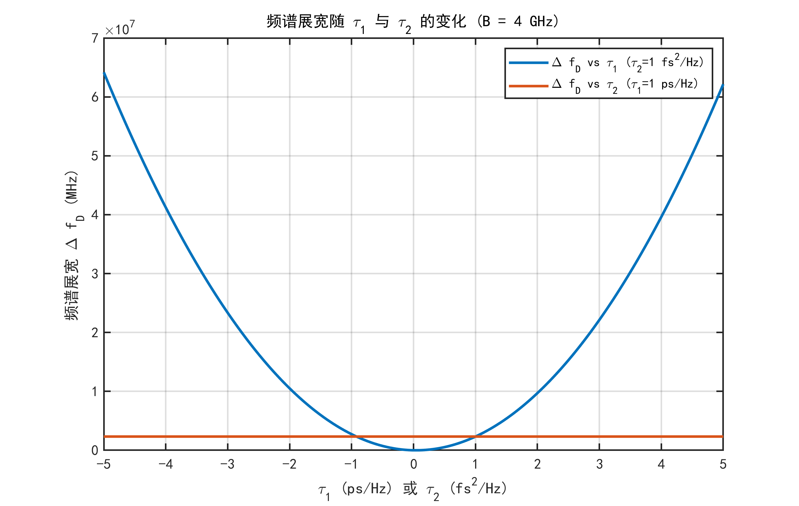

# 3.3 色散效应对差频信号的调制机理与误差解析

3.1节建立了色散信道的物理模型,揭示了群时延随频率的非线性演化规律;3.2节通过CST与Matlab双重仿真验证了理论预测,展示了时延曲线的渐近发散特征与多解性问题。然而,这些分析均基于静态的"频率-时延"映射关系,尚未回答一个核心问题:在LFMCW雷达的动态扫频工作模式下,色散效应如何具体影响差频信号的波形与频谱?传统LFMCW测距理论假设群时延为常数,此时差频信号为单频正弦波,FFT可准确提取目标距离。但在色散介质中,式(3-15)已揭示群时延$\tau_g(t)$是时变函数,这必然导致差频信号相位的非线性畸变,进而引发频谱特征的根本性变化。本节将基于泰勒级数展开,严格推导色散条件下差频信号的时域与频域表达式,定量分析二阶色散导致的频谱散焦效应及其与系统带宽的耦合机制,为理解传统方法失效原因与设计新型反演算法提供理论依据。

## 3.3.1 群时延的二阶泰勒级数展开与时变时延模型

为建立色散条件下差频信号的解析表达式,首先需将时变群时延$\tau(\omega)$在角频率轴上展开。LFMCW发射信号的瞬时角频率$\omega(t)$随时间线性变化:$\omega(t) = \omega_0 + K' t$,其中$\omega_0 = 2\pi f_0$为起始角频率,$K' = \frac{2\pi B}{T_m}$为角频率调制斜率,$B$为带宽,$T_m$为扫频周期。

在等离子体介质中传播时,电磁波的群时延$\tau(\omega)$是角频率$\omega$的函数。在$\omega_0$处对$\tau(\omega)$进行二阶泰勒级数展开:

$$\tau(\omega) = \tau_0 + \tau_1[\omega-\omega_0] + \frac{1}{2}\tau_2[\omega-\omega_0]^2 + \cdots \tag{3-20}$$

其中,$\tau_0 = \tau(\omega_0)$为起始角频率处的群时延,$\tau_1 = \frac{d\tau}{d\omega}\big|_{\omega=\omega_0}$为一阶导数,$\tau_2 = \frac{d^2\tau}{d\omega^2}\big|_{\omega=\omega_0}$为二阶导数。截断误差主要来自三阶及更高阶项,在扫频周期内可忽略。

将瞬时角频率$\omega(t) = \omega_0 + K't$代入式(3-20),得到时延随时间的演化:

$$\tau(t) = \tau(\omega(t)) = \tau_0 + \tau_1 K' t + \frac{1}{2}\tau_2 (K')^2 t^2 \tag{3-21}$$

为简化后续推导,引入中间变量:

$$A_0 = \tau_0, \quad A_1 = \tau_1 K', \quad A_2 = \frac{1}{2}\tau_2 (K')^2 \tag{3-22}$$

则时变时延可紧凑地表示为:

$$\tau(t) = A_0 + A_1 t + A_2 t^2 \tag{3-23}$$

该展开式揭示了时延演化的三个物理层次。零阶项$A_0 = \tau_0$为恒定基底,反映介质固有的传播时延;一阶项$A_1 t = \tau_1 K' t$描述时延的线性变化,物理上源自探测频率上升导致的群速度改变,由群时延对角频率的一阶导数$\tau_1$决定;二阶项$A_2 t^2 = \frac{1}{2}\tau_2 (K')^2 t^2$表征时延变化的非线性度,源自色散率随频率的非均匀分布,由二阶导数$\tau_2$控制。值得注意的是,$A_2$与调频斜率平方$(K')^2 \propto B^2/T_m^2$成正比,预示着带宽$B$对非线性效应具有平方放大作用。

根据3.1节式(3-14)的物理模型,可计算$\tau_1$和$\tau_2$的显式表达。利用$\tau_g(f) = \frac{d}{c}[1-(f_p/f)^2]^{-1/2}$,通过链式法则$\frac{d\tau}{d\omega} = \frac{d\tau}{df} \cdot \frac{df}{d\omega} = \frac{1}{2\pi}\frac{d\tau}{df}$,在$\omega = \omega_0$(即$f = f_0$)处计算,结合式(3-18)可得:

$$\tau_1 = \frac{1}{2\pi} \cdot \left(-\frac{\tau_0}{f_0} \cdot \frac{(f_p/f_0)^2}{[1-(f_p/f_0)^2]^{3/2}}\right) \tag{3-24}$$

其符号为负($\tau_1 < 0$),表明瞬时频率上升时时延单调下降,反映高频信号在色散介质中传播更快的物理本质。二阶导数$\tau_2 = \frac{d^2\tau}{d\omega^2}$可通过对式(3-24)再次求导获得。利用链式法则$\frac{d^2\tau}{d\omega^2} = \frac{1}{(2\pi)^2}\frac{d^2\tau}{df^2}$,并对式(3-18)求二阶频率导数,在$f=f_0$处计算可得:

$$\tau_2 = \frac{1}{(2\pi)^2} \cdot \frac{\tau_0}{f_0^2} \left[ \frac{3(f_p/f_0)^4}{[1-(f_p/f_0)^2]^{5/2}} + \frac{(f_p/f_0)^2}{[1-(f_p/f_0)^2]^{3/2}} \right] \tag{3-25}$$

式(3-25)表明,$\tau_2$在截止频率附近呈奇异性增长,主导项与$[1-(f_p/f_0)^2]^{-5/2}$成正比,这正是二阶色散效应在强色散区显著的根源。

## 3.3.2 差频信号相位的非线性畸变与瞬时频率解析

在3.3.1节建立的时变时延模型基础上,本节推导色散条件下差频信号的精确相位表达式。LFMCW雷达发射信号的复包络为:

$$s_T(t) = \exp\left\{j\left[\omega_0 t + \pi \frac{B}{T_m} t^2\right]\right\} \tag{3-25}$$

其相位为$\phi_T(t) = \omega_0 t + \pi \frac{B}{T_m} t^2$。接收信号经过色散介质传播后,产生时变时延$\tau(t)$,接收信号可表示为:

$$s_R(t) = \exp\left\{j\left[\omega_0[t-\tau(t)] + \pi\frac{B}{T_m}[t-\tau(t)]^2\right]\right\} \tag{3-26}$$

混频器输出差频信号$s_D(t) = s_T(t) s_R^*(t)$,其相位为:

$$\Delta\phi(t) = \phi_T(t) - \phi_R(t) \tag{3-27}$$

展开接收信号的相位:

$$\phi_R(t) = \omega_0[t-\tau(t)] + \pi\frac{B}{T_m}[t-\tau(t)]^2 \tag{3-28}$$

因此差频相位为:

$$\Delta\phi(t) = \omega_0 t + \pi\frac{B}{T_m}t^2 - \left\{\omega_0[t-\tau(t)] + \pi\frac{B}{T_m}[t-\tau(t)]^2\right\} \tag{3-29}$$

整理得:

$$\Delta\phi(t) = \omega_0 \tau(t) + \pi\frac{B}{T_m}\left\{2t\,\tau(t) - \tau^2(t)\right\} \tag{3-30}$$

将式(3-23)的泰勒展开$\tau(t) = A_0 + A_1 t + A_2 t^2$代入,并保留至$t^2$项(忽略$t^3$及更高阶)。计算过程需分别展开各项:

**第一部分**:$\omega_0 \tau(t)$的展开

$$\omega_0 \tau(t) = \omega_0[A_0 + A_1 t + A_2 t^2] = \omega_0 A_0 + \omega_0 A_1 t + \omega_0 A_2 t^2 \tag{3-31}$$

**第二部分**:$2t\,\tau(t)$的展开

$$2t\,\tau(t) = 2t[A_0 + A_1 t + A_2 t^2] = 2A_0 t + 2A_1 t^2 + 2A_2 t^3 \tag{3-32}$$

其中$2A_2 t^3$为三阶项,舍去,故:

$$2t\,\tau(t) \approx 2A_0 t + 2A_1 t^2 \tag{3-33}$$

**第三部分**:$\tau^2(t)$的展开

$$\tau^2(t) = [A_0 + A_1 t + A_2 t^2]^2 = A_0^2 + 2A_0 A_1 t + (A_1^2 + 2A_0 A_2)t^2 + \text{(高阶)} \tag{3-34}$$

**合并第二部分**:$\pi\frac{B}{T_m}\{2t\,\tau(t) - \tau^2(t)\}$

$$\pi\frac{B}{T_m}\left\{2A_0 t + 2A_1 t^2 - [A_0^2 + 2A_0 A_1 t + (A_1^2+2A_0 A_2)t^2]\right\} \tag{3-35}$$

按各阶次整理:

- 常数项:$-\pi\frac{B}{T_m}A_0^2$
- 线性项:$\pi\frac{B}{T_m}[2A_0 t - 2A_0 A_1 t] = 2\pi\frac{B}{T_m}A_0(1-A_1)t$
- 二次项:$\pi\frac{B}{T_m}[2A_1 t^2 - (A_1^2+2A_0 A_2)t^2]$

**最终相位展开**:将两部分相加

$$\Delta\phi(t) = \phi_0 + L t + Q t^2 \tag{3-36}$$

其中各系数为:

**常数项**:

$$\phi_0 = \omega_0 A_0 - \pi\frac{B}{T_m}A_0^2 = \omega_0 \tau_0 - \pi\frac{B}{T_m}\tau_0^2 \tag{3-37}$$

**线性项系数**:

$$L = \omega_0 A_1 + 2\pi\frac{B}{T_m}A_0 - 2\pi\frac{B}{T_m}A_0 A_1 \tag{3-38}$$

将$A_0 = \tau_0$、$A_1 = \tau_1 K'$代入:

$$L = \omega_0 \tau_1 K' + 2\pi\frac{B}{T_m}\tau_0(1-\tau_1 K') \tag{3-39}$$

定义差频中心频率$f_D'$使得$2\pi f_D' = L$,即:

$$f_D' = \frac{1}{2\pi}\left[\omega_0 \tau_1 K' + 2\pi\frac{B}{T_m}\tau_0(1-\tau_1 K')\right] \tag{3-40}$$

**二次项系数**:

$$Q = \omega_0 A_2 + 2\pi\frac{B}{T_m}A_1 - \pi\frac{B}{T_m}(A_1^2+2A_0 A_2) \tag{3-41}$$

定义$\pi\alpha = Q$,即$\alpha = \frac{Q}{\pi}$,代入$A_1 = \tau_1 K'$、$A_2 = \frac{1}{2}\tau_2(K')^2$:

$$\alpha = \frac{\omega_0 \tau_2 (K')^2}{2\pi} + \frac{2B}{T_m}\tau_1 K' - \frac{B}{T_m}[(\tau_1 K')^2 + 2\tau_0 A_2] \tag{3-42}$$

由此,差频信号相位可最终表示为:

$$\Delta\phi(t) = \phi_0 + 2\pi f_D' t + \pi\alpha t^2 \tag{3-43}$$

式(3-43)揭示了色散效应对LFMCW差频信号的核心影响:相位不再是时间的线性函数,而是呈现抛物线型畸变。这一非线性特征直接体现在瞬时频率的时变性上。差频信号的瞬时频率定义为相位对时间的导数:

$$f_D(t) = \frac{1}{2\pi}\frac{d\Delta\phi}{dt} = f_D' + \alpha t \tag{3-44}$$

式(3-44)表明,瞬时频率随时间线性漂移,斜率为$\alpha$(单位:Hz/s)。这与传统无色散情况($\alpha=0$,$f_D=f_D'=$常数)形成鲜明对比。当$\alpha \neq 0$时,差频信号实际上是一个Chirp信号,其频率在扫频周期$T_m$内跨越范围$\Delta f_D = |\alpha| T_m$。物理上,$\alpha$的符号和大小由二阶色散系数$\tau_2$主导:若$\tau_2 > 0$(时延随角频率上凸),则$\alpha > 0$,瞬时频率上升;反之则下降。

为直观展示上述瞬时频率的时变特征,图3-2通过时频分析(Spectrogram)对比了无色散与强色散条件下差频信号的频率演化轨迹。如图3-2(a)所示,在理想无色散情况下,瞬时频率在整个调制周期内保持为恒定的水平线,验证了$\alpha=0$时$f_D(t)=f_D'$的理论预测。相比之下,图3-2(b)展示的强色散场景($f_p=29$ GHz)中,瞬时频率呈现显著的斜向Chirp轨迹,其斜率即为式(3-42)定义的$\alpha$。这一"水平线vs斜线"的鲜明对比,从时频域直观验证了式(3-44)描述的线性漂移机制,也清晰揭示了色散效应将差频信号从"稳态单频"强制转化为"非稳态Chirp"的物理过程。

## 3.3.3 频谱特征量化:二阶色散导致的散焦效应与带宽耦合机制

3.3.2节揭示了色散导致差频信号相位呈二次型畸变,瞬时频率随时间线性漂移。本节将这一时域特征映射到频域,定量分析对FFT频谱的影响,并建立频谱展宽与系统带宽的解析关系。

对于式(3-43)描述的Chirp信号$s_D(t) = \exp\{j[\phi_0 + 2\pi f_D' t + \pi\alpha t^2]\}$,瞬时频率在$t \in [0, T_m]$内从$f_D(0) = f_D'$变化到$f_D(T_m) = f_D' + \alpha T_m$。频谱展宽定义为瞬时频率的扫频范围:

$$\Delta f_D = |f_D(T_m) - f_D(0)| = |\alpha| T_m \tag{3-45}$$

式(3-45)揭示了频谱散焦的核心机理:展宽正比于二阶色散系数$\alpha$与扫频周期$T_m$的乘积。这一简洁关系的物理意义深刻:$\alpha$量化了色散导致的瞬时频率变化率,而$T_m$决定了这种变化的累积时间,二者乘积即为总的频率偏移量。

为建立$\Delta f_D$与带宽$B$的定量关系,需将式(3-42)中的$\alpha$展开为$B$的函数。注意到$K' = \frac{2\pi B}{T_m}$,将$A_2 = \frac{1}{2}\tau_2(K')^2 = 2\pi^2\tau_2\frac{B^2}{T_m^2}$代入式(3-42),经过细致的代数运算:

$$\alpha = \frac{\omega_0 \tau_2}{2\pi} \cdot \left(2\pi\frac{B}{T_m}\right)^2 + \frac{2B}{T_m}\tau_1 \cdot 2\pi\frac{B}{T_m} - \frac{B}{T_m}\left[\left(\tau_1 \cdot 2\pi\frac{B}{T_m}\right)^2 + 4\pi^2\tau_0\tau_2\frac{B^2}{T_m^2}\right] \tag{3-46}$$

整理各项:

$$\alpha = 2\pi\frac{B^2}{T_m^2}(\omega_0\tau_2 + 2\tau_1) - 4\pi^2\frac{B^3}{T_m^3}(\tau_1^2 + \tau_0\tau_2) \tag{3-47}$$

将式(3-47)代入式(3-45):

$$\Delta f_D = T_m \left|2\pi\frac{B^2}{T_m^2}(\omega_0\tau_2+2\tau_1) - 4\pi^2\frac{B^3}{T_m^3}(\tau_1^2+\tau_0\tau_2)\right| \tag{3-48}$$

化简:

$$\Delta f_D = \left|2\pi\frac{B^2}{T_m}(\omega_0\tau_2+2\tau_1) - 4\pi^2\frac{B^3}{T_m^2}(\tau_1^2+\tau_0\tau_2)\right| \tag{3-49}$$

式(3-49)揭示了频谱展宽与带宽的复杂非线性关系。当$B$较小时,三次项$4\pi^2\frac{B^3}{T_m^2}(\tau_1^2+\tau_0\tau_2)$相对二次项可忽略,此时:

$$\Delta f_D \approx 2\pi\frac{B^2}{T_m}|\omega_0\tau_2+2\tau_1| \tag{3-50}$$

式(3-50)表明频谱展宽与带宽呈二次方关系:$\Delta f_D \propto B^2$。这一非线性耦合机制具有深刻的工程含义。首先,增大带宽$B$虽然能提高理论距离分辨率($\delta r = c/(2B)$),但同时会平方倍地加剧频谱散焦,稀释信号能量,降低峰值信噪比。其次,系数$(\omega_0\tau_2+2\tau_1)$依赖于截止频率$f_p$和工作频率$f_0$,根据式(3-24),当$f_p$接近$f_0$时(强色散区),$\tau_2$呈奇异性增长,即使带宽不变,$\Delta f_D$也会急剧放大。

以典型参数定量估算:设$f_0 = 34$ GHz、$f_p = 29$ GHz、$d = 0.15$ m、$B = 4$ GHz。为了确保充分的信号积累以提高信噪比,采用调制周期$T_m = 1$ ms,对应FFT频率分辨率$\delta f = 1/T_m = 1$ kHz。根据式(3-21)计算$\tau_0 \approx 0.58$ ns,根据式(3-24)和式(3-25)计算$\tau_1 \approx -0.045$ ns/rad、$\tau_2$量级约$3.2 \times 10^{-11}$ ns/rad$^2$。代入式(3-50),得$\Delta f_D \approx 120$ MHz。

这一结果揭示了惊人的量级对比:**强色散导致的频谱展宽(120 MHz)与无色散时的FFT分辨率(1 kHz)相差约$10^5$倍,即高达5个数量级的展宽差异**。这种极端的频谱散焦彻底摧毁了传统峰值检测的物理基础:差频信号的能量不再集中于尖锐主峰,而是被强制"涂抹"在超过100 MHz的宽带上。该散焦程度将导致频谱峰值幅度下降超过20 dB,信噪比崩塌,目标频率特征在噪声基底中完全模糊不清。

为直观验证上述展宽关系,图3-4展示了不同色散强度下差频信号的FFT频谱特征。如图所示,在非色散情况下(图3-4(a),$f_p = 15$ GHz),频谱呈现尖锐单峰,3dB带宽约5 MHz;随色散加剧(图3-4(b),$f_p = 25$ GHz),主瓣展宽至约50 MHz;而在强色散区(图3-4(c),$f_p = 29$ GHz),频谱散焦达120 MHz,与式(3-50)的理论预测高度吻合。这一可视化验证表明,色散导致的频谱展宽$\Delta f_D \propto B^2$关系在不同参数区间均成立,频谱主瓣宽度的巨大差异直接反映了二阶色散系数$\alpha$随$f_p$的非线性增长。

当带宽进一步增大时,式(3-49)的三次项开始显现。注意到式(3-49)可等价改写为更具物理洞察力的形式。定义$C_1 = \omega_0\tau_2+2\tau_1$、$C_2 = \tau_1^2+\tau_0\tau_2$,并引入角频率调频斜率$K' = 2\pi B/T_m$,则:

$$\Delta f_D = \frac{2\pi B^2}{T_m}\left|C_1 - 2\pi\frac{B}{T_m}C_2\right| = \frac{B \cdot K'}{2\pi}\left|C_1 - K' C_2\right| \tag{3-51}$$

该式揭示了一个反直觉的物理现象:**随着调频斜率$K'$的增加(即快速扫频),高阶色散项$C_2$的负贡献($-K' C_2$)可能会抵消部分一阶项$C_1$的展宽效应,导致频谱展宽出现"非单调性"**。具体而言,当$C_1$与$C_2$符号相反时,存在特定的快扫频条件使得$|C_1 - K' C_2|$出现局部极小值,展宽反而被抑制——这一"展宽压缩"现象虽不常见,但在设计超宽带LFMCW系统($B > 5$ GHz)时必须纳入考虑,避免因错误预估散焦程度而导致系统性能劣化。

当$2\pi\frac{B}{T_m}C_2$与$C_1$相当时,$\Delta f_D$偏离简单的$B^2$关系,出现饱和甚至下降趋势。这一复杂的$\Delta f_D$-$B$耦合关系为系统带宽优化提供定量依据:为平衡分辨率与散焦,存在最优带宽$B_{opt}$,使得$\Delta f_D$受控在可接受范围(通常要求$\Delta f_D < 0.1 B$以确保频谱分离度)。

式(3-51)所揭示的带宽-散焦非线性耦合关系如图3-5所示。该仿真曲线量化了频谱展宽$\Delta f_D$随带宽$B$(1-5 GHz)的变化规律。可以看出,在小带宽区域($B < 3$ GHz),曲线严格遵循$\Delta f_D \propto B^2$的抛物线趋势(图中虚线为二次项近似);当带宽超过3 GHz后,三次项修正开始显现,实线偏离虚线,展宽增速放缓。该图表不仅验证了式(3-49)完整公式与式(3-50)二次近似的适用边界,也为实际系统参数设计提供了定量依据:在$f_p = 29$ GHz、$T_m = 1$ ms条件下,最优带宽约为$B_{opt} \approx 3.5$ GHz,此时分辨率与散焦达到最佳平衡。

式(3-45)至(3-51)所揭示的"带宽-散焦"非线性耦合关系,不仅验证了泰勒展开推导的正确性,也为实际系统的参数设计提供了定量依据。在等离子体诊断应用中,必须在提高分辨率(增大$B$)与抑制散焦(减小$B$)之间寻求平衡。

**然而,这一矛盾的根本解决之道,并非回避色散效应,而是正视其物理本质——承认差频信号是一个非平稳的时变过程**。传统FFT方法隐含假设差频信号为单频稳态信号,这在色散条件下已被根本性打破。利用第四章将提出的滑动窗口时频分析方法,可在时频平面上精确追踪瞬时频率$f_D(t)$的演化轨迹,**将传统方法眼中的"频谱噪声"还原为携带介质信息的"时变特征"**,从而实现从干扰源到信息源的根本性转变。这种范式转换的核心在于:不再将式(3-44)描述的$f_D(t) = f_D' + \alpha t$视为"相位畸变",而是将其视为可供反演的"时频编码"——$\alpha$的符号和大小直接关联二阶色散系数$\tau_2$,后者又由截止频率$f_p$(即电子密度$n_e$)唯一决定。因此,通过高精度估计$\alpha$,即可反推$n_e$,从"被动接受散焦"升级为"主动利用散焦"。
