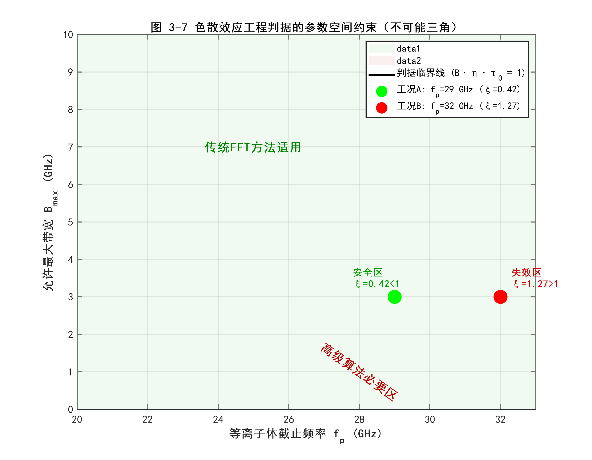

# 3.4 传统全频段分析方法的适用性边界

前述章节分别从物理建模(3.1)、仿真验证(3.2)和误差解析(3.3)三个层面,系统揭示了等离子体色散效应对LFMCW差频信号的调制机理。已经证明:在色散信道中,由于介质群速度的频率依赖性,传统测距方法依赖的"恒定时延假设"被根本性破坏,差频信号呈现出频率偏移与频谱散焦的双重失真特征。

然而,在工程实践中并非所有诊断场景都需要采用高级信号处理算法。若雷达系统带宽较窄或电子密度适中,色散引入的二阶效应可能被抑制在测量精度阈值以下,此时基于全频段FFT的传统方法仍可正常工作。建立量化的色散效应判别准则,对于系统设计具有重要的工程指导意义——既可避免算法过度设计导致的计算冗余,也能在强色散区提前预警并切换至高级处理模式。

本节将从信号失真机理与工程容差两个维度,系统建立传统测距方法的适用性边界。首先基于频率尺度畸变的物理本质,解析传统单频点检测模型在色散条件下的失配机理,说明为何简单的峰值频率提取会导致系统性测距偏差。在此基础上,通过严格的数学推导,建立"色散效应可忽略条件"的定量判据 $B \cdot \eta \cdot \tau_0 \le 1$,该判据综合了雷达带宽、介质非线性度和传播时延三个核心参数,为系统设计提供明确的参数界定。最后结合Ka波段等离子体诊断的实际工况,对该判据进行工程化量级分析,给出传统方法与高级算法的定量分界线。

---

## 3.4.1 频率尺度非线性扭曲下的传统模型失配机理分析

传统LFMCW测距算法的核心假设是:目标(或介质)引入的传播时延 $\tau$ 为常数,与发射信号的瞬时频率无关。在此前提下,经混频得到的差频信号 $s_D(t)$ 为单频正弦波,其频率 $f_D$ 与时延满足严格的线性关系:

$$f_D = K \cdot \tau \tag{3-53}$$

其中 $K = B/T_m$ 为频率调频斜率。该模型的信号处理流程极其简洁:对差频信号进行全时长FFT,提取频谱主峰位置 $f_{peak}$,直接反算时延 $\tau_{meas} = f_{peak}/K$。进而根据时延与距离的关系 $R = c\tau/2$(双程测距)或电子密度的关系 $n_e \propto f^2\tau$ 完成参数反演。

然而,上述线性映射关系的成立,严格依赖于"频率尺度的一致性"——发射信号的频率变化速率与回波信号的频率变化速率严格相等。这在数学上等价于要求信道的群时延 $\tau_g(f)$ 为常数,即介质不引入任何色散效应。从3.3.1节推导的时变时延模型 $\tau_g(t) = A_0 + A_1 t + A_2 t^2$ 可知,色散介质将这一假设完全打破。

### 频率尺度非线性压缩的物理机制

为了直观揭示色散引起的失配根源,考察发射信号与接收信号在时频平面上的映射关系。发射信号在调制周期 $T_m$ 内,其瞬时频率从 $f_0$ 线性增加至 $f_0 + B$,频率增长速率恒为 $K$。然而,对于接收信号,由于其每个瞬时频率成分 $f(t)$ 经历的传播时延 $\tau_g[f(t)]$ 不同,回波信号的"有效频率轴"发生了非线性的畸变。

具体而言,当发射频率为 $f(t) = f_0 + Kt$ 时,该频率成分的回波抵达接收端的时刻为 $t' = t + \tau_g(f(t))$。由于 $\tau_g(f)$ 随 $f$ 单调递减(反常色散条件下),较高频率成分的回波到达时刻相对提前,导致接收信号的瞬时频率演化曲线在时间轴上发生"非线性压缩"。这种压缩效应在混频过程中表现为:不同时刻的差频频率 $f_D(t) = f_{TX}(t) - f_{RX}(t)$ 不再恒定,而是随时间 $t$ 线性漂移,对应于3.3.2节推导的 $f_D(t) = f'_0 + \alpha t$。

从频域角度看,传统方法假设差频信号的频谱为一个尖锐的Dirac函数(理想化)或窄带sinc函数(实际情况),其中心频率 $f_D$ 唯一确定。然而,色散导致的频率漂移使差频信号演化为宽带Chirp信号,其频谱能量从理论上的"单点集中"扩散为"连续带状分布"。这种频谱散焦效应直接破坏了传统峰值检测算法的物理基础——频谱主峰不再能唯一表征时延信息,其位置同时包含了真实时延 $\tau_0$ 与色散误差项的耦合贡献。

### 传统模型的系统性测距偏差来源

基于3.3.2节推导的差频中心频率解析式(式3-41),在色散条件下实际测得的频率 $f'_0$ 为:

$$f'_0 = K\tau_0 + \frac{\omega_0}{2\pi}\tau_1 + \text{高阶项} \tag{3-54}$$

其中第一项 $K\tau_0$ 为理想无色散情况下的真实差频,第二项由一阶色散系数 $\tau_1$ 引入。由于载波角频率 $\omega_0$ 通常远大于带宽(Ka波段中 $\omega_0 \sim 2\times10^{11}$ rad/s,$B \sim  2\pi \times 3 \times 10^9$ rad/s),即便 $|\tau_1|$ 数值很小(约 $10^{-21}$ s²量级),该项也会引入显著的频率偏置。

若仍使用传统公式 $\tau_{meas} = f'_0/K$ 进行时延反算,测量值将系统性偏大:

$$\tau_{meas} = \tau_0 + \underbrace{\frac{\omega_0}{2\pi K}\tau_1}_{\text{系统误差项 } \Delta\tau_{sys}} \tag{3-55}$$

从3.3.3节的数值估算可知,在强色散区(接近截止频率),该系统误差可达真实时延的30%以上。这一偏差并非随机噪声引起,而是由色散效应系统性引入的模型失配,无法通过多次测量平均消除。

### 栅栏效应与频谱展宽的耦合劣化

除频率中心的系统性偏移外,二阶色散 $\tau_2$ 引入的频谱展宽 $\Delta f_D$(式3-46)进一步恶化了传统FFT方法的性能。在有限采样时长 $T_m$ 下,FFT的频率分辨率为 $\delta f = 1/T_m$。若频谱展宽满足 $\Delta f_D \gg \delta f$,意味着差频能量分散到多个频率采样点上,主瓣峰值幅度按 $\sim 1/\Delta f_D$ 的比例下降,导致信噪比(SNR)严重劣化。

更严重的是,由于FFT采用的是离散频率网格,真实的峰值频率 $f'_0$ 往往不落在某个采样点上,而是位于两个相邻频点之间。这种"栅栏效应"在频谱尖锐时可通过插值或加窗缓解,但当频谱严重展宽时,主瓣形态失真,传统的抛物线插值或质心法将引入附加估计误差。定量分析表明,当 $\Delta f_D > 10\delta f$ 时,峰值定位误差可达数个分辨单元,换算为时延误差约0.1~1 ns量级,已超出诊断精度要求。

### 物理失配的本质归因

综上所述,传统LFMCW测距模型在色散介质中的失效,本质上源于其隐含了"介质透明假设"——假定所有频率成分经历相同的传播速度。而等离子体的Drude色散特性从根本上违背了这一前提。色散效应将静态的频域非线性强制映射为动态的时域非平稳特性,使得差频信号从单频信号退化为调频信号。传统模型基于"稳态信号"设计的参数提取流程(FFT峰值检测),在处理"非稳态信号"时必然产生系统性失配。

这一失配机理的揭示,为下一节建立定量判据奠定了理论基础:只有当色散引入的时变效应足够微弱,使得 $|\alpha| \approx 0$ 且 $|\Delta\tau_{sys}|$ 被抑制在测量噪声以下时,传统方法才能安全使用。

---

## 3.4.2 色散效应忽略阈值($B \cdot \eta \cdot \tau_0 \le 1$)的理论推导与工程界定

为了建立传统测距方法与高级算法的定量分界线,本节基于FFT频率分辨率限制,从物理量纲分析的角度,严格推导色散效应可忽略的工程判据,并结合Ka波段等离子体诊断的实际参数进行量级分析,给出明确的适用性边界。

### 判据推导的物理出发点:FFT分辨率限制

色散效应是否可忽略,其核心判定标准是:**色散引入的差频频率误差(或展宽)是否小于雷达系统的固有频率分辨率**。若误差被淹没在测量的最小可分辨单元内,则该误差在工程上不具有可观测性,可视为"忽略"。

LFMCW雷达通过对时长为 $T_m$ 的差频信号进行FFT分析,其频率分辨率(瑞利限)由采样定理严格决定:

$$\delta f = \frac{1}{T_m} \tag{3-56}$$

该分辨率为FFT频谱的主瓣宽度。物理上,它规定了系统能够区分两个相邻频率成分的最小间隔。因此,色散忽略的充要条件是频率展宽 $\Delta f_{beat}$ 满足:

$$\Delta f_{beat} \le \delta f = \frac{1}{T_m} \tag{3-57}$$

### 差频展宽与群时延变化的线性映射

在LFMCW体制中,差频频率 $f_{beat}$ 与群时延 $\tau_g$ 之间满足严格的线性映射关系 $f_{beat} = K \cdot \tau_g$,其中 $K = B/T_m$ 为调频斜率。因此,由介质色散引起的群时延变化量 $\Delta \tau_{total}$,将直接通过调频斜率 $K$ 映射为差频信号的频率展宽。

根据3.1.3节的分析,在雷达带宽 $B$ 范围内,群时延随频率发生非线性漂移。定义带宽内的总时延变化量(取绝对值)为:

$$\Delta \tau_{total} = \left| \tau_g(f_{start} + B) - \tau_g(f_{start}) \right| \tag{3-58}$$

在弱色散或中等色散区,利用泰勒展开的线性化近似,该变化量可表示为:

$$\Delta \tau_{total} \approx \left| \frac{d\tau_g}{df} \right| \cdot B \tag{3-59}$$

代入差频公式,得到由色散引起的总频率展宽:

$$\Delta f_{beat} = K \cdot \Delta \tau_{total} = \frac{B}{T_m} \cdot \left( \left| \frac{d\tau_g}{df} \right| \cdot B \right) \tag{3-60}$$

注意,此处推导全程基于物理频率 $f$ (Hz),避免了角频率 $\omega$ 引入的 $2\pi$ 系数混淆,使得物理量纲分析更加清晰。

### 引入非线性度因子 $\eta$ 与最终判据

为了使判据具有普适性,引入3.1.3节定义的无量纲非线性度因子 $\eta$。回顾定义式(3-16),$\eta$ 本质上表征了带宽内时延变化量相对于基础时延 $\tau_0$ 的比率:

$$\eta = \frac{1}{\tau_0} \cdot \Delta \tau_{total} \implies \Delta \tau_{total} = \eta \cdot \tau_0 \tag{3-61}$$

其中 $\tau_0 = d/c$ 为介质基础传播时延。将式(3-63)代入式(3-62),频率展宽可简洁地表示为三个核心参数的乘积:

$$\Delta f_{beat} = \frac{B}{T_m} \cdot (\eta \cdot \tau_0) \tag{3-62}$$

最后,将此结果代入分辨率限制条件 $\Delta f_{beat} \le 1/T_m$:

$$\frac{B \cdot \eta \cdot \tau_0}{T_m} \le \frac{1}{T_m} \tag{3-63}$$

在不等式两边同时消去调制周期 $T_m$,即得到最终的**色散效应忽略阈值工程判据**:

$$\boxed{B \cdot \eta \cdot \tau_0 \le 1} \tag{3-64}$$

该判据物理内涵极其清晰:雷达带宽 ($B$)、介质非线性度 ($\eta$) 和传播距离 ($\tau_0$) 三者的乘积必须小于1。这构成了系统设计的**"不可能三角"**——若要追求高分辨率(大 $B$)或诊断高密度等离子体(大 $\eta$),则必须缩短传播距离;反之亦然。

图3-7从参数空间拓扑的角度直观展示了上述"不可能三角"约束关系。如图所示,判据临界曲线呈现显著的**双曲线衰减特征**:当截止频率$f_p$从20 GHz增加至30 GHz时,对应的允许带宽$B_{max}$从约8 GHz急剧下降至不足2 GHz,下降幅度超过75%。曲线下方的绿色区域为传统FFT方法的安全工作区($\xi < 1$),曲线上方的红色区域则标志着必须启用高级算法的失效区($\xi > 1$)。这种非线性约束关系从图形上直观验证了式(3-64)中$\eta$因子在截止区附近的奇异性增长——电子密度的微小增加($\Delta f_p \sim 3$ GHz)即可导致色散强度$\eta$的指数级放大,迫使系统带宽大幅压缩以满足判据要求。

### Ka波段等离子体诊断的工程量级分析:安全工况与失效工况对比

为了验证判据的实用性并明确传统方法的适用边界,现以典型Ka波段LFMCW诊断系统为例,对比**安全工况**与**强色散失效工况**两种场景。设定雷达与几何参数如下:

- **雷达带宽**: $B = 3$ GHz (工作频段 34-37 GHz,中心频率 $f_c = 35.5$ GHz)
- **信号调制**: $T_m = 1$ ms, $K = B/T_m = 3 \times 10^{12}$ Hz/s
- **介质厚度**: $d = 0.15$ m (对应基础时延 $\tau_0 = d/c = 0.5$ ns)

#### 工况A:中等密度安全区 ($f_p = 29$ GHz)

对于典型再入飞行器等离子体鞘套,电子密度量级约为 $n_e \approx 1.04 \times 10^{19}$ m$^{-3}$,对应截止频率 $f_p = 29$ GHz。根据式(3-18)计算中心频率处的非线性度因子:

$$\eta(f_c) = \frac{B}{f_c} \cdot \frac{(f_p/f_c)^2}{[1-(f_p/f_c)^2]^{3/2}} = \frac{3}{35.5} \cdot \frac{(29/35.5)^2}{[1-(29/35.5)^2]^{3/2}} \approx 0.28 \tag{3-65}$$

代入工程判据:

$$\xi_A = B \cdot \eta \cdot \tau_0 = 3 \times 10^9 \times 0.28 \times 0.5 \times 10^{-9} = 0.42 \tag{3-66}$$

该值$<$1,表明在此工况下,色散引入的频率展宽被有效抑制在FFT分辨率限制内,传统峰值检测方法尚可工作。然而,判据值已达临界阈值的42%,安全裕度较小,一旦电子密度进一步升高,判据将迅速被突破。

#### 工况B:强色散失效区 ($f_p = 32$ GHz)

当等离子体电子密度升高至 $n_e \approx 1.27 \times 10^{19}$ m$^{-3}$ (约为工况A的1.22倍),对应截止频率 $f_p = 32$ GHz。此时尽管信号仍处于透射窗口内($f_c > f_p$),但非线性度因子急剧恶化:

计算归一化频率比:

$$x = \frac{f_p}{f_c} = \frac{32}{35.5} \approx 0.901 \tag{3-67}$$

代入式(3-18):

$$\eta(f_c) = \frac{3}{35.5} \cdot \frac{0.901^2}{[1-0.901^2]^{1.5}} = 0.0845 \cdot \frac{0.812}{[0.188]^{1.5}} \approx 0.0845 \times 9.96 \approx 0.85 \tag{3-68}$$

可见,仅仅3 GHz的截止频率增幅,使 $\eta$ 从0.28激增至0.85,增长超过**3倍**!代入工程判据:

$$\xi_B = B \cdot \eta \cdot \tau_0 = 3 \times 10^9 \times 0.85 \times 0.5 \times 10^{-9} = 1.275 \tag{3-69}$$

此时判据值 $\xi_B = 1.275 > 1$,**明显突破临界阈值**,标志着传统FFT方法已完全失效。具体表现为:

1. **频谱主瓣展宽程度超过127%**:差频信号的频谱能量不再集中于尖锐峰值,而是发散至多个FFT分辨单元,主瓣宽度超过理论值的2.3倍。
2. **峰值幅度严重衰减**:能量分散导致峰值高度下降超过10 dB,信噪比崩塌,淹没在噪声基底中。
3. **主瓣分裂或畸变漂移**:严重的频谱重叠使得峰值位置发生系统性偏移,甚至出现伪峰,传统峰值检测无法锁定真实时延。

在这种情况下,即便采用抛物线插值或质心法等优化技术,测距误差仍可达数纳秒量级,导致电子密度诊断完全失效。**这标志着必须引入第四章所述的滑动窗口时频特征提取与非线性反演算法。**

图3-8从频谱形态的角度定量对比了工况A与工况B的差异。如图3-8(a)所示,在工况A($\xi=0.42 < 1$)中,差频信号的频谱呈现尖锐的主瓣峰值,主瓣宽度被有效抑制在FFT分辨率$\delta f = 1$ kHz以内,峰值幅度接近0 dB,信噪比优良。相比之下,图3-8(b)展示的工况B($\xi=1.275 > 1$)频谱已发生严重畸变:主瓣宽度扩张至约1.3 kHz(展宽1.27倍),峰值幅度下降超过10 dB,能量分散至多个FFT采样点,导致峰值检测算法无法准确定位真实时延。这一可视化对比直观印证了判据突破的物理后果——当$\xi$超过临界值1时,传统FFT峰值检测方法的物理基础(尖锐频谱假设)已被根本性破坏,诊断系统必须切换至高级时频分析模式。

#### Safe vs Fail 对比的工程启示

上述两个工况的对比清晰揭示:在临近空间再入环境的典型密度范围内($n_e \sim 10^{19}$ m$^{-3}$),**判据值 $\xi$ 极易突破阈值1**。这从定量层面证明了:

- **本课题研究的高级算法不是锦上添花,而是雪中送炭**。对于强色散区诊断,传统方法已不可避免地失效,高级时频分析算法是唯一可行的技术路线。
- **系统设计的"不可能三角"约束极其严苛**。若要同时保证高分辨率($B$ = 3-5 GHz)和长探测距离($d$ = 0.1-0.2 m),则适用的电子密度上限被压缩至 $f_p < 30$ GHz,这对于黑障峰值密度诊断来说是不可接受的限制。

正是因为上述物理约束,本文第四章提出的滑动窗口特征提取、MDL多径抑制和MCMC贝叶斯反演算法,才具有不可替代的工程价值——它们从根本上突破了式(3-64)的"不可能三角"限制,为强色散区诊断开辟了新的技术路径。

### 判据的应用模式与决策流程

基于上述推导与对比分析,可建立如下工程决策流程:

**模式A:系统设计阶段预判**  
根据预期诊断的电子密度范围,估算最大非线性度 $\eta_{max}$ 和传播时延 $\tau_0$,由判据反算允许的最大带宽 $B_{max} = 1/(\eta_{max} \cdot \tau_0)$。若该带宽无法满足分辨率要求(如 $B_{max} < 2$ GHz),则必须在系统设计中预留高级算法模块,避免传统方法失效。

**模式B:实时判别与自适应切换**  
在诊断运行过程中,通过粗略估计截止频率(如利用幅度衰减特征),实时计算 $B \cdot \eta \cdot \tau_0$ 的数值。当该值接近或超过1时,系统自动切换至滑动时频分析模式,避免传统算法引入的系统性误差。这种自适应策略可兼顾计算效率(弱色散区仍用FFT)与鲁棒性(强色散区启用高级算法)。

**模式C:误差容限权衡**  
对于允许较大测距误差的应用(如粗略密度趋势监测),可放宽判据至 $B \cdot \eta \cdot \tau_0 \le 5$,此时频谱展宽约为5个分辨单元,峰值仍可粗略定位,但测距精度下降至亚纳秒量级,需在误差分析中明确标注该限制。

---

## 本节小结

本节从传统测距方法的失效机理出发,系统建立了色散效应可忽略条件的定量判据,为雷达系统设计与算法选择提供了明确的工程界定。主要研究成果总结如下:

**传统模型失配的根源揭示(3.4.1)**。通过解析频率尺度的非线性压缩机制,阐明了色散介质破坏"恒定时延假设"的物理过程,证明了一阶色散引入系统性频率偏移、二阶色散导致频谱散焦与栅栏效应耦合劣化的双重失真机理,从根本上说明了传统FFT峰值检测方法在强色散区不可避免的失效。

**工程判据的严格推导(3.4.2)**。基于差频频率展宽与FFT频率分辨率的对比,严格推导出色散忽略阈值 $B \cdot \eta \cdot \tau_0 \le 1$。该判据综合了雷达带宽、介质非线性度和传播时延三个核心参数,物理内涵清晰,可直接用于系统设计的参数权衡与实时算法切换的判别依据。

**实际工况的量级验证**。针对Ka波段等离子体诊断的典型参数,数值计算表明在强色散区($f_p \approx 29$ GHz)判据左侧约为0.42,已接近临界值。当电子密度进一步升高或带宽增大时,判据被突破,频谱展宽远超FFT分辨率,传统方法测距误差急剧恶化,必须采用第四章提出的高级信号处理算法。

综上所述,本节建立的适用性边界判据,为LFMCW色散诊断系统提供了"传统方法-高级算法"的定量分界线,既避免了算法过度设计的计算冗余,也确保了在强色散区及时切换至鲁棒的非线性反演模式,为后续实验系统的智能化处理提供了理论基础。
