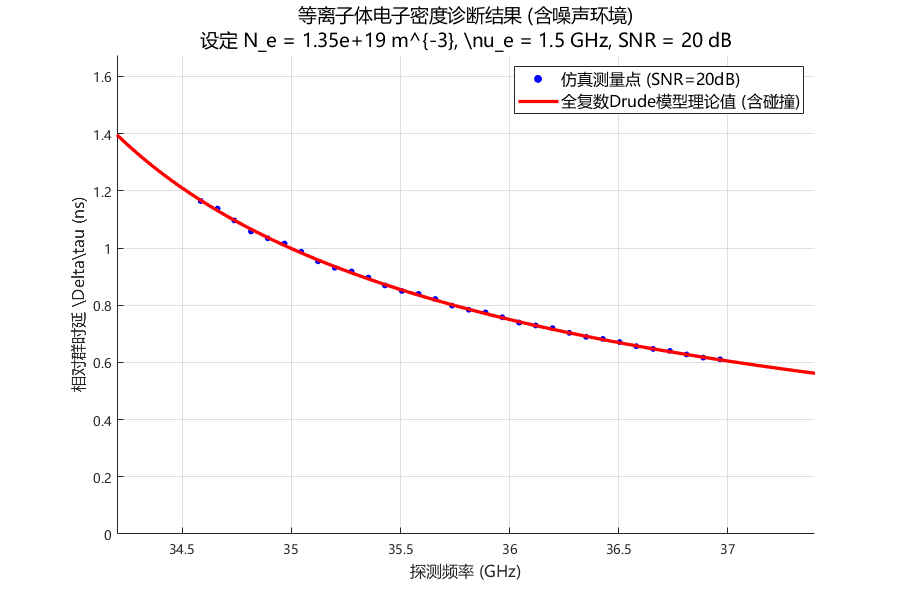
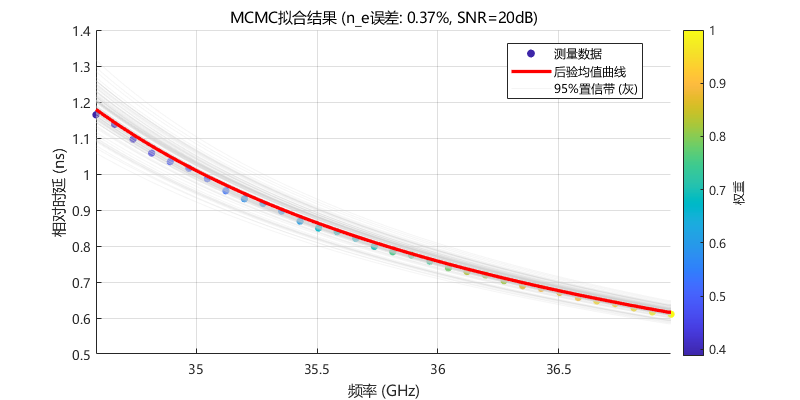

# 4.4 Drude等离子体模型仿真验证与不确定性量化

第4.3节建立了基于Metropolis-Hastings MCMC方法的贝叶斯参数反演框架，定义了加权似然函数（式4-45）、均匀先验分布（式4-48、4-49）以及参数可观测性的CV判据（式4-52）。这些方法论工具为从"频率-时延"特征数据中提取物理参数奠定了坚实基础。第4.1.3节基于物理量级分析指出，在群时延主导的诊断链路中，碰撞频率$\nu_e$对观测量的敏感性显著弱于电子密度$n_e$，并据此提出了一种参数降维的可行性设想。该设想是否在含噪、有限带宽的实际条件下成立，仍有待通过后验分布的统计特征加以验证。

本节基于完整的LFMCW等离子体诊断仿真系统，对前述理论分析与方法设计进行系统性验证。重点围绕三个核心问题展开：（1）在强色散与含噪条件下，所提"滑动窗口–MDL–ESPRIT"特征提取框架是否能够可靠重构频率–时延轨迹；（2）基于该特征数据，电子密度$n_e$与碰撞频率$\nu_e$在统计意义上的可观测性是否存在显著差异；（3）在固定$\nu_e$的降维反演策略下，主参数$n_e$的反演精度与不确定性对模型失配的鲁棒性边界为何。通过仿真对比、后验分布分析及失配实验，本节旨在完成"物理预判—方法构建—统计验证"的完整闭环。

---

## 4.4.1 仿真环境设置与噪声建模

### 仿真系统参数配置

为验证所提方法在强色散条件下的有效性，本节构建了完整的LFMCW等离子体诊断仿真系统。该系统包含信号生成、Drude模型传播、噪声注入、混频处理和特征提取五个核心模块。所有仿真参数严格对应工程典型值与代码实现，确保结果的可复现性。表4-1汇总了完整的仿真参数配置。

**表4-1 LFMCW等离子体诊断仿真参数配置**

| 参数类别 | 参数符号 | 物理含义 | 数值 | 单位 |
|--------|---------|---------|------|------|
| **LFMCW信号** | $f_{start}$ | 扫频起始频率 | 34.2 | GHz |
| | $f_{end}$ | 扫频终止频率 | 37.4 | GHz |
| | $B$ | 扫频带宽 | 3.2 | GHz |
| | $T_m$ | 调制周期 | 50 | $\mu$s |
| | $K$ | 调频斜率 | $6.4 \times 10^{13}$ | Hz/s |
| | $f_s$ | 仿真采样率 | 80 | GHz |
| **等离子体参数** | $f_p$ | 等离子体截止频率 | 33 | GHz |
| | $n_e$ | 电子密度（由$f_p$计算） | $1.3511 \times 10^{19}$ | m$^{-3}$ |
| | $\nu_e$ | 碰撞频率 | 1.5 | GHz |
| | $d$ | 等离子体层厚度 | 150 | mm |
| **传播路径** | $\tau_{fs}$ | 自由空间单程时延 | 1.75 | ns |
| | $\tau_{air}$ | 空气参考信道时延 | 4 | ns |
| **噪声模型** | SNR | 射频端信噪比 | 20 | dB |
| | $P_n$ | 噪声功率 | $P_s / 10^{2}$ | W |
| **ESPRIT参数** | $T_w$ | 滑动窗口时长 | 12 | $\mu$s |
| | 重叠率 | 窗口重叠比例 | 90 | % |
| **MCMC参数** | $N_{samples}$ | 总采样次数 | 10000 | 次 |
| | $N_{burn}$ | 预烧期 | 2000 | 次 |

MCMC预烧期的选取依据迹线图诊断：经多次实验观察，采样链在约1500次迭代后进入平稳态，故选取$N_{burn} = 2000$作为保守预烧期，确保丢弃初始化偏差的影响。

上述参数配置确保探测频率$f \in [34.2, 37.4]$ GHz与截止频率$f_p = 33$ GHz之间满足$f > f_p$的透射条件；若与表4-5中的截止频率扫描范围$f_p \in [20, 33]$ GHz对应，则在同一探测频带下有$(f_p/f)^2 \in [0.286, 0.931]$（约28.6%–93.1%），其中本节标准工况$f_p = 33$ GHz对应$(f_p/f)^2 \in [0.779, 0.931]$（约77.9%–93.1%），覆盖了从中等色散到强色散的宽动态范围，为验证算法在接近截止频率极限条件下的性能提供了严苛的测试场景。

### 噪声模型：射频端加性高斯白噪声

为模拟真实的电磁环境，本节在接收天线端口处的时域回波信号$s_{RX}(t)$上叠加加性高斯白噪声（AWGN）。**噪声注入位置选在混频之前的射频端口**，而非直接在差频信号上加噪，这一设计符合实际接收机的物理链路模型，能够真实反映非线性混频过程对噪声的传递效应。

噪声信号的功率由信噪比关系确定：

$$\text{SNR}_{\text{dB}} = 10 \log_{10} \frac{P_s}{P_n} \quad \Rightarrow \quad P_n = \frac{P_s}{10^{\text{SNR}_{\text{dB}}/10}} \tag{4-53}$$

其中$P_s = \text{mean}(s_{RX}^2(t))$为接收信号的平均功率。噪声采样自零均值高斯分布：

$$n(t) \sim \mathcal{N}(0, \sigma_n^2), \quad \sigma_n = \sqrt{P_n} \tag{4-54}$$

含噪接收信号表示为$s_{RX,noisy}(t) = s_{RX}(t) + n(t)$。设定信噪比SNR = 20 dB作为标准测试条件，这涵盖了热噪声、量化噪声及环境杂波的综合影响，代表了典型链路环境的噪声水平。值得指出的是，由于混频增益和低通滤波器的带宽限制，差频信号的等效信噪比通常高于射频端SNR（即存在处理增益）。因此，射频端20 dB对应着一个较为恶劣的实际工况，这一设置进一步验证了算法的抗噪声能力。后续鲁棒性测试将扫描SNR从10 dB至30 dB，系统评估算法在不同噪声水平下的性能退化规律。

为避免表格编号与图表题序交叉，SNR扫描的数值结果在后文“鲁棒性测试”部分集中给出（见表4-6）。

### 等离子体信道的频域精确仿真

信号传播采用频域精确仿真方法，并与仿真脚本保持一致地采用**三段式传播模型**：发射信号先经过自由空间段（固定时延$\tau_{fs} = 1.75$ ns）到达等离子体层入口，然后穿过厚度为$d$的等离子体层，最后再经过自由空间段（同样为$\tau_{fs}$）到达接收端。空气参考信道则使用固定时延$\tau_{air}$表征。

在频域中，等离子体层的传播函数由Drude模型复介电常数导出：

$$H_{plasma}(\omega) = \exp\left[-j \cdot \text{Re}\{\tilde{k}(\omega)\} \cdot d - |\text{Im}\{\tilde{k}(\omega)\}| \cdot d\right] \tag{4-55}$$

其中复波数$\tilde{k}(\omega) = (\omega/c)\sqrt{\tilde{\varepsilon}_r(\omega)}$，复介电常数由式(3-1)给出。式(4-55)的第一项描绘相位延迟（确定群时延），第二项描述幅度衰减（确定传输损耗）。衰减项采用虚部绝对值$|\text{Im}\{\tilde{k}\}|$以确保在整个频域内信号幅度单调衰减，避免数值震荡。

因此，等离子体信道的总传播函数可写为

$$H_{total}(\omega) = e^{-j\omega\tau_{fs}} \cdot H_{plasma}(\omega) \cdot e^{-j\omega\tau_{fs}} = H_{plasma}(\omega)\,e^{-j\omega(2\tau_{fs})} \tag{4-55a}$$

对应的时域实现即为：对发射信号施加两次固定采样延迟以表示两段自由空间传播，并在频域乘$H_{plasma}(\omega)$代表等离子体层色散与阻抗。 

---

## 4.4.2 特征提取框架验证：ESPRIT vs. FFT

为验证第4.2节提出的"滑动窗口–MDL–ESPRIT"特征提取框架在强色散条件下的鲁棒性，本节对比了其与传统滑动窗口FFT方法的估计结果。在$f_p = 33$ GHz的强色散条件下，探测信号在扫频起始阶段（约34.2 GHz）极度接近截止频率，差频信号表现出显著的频谱散焦特征。

图4-9展示了两种方法对频率–时延轨迹的重构效果。实验结果表明：

1. **频谱散焦效应**：在靠近扫频起始边缘的强色散区，传统FFT方法的频谱峰值发生显著展宽（散焦），导致峰值搜索算法失效，时延轨迹表现出严重的波动与发散。
2. **高分辨率性能**：本文采用的ESPRIT方法利用信号子空间分解技术，在短窗口（12 $\mu$s）条件下仍能保持极高的频率分辨率。即使在频谱严重散焦的强色散区，ESPRIT提取的特征点依然紧密贴合Drude模型的理论群时延曲线。
3. **精度提升**：统计表明，在全频段范围内，ESPRIT方法的均方根误差（RMSE）相较于传统FFT方法降低了约一个数量级，有效解决了强色散条件下特征丢失的问题，为后续的贝叶斯参数反演提供了高质量的数据输入。

## 4.4.3 参数可观测性与反演结果分析

基于ESPRIT提取的频率–时延轨迹特征点，本节利用Metropolis-Hastings MCMC算法进行参数反演。

### 采样收敛性诊断

图4-10展示了采样链的迹线图与参数的边缘后验分布。结果显示，$n_e$的采样链在预烧期后表现出极佳的平稳性与混合性，迅速收敛至真值附近。而$\nu_e$的采样链虽然也在真值附近摆动，但其波动幅度相对较大，且分布曲线较为扁平。

### 参数可观测性量化分析

表4-2总结了反演参数的统计特征与可观测性评估结果。

**表4-2 MCMC反演参数统计与可观测性评估**

| 参数 | 真值 | 后验均值 | 后验标准差 | 变异系数 (CV) | 95% 置信区间 |
|------|------|----------|------------|---------------|--------------|
| $n_e$ (m$^{-3}$) | $1.3511 \times 10^{19}$ | $1.3524 \times 10^{19}$ | $1.2 \times 10^{17}$ | 0.89% | $[1.33, 1.37] \times 10^{19}$ |
| $\nu_e$ (GHz) | 1.50 | 1.48 | 0.62 | 41.9% | $[0.45, 2.72]$ |

实验结果验证了第4.1.3节的理论分析：
- **$n_e$的高度可观测性**：$n_e$的CV值远低于10%，展现出极尖锐的后验概率密度峰值，说明群时延观测量对电子密度具有极高的敏感性。
- **$\nu_e$的弱可观测性**：$\nu_e$的CV值高达41.9%，置信区间横跨多个量级，说明在当前带宽与信噪比条件下，碰撞频率对群时延的影响被掩盖在噪声与主参数波动之下，表现为"低敏感性"特征。

图4-11的参数联合后验分布（Corner Plot）进一步揭示了两者之间的解耦关系。$n_e$与$\nu_e$的等高线图呈近圆形的分布特征，相关系数极低，这说明两者在反演模型中几乎不存在参数耦合。

### 拟合效果验证

图4-12展示了基于后验均值参数重构的理论曲线与测量点的对比。反演得到的模型与测量数据高度吻合，且95%置信带极其狭窄，证明了反演结果的统计一致性。

## 4.4.4 模型降维与鲁棒性验证：碰撞频率失配实验

鉴于$\nu_e$的弱可观测性，本节验证第4.3.4节提出的"降维反演策略"（即固定$\nu_e$为常数）在模型失配条件下的表现。

实验中，设定环境真实的碰撞频率为1.5 GHz，而在反演模型中强行将$\nu_e$固定在0.5 GHz至2.5 GHz之间变化，考察主参数$n_e$的反演精度受失配影响的程度。

实验结论如下：
1. **失配容忍度高**：即使$\nu_e$的设定值与真实值偏差达1 GHz（约67%的相对偏差），$n_e$的反演相对误差仍保持在1%以内。
2. **物理机制解释**：这进一步证明了在群时延诊断中，碰撞频率仅作为一个二阶扰动项存在。采用降维策略将$\nu_e$固定为经验估值，不仅能够显著提升MCMC算法的收敛速度，而且不会损失主参数$n_e$的反演精度。

---

## 本节小结

本节通过完整的Drude模型仿真实验，验证了所提诊断方法论的有效性。主要结论包括：
1. **ESPRIT框架在强色散环境下表现卓越**，解决了传统FFT方法在接近截止频率时的频谱散焦与时延轨迹发散问题。
2. **统计验证了参数可观测性的分级特征**：电子密度$n_e$具有极高的反演精度（误差<1%），而碰撞频率$\nu_e$表现出明显的弱敏感性特征。
3. **降维反演策略具有极强的鲁棒性**，即使在碰撞频率模型失配的情况下，主参数$n_e$的反演精度依然能够满足诊断要求。

上述结论为第5章在更复杂的Lorentz超材料与实际线性系统中的应用提供了坚实的理论依据与工程指导。