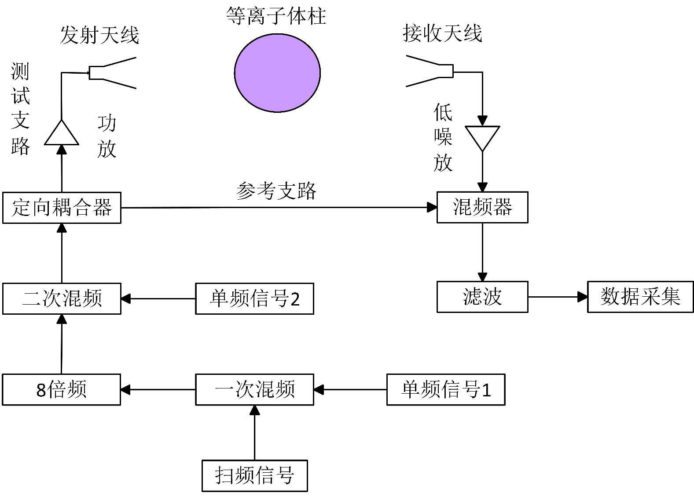

# 第二章 等离子体电磁特性与LFMCW诊断机理

第一章从工程应用的角度指出，基于LFMCW的时延诊断方法能够从根本上规避传统微波干涉法在高电子密度环境下面临的相位整周模糊问题。为了深入理解这一诊断方法的物理基础，并为后续章节的色散传播机理分析与反演算法设计提供理论支撑，本章将系统建立等离子体电磁特性与LFMCW诊断原理的基础理论框架。

本章首先从电磁波与等离子体相互作用的微观动力学出发，推导非磁化等离子体的复介电常数模型以及电磁波在其中的传播常数，阐明等离子体的频率选择性传播特征及其物理根源。在此基础上，详细论述LFMCW信号模型、无色散与色散两种典型环境下的时延测量机制，揭示差频信号频率与传播时延之间的映射关系。最后，介绍本文诊断系统的宽带超外差收发前端架构与信号预处理流程，为后续实验验证奠定硬件基础。

## 2.1 等离子体与电磁波相互作用基础

### 2.1.1 等离子体介电特性与截止频率

等离子体是物质存在的第四态，由大量的自由电子、正离子与中性粒子混合组成，宏观上呈现电中性。从电磁学角度审视，等离子体可被等效为一种色散、有耗的特殊电介质，其电磁响应特性由内部带电粒子的集体运动行为所决定。建立等离子体的介电常数模型，是分析电磁波在其中传播特性的理论起点。

等离子体的电磁特性主要由三个核心参数所表征。电子密度$n_e$（单位：m$^{-3}$）表征单位体积内的自由电子数目，是决定等离子体电磁响应强度的首要参量，电子密度越高，等离子体对电磁波的色散与衰减效应越显著；对于本文所关注的高超声速飞行器等离子体鞘套诊断场景，实验装置产生的等离子体射流电子密度覆盖$10^{15}$~$3 \times 10^{19}$ m$^{-3}$的宽动态范围。等离子体特征频率$f_p$（或特征角频率$\omega_p$）本质上是自由电子在受到外电场扰动后，由电荷恢复力驱动产生的集体振荡频率——当外加电场消失后，自由电子因惯性效应在正离子背景电荷的库仑恢复力作用下进行往复振荡，最终趋于动态平衡。这种电子集体振荡的固有角频率定义为：

$$\omega_p = \sqrt{\frac{n_e e^2}{\varepsilon_0 m_e}} \tag{2-1}$$

式中，$e$为电子电荷量（$1.602 \times 10^{-19}$ C），$m_e$为电子质量（$9.109 \times 10^{-31}$ kg），$\varepsilon_0$为真空介电常数（$8.854 \times 10^{-12}$ F/m）。将上述常数代入式(2-1)并转换为线性频率，可得到等离子体特征频率与电子密度的近似数值关系：

$$f_p = \frac{\omega_p}{2\pi} \approx 8.98 \sqrt{n_e} \quad (\text{Hz}) \tag{2-2}$$

式(2-2)表明，特征频率仅由电子密度唯一确定——这一单调递增的对应关系构成了通过测量频率相关的电磁量（如群时延）来反演电子密度的物理基础。从传播物理学的角度看，特征频率实质上扮演了截止频率的角色：当入射电磁波频率$f$高于$f_p$时，电磁波能够穿透等离子体，虽然会经历群时延色散与幅度衰减；而当$f$低于$f_p$时，电磁波将被完全反射或发生全内截止，无法在等离子体内部有效传播。

与上述两个频率参数并列的第三个核心参量为碰撞频率$\nu_e$（单位：Hz），它描述等离子体内部电子与中性粒子或离子之间碰撞事件的统计频次。碰撞过程导致电子有序运动动能向热运动能量的不可逆转化，在电磁学模型中体现为介质的欧姆损耗机制。碰撞频率的大小取决于等离子体的气体组分、温度和气压等宏观热力学条件，在本文所涉及的诊断场景中，其典型量级为$10^9$~$10^{10}$ Hz。

在明确上述三个核心参数的基础上，等离子体的宏观介电特性可通过分析自由电子在外加时变电场作用下的受迫运动规律来获得。在非磁化、各向同性的冷等离子体近似条件下，单个电子在外加电场$\vec{E} = E_0 e^{-j\omega t}$作用下的运动方程遵循经典朗之万方程：

$$m_e \frac{d^2 \vec{X}_e}{dt^2} = -m_e \nu_e \frac{d\vec{X}_e}{dt} - e\vec{E} \tag{2-3}$$

式中，$\vec{X}_e$为电子偏离平衡位置的位移，方程右端第一项表征碰撞引起的阻尼力，第二项为外电场的驱动力。假设位移和电场均具有$e^{-j\omega t}$的时谐性，可从稳态解中获得电子偏离平衡位置的距离：

$$X_e = \frac{eE}{m_e \omega(\omega + j\nu_e)} \tag{2-4}$$

由此可得等离子体的极化强度$P = -n_e e X_e = \varepsilon_0 \chi_e E$，进而获得极化率$\chi_e$的频率依赖关系。利用$\varepsilon = \varepsilon_0(1 + \chi_e)$的本构关系，最终得到等离子体的复相对介电常数——即Drude自由电子气模型的标准形式：

$$\tilde{\varepsilon}_r(\omega) = \left(1 - \frac{\omega_p^2}{\omega^2 + \nu_e^2}\right) - j\left(\frac{\nu_e}{\omega} \cdot \frac{\omega_p^2}{\omega^2 + \nu_e^2}\right) \tag{2-5}$$

式(2-5)是描述等离子体电磁特性的基本方程。其实部$\varepsilon_{r'} = 1 - \omega_p^2/(\omega^2 + \nu_e^2)$反映了等离子体对电磁波相速度的调制能力，决定了信号传播的色散特性；虚部$\varepsilon_{r''} = \nu_e \omega_p^2 / [\omega(\omega^2 + \nu_e^2)]$则表征了介质对电磁能量的吸收机制，决定了信号幅度的衰减程度。当碰撞频率趋于零时，虚部消失，介电常数退化为无损耗的实数形式$\varepsilon_r = 1 - (\omega_p/\omega)^2$，此时等离子体表现为理想的无耗色散介质。

从式(2-5)实部的符号特征可进一步揭示截止频率的物理意义。当$\omega > \omega_p$（且碰撞频率的影响可忽略）时，$\varepsilon_{r'} > 0$，等离子体支持电磁波的传播；当$\omega < \omega_p$时，$\varepsilon_{r'} < 0$，电磁波在等离子体中变为消逝模态（Evanescent Mode），信号幅度随传播距离呈指数衰减。因此，特征频率$f_p$即为等离子体的截止频率，标定了电磁波能否有效穿透等离子体的频率边界。在微波透射诊断的工程实践中，截止频率的数值直接决定了诊断信号工作频段的选择——诊断频率必须显著高于截止频率，以保证足够的穿透能力和信号信噪比。以本文实验装置产生的最高电子密度$n_e = 10^{19}$ m$^{-3}$为例，由式(2-2)计算可得对应的截止频率$f_p \approx 28.4$ GHz，因此诊断系统的工作频段须选择在30 GHz以上的Ka波段，方能确保电磁波在全电子密度诊断范围内均可有效穿透等离子体。

### 2.1.2 电磁波在非磁化等离子体中的传播常数

上一节建立了等离子体的Drude复介电常数模型。为了定量描述电磁波穿过等离子体时经历的相位变化与幅度衰减，本节将从麦克斯韦方程组出发，推导电磁波在非磁化均匀等离子体中的传播常数。

在均匀等离子体中，假设电磁波沿$z$轴方向传播，电场满足时谐平面波形式$\vec{E} = E_0 e^{j(\omega t - kz)}$。将等离子体的本构关系$\vec{D} = \varepsilon \vec{E}$和$\vec{B} = \mu_0 \vec{H}$（非磁化等离子体的磁导率等于真空磁导率$\mu_0$）代入麦克斯韦方程组，对第一个旋度方程再取一次旋度，可得齐次波动方程：

$$\nabla^2 \vec{E} + \omega^2 \mu_0 \varepsilon \vec{E} = 0 \tag{2-6}$$

将平面波解代入式(2-6)，可得电磁波的传播常数$k$与等离子体介电常数之间的色散关系：

$$k = \omega\sqrt{\mu_0 \varepsilon} = \frac{\omega}{c}\sqrt{\tilde{\varepsilon}_r(\omega)} \tag{2-7}$$

由于等离子体的介电常数是复数，传播常数$k$亦为复数，可将其表示为实部与虚部的组合形式$k = \beta - j\alpha$，其中$\beta$称为相位常数（又称相移常数），$\alpha$称为衰减常数。将式(2-5)所表达的复介电常数代入式(2-7)，经过复数开方运算，可分离得到衰减常数$\alpha$与相位常数$\beta$的显式表达：

$$\alpha = \frac{\omega}{\sqrt{2}c}\sqrt{\frac{\omega_p^2}{\omega^2 + \nu_e^2} - 1 + \sqrt{\left(1-\frac{\omega_p^2}{\omega^2+\nu_e^2}\right)^2 + \left(\frac{\nu_e}{\omega}\frac{\omega_p^2}{\omega^2+\nu_e^2}\right)^2}} \tag{2-8}$$

$$\beta = \frac{\omega}{\sqrt{2}c}\sqrt{1 - \frac{\omega_p^2}{\omega^2 + \nu_e^2} + \sqrt{\left(1-\frac{\omega_p^2}{\omega^2+\nu_e^2}\right)^2 + \left(\frac{\nu_e}{\omega}\frac{\omega_p^2}{\omega^2+\nu_e^2}\right)^2}} \tag{2-9}$$

上述两式完整地刻画了电磁波在非磁化等离子体中的传播行为。衰减常数$\alpha$决定了信号幅度沿传播方向的指数衰减速率——电磁波穿过厚度为$d$的等离子体层后，其功率衰减量（单位：dB）为$S = 20\lg e^{-\alpha d} \approx -8.69\alpha d$；相位常数$\beta$则决定了电磁波在介质中的相速度$v_p = \omega/\beta$以及波长$\lambda_g = 2\pi/\beta$。

在本文涉及的Ka波段微波诊断场景中，探测频率（$f \sim 35$ GHz）远大于碰撞频率（$\nu_e \sim 1$~$10$ GHz），满足$\omega \gg \nu_e$的高频弱碰撞条件。在该条件下，式(2-9)中根号内的碰撞相关项可作为小量处理，相位常数简化为：

$$\beta(\omega) \approx \frac{\omega}{c}\sqrt{1 - \frac{\omega_p^2}{\omega^2}} \tag{2-10}$$

该近似形式具有清晰的物理图像：相位常数正比于$\sqrt{1-(\omega_p/\omega)^2}$，当探测频率远高于截止频率时，$\beta \to \omega/c$，等离子体的色散效应可忽略，电磁波近似以光速传播；当探测频率逼近截止频率时，$\beta \to 0$，电磁波的相速度趋于无穷大，群速度趋于零，信号能量被强烈迟滞在介质内部。这种频率依赖的传播速度变化，正是等离子体色散效应的本质体现，也是LFMCW宽带信号在强色散区产生差频频谱散焦的物理根源。

基于式(2-10)的近似结果，可进一步推导电磁波穿过等离子体后的附加相移与传播时延。电磁波穿过厚度为$d$的等离子体时，相对于在同等厚度的真空中传播所产生的附加相移为：

$$\Delta\varphi = (\beta - \beta_0)d = \left(\beta - \frac{\omega}{c}\right) d \tag{2-11}$$

其中$\beta_0 = \omega/c$为真空中的相位常数。值得关注的是，由于在截止频率以上$\beta < \beta_0$（等离子体中的相速度大于光速），附加相移$\Delta\varphi$为负值——即等离子体引起的相位变化是超前的。这一特征与普通介质（如环氧树脂、聚四氟乙烯等$\varepsilon_r > 1$的材料）引起的相位滞后形成鲜明对比，体现了等离子体作为"欠密介质"（Under-dense Medium, $\varepsilon_r < 1$）的特殊性。

附加相移的本质来源是传播时延的差异。定义等离子体引起的相对传播时延$\tau$为电磁波在等离子体中的群传播时间与在真空中的群传播时间之差：

$$\tau = \frac{d}{v_g} - \frac{d}{c} \tag{2-12}$$

其中$v_g$为等离子体中的群速度。在高频弱碰撞近似下，群速度$v_g = c\sqrt{1-(\omega_p/\omega)^2}$恒小于光速（等离子体呈正常群速度色散），因此$\tau > 0$，即信号在等离子体中的传播时间长于在真空中的传播时间。图2-1以归一化形式直观展示了群速度$v_g/c = \sqrt{1-(f_p/f)^2}$随归一化探测频率$f/f_p$的变化规律：当$f/f_p$趋向1时群速度急剧降至零，揭示了截止区附近信号能量被强烈迟滞的奇异色散行为；随着探测频率远离截止频率，群速度逐渐趋近光速，色散效应迅速减弱。

将式(2-1)和式(2-12)联立，在$\omega \gg \omega_p$的进一步近似条件下，可得到电子密度与传播时延的线性估算关系：

$$n_e \approx \frac{8\pi^2 \varepsilon_0 m_e c}{e^2} \cdot \frac{f^2}{d} \cdot \tau \tag{2-13}$$

式(2-13)揭示了一个重要的物理关系：在弱色散条件（$f \gg f_p$）下，电子密度与传播时延近似成正比。这意味着，通过精确测量电磁波穿过等离子体引起的时延变化量，即可估算出线积分路径上的平均电子密度。这一原理构成了LFMCW时延诊断法的理论基石——将对电磁波相位变化的直接测量转化为对传播时延的间接提取，在根本上规避了相位测量固有的$2\pi$周期性模糊。

然而，需要特别指出的是，式(2-13)仅在弱色散近似（$f \gg f_p$）下成立。当等离子体电子密度较高、截止频率逼近诊断频段时，群时延$\tau$不再是频率的常数，而是频率的强非线性函数。此时，LFMCW宽带信号不同频率分量经历的时延差异不可忽略，差频信号将偏离理想的单频正弦波形态。这一色散效应对诊断精度的影响将在第三章进行严格的解析推导与量化分析。

---

## 2.2 LFMCW时延法诊断原理

上一节建立了等离子体电子密度与电磁波传播时延之间的物理关联，表明通过测量时延变化可实现电子密度的参数反演。然而，微波传播时延通常处于纳秒乃至皮秒量级，直接在时域中精确测量如此微小的时间差异在硬件实现上面临极大困难。线性调频连续波（LFMCW）体制提供了一种将时延信息转化为可精确测量的频率偏移量的高效机制。本节将首先建立LFMCW信号的数学模型，随后分别在理想无色散与色散两种典型传播环境下，详细阐述差频信号频率与传播时延之间的映射关系，揭示色散效应对传统LFMCW测距方法的影响机理。

### 2.2.1 线性调频连续波信号模型

线性调频连续波是一种频率随时间线性变化的连续电磁波信号。本文诊断系统采用锯齿波形式的频率调制，在每个调制周期$T_m$内，发射信号的瞬时频率从起始频率$f_0$以恒定速率$K$线性递增至终止频率$f_0 + B$，其中$B$为扫频带宽，$K = B/T_m$为调频斜率。发射信号的瞬时频率可表示为：

$$f_T(t) = f_0 + Kt, \quad 0 \le t \le T_m \tag{2-14}$$

理想条件下，锯齿波调制的单周期LFMCW发射信号的时域表达式为：

$$s_T(t) = A_0 \cos\left(2\pi f_0 t + \pi K t^2 + \theta_0\right), \quad 0 \le t \le T_m \tag{2-15}$$

式中$A_0$为发射信号幅度，$\theta_0$为初始相位。信号的瞬时相位为$\Phi_T(t) = 2\pi f_0 t + \pi K t^2 + \theta_0$，对时间求导可验证瞬时频率确为式(2-14)所描述的线性函数。

当发射信号经过一段传播路径后，接收信号是发射信号的延时拷贝（暂不考虑色散效应），其瞬时频率和时域信号分别为：

$$f_R(t) = f_0 + K(t-\tau), \quad \tau \le t \le \tau + T_m \tag{2-16}$$

$$s_R(t) = A_1 \cos\left[2\pi f_0 (t-\tau) + \pi K(t-\tau)^2 + \theta_0\right] \tag{2-17}$$

式中$\tau$为信号在传播路径上经历的群时延，$A_1$为接收信号幅度（由于传播衰减$A_1 < A_0$）。

LFMCW系统的核心信号处理步骤是将接收信号与发射信号进行混频（De-chirp操作）。混频器在时域上实现两信号的相乘运算，输出包含两路信号频率之和与之差的分量。经低通滤波器滤除高频和频分量后，保留的差频信号即包含了传播时延信息。

### 2.2.2 理想无色散环境下的时延测量机制

在理想无色散传播环境中（如自由空间或空气），电磁波的群速度等于光速，传播时延$\tau$为常数。此时，在每个扫频周期内，发射信号与接收信号的瞬时频率差值在不同时间段内具有不同表现。混频后差频信号的瞬时频率可分为两个时间区间：

$$f_D(t) = \begin{cases} K(\tau - T_m), & 0 \le t \le \tau \\ K\tau, & \tau \le t \le T_m \end{cases} \tag{2-18}$$

上式表明，在$0 \le t \le \tau$的区间内，差频频率同时受到扫频周期$T_m$和时延$\tau$的影响，该区间被称为"不规则区"；而在$\tau \le t \le T_m$的区间内，差频频率仅与时延$\tau$和调频斜率$K$成正比，该区间被称为"规则区"。在实际诊断系统中，等离子体引起的传播时延远小于扫频周期（$\tau \ll T_m$），该条件在本系统的参数设置下充分满足——以$T_m = 50~\mu$s、最大传播时延约268 ps计算，$T_m/\tau > 10^5$。因此不规则区所占时间比例极小，差频信号在规则区内可近似表示为恒定频率的稳态正弦波，差频频率与传播时延之间的基本映射关系为：

$$f_D = K\tau = \frac{B}{T_m} \tau \tag{2-19}$$

式(2-19)是LFMCW测距的核心公式，揭示了该体制将时间域的微小延迟精确映射至频率域的基本机理：传播时延$\tau$乘以调频斜率$K$即得差频信号频率$f_D$，这一线性关系表明提高调频斜率$K$（即增大带宽$B$或缩短周期$T_m$）可增强时延到频率的转换灵敏度。在等离子体诊断的差分测量模式中，分别采集有等离子体和无等离子体（空气基准）状态下的差频信号，两次测量的差频频率差值$\Delta f_D$对应于等离子体引入的相对时延增量，联立式(2-13)和式(2-19)即可建立从差频频率变化量到电子密度的完整计算链路。

在差频频率的精确提取方面，对差频信号进行$N_{FFT}$点离散傅里叶变换（DFT），频域的频率分辨率为$\Delta f = f_s/N_{FFT}$。当采样点数$N$等于FFT点数$N_{FFT}$时，利用采样频率$f_s = N/T_m$的关系，可得系统能够分辨的最小时延变化为：

$$\Delta\tau = \frac{1}{B} \tag{2-20}$$

式(2-20)表明，LFMCW系统的固有时延分辨率仅取决于扫频带宽$B$，与调频周期$T_m$和FFT点数$N_{FFT}$无关。在本系统默认的800 MHz基带扫频带宽配置下，固有分辨率为$\Delta\tau = 1.25$ ns。然而，由于DFT将连续频谱离散化为频率间隔$\Delta f = 1/T_m$的等间距栅栏点，当差频信号的真实频率并非恰好落在某一栅栏点上时，其频谱能量将泄漏至相邻谱线，该栅栏效应（Picket Fence Effect）限制了直接从FFT峰值读取频率值的精度，是影响LFMCW系统时延测量精度的重要因素。第五章将介绍通过线性调频Z变换（CZT）结合能量重心法等频谱细化与校正技术，实现超越固有分辨率限制的高精度频率估计。

### 2.2.3 色散介质下的时延测量机制

前述分析假设传播时延$\tau$为常数，对应于非色散环境。然而，等离子体作为色散介质，其群速度是频率的函数$v_g(\omega) = c\sqrt{1-(\omega_p/\omega)^2}$，不同频率分量在穿过等离子体时经历的群时延各不相同。当LFMCW信号的扫频带宽较大或等离子体的截止频率接近诊断频段时，这种频率依赖的时延差异将对差频信号的特性产生本质性的影响。

在LFMCW体制下，发射信号的瞬时频率按$f(t) = f_0 + Kt$随时间线性扫描。由于等离子体对不同频率的电磁波施加不同的群时延$\tau_g(f)$，在一个扫频周期内，信号不同时刻的频率分量经历的传播延迟也随之变化。将$f = f_0 + Kt$代入群时延的频率依赖关系中，可得到传播时延对时间的隐式函数$\tau_g(t) = \tau_g(f(t))$。第三章将严格表明，这一时变时延可用二阶多项式进行近似描述：

$$\tau_g(t) \approx A_0 + A_1 t + A_2 t^2 \tag{2-21}$$

式中$A_0$为起始频率处的名义群时延，$A_1$为一阶色散系数与调频斜率的耦合项（表征时延的线性漂移速率），$A_2$为二阶色散引入的高阶畸变系数，各系数的具体推导与物理含义见第三章3.3.1节。图2-2以时频平面的形式直观对比了非色散与色散两种信道下LFMCW信号的传播差异：在非色散信道中，发射与接收信号的瞬时频率线保持严格平行，差频频率在整个扫频周期内恒定不变；而在色散信道中，由于群时延随瞬时频率变化，接收信号的瞬时频率线呈现非线性弯曲，与发射线之间的间距随时间递减——这一瞬时频差的非恒定性直接导致差频信号偏离理想的单频正弦波。

当传播时延$\tau_g(t)$随时间变化时，接收信号不再是发射信号的简单延时拷贝，而是经历了时变调制后的复杂信号。在混频解调后，差频信号的瞬时频率不再是常数$K\tau$，而是变为时间的函数：

$$f_D(t) \approx \underbrace{K\tau_0}_{\text{理想差频项}} + \underbrace{f_0 K \cdot \frac{\partial\tau_g}{\partial f}\bigg|_{f_0}}_{\text{一阶色散频移}} + \underbrace{\left(2K^2\frac{\partial\tau_g}{\partial f}\bigg|_{f_0} + f_0 K^2 \frac{\partial^2\tau_g}{\partial f^2}\bigg|_{f_0}\right) \cdot t}_{\text{二阶色散散焦项}} \tag{2-22}$$

式(2-22)中的后两项严格揭示了色散效应对差频信号的非稳态调制机理。具体而言，方程中的一阶导数项构成了一个与时间无关的常数频移，由于Ka波段的载波频率$f_0$高达数十GHz，其与调频斜率及群时延色散率的乘积将被显著放大；即使等离子体的频变色散率本身较小，该乘积项也会在MHz量级的差频维度上引入不可忽略的系统偏置。此时，若仍沿用传统的单峰检测法提取所谓"恒定频差"，必然导致其对应的表观时延严重偏离真实的物理群时延。进一步地，方程中的二阶导数项刻画了信号随时间演化的非线性调频特性，由于这一随时间线性变化的时变频率分量直接破坏了差频信号的稳态正弦假设，在全周期傅里叶频域积分下，其频谱能量不可避免地由尖锐的窄主瓣向两侧宽频带弥散——即发生显著的频谱散焦现象，进而加剧峰值信噪比的衰退与系统理论距离分辨力的恶化。在强色散条件下，频谱散焦可能严重到FFT峰值完全消失，传统的"单峰检测→单值时延"测量范式不再适用。

上述分析表明，色散效应使得差频信号的频谱从理想的离散单频线展宽为具有一定带宽的连续分布。传统的应对策略是试图"消除"色散效应、恢复理想的单频差频信号，然而正如第一章所指出的，这种"色散消除"范式存在逻辑循环与信息浪费两大根本性局限。本文提出的替代方案是将差频信号频谱的展宽特性重新解读为携带丰富物理信息的"群时延轨迹"——通过滑动窗口将长时间的差频信号分割为多个短时子区间，在每个子区间内利用高分辨率频率估计算法（如ESPRIT）提取局部差频频率，再将其转化为对应时刻（即对应探测频率）的群时延估值，即可重构出离散的"频率-群时延"特征散点集合。该散点集合编码了等离子体的完整色散信息——其形状和趋势由截止频率$f_p$（即电子密度$n_e$）所唯一决定，在此基础上通过非线性参数反演算法（如MCMC贝叶斯反演）从散点集合中定量反解出电子密度参数。这一"色散利用"的技术路线将在第三章和第四章中进行完整的理论建模与算法设计。

---

## 2.3 诊断系统硬件架构与信号链路

本节介绍为实现上述LFMCW时延诊断原理所构建的硬件系统平台。诊断系统采用超外差架构实现从基带信号到Ka波段宽带发射信号的频率搬移，通过多级混频与倍频级联链路生成目标频段的宽带线性调频信号，并配以自混频解调电路提取差频信号。

### 2.3.1 宽带超外差收发前端设计架构

直接在Ka波段（30~40 GHz）产生宽带线性调频信号的硬件复杂度与成本极高，为此本系统采用"低频扫频→上变频混频→倍频扩带→二次混频搬移"的级联超外差方案，核心思想是将信号生成的线性度控制集中在低频段（$\sim$100 MHz），通过后续的频率变换链路将窄带扫频信号逐级搬移至Ka波段。如图2-3所示，系统射频前端链路在信号流向上可划分为发射变频、信号分配与收发、接收解调三个功能模块。

在发射变频模块中，泰克任意波形发生器（AWG70001A）产生中心频率约100~200 MHz、带宽100 MHz（初始配置）的基带线性调频信号。如图2-3左侧链路所示，该信号首先经第一级混频器（MIX1）与频率合成器（LMX2820）提供的1.55 GHz本振信号进行上混频，输出频率落在1.65~1.75 GHz区间的中频信号。中频信号经放大与带通滤波后，进入由三级无源二倍频器串联构成的八倍频链路（HMC188→HMC189A→HMC204），每一级倍频后均配置衰减器与带通滤波器以控制功率电平并抑制谐波杂散。经八倍频处理后，信号频率提升至13.2~14 GHz区间，扫频带宽从初始的100 MHz扩展至800 MHz。该信号经放大后馈入第二级混频器（MIX2），与矢量信号发生器（E8267D）提供的21 GHz可调本振信号进行上混频，完成从中频至Ka波段的最终搬移，获得中心频率约34.6 GHz、带宽800 MHz的发射信号。

在信号分配与收发模块中（图2-4上方通路），发射信号通过定向耦合器（TC-1040-20K）分为两路：直通端信号经功率放大器馈入发射天线，向被测等离子体辐射宽带LFMCW信号；耦合端信号引出作为接收端解调混频器的本振参考。收发天线采用耐高温、高增益的Ka波段聚焦透镜天线，可有效抑制电磁波绕射导致的测量误差。在接收解调模块中（图2-4下方通路），接收天线采集的回波信号经低噪声放大器（HB-LNA-0240，增益>40 dB，频带2~40 GHz）放大后，与定向耦合器耦合端的本振参考信号在接收端混频器（MIX3）中进行自混频操作，输出差频信号。差频信号经过7阶巴特沃斯型LC低通滤波器（通带截止频率5 MHz）滤除高频杂散后，由高速示波器（DSOX95004Q）完成波形数据的数字化采集，后续在MATLAB中进行离线信号处理与参数反演。

射频前端链路的性能最终取决于各级核心器件的级联配合。混频器的选择须兼顾工作频率覆盖、变频损耗和本振功率要求——第一级混频器（HMC213B）工作于1.5~4.5 GHz频段，第二级及接收端混频器（MM1-1044L）覆盖10~44 GHz频段，变频损耗约10 dB。倍频器的输入功率须精确控制在10~20 dBm范围内，以避免输入功率不足导致倍频效率急剧下降或功率过大引起器件损伤。各级带通滤波器的通带范围需与对应频率变换后的信号频段严格匹配，以有效抑制混频产生的镜像频率和倍频引入的谐波杂散。整条链路的功率平衡是确保系统正常工作的关键——每一级频率变换前后均需配置射频放大器，以补偿无源器件（混频器、倍频器、滤波器）的插入损耗，使每一级的输入功率落在器件的最佳变换区间内。

该架构的一个重要设计优势在于系统发射信号的中心频率具备灵活的可调性。通过改变第二级混频本振的输出频率（由矢量信号发生器提供，频率范围100 kHz~44 GHz），可在不改动链路硬件的情况下将发射信号的中心频率在30~40 GHz范围内连续调节。在实际等离子体诊断实验中，可根据待测等离子体的预估截止频率灵活选择诊断频段——使工作频率处于截止频率以上的有效透射窗口内，同时尽可能贴近截止频率以获取更强的色散信号特征。

### 2.3.2 信号预处理与数据采集模块

在非色散环境下，发射信号经传播路径后与参考信号混频解调，理想状态下差频信号为固定频率的单频正弦波，其频率由式(2-19)给出的$f_D = K\tau$确定。在本系统的典型配置下（$B = 800$ MHz，$T_m = 50~\mu$s，初始天线间距对应的系统固有时延在纳秒量级），差频信号频率落在kHz~MHz量级。需要注意的是，由于每次实验使用的射频同轴电缆长度不完全一致，系统固有电延迟在不同测试配置间存在变化，因此诊断中关注的核心物理量并非差频频率的绝对值，而是有、无被测介质两种状态下差频频率的变化量$\Delta f_D$。该差分测量策略可有效消除系统固有电延迟、线缆长度变化等共模误差源。

差频信号在经过低通滤波器滤除高频杂散后，通过功分器分为两路：一路输入至高速示波器进行波形数据的数字化采集与存储，用于后续的离线信号处理；另一路接入频谱仪用于实时监测差频信号的频谱状态，以便在实验过程中及时判断系统是否处于正常工作状态。在数据处理层面，示波器采集到的差频信号时域波形数据导入MATLAB进行后处理——对于传统的单频差频信号（弱色散条件），处理流程包括DFT频谱分析、栅栏效应校正（CZT细化+能量重心法/三角形法）、差频频率精确估计与时延反算；对于色散条件下的非稳态差频信号，则需要采用第四章提出的滑动窗口ESPRIT特征提取与MCMC反演算法进行处理。

LFMCW系统的固有时延分辨率$\Delta\tau = 1/B$仅取决于扫频带宽，因此提升带宽是扩展诊断系统电子密度测量下限的直接手段。在初始800 MHz带宽配置的基础上，通过系统性地更换链路中的关键混频器（中频端口带宽从14 GHz扩展至18 GHz）与各级带通滤波器（通带范围同步拓宽），可将系统的扫频带宽从800 MHz逐步扩展至最大3 GHz，对应的固有分辨率从1.25 ns提升至0.333 ns，电子密度诊断下限从$10^{18}$ m$^{-3}$量级拓展至$10^{17}$ m$^{-3}$量级。扩频链路的详细设计与标定结果将在第五章进行系统论述。

---

## 本章小结

本章建立了等离子体电磁特性与LFMCW时延诊断方法的理论基础框架，主要工作和结论归纳如下。

在等离子体电磁特性方面，基于Drude自由电子气模型，从朗之万方程出发推导了非磁化等离子体的复相对介电常数表达式。通过将复介电常数代入波动方程，获得了电磁波在等离子体中的衰减常数$\alpha$和相位常数$\beta$的完整解析形式。在高频弱碰撞近似条件下，建立了附加相移和相对传播时延与等离子体参数（电子密度$n_e$、碰撞频率$\nu_e$）之间的定量关系，明确了截止频率$f_p$作为电磁波能否穿透等离子体的临界判据的物理意义。

在LFMCW诊断原理方面，建立了锯齿波调制的LFMCW信号数学模型，推导了差频信号频率与传播时延之间的线性映射关系$f_D = K\tau$，揭示了LFMCW体制将时域微小延迟精确映射至频域可测频率偏移的核心机制。明确了系统固有时延分辨率$\Delta\tau = 1/B$仅取决于扫频带宽的基本规律，以及栅栏效应对测量精度的影响机制。进一步阐明了色散环境下传播时延演变为时间的函数，导致差频信号出现一阶色散频移与二阶色散散焦的物理机理，指出了传统"恒定时延"假设在强色散条件下的失效机制。

在硬件系统方面，介绍了诊断系统采用的"低频扫频→混频上变频→八倍频扩带→二次混频搬移"超外差架构设计，阐述了各级关键器件的功能分工与选型要点。该架构通过将频率扩带功能分散至三级倍频模块实现，兼顾了宽带信号生成的线性度控制与谐波抑制要求；通过外部可调本振注入方式，赋予了系统30~40 GHz范围内的频率灵活调节能力。

本章所建立的理论体系和硬件平台为后续章节的深入研究提供了必要基础。第三章将在本章复介电常数与群时延基本关系的基础上，进行更为精细的色散通道建模与量化分析，推导色散效应导致差频信号畸变的完整解析表达，并建立传统方法适用性的工程判据；第四章将在本章差频信号色散特性分析的基础上，提出基于滑动时频特征提取与贝叶斯反演的新型诊断算法。
