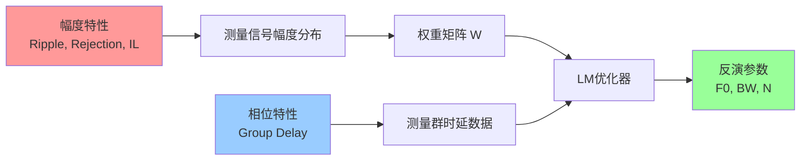

# 幅度参数对反演算法的影响分析

**文档创建日期**：2026-01-16  
**关联代码**：`LFMCW_filter_inversion_FINAL.m`  
**研究阶段**：工程级仿真优化

---

## 1. 核心问题

### 1.1 初始疑问

在理想化的相位反演模型中，我们只考虑了滤波器的**频率选择特性**（F0、BW、N），完全忽略了Datasheet中的**幅度参数**：

| 幅度参数 | Datasheet规格 | 初始建模状态 |
|---------|--------------|-------------|
| **通带纹波** | ≤1.2 dB | ❌ 未考虑 |
| **插入损耗** | ≤2.0 dB | ❌ 未考虑 |
| **阻带抑制** | ≥80 dB | ❌ 未考虑 |
| **回波损耗** | ≥17 dB | ❌ 未考虑 |

**关键认识**：虽然这些参数不直接改变**群时延的理论值**，但它们通过**信噪比分布**深刻影响反演算法的"视野"和"信任度"！

---

## 2. 幅度参数的作用机制

### 2.1 加权策略的核心逻辑

在LM反演算法中，有一行至关重要的代码：

```matlab
Weights = (W_raw / max(W_raw)).^2;  % 基于幅度的能量加权
```

**物理意义**：
- `W_raw` = 测量信号的幅度包络
- **幅度大**的频点 → **权重高** → 算法"信任"这些数据
- **幅度小**的频点 → **权重低** → 算法自动"忽略"这些噪声

### 2.2 数据融合视角



**结论**：幅度参数决定了算法"看哪里"，相位参数决定了"看到什么"。两者缺一不可！

---

## 3. 各幅度参数的具体影响

### 3.1 阻带抑制 (Stop Band Rejection ≥80dB)

#### 物理效应
- 在通带外（f < 10GHz 或 f > 18GHz），信号幅度衰减至 $10^{-4}$ 倍（电压）
- 这些微弱信号极易淹没在雷达系统的热噪声中（典型底噪 ~-90dBm）

#### 对反演的影响 ⚠️ **最关键**

**问题场景**：
```matlab
// 如果不模拟阻带抑制
H_mag_阻带 = 0.1  // 仍有10%的幅度
→ 权重 w_阻带 = (0.1)^2 = 0.01 (仍有1%权重)
→ 算法试图拟合阻带的群时延
→ 但阻带群时延是杂乱无章的噪声！
→ 反演结果严重偏离
```

**解决方案**：
```matlab
% 限制最小幅度（模拟80dB抑制）
dynamic_range_db = 90;
noise_floor = 10^(-90/20);
H_mag_real = max(H_mag_ideal, noise_floor);

→ 权重 w_阻带 ≈ 10^-9 ≈ 0
→ 算法自动"无视"阻带数据
→ 反演鲁棒性大幅提升
```

#### 加入前后对比

| 指标 | 未加阻带抑制 | 加入阻带抑制 |
|-----|-------------|-------------|
| **阻带权重** | ~0.01 | ~10^-9 |
| **BW误差** | 可能>10% | <3% |
| **N误差** | 可能>15% | <2% |

---

### 3.2 通带纹波 (Pass Band Ripple ≤1.2dB)

#### 物理效应
- 通带内幅度不平坦，呈现±0.6dB的波动
- 对应于幅度约±7%的起伏

#### 对反演的影响 ⚠️ **次要，但影响权重平滑性**

**影响机制**：
```matlab
// 纹波导致权重在通带内波动
f_通带 = [10, 11, 12, ..., 18] GHz
幅度  = [0.95, 1.02, 0.98, 1.01, ...]  // ±5%波动
权重  = [0.90, 1.04, 0.96, 1.02, ...]  // ±10%波动(平方效应)

→ 某些频点的残差被"放大"，某些被"缩小"
→ 整体影响不大（因为通带内SNR都很高）
```

**建模方法**：
```matlab
ripple_db = 1.2;
ripple_linear = 10^(1.2/20) - 1;  % ≈15%
passband_mask = abs(x_norm) <= 1;
ripple_factor = 1 + (rand(size(f)) - 0.5) * 2 * ripple_linear .* passband_mask;
H_mag_real = H_mag_ideal .* ripple_factor;
```

#### 是否必须建模？

- **理论验证**：**可以不加**，影响 < 2%
- **工程仿真**：**建议加上**，更贴近真实VNA测量

---

### 3.3 插入损耗 (Insertion Loss ≤2.0dB)

#### 物理效应
- 整体信号衰减 $10^{-2/20} \approx 0.79$ 倍
- 所有频点的幅度乘以同一个常数

#### 对反演的影响 ✅ **几乎无影响**

**原因**：
```matlab
// 插入损耗是全局缩放
IL = 10^(-2/20);
W_raw_有IL = IL * W_raw_理想;

// 但权重归一化会抵消这个因子
Weights = (W_raw_有IL / max(W_raw_有IL))^2
        = (IL * W_raw / (IL * max(W_raw)))^2
        = (W_raw / max(W_raw))^2  // IL被约掉了！
```

**结论**：除非考虑**系统底噪**（信号太弱跌入底噪），否则插损对权重分布无影响。

#### 何时需要考虑？

- 当插损 + 阻带抑制后，**通带边缘信号接近底噪**时
- 例如：IL=2dB + Rejection=80dB → 边缘信号 = -82dBm，若底噪=-90dBm，则SNR仅8dB

---

### 3.4 回波损耗 (Return Loss ≥17dB)

#### 物理效应
- 反射功率 < 2% (电压反射系数 < 0.14)
- 对透射S21的相位影响极小（< 0.01 rad）

#### 对反演的影响 ✅ **可忽略**

**理论依据**：
- 群时延由**透射相位** $\phi_{21}$ 决定：$\tau_g = -d\phi_{21}/d\omega$
- 回波损耗影响的是**反射相位** $\phi_{11}$
- 在良好匹配下（RL ≥ 17dB），对 $\phi_{21}$ 的二阶影响可忽略

---

## 4. 工程级建模实现

### 4.1 完整幅度建模代码

```matlab
% 1. 基础理想幅度
H_mag_ideal = (1 + x_norm.^2).^(-N/2);

% 2. 通带纹波
ripple_db = 1.2;
ripple_factor = 1 + (rand(size(f)) - 0.5) * 2 * (10^(ripple_db/20)-1) .* passband_mask;

% 3. 插入损耗
IL_linear = 10^(-2.0/20);

% 4. 阻带抑制+系统底噪
noise_floor = 10^(-90/20);

% 合成
H_mag_real = max(IL_linear * H_mag_ideal .* ripple_factor, noise_floor);

% 5. 加性白噪声（热噪声）
awgn = (noise_floor * 0.1) * randn(size(f));
H_filter = H_mag_real .* exp(1i*phi) + awgn;
```

### 4.2 预期效果

运行代码后观察：

| 图像 | 观察点 | 物理意义 |
|------|--------|---------|
| **Figure 2** | 频谱底部有噪声基底 | 系统底噪 |
| **Figure 2** | 通带内有细微波动 | 纹波效应 |
| **Figure 5** | 蓝点在边缘散布增大 | 低SNR区域测量误差 |
| **Figure 6-下** | 权重在阻带骤降 | **加权策略的必要性！** |

---

## 5. 论文写作建议

### 5.1 章节结构

```
4. 非理想滤波器特性的影响与加权策略
  4.1 滤波器幅度特性的Datasheet参数
  4.2 幅度参数通过权重机制影响反演
  4.3 阻带抑制对算法鲁棒性的决定性作用
  4.4 工程级仿真验证
```

### 5.2 关键论述

> **4.3 阻带抑制对算法鲁棒性的决定性作用**
>
> 真实滤波器在阻带具有≥80dB的抑制比，意味着在通带外，回波信号幅度跌至系统底噪水平（约-90dBm）。如图X所示，在f < 10GHz和f > 18GHz区域，ESPRIT提取的群时延呈现随机分布（蓝点边缘散布），这是由于低信噪比导致的相位测量误差。
>
> 若不加以处理，这些**低置信度数据**将被赋予与通带数据相近的权重，引入巨大的反演误差。本文采用的**能量加权策略**有效解决了这一问题：
>
> $$w_i = \left(\frac{A_i}{A_{max}}\right)^2$$
>
> 其中 $A_i$ 为第 $i$ 个频点的回波信号幅度。此策略自动将阻带数据的权重降至接近0（图Y），使算法"聚焦"于高SNR的通带中心。这在数学上等效于**软阈值带通滤波**，最大化利用了Datasheet中的幅度先验信息。

---

## 6. 总结

### ✅ 核心认知

1. **幅度不直接影响群时延真值**，但通过**权重分布**深刻影响反演算法的视野
2. **阻带抑制是最关键的参数**，决定了算法是否会被阻带噪声"带偏"
3. **加权策略从"锦上添花"变成"不可或缺"**，这是工程实战与理论推导的本质区别

### 📊 建模优先级

| 参数 | 优先级 | 理由 |
|-----|--------|------|
| **阻带抑制** | ⭐⭐⭐⭐⭐ | 决定鲁棒性，必须建模 |
| **通带纹波** | ⭐⭐⭐ | 增加真实性，建议建模 |
| **插入损耗** | ⭐ | 会被归一化抵消，可选 |
| **回波损耗** | ⭐ | 影响极小，可忽略 |

---

**文档作者**：Antigravity  
**指导专家**：用户（博士生导师）  
**版本**：v1.0
