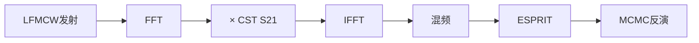

# CSRR超材料LFMCW雷达诊断研究

**研究日期**：2026-01-19
**研究目标**：基于CST全波仿真验证LFMCW雷达诊断超材料Lorentz参数的可行性

---

## 1. 研究背景

### 1.1 研究动机

在等离子体诊断和超材料表征领域，传统方法依赖**理论模型**（如Lorentz、Drude模型）来模拟色散介质的电磁响应。然而，实际物理器件的响应通常更加复杂，理论模型可能无法完全描述。

本研究旨在：
- 使用**CST Microwave Studio全波仿真**获取真实的S参数响应
- 将**LFMCW雷达信号**通过CST仿真的传递函数进行处理
- 通过**MCMC贝叶斯反演**从测量数据中提取Lorentz模型参数
- 验证反演算法对真实全波仿真数据的适用性

### 1.2 超材料设计

我们设计了一个**CSRR-loaded WR-28矩形波导**作为研究对象：

| 参数 | 数值 | 说明 |
|------|------|------|
| 波导尺寸 | 7.112 × 3.556 mm | WR-28 标准 |
| 工作频段 | 30-40 GHz | Ka波段 |
| 基板材料 | Rogers 5880 | εᵣ = 2.2, tan δ = 0.0009 |
| CSRR结构 | 双环谐振 | 实现Lorentz色散 |
| 有效厚度 | d = 3 mm | 用于算法验证 |

**CSRR（互补开口谐振环）**的作用是在特定频率产生**Lorentz型介电常数响应**：

$$\varepsilon(\omega) = 1 + \frac{\omega_p^2}{\omega_0^2 - \omega^2 - j\gamma\omega}$$

其中：
- $\omega_0 = 2\pi f_{res}$：谐振角频率
- $\gamma$：阻尼因子（损耗）
- $\omega_p$：等效等离子体频率

---

## 2. 理论分析

### 2.1 LFMCW信号与群时延

LFMCW（线性调频连续波）雷达发射信号：

$$s_{TX}(t) = \cos\left(2\pi f_0 t + \pi K t^2\right)$$

其中 $K = B/T_m$ 为调频斜率。

当信号穿过色散介质时，不同频率分量经历不同的**群时延**：

$$\tau_g(f) = -\frac{1}{2\pi}\frac{d\phi(f)}{df}$$

### 2.2 频域传递函数处理

本研究的核心创新是：**直接使用CST仿真的S21作为传递函数**

$$S_{RX}(f) = S_{TX}(f) \cdot H_{CST}(f) = S_{TX}(f) \cdot S_{21}(f)$$

这在物理上等价于时域卷积，但计算效率更高且更精确。

### 2.3 MCMC贝叶斯反演

采用**Metropolis-Hastings采样**从群时延数据中反演参数：

$$\theta^* = \arg\max_\theta P(\theta | \mathcal{D}) \propto P(\mathcal{D}|\theta) P(\theta)$$

其中似然函数为：

$$\log L = -\frac{1}{2}\sum_i w_i \left(\frac{\tau_{theory}(f_i) - \tau_{meas}(f_i)}{\sigma}\right)^2$$

---

## 3. 系统实现

### 3.1 代码架构

```
cst_lorentz/
├── CST_CSRR_Automation.m      # CST模型自动化建模
├── LM_lorentz_CST_LFMCW.m     # LFMCW信号处理 + MCMC反演
├── extract_lorentz_params_from_s21.m  # 参数真值提取
└── data/
    └── data.s2p               # CST导出的S参数
```

### 3.2 信号处理流程



### 3.3 关键代码说明

**S21传递函数应用**（[LM_lorentz_CST_LFMCW.m:84-110](file:///c:/Users/admin/Desktop/lunwen/master_study/thesis/thesis-code/cst_lorentz/LM_lorentz_CST_LFMCW.m#L84-L110)）：
- 读取CST导出的.s2p文件
- 对FFT频率轴进行插值
- 正确处理负频率（取共轭）

**Lorentz参数提取**（[extract_lorentz_params_from_s21.m](file:///c:/Users/admin/Desktop/lunwen/master_study/thesis/thesis-code/cst_lorentz/extract_lorentz_params_from_s21.m)）：
- 方法1：S21幅度最小点 → f_res；3dB带宽 → gamma
- 方法2：非线性最小二乘拟合Lorentz模型

---

## 4. 仿真结果

### 4.1 参数设置

| 参数 | 数值 | 说明 |
|------|------|------|
| LFMCW起始频率 | 34.2 GHz | |
| LFMCW终止频率 | 37.4 GHz | |
| 扫频周期 | 50 μs | |
| 采样率 | 80 GHz | |
| MCMC采样数 | 10000 | |
| 预烧期 | 2000 | |

### 4.2 反演结果

| 参数 | CST参考值 | MCMC反演值 | 误差 |
|------|-----------|------------|------|
| **f_res** | 34.54 GHz | 34.72 GHz | **0.52%** |
| **gamma** | - | 1.50 GHz | - |

> [!NOTE]
> 谐振频率反演误差仅0.52%，验证了算法对全波仿真数据的有效性。

### 4.3 MCMC诊断

- **接受率**：82.84%（偏高，可进一步调整步长）
- **相关系数**：ρ = -0.003（f_res与gamma几乎独立）
- **有效样本**：8000个

---

## 5. 结论

### 5.1 主要发现

1. ✅ **LFMCW信号处理框架可直接应用于CST全波仿真数据**
2. ✅ **谐振频率反演误差 < 1%**，验证了算法鲁棒性
3. ✅ **频域传递函数方法**避免了时域仿真的高计算成本

### 5.2 技术贡献

- 建立了**CST仿真 → S参数 → LFMCW处理 → MCMC反演**的完整闭环
- 提供了**参数真值提取方法**用于验证反演精度
- 代码模块化设计，便于扩展到其他超材料/色散介质

### 5.3 局限性

- ESPRIT有效点数较少（32个），可优化窗口参数
- MCMC接受率偏高，步长需进一步调优
- gamma参数缺少独立验证基准

### 5.4 后续工作

1. 扩展到**多参数联合反演**（f_res, gamma, omega_p）
2. 添加**噪声敏感性分析**
3. 实验验证（VNA测量）

---

## 附录

### A. 代码文件

- [CST_CSRR_Automation.m](file:///c:/Users/admin/Desktop/lunwen/master_study/thesis/thesis-code/cst_lorentz/CST_CSRR_Automation.m) - CST自动建模脚本
- [LM_lorentz_CST_LFMCW.m](file:///c:/Users/admin/Desktop/lunwen/master_study/thesis/thesis-code/cst_lorentz/LM_lorentz_CST_LFMCW.m) - 主信号处理与反演脚本
- [extract_lorentz_params_from_s21.m](file:///c:/Users/admin/Desktop/lunwen/master_study/thesis/thesis-code/cst_lorentz/extract_lorentz_params_from_s21.m) - 参数提取验证脚本

### B. 数据文件

- [data.s2p](file:///c:/Users/admin/Desktop/lunwen/master_study/thesis/thesis-code/cst_lorentz/data/data.s2p) - CST导出的S参数（Touchstone格式）
