**基于线性调频连续波的等离子体诊断系统设计**

**作者姓名 [曹 杠]{.underline}**

**指导教师姓名、职称 [刘彦明 教授]{.underline}**

**申请学位类别 [工学硕士]{.underline}**

**基于线性调频连续波的等离子体诊断系统设计**

**作者姓名：**曹 杠

**一级学科：**仪器科学与技术

**二级学科（研究方向）：**空间科学仪器与电磁实验技术

**学位类别：**工学硕士

**指导教师姓名、职称：**刘彦明 教授

**学　　院：**空间科学与技术学院

**提交日期：**2024年6月

**西安电子科技大学**

**硕士学位论文**

**学　号　 [21131213363]{.underline}**

**密　级　 [公开]{.underline}**

**学校代码 [10701]{.underline}**

**分类号** [TN82]{.underline}

**\**

By

Cao Gang

Supervisor: Liu Yan Ming Title: Professor

June 2024

A thesis submitted to

XIDIAN UNIVERSITY

in partial fulfillment of the requirements

for the degree of Master

in Instrument Science and Technology

**Design of Plasma Diagnostic System based on Linear Frequency Modulated
Continuous Wave**

**\**

**西安电子科技大学**

**学位论文独创性（或创新性）声明**

秉承学校严谨的学风和优良的科学道德，本人声明所呈交的论文是我个人在导师指导下进行的研究工作及取得的研究成果。尽我所知，除了文中特别加以标注和致谢中所罗列的内容以外，论文中不包含其他人已经发表或撰写过的研究成果；也不包含为获得西安电子科技大学或其它教育机构的学位或证书而使用过的材料。与我一同工作的同事对本研究所做的任何贡献均已在论文中作了明确的说明并表示了谢意。

学位论文若有不实之处，本人承担一切法律责任。

本人签名： 日 期：

**西安电子科技大学**

**关于论文使用授权的说明**

本人完全了解西安电子科技大学有关保留和使用学位论文的规定，即：研究生在校攻读学位期间论文工作的知识产权属于西安电子科技大学。学校有权保留送交论文的复印件，允许查阅、借阅论文；学校可以公布论文的全部或部分内容，允许采用影印、缩印或其它复制手段保存论文。同时本人保证，结合学位论文研究成果完成的论文、发明专利等成果，署名单位为西安电子科技大学。

保密的学位论文在 年解密后适用本授权书。

本人签名： 导师签名：

日 期： 日 期：

# 摘要 {#摘要 .标题-无编号}

临近空间高速目标等离子体电磁科学实验装置，具有地面模拟等离子体环境的能力，电子密度是衡量等离子体的重要指标之一，对实验装置产生的等离子体射流进行电子密度参数诊断具有必要性。实验装置产生的等离子体射流具有大尺寸、高电子密度的特点，电磁波在高电子密度的等离子体中传播时由于相位变化较大，存在相位反转情况，带来的相位整周模糊问题，是目前微波法通过直接检测相位变化，诊断高电子密度等离子体时存在的主要问题。电磁波相位变化的根源是传播时延发生变化，本文基于扫频式微波干涉法，提出了将线性调频信号检测时延的理论与电子密度诊断相结合的方法，设计了基于线性调频信号的时延诊断系统，通过获取等离子体引起的时延变化，得到等离子体的电子密度参数。本文的主要研究内容如下：

(1)分析电磁波在等离子体中的传播理论以及线性调频连续波诊断传播时延的原理，提出了检测传播时延变化，完成电子密度诊断的方法。基于诊断目标分析并确定系统的主要参数，设计整个诊断系统的硬件方案，主要包括线性调频信号发射及接收链路的设计及器件选择，并提出系统扩频方案。基于ADS射频仿真软件，对整个系统链路信号进行了仿真，对整个硬件链路的实测频率和功率进行匹配调节。

(2)针对调频连续波诊断系统差频信号的提取，给出了基于经验模态分解的去噪算法以及单频率的频谱校正算法，提升了超系统固有分辨率检测的能力。信号在经验模态分解后，依据相关函数能量选取主要的内涵模态分量进行重构完成去噪。在离散傅里叶变换后引入线性调频变换得到所需谱线处准确的频率信息，依据能量重心法及三角形法完成差频信号频率以及幅值的校正。

(3)针对电子密度诊断系统进行极限分辨率标定测试，在800MHz带宽下时延分辨率为20ps，扩频后时延分辨率为7ps，并通过环氧树脂介电常数诊断实验标定出系统误差小于15%。在临近空间高速目标等离子体电磁实验装置上搭建测试平台，对不同状态等离子体射流进行电子密度诊断，给出系统能够诊断的电子密度区间为\\\[8.6
\\times {10\^{17}}{\\rm{\\\~1}}{\\rm{.2}} \\times
{10\^{19}}{{\\rm{m}}\^{{\\rm{ -
3}}}}\\\]，扩频后能够诊断的理论最小电子密度为\\\[2.6 \\times
{10\^{17}}{{\\rm{m}}\^{{\\rm{ - 3}}}}\\\]。

本文验证了线性调频信号诊断时延的原理与等离子体诊断相结合的微波诊断方法，完成了对等离子体电子密度的诊断实验，避免了传统微波诊断法直接检测相位变化时存在的相位整周模糊问题，并标定出诊断系统的极限分辨率和电子密度测量范围及系统测量误差。

**关 键 词**：等离子体诊断，线性调频连续波，离散谱校正，介电常数诊断

# ABSTRACT {#abstract .标题-无编号}

The plasma electromagnetic scientific experiment device for high-speed
targets in near-space, that has the ability to simulate plasma
environment on the ground. Electronic density is one of the important
indicators of measuring plasma. It is necessary to diagnose the electron
density parameters of the plasma jet generated by the experimental
device. The plasma ejection flow generated by the experimental device
has the characteristics of large size and high electronic density. When
electromagnetic waves propagate in plasma with high electron density,
there is a phase reversal due to the large phase change, and the phase
ambiguity caused by the whole circle is the main problem in the direct
diagnosis of high electron density plasma by microwave method by
directly detecting phase changes. The root cause of the phase change of
electromagnetic waves is the change in propagation delay. Based on the
swept microwave interferometry method, a method combining the detection
delay theory of chirp signal with electron density diagnosis is
proposed, and a delay diagnosis system based on chirp signal is
designed, and the electron density parameters of the plasma are obtained
by obtaining the delay change caused by the plasma. The main research
contents of this paper are as follows:

1.  In this paper, analyzing the theory of electromagnetic wave
    propagation in plasma and the principle of linear frequency
    modulation continuous wave diagnosis of propagation delay, a method
    of detecting the change of propagation delay and completing the
    diagnosis of electron density is proposed. Based on the diagnostic
    target analysis and determine the main parameters of the system,
    design the hardware scheme of the whole diagnostic system, mainly
    including the design of linear frequency modulation signal
    transmitting and receiving links and the selection of devices, and
    put forward the system frequency expansion scheme. Based on ADS
    radio frequency simulation software, the whole system link signal
    was simulated, and the measured frequency and power of the whole
    hardware link were matched and adjusted.

2.  For the extraction of differential frequency signals of frequency
    modulation continuous wave diagnostic systems, a denoising algorithm
    based on empirical mode decomposition as well as a single-frequency
    spectral correction algorithm are given to improve the intrinsic
    resolution detection of the supersystem. After empirical modal
    decomposition, the signal is denoised by reconstructing the main
    internal modal components based on the energy of the correlation
    function. After the discrete Fourier transform, the linear frequency
    modulation transform is introduced to obtain the accurate frequency
    information at the required spectral lines, and the correction of
    the frequency and amplitude of the difference signal is completed
    according to the energy centre of gravity method and the triangle
    method.

3.  Limit resolution calibration tests were performed for the electron
    density diagnostic system, with a delay resolution of 20 ps at 800
    MHz bandwidth and 7 ps after spreading, and the system error was
    calibrated to be less than 15% by epoxy dielectric constant
    diagnostic experiments. A test platform is built on the high-speed
    target plasma electromagnetic experimental device in the near space,
    and the electron density diagnosis is carried out for different
    states of plasma jets, which gives the electron density interval
    that can be diagnosed by the system as\\\[8.6 \\times
    {10\^{17}}{\\rm{\\\~1}}{\\rm{.2}} \\times
    {10\^{19}}{{\\rm{m}}\^{{\\rm{ - 3}}}}\\\], and the theoretical
    minimum electron density that can be diagnosed after the frequency
    expansion is \\\[2.6 \\times {10\^{17}}{{\\rm{m}}\^{{\\rm{ -
    3}}}}\\\].

In this paper, the microwave diagnostic method combining the principle
of chirp signal diagnosis delay and plasma diagnosis is verified, and
the diagnostic experiment of plasma electron density is completed, which
avoids the phase integer ambiguity problem when the traditional
microwave diagnostic method directly detects phase changes, and
calibrates the ultimate resolution, electron density measurement range
and system measurement error of the diagnostic system

**Keywords**: Plasma diagnostics, Linear frequency modulation continuous
wave,

Discrete spectrum correction, Dielectric constant diagnosis

# 插图索引 {#插图索引 .标题-无编号}

> 图1.1 等离子体电磁实验装置 [2](#_Toc162279075)
>
> 图1.2 等离子体诊断方法 [3](#_Toc162279076)
>
> 图2.1 微波干涉法原理图 [14](#_Toc162279077)
>
> 图2.2 微波反射法原理图 [16](#_Toc167441013)
>
> 图2.3 扫频信号及差频信号瞬时频率曲线图 [18](#_Toc162279079)
>
> 图2.4 锯齿波调制的单周期扫频信号时域曲线图 [18](#_Toc162279080)
>
> 图2.5 调频线性度误差示意图 [22](#_Toc162279081)
>
> 图3.1 典型微波干涉仪原理图 [26](#_Toc162279082)
>
> 图3.2 典型线性调频连续波系统示意图 [27](#_Toc162279083)
>
> 图3.3 线性调频连续波诊断系统方案示意图 [28](#_Toc162279084)
>
> 图3.4 诊断系统链路方案示意图 [29](#_Toc162279085)
>
> 图3.5 频综板LMX2820正常工作示意图 [30](#_Toc162279086)
>
> 图3.6 PC端控制泰克信号源示意图 [30](#_Toc167441022)
>
> 图3.7 低通滤波器电路图 [35](#_Toc167441023)
>
> 图3.8 低通滤波器实物图 [36](#_Toc167441024)
>
> 图3.9 低通滤波器仿真及实测的S21曲线图 [36](#_Toc167441025)
>
> 图3.10 诊断系统链路仿真模型示意图 [37](#_Toc167441026)
>
> 图3.11 系统初始扫频信号频谱仿真结果 [37](#_Toc162279092)
>
> 图3.12 系统输出扫频信号频谱仿真结果 [38](#_Toc167441028)
>
> 图3.13 系统差频信号仿真频谱图 [38](#_Toc162279094)
>
> 图3.14 诊断系统正常工作状态示意图 [39](#_Toc162279095)
>
> 图3.15 系统链路机箱内部实物图 [40](#_Toc162279096)
>
> 图3.16 系统初始扫频信号实测频谱图 [40](#_Toc162279097)
>
> 图3.17 系统输出信号实测频谱图 [41](#_Toc162279098)
>
> 图3.18 差频信号实测频谱图 [41](#_Toc162279099)
>
> 图3.19 增大初始扫频信号带宽后谐波影响示意图 [42](#_Toc167441035)
>
> 图3.20 调整后初始带宽为200MHz时第一次混频结果 [43](#_Toc162279101)
>
> 图3.21 增大扫频带宽时差频信号实测频谱变化示意图 [43](#_Toc167441037)
>
> 图4.1 理想栅栏效应示意图 [45](#_Toc162279103)
>
> 图4.2 数据处理流程示意图 [46](#_Toc167441039)
>
> 图4.3 系统初始差频信号时域波形图 [49](#_Toc167441040)
>
> 图4.4 分解后IMF分量的波形及对应频谱 [49](#_Toc167441041)
>
> 图4.5 两阶IMF分量主导的自相关函数能量分布图 [50](#_Toc162279107)
>
> 图4.6 三阶IMF分量主导的自相关函数能量分布图 [51](#_Toc162279108)
>
> 图4.7 去噪重构后差频信号时域波形图 [51](#_Toc162279109)
>
> 图4.8 理想差频信号功率谱线分布图 [53](#_Toc167441045)
>
> 图4.9 三角形法校正示意图 [54](#_Toc167441046)
>
> 图4.10 去噪后10个周期差频信号波形图 [56](#_Toc162279112)
>
> 图4.11 加汉宁窗后的时域波形图 [57](#_Toc162279113)
>
> 图4.12 去噪后加窗的差频信号频域谱线图 [57](#_Toc162279114)
>
> 图4.13 小区间CZT变换后的频域谱线图 [58](#_Toc162279115)
>
> 图4.14 CZT变换前后单谱线对比图 [58](#_Toc167441051)
>
> 图4.15 三角形法校正后频谱结果图 [59](#_Toc167441052)
>
> 图4.16 三角形法校正后dBm形式的频谱结果图 [59](#_Toc162279118)
>
> 图4.17 能量重心法校正后dBm形式的频域结果图 [60](#_Toc162279119)
>
> 图5.1 极限分辨率测试环境示意图 [61](#_Toc162279120)
>
> 图5.2 移动10mm时差频信号频谱变化示意图 [62](#_Toc162279121)
>
> 图5.3 环氧树脂介电常数诊断实验示意图 [64](#_Toc167441057)
>
> 图5.4 环氧树脂时延仿真模型 [65](#_Toc167441058)
>
> 图5.5 不同厚度环氧树脂介质仿真时延曲线图 [65](#_Toc167441059)
>
> 图5.6 无介质及有100mm介质时差频信号实测频谱图 [66](#_Toc162279125)
>
> 图5.7 无介质及有100mm介质时差频信号校正后频谱图 [66](#_Toc167441061)
>
> 图5.8 52mm介质时差频信号校正后频域图 [67](#_Toc162279128)
>
> 图5.9 等离子体模型设置界面 [68](#_Toc162279129)
>
> 图5.10 诊断系统电磁仿真模型 [69](#_Toc162279130)
>
> 图5.11 不同电子密度等离子体的S21衰减曲线图 [70](#_Toc167441065)
>
> 图5.12 CST中电场仿真结果示意图 [70](#_Toc162279132)
>
> 图5.13 34.2-35GHz范围内等离子体S21衰减曲线图 [71](#_Toc162279133)
>
> 图5.14 等离子体时延变化曲线图 [72](#_Toc167441068)
>
> 图5.15 34.2-35GHz频率内等离子体时延变化曲线图 [72](#_Toc167441069)
>
> 图5.16 31.6-32.4GHz频率内等离子体时延变化曲线图 [73](#_Toc162279136)
>
> 图5.17 等离子体诊断系统测试示意图 [74](#_Toc162279137)
>
> 图5.18 等离子体诊断系统搭建实物图 [75](#_Toc167441072)
>
> 图5.19 等离子体诊断实验实拍示意图 [76](#_Toc167441073)
>
> 图5.20 等离子体诊断时初始差频信号实测频谱图 [76](#_Toc162279140)
>
> 图5.21 两种电压下有等离子体的差频信号实测频谱图 [77](#_Toc167441075)
>
> 图5.22 系统初始差频信号及其频谱图 [77](#_Toc162279142)
>
> 图5.23 差频信号处理步骤示意图 [78](#_Toc162279143)
>
> 图5.24 校正后的差频信号频谱图 [79](#_Toc167441078)
>
> 图5.25 300mm位置差频信号波形及频谱图 [81](#_Toc162279145)
>
> 图5.26 400mm位置处差频信号频谱图 [81](#_Toc167441080)
>
> 图5.27 33.2\~34GHz频率时400mm处校正后差频信号频谱图
> [82](#_Toc167441081)
>
> 图5.28 36.2\~37GHz频率时400mm处校正后差频信号频谱图
> [83](#_Toc167441082)

# 表格索引 {#表格索引 .标题-无编号}

> [表3.1 HMC213B混频器指标 [31](#_Toc167441083)](#_Toc167441083)
>
> [表3.2 MM1-1044L混频器主要指标 [32](#_Toc167441084)](#_Toc167441084)
>
> [表3.3 倍频器模块主要指标 [32](#_Toc167441085)](#_Toc167441085)
>
> [表3.4 TC-1040-20K定向耦合器主要指标
> [32](#_Toc167441086)](#_Toc167441086)
>
> [表3.5 链路各级滤波器型号及通带范围
> [33](#_Toc167441087)](#_Toc167441087)
>
> [表3.6 更换前后的混频器参数对比 [34](#_Toc167441088)](#_Toc167441088)
>
> [表3.7 更换前后的滤波器参数对比 [34](#_Toc167441089)](#_Toc167441089)
>
> [表3.8 链路节点处信号功率实测结果
> [40](#_Toc167441090)](#_Toc167441090)
>
> [表5.1 10mm极限分辨率测试结果 [62](#_Toc167441091)](#_Toc167441091)
>
> [表5.2 8mm极限分辨率测试结果 [62](#_Toc167441092)](#_Toc167441092)
>
> [表5.3 6mm极限分辨率测试结果 [63](#_Toc167441093)](#_Toc167441093)
>
> [表5.4 5mm极限分辨率测试结果 [63](#_Toc167441094)](#_Toc167441094)
>
> [表5.5 52mm环氧树脂诊断结果及误差
> [67](#_Toc167441095)](#_Toc167441095)
>
> [表5.6 100mm环氧树脂诊断结果及误差
> [67](#_Toc167441096)](#_Toc167441096)
>
> [表5.7 8kV和12kV诊断结果 [79](#_Toc167441097)](#_Toc167441097)
>
> [表5.8 不同电压下电子密度诊断结果
> [79](#_Toc167441098)](#_Toc167441098)
>
> [表5.9 与矢网的电子密度诊断结果对比
> [80](#_Toc167441099)](#_Toc167441099)
>
> [表5.10 33.2\~34GHz频率时400mm处诊断结果
> [82](#_Toc167441100)](#_Toc167441100)
>
> [表5.11 36.2\~37GHz频率时400mm处诊断结果
> [83](#_Toc167441101)](#_Toc167441101)
>
> [表5.12 33.2\~34GHz频率时600mm处诊断结果
> [83](#_Toc167441102)](#_Toc167441102)
>
> [表5.13 1.2GHz带宽下极限分辨率测试结果
> [84](#_Toc167441103)](#_Toc167441103)
>
> [表5.14 1.44GHz带宽下极限分辨率测试结果
> [84](#_Toc167441104)](#_Toc167441104)
>
> [表5.15 1.6GHz带宽下极限分辨率测试结果
> [84](#_Toc167441105)](#_Toc167441105)

# 符号对照表 {#符号对照表 .标题-无编号}

符号 符号名称

\$f\$ 电磁波频率

\$\\omega \$ 电磁波角频率

\$c\$ 光速

\${n_e}\$ 等离子体电子密度

\${\\omega \_p}\$ 等离子体震荡角频率

\${f_p}\$ 等离子体特征频率

\${v_e}\$ 等离子体碰撞频率

\${T_e}\$ 等离子体电子温度

\$e\$ 电子电荷量

\${m_e}\$ 电子质量

\$\\varepsilon \$ 介电常数

\${\\varepsilon \_0}\$ 真空介电常数

\${\\varepsilon \_r}\$ 相对介电常数

\$\\mu \$ 磁导率

\${\\mu \_0}\$ 真空磁导率

\$\\lambda \$ 电磁波波长

\${\\lambda \_g}\$ 等离子体中电磁波波长

\$k\$ 玻尔兹曼常数

\$\\tau \$ 传播时延

\$B\$ 调频带宽

\${T_m}\$ 调频周期

\${f_D}\$ 差频信号频率

\$d\$ 等离子体厚度

\$\\alpha \$ 衰减常数

\$\\beta \$ 相移常数

\$E\$ 电场强度

\$H\$ 磁场强度

\$D\$ 电位移

\${\\alpha \_e}\$ 磁化率

# 缩略语对照表 {#缩略语对照表 .标题-无编号}

缩略语 英文全称 中文对照

LFMCW Linear Frequency Modulation Continuous Wave 线性调频连续波

ADS Advanced Design System 微波仿真软件

EMD Empirical Mode Decomposition 经验模态分解

IMF Intrinsic Mode Functions 内涵模态分量

DFT Discrete Fourier Transform 离散傅里叶变换

FFT Fast Fourier Transform 快速傅里叶变换

CZT Chirp Z-Transform 线性调频变换

目录

[摘要 [I](#摘要)](#摘要)

[ABSTRACT [III](#abstract)](#abstract)

[插图索引 [V](#插图索引)](#插图索引)

[表格索引 [IX](#表格索引)](#表格索引)

[符号对照表 [XI](#符号对照表)](#符号对照表)

[缩略语对照表 [XIII](#缩略语对照表)](#缩略语对照表)

[第一章 绪论 [1](#绪论)](#绪论)

> [1.1 研究背景及意义 [1](#研究背景及意义)](#研究背景及意义)
>
> [1.2 等离子体诊断研究现状
> [3](#等离子体诊断研究现状)](#等离子体诊断研究现状)
>
> [1.3 本文研究内容及章节安排
> [6](#本文研究内容及章节安排)](#本文研究内容及章节安排)

[第二章 等离子体诊断原理及线性调频连续波诊断原理
[9](#等离子体诊断原理及线性调频连续波诊断原理)](#等离子体诊断原理及线性调频连续波诊断原理)

> [2.1 引言 [9](#引言)](#引言)
>
> [2.2 等离子体基础理论 [9](#等离子体基础理论)](#等离子体基础理论)
>
> [2.2.1 等离子体基本参数 [9](#等离子体基本参数)](#等离子体基本参数)
>
> [2.2.2 等离子体的介质特性
> [10](#等离子体的介质特性)](#等离子体的介质特性)
>
> [2.2.3 等离子体中的电磁波传播规律
> [11](#等离子体中的电磁波传播规律)](#等离子体中的电磁波传播规律)
>
> [2.3 等离子体微波诊断方法
> [14](#等离子体微波诊断方法)](#等离子体微波诊断方法)
>
> [2.3.1 微波干涉法 [14](#微波干涉法)](#微波干涉法)
>
> [2.3.2 微波反射法 [16](#微波反射法)](#微波反射法)
>
> [2.4 线性调频连续波诊断原理
> [17](#线性调频连续波诊断原理)](#线性调频连续波诊断原理)
>
> [2.4.1 锯齿波调制的连续波测量原理
> [17](#锯齿波调制的连续波测量原理)](#锯齿波调制的连续波测量原理)
>
> [2.4.2 连续波系统差频信号分析
> [20](#连续波系统差频信号分析)](#连续波系统差频信号分析)
>
> [2.4.3 调频连续波测量的影响因素
> [22](#调频连续波测量的影响因素)](#调频连续波测量的影响因素)
>
> [2.5 本章小结 [22](#本章小结)](#本章小结)

[第三章 诊断系统硬件设计 [25](#诊断系统硬件设计)](#诊断系统硬件设计)

> [3.1 引言 [25](#引言-1)](#引言-1)
>
> [3.2 系统主要工作参数 [25](#系统主要工作参数)](#系统主要工作参数)
>
> [3.2.1 工作频率 [25](#工作频率)](#工作频率)
>
> [3.2.2 扫频带宽 [25](#扫频带宽)](#扫频带宽)
>
> [3.2.3 扫频周期 [26](#扫频周期)](#扫频周期)
>
> [3.3 诊断系统方案设计 [26](#诊断系统方案设计)](#诊断系统方案设计)
>
> [3.3.1 链路方案设计 [28](#链路方案设计)](#链路方案设计)
>
> [3.3.2 链路模块选择 [30](#链路模块选择)](#链路模块选择)
>
> [3.4 系统扩频方案 [33](#系统扩频方案)](#系统扩频方案)
>
> [3.5 基于ADS的系统仿真 [35](#基于ads的系统仿真)](#基于ads的系统仿真)
>
> [3.5.1 低通滤波器设计仿真
> [35](#低通滤波器设计仿真)](#低通滤波器设计仿真)
>
> [3.5.2 系统信号瞬态仿真 [36](#系统信号瞬态仿真)](#系统信号瞬态仿真)
>
> [3.6 诊断系统实物调试 [39](#诊断系统实物调试)](#诊断系统实物调试)
>
> [3.7 本章小结 [43](#本章小结-1)](#本章小结-1)

[第四章 系统差频信号数据处理
[45](#系统差频信号数据处理)](#系统差频信号数据处理)

> [4.1 引言 [45](#引言-2)](#引言-2)
>
> [4.2 信号处理方案 [45](#信号处理方案)](#信号处理方案)
>
> [4.3 EMD去噪算法 [47](#emd去噪算法)](#emd去噪算法)
>
> [4.3.1 EMD分解基本原理 [47](#emd分解基本原理)](#emd分解基本原理)
>
> [4.3.2 基于相关函数特性的带通滤波方法
> [48](#基于相关函数特性的带通滤波方法)](#基于相关函数特性的带通滤波方法)
>
> [4.3.3 去噪算法测试分析 [48](#去噪算法测试分析)](#去噪算法测试分析)
>
> [4.4 频谱校正算法 [52](#频谱校正算法)](#频谱校正算法)
>
> [4.4.1 校正方法分析 [52](#校正方法分析)](#校正方法分析)
>
> [4.4.2 校正算法流程 [55](#校正算法流程)](#校正算法流程)
>
> [4.4.3 校正算法测试分析 [56](#校正算法测试分析)](#校正算法测试分析)
>
> [4.5 本章小结 [60](#本章小结-2)](#本章小结-2)

[第五章 系统标定及诊断实验
[61](#系统标定及诊断实验)](#系统标定及诊断实验)

> [5.1 引言 [61](#引言-3)](#引言-3)
>
> [5.2 系统极限分辨率标定实验
> [61](#系统极限分辨率标定实验)](#系统极限分辨率标定实验)
>
> [5.3 环氧树脂介电常数诊断实验
> [64](#环氧树脂介电常数诊断实验)](#环氧树脂介电常数诊断实验)
>
> [5.4 等离子体电子密度诊断实验
> [68](#等离子体电子密度诊断实验)](#等离子体电子密度诊断实验)
>
> [5.4.1 等离子体的衰减及时延仿真
> [68](#等离子体的衰减及时延仿真)](#等离子体的衰减及时延仿真)
>
> [5.4.2 等离子体诊断系统搭建
> [73](#等离子体诊断系统搭建)](#等离子体诊断系统搭建)
>
> [5.4.3 相同位置下不同电压诊断结果分析及对比
> [75](#相同位置下不同电压诊断结果分析及对比)](#相同位置下不同电压诊断结果分析及对比)
>
> [5.4.4 相同电压下不同位置诊断结果分析及对比
> [80](#相同电压下不同位置诊断结果分析及对比)](#相同电压下不同位置诊断结果分析及对比)
>
> [5.5 系统扩频后诊断实验
> [84](#系统扩频后诊断实验)](#系统扩频后诊断实验)
>
> [5.6 本章小结 [85](#本章小结-3)](#本章小结-3)

[第六章 总结与展望 [87](#总结与展望)](#总结与展望)

> [6.1 本文工作总结 [87](#本文工作总结)](#本文工作总结)
>
> [6.2 后期工作展望 [87](#后期工作展望)](#后期工作展望)

[参考文献 [89](#参考文献)](#参考文献)

[致谢 [93](#致谢)](#致谢)

[作者简介 [95](#作者简介)](#作者简介)

# 绪论

## 研究背景及意义

当飞行器在高空大气层中以5到25马赫的速度飞行时，机体与空气产生剧烈摩擦，在飞行器的前端形成极强的激波[^\[1\]^](#_Ref156823528)，激波具有很强的黏性滞止和压缩效应，促使高速飞行的动能转变成热能，使飞行器表面温度大幅度上升，激波层的温度会处于更高的水平。高温会使飞行器周围的气体发生电离，致使飞行器被多种类的高温带电粒子包围，即被"等离子体"包裹。等离子体中包含有大量的自由电子及带电离子，会给电磁波的传播带来极强的衰减作用，从而影响到通信信号的质量及可靠性^[\[2\]](#_Ref156823544)-[\[4\]](#_Ref166255243)^，严重时等离子体会对电磁场产生屏蔽效果，被称作"等离子体鞘套"，飞行器与地面基站的通信信息发生中断时，被称作"黑障"现象^[\[5\]](#_Ref166255497)-[\[9\]](#_Ref162881738)^。我国目前采取存储转发技术针对再入飞行器的"黑障"问题，能够在航天器出"黑障"状态后获取到黑障段的飞行状态^[\[10\]](#_Ref162881549)-[\[11\]](#_Ref156823684)^，再调整飞行器最新状态，属于延后的通信方式。不仅在再入航天飞行器中存在"黑障"，此现象也会在空天飞机以及高超声速飞行器等高速飞行的新型航天器中一直存在。在高超声速飞行时，飞行器所面临的环境会更恶劣，等离子体状态会更加复杂多变，"黑障"现象也会更严重[^\[12\]^](#_Ref156823700)。

为攻克"黑障"问题，第一步需要明确等离子体的相关参数及在等离子体中电磁波的传播规律。国内外从三方面展开研究，包括理论研究、地面实验及飞行实验。从理论上主要探究了在等离子体中电磁波的传播规律；研究真实等离子体鞘套的唯一手段只有飞行实验，是验证理论最真实且有效的方法，然而飞行实验的成本极高，等离子体参数重复性较差且分析难度较大[^\[12\]^](#_Ref156823700)；而进行地面实验具有可重复性好、模拟度高、单一参数变化易控制等优点，地面实验是研究"黑障"问题的重要手段，同时也是研究等离子体中电磁波传播规律的主要方法。

临近空间高速目标等离子体电磁科学实验装置为地面模拟等离子体环境提供了条件。该实验装置能够模拟出不同形状、不同厚度以及不同电子密度下的等离子体环境[^\[12\]^](#_Ref156823700)。该装置能够产生电子密度在\$1
\\times {10\^{15}}\\\~3 \\times {10\^{19}}{{\\rm{m}}\^{{\\rm{ -
3}}}}\$范围内的等离子体射流，其电子密度参数是服从高斯非均匀分布，温度可达几千甚至上万K的高温，等离子体射流的最大直径为200mm。等离子体电磁实验装置的实物图如下：

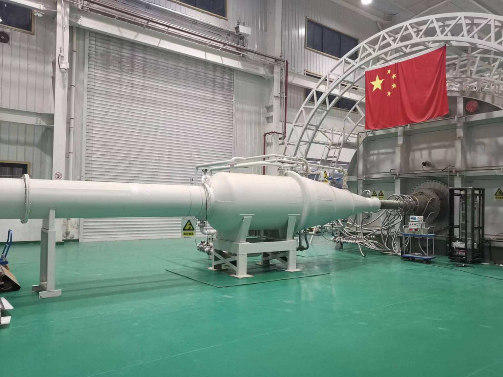{width="4.461111111111111in"
height="2.7979166666666666in"}

1.  []{#_Toc162279075
    .anchor}等离子体电磁实验装置[^\[12\]^](#_Ref156823700)

由于等离子体中所涉及物理过程极为复杂，因此对实验装置产生等离子体射流的主要参数进行精确诊断，验证其产生的等离子体是否达到既定状态，是研究等离子体中电磁波传播规律的前提，同时也是研究解决"黑障"问题的第一步。

等离子体主要参数包括：电子密度、碰撞频率及等离子体温度等，对于不同等离子体参数有多种不同的诊断测量方法，不同的诊断方法均是优点与缺点并存，其中微波诊断法不会对待测等离子体产生干扰，应用范围较广。本文的主要诊断目标是针对等离子体的电子密度参数，实验装置目前对于电子密度参数的微波诊断方法是利用矢量网络分析仪作为测量工具，直接测量等离子体带来的相对相位变化，完成参数诊断。而实验装置产生的等离子体射流具有大尺寸、高电子密度等特点，直接对于相位进行检测时，当相位变化大于\${\\rm{36}}{{\\rm{0}}\^{\\rm{o}}}\$时，会发生相位反转情况，带来的相位整周模糊问题，使得无法获取真实相移，是目前微波诊断法存在的一个主要问题。

由于矢量网络分析仪的系统成本较高且在高电子密度环境下存在相位模糊问题，设计一套成本相对较低且诊断精度较高的等离子体诊断系统，使得能够避免或解决相位整周模糊问题，完成电子密度的诊断任务，便是本文的研究意义。电磁波相位发生变化根本原因是由于传播时延发生改变，本文以扫频微波干涉法为基础，建立起了通过测量线性调频信号在等离子体中传播时带来的相对时延变化得到等离子体电子密度的诊断测量方法，设计一套由锯齿波调制的连续波诊断系统，能够实现调频连续波信号的发射及接收，并依据处理算法对系统差频信号进行高精度校正，完成对于电子密度的参数诊断。本文通过测量系统在有、无等离子体时的传播时延变化而确定对应的电子密度，从根本上避免了在高电子密度的等离子体中利用直接检测相位变化作为测量方法时所存在的相位整周模糊问题。

## 等离子体诊断研究现状

对等离子体的研究在上世纪早已开始，针对等离子体的参数诊断经过长时间发展已形成多种成熟的理论及方法，诊断方法总结如下图所示：

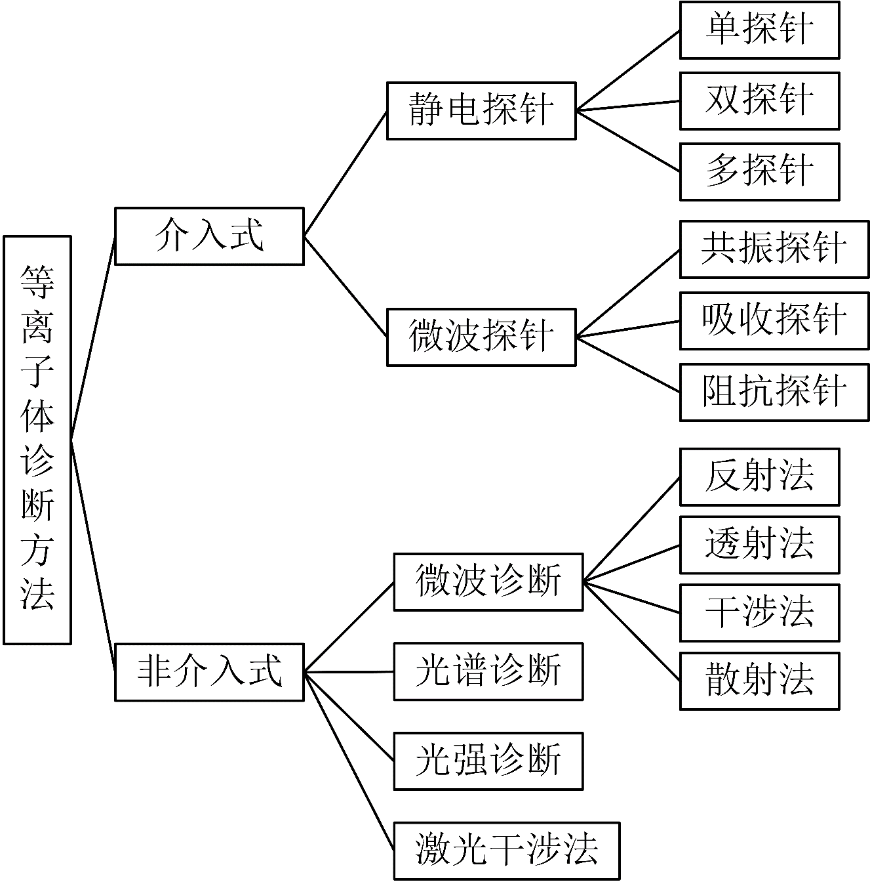{width="3.1819444444444445in"
height="3.2375in"}

1.  []{#_Toc162279076 .anchor}等离子体诊断方法

依据测量设备是否会深入到等离子体的内部，可将诊断方法分成两大类：介入式诊断及非介入式诊断，非介入式的测量方法具有不会扰动待测等离子体状态的测量优势，所以相较于介入式的诊断方法应用范围更加广泛^[\[13\]](#_Ref166266569)-[\[14\]](#_Ref156823794)^，其中微波诊断法具有方法多样、精度高、应用范围广等优点，且采用的电磁波信号多属于小功率信号，对待测的等离子体而言并不会产生电磁干扰。当电磁波在传播时遇到等离子体，会产生吸收、透射以及反射等传播规律，因此可以检测微波信号在其传播路径上有、无等离子体时相位的偏移变化以及幅值的衰减，得到电子密度以及碰撞频率参数。

（1）微波干涉法

微波干涉法相比于其他微波测量方法不需要标定系数，属于绝对测量，是等离子体诊断方法中应用极广、诊断参数范围最大的方法之一。通过测量有、无等离子体时相对产生的相位变化信息，并结合等离子体的介质特性，从而可获得微波传播路径上电子密度参数的平均值^[\[15\]](#_Ref166266089)-[\[16\]](#_Ref166266586)^。此法的缺点是无法获得电子密度参数的空间分布趋势，且只能测量电子密度参数，但干涉法仍具有较高的电子密度诊断精度。

微波干涉仪同样有多种形式，可分为外差式、扫频式、零拍式以及反射式等，经较长时间的发展，从单道路径检测发展到如今的多道检测，并且诊断所用的频率目前已发展到太赫兹^[\[17\]](#_Ref166316729)-[\[18\]](#_Ref166490449)^。扫频式微波干涉法依据其信号频率调制方式的不同又可分为锯齿波调制以及三角波调制，两者优缺点各异，三角波调制下系统接收端的输出信号频率成分较为复杂，给后续处理带来一定难度。

1965年，叶幼璋等人利用3cm波段的微波吸收仪以及8mm波段的干涉仪在"小龙"装置上进行测量，能够清晰的观测到相应的干涉图案及吸收图案，通过分析等离子体引起的相位以及幅值变化，诊断了最大电子密度为\$1.66
\\times {10\^{13}}{\\rm{c}}{{\\rm{m}}\^{{\\rm{ -
3}}}}\$的等离子体[^\[19\]^](#_Ref160179224)。

1976年，在托卡马克等离子体实验装置上利用干涉法测量了其电子密度参数，针对较小电子密度的等离子体状态时，分辨率会变差^[\[20\]](#_Ref156823883)-[\[21\]](#_Ref156824502)^。1993年，曹金祥等人设计了X波段零拍式微波干涉仪系统以及相应的收发透镜天线，通过分析光程差引起的相位变化，测量了在EACVD内等离子体的电子密度参数[^\[22\]^](#_Ref160179408)，其诊断的电子密度区间在\${\\rm{1}}
\\times {\\rm{1}}{{\\rm{0}}\^{\\rm{8}}}{\\rm{\\\~1}}{\\rm{.24}} \\times
{\\rm{1}}{{\\rm{0}}\^{{\\rm{12}}}}{\\rm{c}}{{\\rm{m}}\^{{\\rm{ -
3}}}}\$。

1995年，刘发林等人在8mm波段的干涉仪上利用扫频式的信号源，分析起始和终止两个频率（即双频法）进行细化测量，通过分析相位变化，最终能够诊断电子密度在\$4
\\times {10\^9}\\\~1 \\times {10\^{13}}{\\rm{c}}{{\\rm{m}}\^{{\\rm{ -
3}}}}\$的等离子体[^\[23\]^](#_Ref160179421)。2004年，Cappelli等人对比30GHz干涉仪测量结果，利用频率为90
GHz的干涉仪诊断等离子体的电子密度参数，时间及空间上的分辨率均有所提高[^\[24\]^](#_Ref156824509)。

2005年，安士全讨论了扫频式微波干涉仪系统的设计以及实现，对干涉系统主要参数选取进行了详细论述，分析对比了锯齿波和三角波调制下的扫频信号测量各自所具的优缺点[^\[25\]^](#_Ref156824517)，最终测量的相位与矢网相差仅为0.3°。2014年，毛军见设计了扫频式微波干涉仪，从理论上得到了传播时延与扫频带宽的关系，采用过零鉴相法提取相位，同时给干涉系统添加了反射测量支路，用于测量等离子体的幅度变化[^\[26\]^](#_Ref156824526)。2015年，G.
Torrisi等人提出了一种扫描式频率的干涉仪系统，将其应用在电子回旋共振离子源装置上，测量分析了等离子体产生的相对相位变化，得到了范围在\$1
\\times {10\^{11}}\\\~1.24 \\times
{10\^{12}}{\\rm{c}}{{\\rm{m}}\^{{\\rm{ -
3}}}}\$的电子密度参数[^\[27\]^](#_Ref156824535)。

2017年，石正雨提出设计了一种零拍式的微波干涉诊断系统，工作频率确定在10GHz，并对电容耦合式的等离子体进行诊断，利用移相器分析得到等离子体引起的附加相移，诊断得到了等离子体的电子密度为\$5.9
\\times {10\^9}{\\rm{c}}{{\\rm{m}}\^{{\\rm{ -
3}}}}\$[^\[28\]^](#_Ref156824542)。2019年，M.
Ghaderi等人对直径为30mm的圆柱形等离子体利用干涉仪系统进行了参数诊断[^\[29\]^](#_Ref156824549)。2022年，王国豪针对激波管等离子体提出了多通道的微波干涉系统进行测量，利用中频数字接收技术，采用I/Q解调的方式，得到在0°\~360°的相位变化信息，最终实现电子密度的空间分布参数的测量[^\[30\]^](#_Ref160181319)。2023年，欧阳文冲利用太赫兹干涉系统在APPJ装置上针对4mm厚度的等离子体进行诊断，诊断信号频率为0.65THz，诊断了电子密度为\$1.94
\\times {10\^{13}}{\\rm{c}}{{\\rm{m}}\^{{\\rm{ -
3}}}}\$的等离子体[^\[31\]^](#_Ref166230519)。

目前多数的传统微波干涉仪均是对于等离子体相位变化的检测，当待测等离子体的电子密度较高时，等离子体引起的相位变化会大于\${\\rm{36}}{{\\rm{0}}\^{\\rm{o}}}\$，存在相位反转问题，若不知道相位反转多少周期时，便不能得到真实的相位变化，此情况便被称作相位周期模糊问题。

（2）微波反射法

微波反射法的基本思想来自雷达技术中，其测量思路是当微波信号的频率值比等离子体的特征频率低时，信号无法在等离子体内部传播，不同频率的微波信号会在不同位置处发生全反射现象，通过入射的微波信号频率可分析得到对应发生全反射位置处的电子密度参数。利用扫频信号源进行诊断，便可得到电子密度的分布参数，所以微波反射法具有较高的空间分辨率。

1961年，Anisimov等人从理论上分析了反射电磁波的相位变化，得到了电子密度的分布参数，首次利用此方法测量了实验室等离子体^[\[32\]](#_Ref156824209)-[\[33\]](#_Ref161392289)^。2001年，S.
Kubota等人利用调频连续波反射仪测量了电子密度的分布参数，并将其配置为固定频率的诊断系统可对于电子密度的波动进行测量[^\[34\]^](#_Ref156824357)。2007年，李斌等人针对复杂背景下的等离子体利用脉冲压缩雷达反射法进行电子密度的参数诊断，得到电子密度的剖面信息，测量的电子密度范围为\$1.23
\\times {10\^{12}}\\\~3.16 \\times
{10\^{12}}{\\rm{c}}{{\\rm{m}}\^{{\\rm{ -
3}}}}\$[^\[35\]^](#_Ref162621222)。2016年，蒋元俊等人对圆柱及平板两种形状的等离子体进行了分析研究，利用点频式的反射测量系统得到了激波管等离子体的相关参数[^\[36\]^](#_Ref162621206)。2017年，M.
Rishabhkumar等人利用频率处于Ka波段的微波信号进行反射法的诊断，实验得到了等离子体的电子密度及碰撞频率参数[^\[37\]^](#_Ref156824391)。2018年，杜晨阳以反射法为基础，建立了Vivaldi天线发射线性扫频信号的模型，从仿真的角度完成对于电子密度的诊断[^\[38\]^](#_Ref156824401)。
2022年，杨敏等人提出了利用宽带扫频反射测量法对等离子体进行诊断.
可以同时诊断电子密度和碰撞频率参数，弥补了传统反射计无法检测高碰撞频率等离子体的不足[^\[39\]^](#_Ref166252520)。

微波反射诊断方法中由于反射信号比较微弱，所以要求天线距离待测的等离子体处于近距离状态。反射信号相对发射信号同样可能是多周期的相位滞后，故反射诊断时同样是存在周期模糊问题。通过对现有诊断技术的分析，可以明确传统微波诊断法通过相位变化检测时，一直存在相位周期模糊问题。线性调频连续波诊断电子密度的可行性同样有仿真结果进行理论支撑[^\[38\]^](#_Ref156824401)，本文采用锯齿波调制方式的线性扫频信号作为诊断系统的测试信号，通过对扫频信号时频域的分析去探究限制时间分辨率的因素，设计出诊断系统的前端链路。线性调频连续波系统差频信号的离散谱存在栅栏效应，影响对信号频率的检测，故需要对离散谱进行相应的校正分析，使得能够得到差频信号准确的频率信息。最终诊断系统能够通过对于等离子体引起的信号频率偏移量得到相应的时延变化，并依据时延变化能够完成对于电子密度参数的高精度测量。

## 本文研究内容及章节安排

前文简述了等离子体微波诊断的方法，其具有应用范围广，测量精度高等优点。微波法对于电子密度的诊断都是基于相位变化的检测处理，从而反演出对应的电子密度，相位周期模糊是目前微波法对于高电子密度等离子体诊断时存在的一个主要问题。等离子体存在相位变化的根本原因是由于其相对于空气的传播时延发生了变化，依据等离子体中电磁波的传播特性可以得到电子密度与传播时延的对应关系，且随着电子密度升高，传播时延也会随之增加。本文以微波扫频干涉法为基础，设计一套线性调频连续波(LFMCW)测量系统，通过锯齿波调制的扫频信号测量等离子体产生的传播时延变化，从而完成对电子密度的诊断。本论文的具体章节安排如下：

第一章
绪论，本章主要介绍了论文的研究意义和背景，讨论了本文主要解决的问题，讨论了关于等离子体微波诊断技术及其国内外的研究进展，最后讨论了本论文主要的工作内容并对章节安排进行了简述。

第二章
等离子体诊断原理及线性调频连续波诊断原理，本章主要介绍等离子体的相关参数，分析了电磁波在等离子体的传播特性，对不同诊断方法进行了理论分析，通过对微波干涉法的分析得到了电子密度与传播时延的关系。其后讨论了线性调频连续波诊断传播时延的原理，给出了差频信号频率变化与传播时延的关系，建立起了利用调频信号检测传播时延，完成电子密度诊断的理论基础。分析了差频信号的相关参数，讨论了影响测量结果的主要因素，本章节为后续研究提供了理论基础。

第三章
诊断系统硬件设计，本章给出了整个测量系统的目标要求，依据要求确定该系统的主要参数，包括诊断频率、调频周期、调频带宽等。依据系统参数设计整个诊断系统，主要对于整个扫频信号发射机的方案设计，系统硬件链路完成目标扫频信号的产生、发射及接收，其后包括对差频信号的低通滤波器硬件设计，对于链路各模块的设计及选型工作，并给出了系统的优化扩频方案。基于ADS射频仿真软件做了信号的瞬态仿真，给出了整个系统发射端的扫频信号及差频信号的仿真结果，最后搭建测试平台，对整个系统硬件链路的实测频率和功率进行匹配调节，使系统链路每一级都工作在最佳的工作范围。

第四章
系统差频信号数据处理，本章主要是对系统采集到的差频信号进行后续分析处理，主要包含了基于EMD分解的去噪处理，以及对于信号离散谱的单频率校正。在EMD分解后得到的内涵模态分量，依据相关函数能量大小以带通滤波的形式选取主要阶数的内涵模态分量，进行信号的重构，完成对差频信号的去噪处理。在FFT后引入CZT，对差频信号期望频率范围内进行频谱细化处理，使得期望频率区间内检索到的谱线频率信息更加精确，依据能量重心法及三角形法完成了对差频信号频率及幅值信息的校正处理。

第五章
系统标定及诊断实验,本章对线性调频连续波诊断系统进行极限分辨的标定测试，给出了系统能够分辨的最小时延变化，对于环氧树脂的介电常数进行诊断实验，给出了对应的测量误差，验证了诊断系统的可行性。基于CST电磁仿真软件模拟了聚焦透镜天线模型，作为等离子体诊断时的实验状态，得到了不同电子密度等离子体相对空气产生的衰减及时延变化，在等离子体电磁装置中搭建测试平台，对不同状态下等离子体射流的电子密度进行诊断实验，与直接检测相位的微波诊断方式的测量结果进行对比，给出系统能够诊断的电子密度范围及对应误差。在系统优化扩频后，标定出了新的极限分辨率，给出了系统能够诊断的最小电子密度。

第六章
总结与展望，本章对本论文所作工作以及诊断系统各项指标进行总结，同时也分析了诊断系统的不足之处，并对线性调频连续波诊断系统提出了下一步改进的方向。

# 等离子体诊断原理及线性调频连续波诊断原理

## 引言

本章主要介绍等离子体的基础概念以及等离子体诊断相关理论，包括了等离子体主要参数及电磁波在等离子体中传播特性，介绍等离子体微波诊断方法的原理，主要是干涉法诊断原理以及反射法诊断原理，介绍线性调频连续波测量时延的工作原理，构建起电子密度与传播时延的关系，分析线性调频连续波系统差频信号的特点以及影响因素。

## 等离子体基础理论

### 等离子体基本参数

等离子体宏观上是由大量原子和分子组成，且呈现电中性，表明了等离子体内部的正、负粒子数基本处于持平状态，其内部的负粒子主要是由电子构成[^\[12\]^](#_Ref156823700)。等离子体的主要参数包括：电子密度、特征频率以及碰撞频率等。

(1) 电子密度

电子密度作为等离子体最主要的参数之一，其表征了单位体积所包含电子的数量，通常使用\${n_e}\$作为表示符号，其决定了通信信号是否能够正常进行传输。等离子体的电离程度越高时，包含的能量越高，对应的电子密度也就越高，对电磁波的阻碍作用越大[^\[40\]^](#_Ref166254416)，所以对于电子密度参数进行诊断，是对等离子体的诊断中最重要的研究内容。本论文的诊断任务便是对于等离子体实验装置产生的等离子体射流电子密度参数进行诊断，通过诊断测量等离子体相对于空气所产生的相对传播时延变化，去得到对应的电子密度参数。

(2) 特征频率

特征频率主要表征了等离子体内部电子和离子的振荡，也可称为等离子体截止角频率或振荡角频率，是检测电磁波是否能够透射等离子体的重要参数。宏观上来看，等离子体是呈电中性的，在等离子体外部加一个磁场后，内部自由电子会在磁场的作用下进行移动，从而产生电场。外加磁场消失后，由于电场的惯性作用，等离子体中的电子仍会继续运动，最后电子会进行往复运动，达到一种动态的平衡。电子的振荡角频率\${\\omega
\_p}\$可以表示为[^\[41\]^](#_Ref166254421)：

\\\[{\\omega \_p} = \\sqrt {\\frac{{{n_e}{e\^2}}}{{{\\varepsilon
\_0}{m_e}}}} \\\] (2-1)

上式中\${n_e}\$代表每立方米的电子总数，\\\[e\\\]代表电子所带的电荷量，\${m_e}\$代表电子质量，\${\\varepsilon
\_0}\$代表真空介电常数。等离子体的特征频率可以表示为：

\\\[{f_p} = \\frac{{{\\omega \_p}}}{{2\\pi }} = \\frac{1}{{2\\pi
}}\\sqrt {\\frac{{{n_e}{e\^2}}}{{{\\varepsilon \_0}{m_e}}}} \\\] (2-2)

上式中只有\${n_e}\$是一个未知量，其余均是已知常数，代入计算可得到一个近似公式：

\\\[{f_p} = 8.977\\sqrt {{n_e}} \\\] (2-3)

上式表述了等离子体特征频率与电子密度之间存在的近似转换关系。只有当入射的电磁波频率远高于等离子体的特征频率时，此时等离子体才可被看作是低损耗的色散介质。电磁波频率高于特征频率时才可以透射过等离子体，当入射波的频率越高时，等离子体对电磁波产生的衰减越小。

(3) 碰撞频率

等离子体中含有大量的各类粒子，粒子均具有较大的动能，故等离子体的内部在不停的发生高速粒子碰撞，等离子体的碰撞频率就是主要用于描述等离子体内粒子的碰撞情况，碰撞频率的常用表示符号为\${v_e}\$[^\[42\]^](#_Ref166254432)。碰撞的种类包含两种：一种是弹性碰撞，另外一种是库伦碰撞。内部的碰撞主要存在于：自由电子之间、电子与带电离子之间及电子与中性粒子之间。

### 等离子体的介质特性

等离子体的介质特性主要包含三个参数，分别为：电导率、磁导率以及介电常数，且相对非磁化的等离子体而言，其对应的磁导率为1。故在描述等离子体的介质特性时，主要包含两种形式：一种通过复介电系数来进行表述，此时等离子体可被看作是一种色散、有耗的连续电介质；另外的一种则是用电导率进行描述，将等离子看作是色散、有极化效应的复电导率连续导体。而由介电系数描述的等离子体形式更具一般性，两种描述形式也是互相等价的。

等离子体的等效介电常数可以通过分析电子在外电场作用下的极化效应得到。在均匀等离子体中，极化强度\$P\$可以表示为：

\\\[\\left\| P \\right\| = - {n_e}e{X_e} = {\\alpha \_e}{\\varepsilon
\_0}E\\\] (2-4)

上式中的\${n_e}\$表示电子密度，\${X_e}\$表示电子偏离平衡处的距离，\${\\alpha
\_e}\$表示极化率，\$E\$表示外加电场的场强。电子在电场中的运动服从朗之万方程[^\[11\]^](#_Ref156823684):

\\\[{m_e}\\frac{{{d\^2}\\overrightarrow {{X_e}} }}{{d{t\^2}}} = -
{m_e}{v_e}\\frac{{d\\overrightarrow {{X_e}} }}{{dt}} - e\\overrightarrow
E \\\] (2-5)

上式中的\${v_e}\$表示的是电子碰撞频率，其中\${X_e}\$和\$E\$具有\${e\^{ -
j\\omega
t}}\$时谐性，且当无外磁场时，由上式可得到电子偏离平衡处的距离为：

\\\[{X_e} = \\frac{{eE}}{{{m_e}\\omega (\\omega + j{v_e})}}\\\] (2-6)

可得到等离子体的极化率\${\\alpha \_e}\$可表示为：

\\\[{\\alpha \_e} = - \\frac{{{n_e}{e\^2}}}{{{m_e}{\\varepsilon
\_0}\\omega (\\omega + j{v_e})}}\\\] (2-7)

可得到极化率与等离子体特征频率的关系如下：

\\\[{\\alpha \_e} = - \\frac{{{\\omega \_p}\^2}}{{\\omega (\\omega +
j{v_e})}} = - \\frac{{{\\omega \_p}\^2}}{{{\\omega \^2} + {v_e}\^2}} -
j\\frac{{{\\omega \_p}\^2v/\\omega }}{{{\\omega \^2} + {v_e}\^2}}\\\]
(2-8)

等离子体的介电常数\$\\varepsilon \$表示为：

\\\[\\varepsilon = (1 + {\\alpha \_e}){\\varepsilon \_0} = (1 -
\\frac{{{\\omega \_p}\^2}}{{{\\omega \^2} + {v_e}\^2}} -
j\\frac{{{\\omega \_p}\^2v/\\omega }}{{{\\omega \^2} +
{v_e}\^2}}){\\varepsilon \_0}\\\] (2-9)

### 等离子体中的电磁波传播规律

多数介质中的电磁传播规律均可通过麦克斯韦方程来描述，前文阐述了等离子体可以被看成一种有耗色散的特殊电介质,且本论文的电子密度诊断是对于平均电子密度的测量，故此处只讨论均匀等离子体模型中的电磁波传播特性。

电磁波在均匀等离子体中进行传播时的麦克斯韦方程组可表示为：

\\\[\\left\\{ \\begin{array}{l}

\\nabla \\times \\overrightarrow E = - \\frac{{\\partial
\\overrightarrow B }}{{\\partial t}}\\\\

\\nabla \\times \\overrightarrow H = \\frac{{\\partial \\overrightarrow
H }}{{\\partial t}}\\\\

\\nabla \\cdot \\overrightarrow D = 0\\\\

\\nabla \\cdot \\overrightarrow B = 0

\\end{array} \\right.\\\] (2-10)

上式中\$\\overrightarrow E \$表示的是电场强度，\$\\overrightarrow H
\$是磁场强度,\$\\overrightarrow D \$是电位移矢量,\$\\overrightarrow B
\$是磁感应强度,此时对应的本构关系是：

\\\[\\left\\{ \\begin{array}{l}

\\overrightarrow D = \\varepsilon \\overrightarrow E = {\\varepsilon
\_0}{\\varepsilon \_r}\\overrightarrow E \\\\

\\overrightarrow B = \\mu \\overrightarrow H

\\end{array} \\right.\\\] (2-11)

上式中\$\\varepsilon \$表示的是等离子体的介电常数，\$\\mu
\$表示的是等离子体的磁导率，对于非磁化等离子体而言，磁导率等于真空磁导率，即\$\\mu
= {\\mu \_0}\$。对式(2-10)中的第一个子式求一次旋度可得：

\\\[{\\nabla \^2}\\overrightarrow E - \\mu \\varepsilon
\\frac{{{\\partial \^2}\\overrightarrow E }}{{\\partial t}} = 0\\\]
(2-12)

此时假定电磁波是沿着z轴传播，即电磁波是垂直入射的，此时的电场应该满足下式：

\\\[\\overrightarrow E = {E_0}{e\^{j\\left( {\\omega t - kz}
\\right)}}\\\] (2-13)

上式中\${E_0}\$为电场最大值，\$k\$为电磁波的传播系数，\$\\omega
\$为电磁波信号的角频率，求解式(2-13)可得到\$k\$，由于等离子体的介电常数为复数，则对应的\$k\$也为复数，令\$k
= \\beta - j\\alpha \$ ，其中\$\\beta \$称为相移常数，\$\\alpha
\$称为衰减常数，可得到传播系数为：

\\\[k = \\omega \\sqrt {{\\mu \_0}\\varepsilon } = \\beta - j\\alpha
\\\] (2-14)

由前文得到的等离子体的介电常数，式(2-9)，代入上式可得衰减常数\$\\alpha
\$以及相移常数\$\\beta \$的表达式为：

\\\[\\begin{array}{\*{20}{c}}

{\\alpha = \\frac{\\omega }{{\\sqrt 2 c}}\\sqrt {\\frac{{{\\omega
\_p}\^2}}{{{\\omega \^2} + {v_e}\^2}} - 1 + \\sqrt {{{(1 -
\\frac{{{\\omega \_p}\^2}}{{{\\omega \^2} + {v_e}\^2}})}\^2} +
{{(\\frac{{{v_e}}}{\\omega }\\frac{{{\\omega \_p}\^2}}{{{\\omega \^2} +
{v_e}\^2}})}\^2}} } }\\\\

{\\beta = \\frac{\\omega }{{\\sqrt 2 c}}\\sqrt {1 - \\frac{{{\\omega
\_p}\^2}}{{{\\omega \^2} + {v_e}\^2}} + \\sqrt {{{(1 - \\frac{{{\\omega
\_p}\^2}}{{{\\omega \^2} + {v_e}\^2}})}\^2} + {{(\\frac{{{v_e}}}{\\omega
}\\frac{{{\\omega \_p}\^2}}{{{\\omega \^2} + {v_e}\^2}})}\^2}} } }

\\end{array}\\\] (2-15)

上式中的\$c\$代表了光速，上式体现了衰减常数及相移常数与电磁波角频率及等离子体相关参数的关系。衰减常数描述了电磁波在等离子体中传播时的幅值衰减，相移常数描述了传播时的相位变化。电磁波在一定厚度的等离子体中传播时，电磁波的衰减为：

\\\[S = 20\\lg {e\^{ - \\alpha d}} \\approx - 8.69\\alpha d\\left( {dB}
\\right)\\\] (2-16)

上式中的\$d\$为电磁波透射过的等离子体厚度。在等离子体中相对相位偏移可以描述为电磁波在等离子体中的相位变化与在真空中的相位变化的差值，即等离子体引起的附加相移可表示为下式：

\\\[\\Delta \\varphi = (\\beta - {\\beta \_0})d = (\\beta -
\\frac{\\omega }{{\\sqrt 2 c}})d\\\] (2-17)

上式中的\${\\beta
\_0}\$表示电磁波在真空中的相移常数。为了简化分析，假定电磁波与等离子体参数满足\$\\omega
\> {\\omega \_p}\$且\\\[\\omega \\gg
{v_e}\\\]，联立式(2-15)和式(2-17)，厚度为\$d\$的等离子体引起的附加相移可以简化为：

\\\[\\Delta \\varphi \\approx \\frac{{\\omega d}}{c}(\\sqrt {1 -
\\frac{{{\\omega \_p}\^2}}{{{\\omega \^2}}}} - 1)\\\] (2-18)

上式得到的附加相移是一个负数，表明了由等离子体引起的相位变化是超前的，这一点是区别于一般介质的，类似环氧树脂及聚四氟乙烯等介质引起的相位是滞后的，这一点也说明了等离子体作为介质的特殊性。将等离子体的特征角频率表达式，即式(2-1)，代入上式后可进一步得到等离子体附加相移的表达式为：

\\\[\\Delta \\varphi \\approx - \\frac{{{e\^2}d{n_e}}}{{2{\\varepsilon
\_0}{m_e}\\omega c}}(rad/m)\\\] (2-19)

上式表述了等离子体引起的附加相移与电子密度的关系。在一定条件下，等离子体的附加相移与其电子密度呈现性关系的，这也是进行电子密度参数诊断的基础。

## 等离子体微波诊断方法

等离子体是一种特殊的物质态，前文讨论了等离子体的一些描述参数，用特定方法对等离子体不同参数进行测量，就称作为等离子体诊断，其中微波诊断方法依据收发设备是否与等离子体进行接触，既可是介入式也可是非介入式的。每个诊断方法都有自己的局限性，所以进行不同等离子体参数诊断时应选择最合适的方法，在实际进行等离子体参数诊断时，往往需要多种诊断方法相互联合，互相验证，才能保证诊断结果的可信度。本文主要是利用微波的诊断方法作为电子密度诊断的理论基础，下文主要讨论介绍：微波干涉法以及微波反射法。

### 微波干涉法

微波干涉法主要是针对电子密度参数的诊断测量，属于非介入式的方法，其基本原理是将等离子体等效为具有色散性质的特殊介质，当电磁波在不同电子密度的等离子体内传播时，会产生不同的传播时延及衰减[^\[11\]^](#_Ref156823684)，由于传播时延的存在，才导致了电磁波的相位发生变化，即电磁波在等离子体中与在真空中产生的传播时延是不相同的，因此才会产生附加相移。通过测量测试支路在有等离子体时相对于无等离子体的空气状态所产生的时延变化，便可以对电子密度完成参数诊断。干涉法的基本测量原理如下图所示：

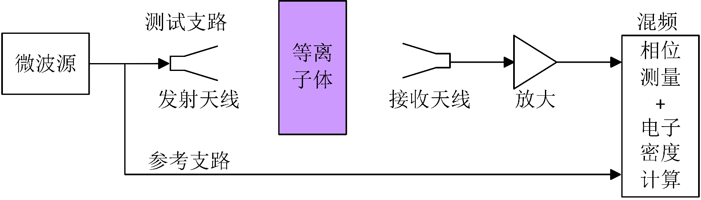{width="5.145833333333333in"
height="1.46875in"}

1.  []{#_Toc162279077 .anchor}微波干涉法原理图

在干涉法中因为电磁波信号穿透了整个等离子，所以测量到的电子密度数值是一种平均电子密度，此方法无法测量不同位置的电子密度数值，无法得到电子密度的空间分布趋势。当诊断信号的频率远高于等离子体的振荡频率时，等离子体可以被近似的看作是无损介质，电磁波几乎是可以无损耗的穿透过等离子体。但由于实际的硬件条件限制，诊断时的信号频率一般会低于40GHz，且在实际诊断时，为了减少电磁波绕射带来的影响，收发天线一般均采用聚焦透镜天线。当电磁波穿过厚度为\$d\$的等离子体时产生的相对相位变化可表示为：

\\\[\\Delta \\varphi = \\frac{{2\\pi d}}{{{\\lambda \_g}}} -
\\frac{{2\\pi d}}{{{\\lambda \_0}}}\\\] (2-20)

上式中\${\\lambda \_g}\$代表等离子体中诊断信号的波长，\${\\lambda
\_0}\$代表真空中诊断信号的波长。信号在传播时，其速度与波长的关系是\$V =
\\lambda \\times f\$,代入上式可得附加相移为：

\\\[\\Delta \\varphi = 2\\pi f(\\frac{d}{{{V_g}}} - \\frac{d}{c})\\\]
(2-21)

其中\${V_g}\$代表电磁波在等离子体中的传播速度，\$f\$代表诊断信号的频率值，\$c\$代表光速。上式中假定：

\\\[\\tau = (\\frac{d}{{{V_g}}} - \\frac{d}{c})\\\] (2-22)

此时\$\\tau
\$表示电磁波在等离子体中相对于在真空中传播时的时间差值，即\$\\tau
\$为等离子体带来的传播时延变化值，将式(2-15)、式(2-17)
、式(2-21)及式(2-22)联立，此处需要注意式(2-17)得到的相位为负数，而传播时延得到的一定为正值，计算后可得到传播时延与电磁波频率、等离子体特征角频率及碰撞频率的计算公式为：

\\\[\\tau = \\frac{d}{{\\sqrt 2 c}}\\left\[ {1 - \\sqrt {1 -
\\frac{{{\\omega \_p}\^2}}{{{\\omega \^2} + {v_e}\^2}} + \\sqrt {{{(1 -
\\frac{{{\\omega \_p}\^2}}{{{\\omega \^2} + {v_e}\^2}})}\^2} +
{{(\\frac{{{v_e}}}{\\omega }\\frac{{{\\omega \_p}\^2}}{{{\\omega \^2} +
{v_e}\^2}})}\^2}} } } \\right\]\\\] (2-23)

当电磁波与等离子体参数满足\\\[\\omega \\gg {\\omega
\_p}\\\]且\\\[\\omega \\gg
{v_e}\\\]时，将式(2-1)及式(2-23)联立后可得到电子密度计算公式为：

\\\[{n_e} \\approx \\frac{{8{\\pi \^2}{\\varepsilon
\_0}{m_e}c}}{{{e\^2}}}\\frac{{{f\^2}}}{d}\\tau \\\] (2-24)

将上式中的固定常数代入后，可得到电子密度与传播时延的估算公式为：

\\\[{n_e} \\approx 1.158 \\times {10\^6} \\times 2 \\times \\pi \\times
\\frac{{{f\^2}}}{d} \\times \\tau \\\] (2-25)

上式标明了电子密度与传播时延\$\\tau
\$、诊断频率\$f\$及等离子体厚度\$d\$的计算关系，这也是本文基于扫频干涉法，利用线性调频信号诊断电子密度的理论基础。

### 微波反射法

当电磁波信号的频率大于等离子体的特征频率时，电磁波可在等离子体内部进行传播，而当接近特征频率时，会发生全反射现象，通过分析入射波和反射波之间的时间延迟或相位差，可得到相应反射面的位置，结合诊断信号的频率，便可以获得对应反射界面处的电子密度参数，当测量系统发射的信号为扫频信号时，可完成扫频检测，即可得到电子密度的空间分布参数。反射法诊断的基本原理如下图所示：

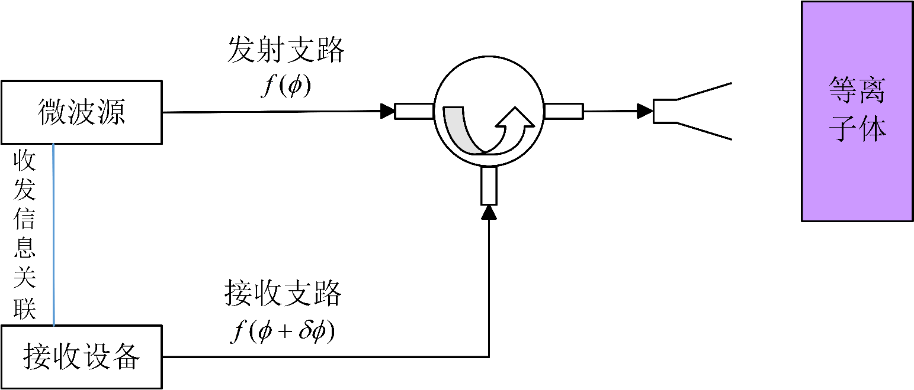{width="4.677083333333333in"
height="2.0in"}

1.  []{#_Toc167441013 .anchor}微波反射法原理图

对于通过扫频反射法进行诊断的测量设备中，收发天线既可以是通过环形器的单天线形式，也可以是采用两个天线的形式，完成信号的收发任务。不同的电磁波频率，会在不同的位置发生全反射现象，电磁波在等离子体路径上传播时的相位积分能够表示入射波与反射波之间存在的相位差，表示为：

\\\[\\varphi (\\omega ) = \\frac{{2\\omega }}{c}\\int\_{{r_c}}\^{{r_0}}
{\\sqrt {1 - \\frac{{{\\omega \_p}\^2}}{{{\\omega \^2}}}} dr - \\pi }
\\\] (2-26)

上式中\$\\omega
\$为入射电磁波的角频率，\${r_0}\$表示边界位置，\${\\omega
\_p}\$为等离子体的特征角频率，\$\\pi
\$是在界面处由反射引起的相位变化。将式(2-1)代入上式，可得到对应的电子密度表达式为：

\\\[{n_e}(f) = \\frac{{{\\varepsilon \_0}{m_e}{{(2\\pi
f)}\^2}}}{{{e\^2}}}\\\] (2-27)

上式表述了微波反射法对电子密度进行诊断时的理论基础，通过扫频的信号方式，便可得到待测等离子体电子密度的空间分布参数。微波反射诊断系统的硬件复杂且要求较高，但具有较高的空间分辨率。微波反射法和微波透射法均属于微波干涉法的子类，透射法诊断的电子密度理论公式与上述干涉法得到的电子密度公式是一致的。

## 线性调频连续波诊断原理

线性调频连续波信号是指频率随时间线性变化的电磁波信号，利用线性调频信号诊断等离子体电子密度的方法属于微波扫频干涉法的诊断类型，扫频信号的调制方式同样是有不同形式的，一般情况下包括锯齿型和三角型调制的扫频信号[^\[25\]^](#_Ref156824517)，锯齿波调制方式能够获得时延信息，且硬件实现简单，数据处理难度较小，三角波调制形式能够获得目标的二维信息，但三角波调制的扫频信号系统输出的信号谐波非常复杂，在雷达体系中，此种调制方式即能够获得目标的距离信息，也能够获得速度信息。对于本论文的诊断模型，选取锯齿波调制的扫频信号，通过分析系统差频信号的频率变化，便可完成对等离子体的时延诊断。

依据线性调频连续波诊断等离子体时延的诊断方法与直接测量相位变化的诊断方法对比而言，避免了测量大电子密度等离子体，相位变化大于\$36{0\^o}\$时，因为相位反转而产生的相位整周模糊问题；大电子密度等离子体对应的传播时延会更大，对于直接测量时延的诊断方法而言，大时延更容易检测，测量小时延对于对系统的极限分辨率有更高的要求，即对系统硬件会有更高的要求，只要等离子体不产生通信中断，通过时延变化测量电子密度的方法便是可行的。

### 锯齿波调制的连续波测量原理

锯齿波调制的扫频信号，指的是调制信号的频率按照锯齿波波形变化[^\[43\]^](#_Ref156825749)，发射信号与接收信号波形变化是一致的，但两信号间存在一定的时间延迟，发射信号与接收到的信号混频后便可得到包含传播时延信息的差频信号，下图展示了单周期锯齿波调制的扫频信号，其频率与时间的变化曲线：

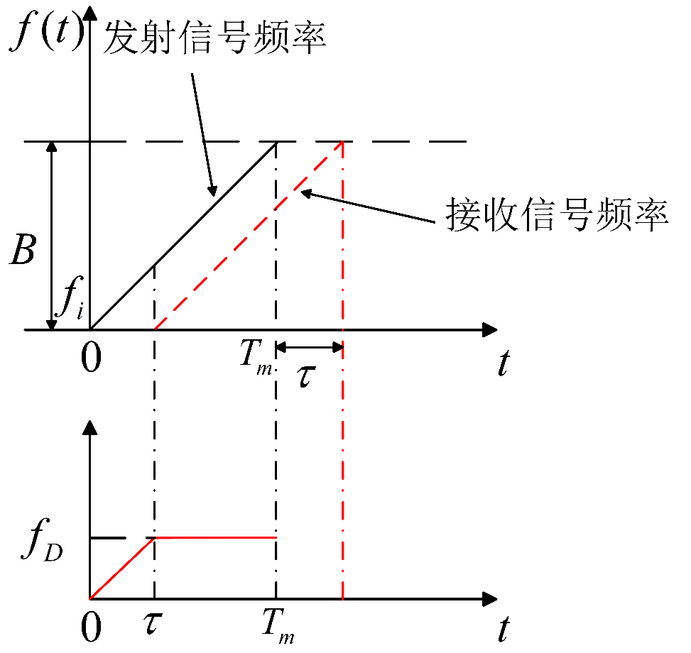{width="2.5833333333333335in"
height="2.441666666666667in"}

1.  []{#_Toc162279079 .anchor}扫频信号及差频信号瞬时频率曲线图

上图中的\${f_i}\$表示调频信号的起始频率，\$B\$表示调频信号的扫频带宽，\${T_m}\$为调频信号的扫频周期，\$\\tau
\$表示发射与接收信号间相差的传播时延，\\\[{f_D}\\\]表示差频信号的频率。由上图可以得到扫频发射信号的瞬时频率满足：

(2-28)

上式中的\$K = {B \\mathord{\\left/

{\\vphantom {B {{T_m}}}} \\right.

\\kern-\\nulldelimiterspace}
{{T_m}}}\$为调频斜率。理想条件下，锯齿波调制的扫频信号，其单周期的时域信号可以表示为：

(2-29)

上式中\${A_0}\$为发射的调频信号幅度，\${\\theta
\_i}\$为信号的初始相位，锯齿波调制的单周期扫频信号波形如下：

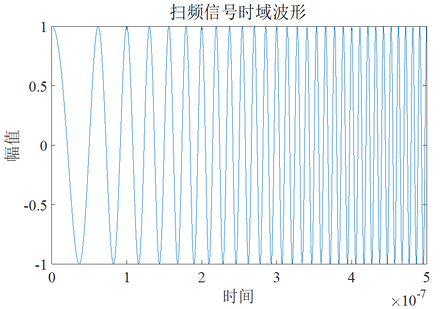{width="3.6479166666666667in"
height="2.442361111111111in"}

2.  []{#_Toc162279080 .anchor}锯齿波调制的单周期扫频信号时域曲线图

接收信号的瞬时频率可以表示为：

(2-30)

接收信号是在发射信号基础之上有一个传播时延\$\\tau
\$，接收信号的时域信号可表述为：

(2-31)

上式中\${A_1}\$表示接收信号幅度，由于电磁波在空间中传播时是存在衰减的，故存在\${A_1}
\<
{A_0}\$的关系。发射信号与接收信号在经过混频后，便可得到差频信号，其相位与频率满足下式：

\${\\varphi \_D} = 2\\pi \\int_0\^t {{f_D}(t)} dt\$ (2-32)

对相位信息求导后即可得到差频信号的频率信息。从时域信号而言，混频实现了两信号的时域乘积效果，利用积化和差公式,再滤除两信号频率的相加项，即滤除混频信号的高频分量后，得到差频信号的瞬时频率可表示为：

(2-33)

上式表明了每个周期的差频信号都是包括两个时间段，其中当\$t\$属于\$0 \\le
t \\le \\tau
\$时间段时，被称作差频信号的不规则区，此时差频信号的频率值与信号的调频斜率、传播时延及调频周期均存在关系，而当属于\$\\tau
\\le t \\le
{T_m}\$的时间段时，称作差频信号的规则区，此时差频信号的频率与时延信息成线性关系。在对时延信息进行获取时，应当尽量的避免不规则区，即此时调制的扫频信号参数应满足\\\[{T_m} -
\\tau \\gg \\tau \\\]的条件。

故此条件下可以认为差频信号频率与传播时延的关系满足下式：

\\\[{f_D}(t) = \\frac{B}{{{T_m}}}\\tau \\\] (2-34)

上式表明了当得到差频信号的频率时，便可以得到对应的时延信息。联立式(2-25)和式(2-34)可得：

\\\[{n_e} \\approx 1.158 \\times {10\^6} \\times 2 \\times \\pi \\times
\\frac{{{f\^2}}}{d} \\times \\frac{{{T_m}}}{B} \\times \\Delta {f_D}\\\]
(2-35)

上式中\\\[\\Delta
{f_D}\\\]表示了诊断系统在有等离子体时相对于空气产生的频率变化量。进行等离子体电子密度诊断实验时，便可以依据差频信号的频率变化反推出电子密度的具体数值，式(2-35)，是本文诊断系统的理论基础。

### 连续波系统差频信号分析

将式(2-29)和式(2-31)两信号经过混频并且滤除信号的高频分量后，可得到差频信号的时域可表示为：

(2-36)

当满足\\\[{T_m} \\gg \\tau
\\\]的条件时，便可以忽略掉不规则区域以及上式中的\$\\pi K{\\tau \^2}\$
项，且对差频信号进行幅度归一化处理后，差频信号可简化为：

(2-37)

对单周期的差频信号进行采样处理，假设采样的点数为\$N\$，采样的间隔为\$\\Delta
t = {{{T_m}} \\mathord{\\left/

{\\vphantom {{{T_m}} N}} \\right.

\\kern-\\nulldelimiterspace} N}\$，采样频率为\${f_s} = {1
\\mathord{\\left/

{\\vphantom {1 {\\Delta t}}} \\right.

\\kern-\\nulldelimiterspace} {\\Delta t}}\$，采样后单周期的差频信号为：

(2-38)

对于差频信号的DFT变换可利用\${N\_{FFT}}\$点的傅里叶变换代替，通过计算可得到：

\\\[{S_D}(k) = \\frac{1}{2}{\\rm{ }}\\begin{array}{\*{20}{c}}

{\\left\\{ {\\frac{{\\sin \\left\[ {\\pi \\left( {k - B\\tau } \\right)}
\\right\]}}{{\\frac{\\pi }{{{N\_{FFT}}}}\\left( {k - B\\tau }
\\right)}}{e\^{j\\left\[ {2\\pi {f_i}\\tau - \\frac{{{N\_{FFT}} -
1}}{{{N\_{FFT}}}}\\pi \\left( {k - B\\tau } \\right)} \\right\]}}}
\\right.}\\\\

{\\left. { + \\frac{{\\sin \\left\[ {\\pi \\left( {k + B\\tau }
\\right)} \\right\]}}{{\\frac{\\pi }{{{N\_{FFT}}}}\\left( {k + B\\tau }
\\right)}}{e\^{ - j\\left\[ {2\\pi {f_i}\\tau - \\frac{{{N\_{FFT}} -
1}}{{{N\_{FFT}}}}\\pi \\left( {k + B\\tau } \\right)} \\right\]}}}
\\right\\}}

\\end{array}{\\rm{, }}k = 0,1,2, \\ldots ,N - 1\\\]\\\[\\\] (2-39)

由于对采样后的差频信号进行的是离散傅里叶变换，最终得到的频谱信息同样被限制在了离散点上，即频谱谱线仅存在于基频的整数倍处，这种规律被称作为"栅栏效应"[^\[43\]^](#_Ref156825749)。

由于DFT具有周期性规律且实序列是共轭对称的，则有\${S_D}(k)\$的幅度关于\$k
= {{{N\_{FFT}}} \\mathord{\\left/

{\\vphantom {{{N\_{FFT}}} 2}} \\right.

\\kern-\\nulldelimiterspace} 2}\$是具有对称性的，假定\${k\_{\\max
}}\$是其在\$k \\in \\left\[ {0,{{{N\_{FFT}}} \\mathord{\\left/

{\\vphantom {{{N\_{FFT}}} 2}} \\right.

\\kern-\\nulldelimiterspace} 2}}
\\right\]\$时幅值最大点处所对应的谱线位置，由式(2-39)可得\${k\_{\\max
}}\$的取值为最接近\$B\\tau \$的整数值。

此时测到的差频信号的频率为：

\\\[{f_D} = {k\_{\\max }}\\Delta f\\\] (2-40)

上式中的\$\\Delta f = {{{f_s}} \\mathord{\\left/

{\\vphantom {{{f_s}} {{N\_{FFT}}}}} \\right.

\\kern-\\nulldelimiterspace}
{{N\_{FFT}}}}\$，其代表了DFT的频率分辨率，式(2-34)
与式(2-40)联立可得到：

\\\[\\tau = {k\_{\\max }}\\frac{{{T_m}}}{B}\\frac{{{f_s}}}{{{N\_{FFT}}}}
= {k\_{\\max }}\\Delta \\tau \\\] (2-41)

上式中的\$\\Delta \\tau
\$表示了线性调频连续波系统的固有时延分辨率，当满足\$N =
{N\_{FFT}}\$时，即满足采样点数与傅里叶变换点数相同时，诊断系统的固有时延分辨率为：

\\\[\\Delta \\tau = \\frac{1}{B}\\\] (2-42)

由上式可知，理想的锯齿波调制的线性调频连续波测量系统的固有时延分辨率与傅里叶变换的点数和调频信号的调频周期均无关，其仅仅取决于调频信号的扫频带宽。上式同样是微波干涉仪的设计准则之一。

综上分析可以得到关于差频信号的两点重要结论：

(1)对于锯齿波调制方式的线性调频连续波测量系统而言，其差频信号的频谱具有离散性，且相邻谱线的间隔取决于调频周期，间隔为\${1
\\mathord{\\left/

{\\vphantom {1 {{T\_{\\mathop{\\rm m}\\nolimits} }}}} \\right.

\\kern-\\nulldelimiterspace} {{T\_{\\mathop{\\rm m}\\nolimits}
}}}\$。调频周期越大，谱线间隔越小，即离散谱的谱线越密[^\[43\]^](#_Ref156825749)。

(2)离散谱的谱线位置是不会发生变化的，当系统测量到的传播时延发生变化时，各谱线的幅值会发生一定的变化。当传播时延变化量较小时，谱线幅值最大值处对应的频率值不会发生变化。由于谱线是离散的，实际频谱的幅值最大值是需要进行离散谱校正的，校正后的幅值最大处对应的频率值才能认为是系统传播时延对应的差频信号频率值。对于离散谱的信息校正会在后续第四章中进行详细分析。

### 调频连续波测量的影响因素

诊断系统的主要因素可包括为两个部分：一是时延的分辨率，二是时延的测量精度。上一节中讨论了理想条件下的时延分辨率是仅取决于调频带宽的，但在实际的系统应用中对于时延分辨率的影响可总结为以下几点：

(1)调频线性度

当系统发射端的扫频信号并不是理想环境下的调频信号时，具体调频线性度误差可由下图表示：

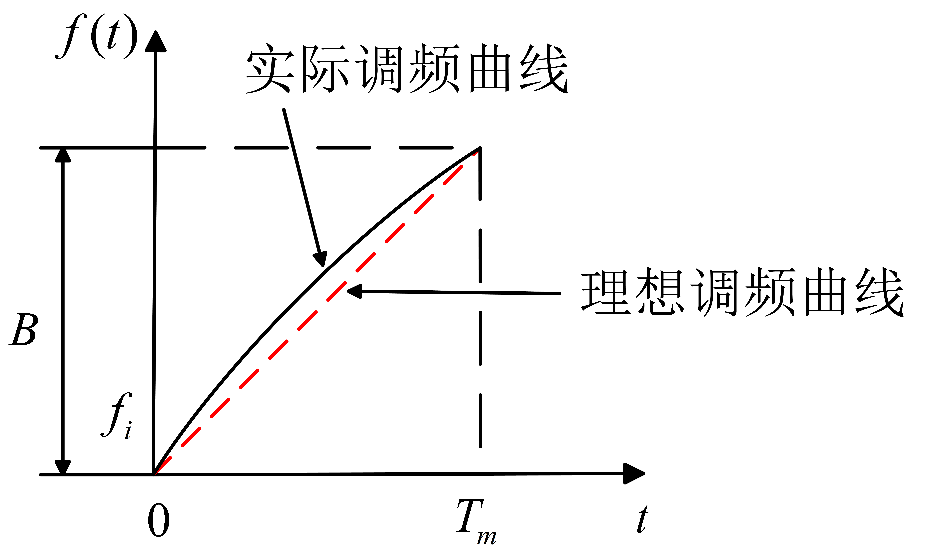{width="2.6930555555555555in"
height="1.6041666666666667in"}

1.  []{#_Toc162279081 .anchor}调频线性度误差示意图

上图中假定直线为实际的调频规律，其与上图中虚线的理想调频规律存在偏差时，此时得到的差频信号会有一定的带宽，即频谱展宽，会使得差频信号的信噪比变差，从而影响系统时延分辨率和时延测量精度。

(2)调频带宽

从理想系统分辨率的计算公式可以看出，时延分辨率与调频带宽的关系，理论上，提高扫频信号的调频带宽便可以无限增加时延分辨率，但在实际的工程当中，提高带宽会使得硬件成本增加；对调频线性度的保证带来更大的压力[^\[43\]^](#_Ref156825749)；且在对等离子体进行时延诊断时，由于等离子体具有色散特性，所以调频带宽必须根据测量目标和要求，适中的进行选取。

对于测量精度而言，在利用线性调频连续波测量传播时延时，正常环境下肯定是存在噪声的，包括系统本身的噪声以及电磁波传播时环境中的噪声，噪声必然会影响时延变化的测量精度。本论文的诊断系统测量到的目标时延属于单目标，在噪声背景下的单目标时延测量精度，仅仅取决于差频信号的信噪比，当信噪比越大时，时延的测量精度就越高。

## 本章小结

本章首先介绍了等离子体的相关参数，如电子密度及特征频率等，其次分析介绍了等离子体中电磁波的传播规律。同时对于本文所用到的微波干涉诊断法进行了详细推导分析，得到等离子体电子密度与其传播时延的计算关系。最后分析了锯齿波调制的连续波测量传播时延的原理，建立起了通过测量传播时延进行电子密度的扫频干涉诊断方法，同时分析了影响时延测量结果的因素。本章的内容为后续的诊断系统硬件设计，及差频信号的数据处理做了有力的理论铺垫。

# 诊断系统硬件设计

## 引言

第二章介绍了等离子体微波诊断理论及线性调频连续波传播原理，提出了基于线性调频连续波原理测量等离子体相对于空气的传播时延，完成对等离子体电子密度的参数诊断，避免了传统微波诊断时存在的相位周期模糊问题。本章对于诊断系统的硬件射频前端进行整体的方案设计，包括诊断系统主要工作参数的选取，前端链路中所用到具体模块的选型，并对系统硬件提出了一种优化扩频方案，能够使得系统扫频带宽进一步提高。在射频仿真软件ADS中对于整个链路信号进行瞬态仿真。在系统实际调试中，对于各模块的频率及功率不断进行调试匹配，使其能够工作在良好的线性变换范围之内，最终保证系统发射端信号的准确性。

## 系统主要工作参数

等离子体实验装置产生的等离子体射流，其直径为150mm或200mm，电子密度范围为\${\\rm{1}}
\\times {\\rm{1}}{{\\rm{0}}\^{{\\rm{15}}}}{\\rm{\\\~3}} \\times
{\\rm{1}}{{\\rm{0}}\^{{\\rm{19}}}}{{\\rm{m}}\^{{\\rm{ -
3}}}}\$。根据等离子体诊断实验的要求，此诊断系统需要诊断的电子密度范围为\${\\rm{1}}
\\times {\\rm{1}}{{\\rm{0}}\^{{\\rm{18}}}}{\\rm{\\\~1}} \\times
{\\rm{1}}{{\\rm{0}}\^{{\\rm{19}}}}{{\\rm{m}}\^{{\\rm{ -
3}}}}\$，系统的诊断误差要求小于15%。

### 工作频率

工作频率的选择一般需要考虑：等离子体的尺寸以及特征频率，要求等离子体的尺寸大于诊断频率波长，由于当电磁波频率靠近特征频率时，衰减非常大甚至造成黑障现象，阻断诊断信号，使得差频信号消失，则诊断频率需大于等离子体的特征频率。根据诊断系统指标要求，需诊断的最大电子密度为\${\\rm{1}}
\\times {\\rm{1}}{{\\rm{0}}\^{{\\rm{19}}}}{{\\rm{m}}\^{{\\rm{ -
3}}}}\$，根据式(2-3)计算可得到此时的等离子体特征频率为28.4GHz。而且电磁波频率大于40GHz时，系统成本也会极具升高。故诊断系统的工作频率选定在30GHz\~40GHz之间，根据国内的技术条件，常用的微波干涉仪的工作频率为35GHz，故在后续的设计中使诊断系统发射的扫频信号处在35GHz左右，且系统发射信号频率根据实际待测等离子体电子密度可进行一定范围的调节。

### 扫频带宽

不管等离子体的相位是否发生跳变反转，其群时延，即调频连续波诊断系统测量的传播时延，在一个小的周期内是可以看作是固定不变的，即在小周期内各频点的时延虽然略有不同，但从整体上看时延是一个稳定值，在仿真时得到的群时延变化曲线，在一个小周期内对其求平均值，得到此扫频范围内的传播时延。

由第二章可知线性调频连续波诊断系统的固有分辨率，仅取决于系统发射的扫频信号带宽，即诊断的下限是取决于系统的扫频带宽。但实际考虑时，也需要考虑到扫频信号的线性度及功率的平坦度，且等离子体具有色散特性，当诊断频率仅高于等离子体特征频率较小数值时，如果扫频带宽太大，会使得诊断信号的调频斜率在等离子体中难以保证。本论文诊断系统发射信号的扫频带宽确定为\\\[B
=
800MHz\\\]，由式(2-42)可知，此带宽下对应的系统固有时间分辨率为\\\[\\Delta
{\\rm{t}} = 1.25
ns\\\]。此时距最小时延分辨要求还有很大差距，故需要进行频谱校正达到超固有分辨率检测。

### 扫频周期

根据系统指标要求能够测量最大电子密度为\\\[1 \\times 1{0\^{19}}{m\^{ -
3}}\\\]，其对应的特征频率为28.4GHz，假定等离子体装置产生等离子体柱直径为200mm，诊断信号的中心频率为32GHz，其对应的最大时延是268.44ps。根据第二章内容可知，要求诊断信号的扫频周期远大于检测时延最大值，且当扫频带宽固定时，\\\[{T_m}\\\]可以决定系统初始差频信号的频率，同时\\\[{T_m}\\\]决定了差频信号频域的谱线间隔。根据系统特性，将扫频周期确定为\\\[{T_m}
= 50 \\mu s\\\]，此时对应的频域谱线间隔为20kHz。

## 诊断系统方案设计

本文是以微波干涉法的测量原理作为基础，设计基于线性调频连续波的诊断系统，典型微波干涉仪的原理图如下：

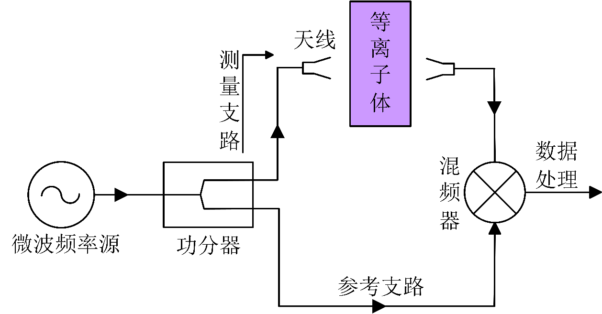{width="3.8125in"
height="1.9895833333333333in"}

1.  []{#_Toc162279082 .anchor}典型微波干涉仪原理图

参考支路的信号直接作为本振信号输入到接收端混频器中，测量支路的信号经过被测的等离子体介质后作为混频器的射频输入。当测量支路没有介质时，系统输出一个包含初始时延的差频信号；测试支路有等离子体后，差频信号的幅值和频率均会发生变化，最后比较有、无等离子体时系统输出的差频信号频率变化，便可得到等离子体产生的传播时延，后计算得到电子密度参数。

典型线性调频连续波测量系统总共包含三部分：连续波发射模块，收发天线模块及接收信号处理模块，系统示意图如下：

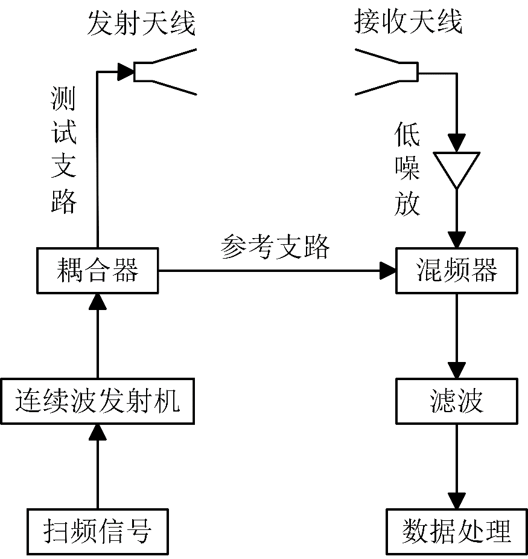{width="2.6354166666666665in"
height="2.785416666666667in"}

2.  []{#_Toc162279083 .anchor}典型线性调频连续波系统示意图

连续波发射模块包含：初始扫频信号输入以及连续波发射机链路。直接产生高频信号的成本和要求较高，所以需要将低频信号经过变频提高到系统要求的发射频段。本论文选用锯齿波调制下的线性扫频信号作为系统初始信号。连续波发射机链路的作用是将初始带宽扫频信号提高到系统既定带宽及诊断要求的30\~40GHz频段。

收发天线模块：耐高温聚焦透镜天线。由于实验装置产生的等离子体射流为近似圆柱体且在实验装置产生的等离子体射流周围温度较高，为了减少电磁波绕射带来的测量误差以及满足高温的实验环境，收发天线都采用耐高温的聚焦透镜天线。

接收信号处理模块：混频电路以及滤波电路。将接收天线的接收信号与系统发射信号进行混频，得到系统差频信号，差频信号经过低通滤波后，对差频信号进行采集，后续在MATLAB中进行分析计算。

系统初始扫频信号由泰克信号源(AWG70001A)产生，差频信号由高速示波器(DSOX95004Q)进行波形数据的采集。在实际的实验过程中，由于每次采集的差频信号状态较多，为了控制采集的信号数据量大小，需要在示波器中设置一个低通滤波且通带截止频率远高于前端链路中硬件滤波器的截止频率值，此滤波过程属于软件滤波，此处在示波器上的滤波设置仅仅是为了降低差频信号的波形数据大小。

### 链路方案设计

由3.2节中可知系统发射端信号的扫频带宽为\\\[800{\\rm{MHz}}\\\]，系统工作频率在35GHz左右，即整个系统的线性调频连续波发射电路需要完成带宽为800MHz的扫频信号产生及在30\~40GHz的频率范围内有一定的频率可调节性，以应对不同电子密度状态的等离子体实验环境。本文设计的诊断系统具体框架如下图所示：

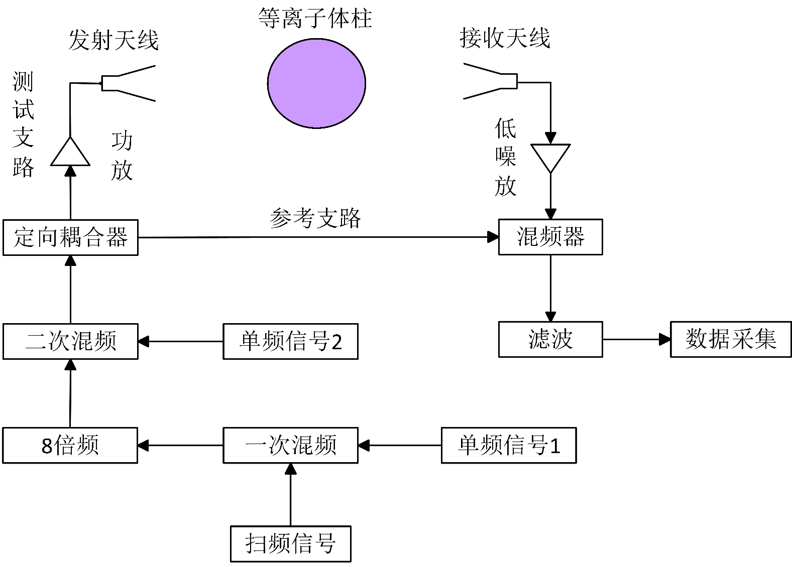{width="4.76875in"
height="3.417361111111111in"}

1.  []{#_Toc162279084 .anchor}线性调频连续波诊断系统方案示意图

本文系统选用锯齿波调制的扫频信号，系统初始扫频信号设计为100\~200MHz，其扫频带宽为100MHz。系统初始信号经过第一次混频后，达到倍频电路的频率输入要求，再经过8倍频链路达到输出端扫频带宽800MHz的要求。倍频电路的本质为乘法电路，而在射频前端中常用的倍频模块是二倍频电路，故本系统选用二倍频电路来实现要求的8倍频，即使用3次二倍频电路来达到系统的8倍频目的。8倍频后的扫频信号，再经过第二次混频将800MHz带宽的扫频信号提高到系统要求的30\~40GHz频段范围内，第二次混频的本振输入信号需要有一定的频率可调节性。

系统扫频信号达到要求的扫频带宽及发射频率后，经过定向耦合器的直通端给到功率放大器，再给到发射天线；其耦合端信号直接给到诊断系统的接收端，用作混频器的本振输入信号。接收天线收到信号后，经过低噪声放大器作为混频器的射频输入信号，经过混频器后得到的系统的差频信号，再经过低通滤波电路后，由高速示波器完成信号波形数据的采集，采集后在MATLAB中进行数据的分析处理。

由于混频电路和倍频电路都属于依靠器件的非线性工作原理来实现频率变换，所以信号经过混频和倍频后均需要选用合适的滤波电路来滤除出现的谐波或镜像频率信号。本文系统中所选用的混频器和倍频器均属于无源射频器件，无源器件会有一定的输入信号功率要求，且信号经过无源器件会有一定的功率损耗，所以依据每一级的输入功率要求，需在每一级频率变换时加入功率放大电路用来抵消信号在经过无源射频器件时带来的损耗。每一级的器件选择都是以平衡整个链路功率为目标，这也是对诊断系统进行实际链路调试时的重要任务，需要使混频器和倍频器都能够工作在最佳频率变换状态。经过分析后，实际的诊断系统链路方案设计如下：

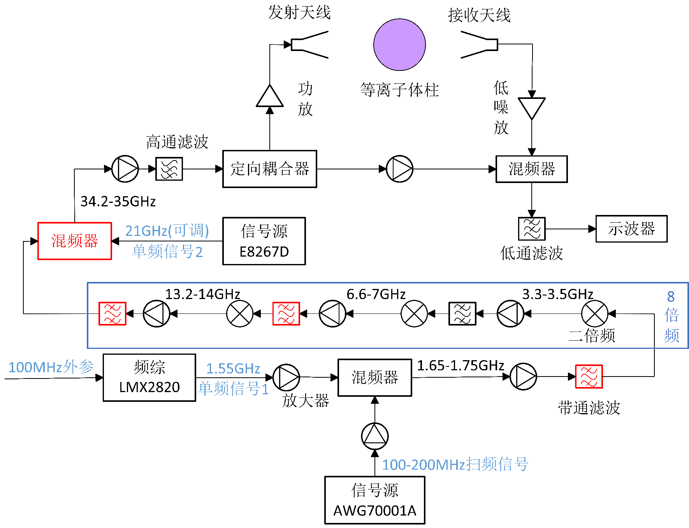{width="5.331944444444445in"
height="4.083333333333333in"}

2.  []{#_Toc162279085 .anchor}诊断系统链路方案示意图

上图展示的每一级所加的放大器均是经过实际调试后，最终的链路方案。由上图可以看出系统的外部输入信号主要包含三个部分：第一次混频的本振信号、系统初始100MHz带宽的扫频信号及第二次混频的本振信号。

第一次混频的本振信号由频综LMX2820提供，此开发板由Texas
Instruments官方提供的时钟芯片配置软件TICS
Pro控制。此开发板正常工作的条件：5V直流电压、100MHz外部参考信号、50欧姆端口负载。开发板留有电压测试端口，检测其测试端口是否达到3.3V，可验证是否正常供电。100MHz外部参考信号由泰克信号源(AFG3102)提供，正常供电后，由TICS
Pro软件控制其产生1.55GHz的单频信号。正常工作示意图如下：

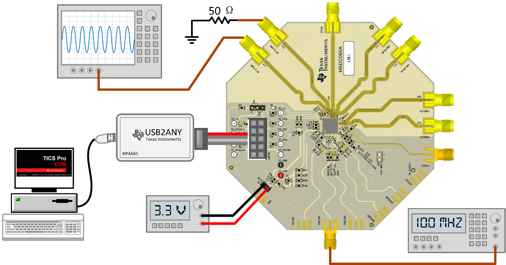{width="4.648611111111111in"
height="2.4402777777777778in"}

3.  []{#_Toc162279086 .anchor}频综板LMX2820正常工作示意图

诊断系统的初始100MHz带宽的扫频信号由泰克任意波形发生器(AWG70001A)产生，由MATLAB控制信号写入波形发生器。将主机与信号源通过网线进行物理连接，通过主机与仪器的通信程序TekVISA完成连接。在MATLAB中利用与仪器间的交互函数，编写数据传送程序，将频率为100\~200MHz，带宽为100MHz，调频周期为\\\[50{\\rm{\\mu
s}}\\\]的扫频信号写入波形发生器中，再由仪器完成扫频信号的输出作为诊断系统的输入。

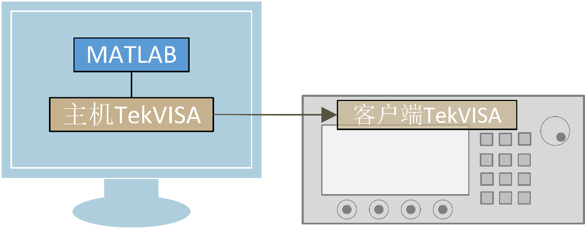{width="3.3965277777777776in"
height="1.33125in"}

4.  []{#_Toc167441022 .anchor}PC端控制泰克信号源示意图

第二次混频的本振信号属于单频信号，由矢量信号发生器(E8267D)为诊断系统提供，其可产生100kHz至44GHz的频率范围的信号，最高可提供25dBm的信号输出功率，由此信号源产生可调节的本振信号，确保诊断系统的诊断频率具有可调节性。系统初始设定第二次混频的本振信号频率为21GHz，输出功率设置为15dBm。

经过整个链路的方案设计后，系统能够输出频率为34.2\~35GHz，带宽为800MHz的扫频信号，且扫频信号具有一定的频率可调节性，满足了之前的设计参数。

### 链路模块选择

在整个射频前端链路中器件的选择依据，主要考虑的有两点：输入频率范围和功率要求。对于射频器件而言，首先关注的点一定是器件能够应用的频率范围。对于无源器件而言，其信号输入功率会有一定范围的要求，当信号功率太低时，无源器件的插损会远大于预期值，给其后的射频放大器选择带来一定影响；而输入信号的功率过大时会导致无源器件的预期效果下降，严重时造成不可逆的损伤，故无源器件的输入功率有上限值和下限值两个关注点。对于射频有源器件而言，由于器件自身会有一定的增益，需要关注的点是的输出功率最大值，从输出功率最大值推算合适的信号输入功率上限值。

因此整个系统的发射链路每一级的功率平衡是器件选择的重要问题，每一级器件的选择都不是单独去考虑的，而是需要兼顾其前后器件的频率范围、功率范围及各方面指标去进行选择。.

一、混频器选择

混频器在射频领域中作为上、下变频中重要的组成部分，其属于三端口器件包括本振、[射频](https://www.eefocus.com/tag/%E5%B0%84%E9%A2%91/)及中频端口。混频器实际上是一种非线性变换器件，用于将信号从频谱中的一个频率移到另一个频率点。混频器自身的指标对于整个发射及接收链路影响至关重要，混频器的选择需要考虑：工作频率、变频损耗、端口功率及端口隔离度。

混频器工作频率选择需要考虑三个端口各自的工作频率，主要是射频和中频端口频率，其关乎到前后级的器件选择。混频器的变频损耗，在接收机中会影响系统的接收灵敏度。端口功率主要考虑的是本振信号的端口功率，而射频端口输入功率一般情况下需小于本振功率10dB，本振信号功率对于混频器而言类似于开关的作用，本振信号功率达到一定数值时才能控制内部的[二极管](https://www.eefocus.com/baike/512433.html)进行开关操作，混频器模块给出的性能指标，都是在一定的本振功率条件下测试出来的。本振功率在一定范围内变化对于混频器的变频损耗影响不大，但是其功率过小时，混频器的各项指标均会恶化。混频器进行选择时，一般选用本振信号的开启功率较小的混频器，减少系统的功耗。

第一次混频器选择ADI公司的HMC213B，当其作为上混频器使用时，其性能指标如下：

1.  []{#_Toc167441083 .anchor}HMC213B混频器指标

+-------------------+---------------+-----------+----------------+
| 输入频率范围      | 本振功率要求  | 插入损耗  | 输入1dB压缩点  |
+:=================:+:=============:+:=========:+:==============:+
| RF/LO:1.5\~4.5GHz | 13dBm         | 10dB      | 8dBm           |
|                   |               |           |                |
| IF:DC\~1.5GHz     |               |           |                |
+-------------------+---------------+-----------+----------------+

第二次混频器及接收端混频器选用Marki公司的MM1-1044L，其性能指标如下：

2.  []{#_Toc167441084 .anchor}MM1-1044L混频器主要指标

+-----------------+---------------+-----------+----------------+
| 输入频率范围    | 本振功率要求  | 插入损耗  | 输入1dB压缩点  |
+:===============:+:=============:+:=========:+:==============:+
| RF/LO:10\~44GHz | 7dBm          | 10dB      | 5dBm           |
|                 |               |           |                |
| IF:DC\~14GHz    |               |           |                |
+-----------------+---------------+-----------+----------------+

二、倍频器选择

倍频器的作用是将输入信号的频率乘以整数倍进行输出，其与混频器原理有一定的相似性，都是依靠器件的非线性达到频率的变换。倍频器不需要外部本振信号的输入，而是使用输入信号本身的载波频率来生成倍频内容。本次系统方案使用的是3次二倍频达到8倍频程的目的。

由前文方案确定的信号频率可知，第一次混频后输出的扫频信号频率为1.65\~1.75GHz，故在二倍频器件的选择上也是依据此频率进行选择。三次二倍频选用的模块均属于ADI公司，分别是：HMC188、HMC189A、HMC204。其具体参数如下：

3.  []{#_Toc167441085 .anchor}倍频器模块主要指标

  -----------------------------------------------------------------
        型号        输入频率范围    输入功率要求       插入损耗
  ---------------- -------------- ---------------- ----------------
       HMC188        1.25\~3GHz      10\~20dBm           15dB

      HMC189A         2\~4GHz        10\~15dBm           13dB

       HMC204         4\~8GHz        10\~15dBm           16dB
  -----------------------------------------------------------------

三、定向耦合器选择

定向耦合器的作用是将系统的扫频信号分为两路，一路作为测试支路，连接功放后给到天线作为测试信号；另一路作为接收端混频器的本振输入。此时定向耦合器的信号输入频率为34.2\~35GHz，选择的定向耦合器是泰莱微波的TC-1040-20K。其具体参数如下：

4.  []{#_Toc167441086 .anchor}TC-1040-20K定向耦合器主要指标

  -----------------------------------------------------------
    工作频率    耦合度    插入损耗     驻波VSWR     耐功率
  ------------ -------- ------------ ------------ -----------
    2\~40GHz     20dB      1.5dB        1.7:1         20W

  -----------------------------------------------------------

四、带通滤波器选择

信号经过混频后会存在镜像频率和谐波频率，经过倍频器后同样存在谐波频率的影响，故在每次频率变换后均需要选用合适的带通滤波器用来滤除信号中的其他频率成分。具体滤波器选择如下：

5.  []{#_Toc167441087 .anchor}链路各级滤波器型号及通带范围

  -------------------------------------------------------------
     所处链路位置              型号               通带范围
  ------------------- ---------------------- ------------------
     第一次混频后          XBLBQ-DTA411        1.65\~1.75GHz

     第一次倍频后          VBFZ-3590-S+          3\~4.3GHz

     第二次倍频后          VBFZ-6260-S+          5.6\~7GHz

     第三次倍频后          XBLBQ-DTA410         13.2\~14GHz

     第二次混频后          XBLBQ-DTA296          26\~40GHz
  -------------------------------------------------------------

接收端混频器的中频端口输出的差频信号，同样需要经过滤波电路来滤除高频噪音信号，此处设计了一个7阶的LC低通滤波器，能够实现5MHz的低通滤波，同样在ADS中进行了设计仿真，后文会给出具体仿真及实测指标。

五、放大器选择

放大器主要作用是放大信号的功率，前文提到每一级器件都有自己的最佳输入功率要求，滤波器同样是有一定的插损，故在每一级频率变换前后均需要用到放大器，来使每一级达到既定的输入功率值。

对于放大器而言，系统中主要考虑的是功率放大器及低噪声放大器两者。功率放大器一般处于发射链路的最后一级，是发射通道中一个关键的构成部件[^\[43\]^](#_Ref156825749)，它的作用是将发射信号放大到一定的大功率电平来实现远距离传输。低噪声放大器处于接收链路的最前端，它的主要作用是放大聚焦透镜天线接收到的微弱信号，降低噪声干扰。

系统正常诊断时低噪放是一直需要连接的，不管是后续实验中测量介质的介电常数、测量极限分辨率，还是最后对于等离子体的诊断实验，只要是对差频信号进行采集，低噪放必须正常工作，低噪放选用的型号是瀚博科技的HB-LNA-0240,
其频率范围是2\~40GHz，增益大于40 dB, 输入功率要求小于-20dBm。

当应用到等离子体诊断实验时，由于在等离子体电磁实验装置上带来的链路损耗较大，系统需要外接功放，选用的功放型号是瀚博科技的HB-PA-1840，其频率范围是18\~40GHz，增益大于30dB，输入功率要求小于-10dBm。

## 系统扩频方案

由第二章可知系统的极限分辨率只与扫频信号带宽有关，即限制诊断系统电子密度测量下限值的参数是扫频带宽，为了使系统的极限分辨率有进一步提高的可能，可以适度提高信号的扫频带宽。此处提供一种扩频方案，使得系统能够产生最大1.6GHz的扫频带宽，应对小电子密度等离子体的诊断实验。

扩大扫频带宽时，就需要对于之前的硬件进行一些的调整，主要调整的是第二次混频的混频器和第一次混频后的滤波器及倍频链路中的两级滤波器。混频器的中频端口频率上限和滤波器的通带范围限制了扫频信号带宽的增大，前文系统方案所用混频器的中频端口频率上限为14GHz，限制了频率往上的扩展可能性，此处重新选定型号为ZMDB-44H-K+的混频器，此型号与之前选定的MM1-1044L对比如下：

1.  []{#_Toc167441088 .anchor}更换前后的混频器参数对比

+-------------+-----------------+---------------------------------------+----------+-----------------------------------+
| 型号        | 输入频率范围    | \${{\\rm{P}}\_{{\\rm{LO}}}}\$最低要求 | 插入损耗 | \${{\\rm{P}}\_{{\\rm{1dB,IN}}}}\$ |
+:===========:+:===============:+:=====================================:+:========:+:=================================:+
| MM1-1044L   | RF/LO:10\~44GHz | 7dBm                                  | 9.5dB    | 5dBm                              |
|             |                 |                                       |          |                                   |
|             | IF:DC\~14GHz    |                                       |          |                                   |
+-------------+-----------------+---------------------------------------+----------+-----------------------------------+
| ZMDB-44H-K+ | RF/LO:10\~40GHz | 15dBm                                 | 8.8dB    | 10dBm                             |
|             |                 |                                       |          |                                   |
|             | IF:DC\~15GHz    |                                       |          |                                   |
+-------------+-----------------+---------------------------------------+----------+-----------------------------------+

上图可以看出中频端口的频率上限提高到了15GHz，使得扫频信号带宽能够往上进行调节，虽然混频器ZMDB-44H-K+的本振功率要求有所提高，但其能够承受的射频输入功率也有一定提高，这使得诊断系统的发射信号功率有了进一步提高的空间，使系统能够有诊断更高电子密度的可能性。

对于滤波器的调节以第一次混频后位置所用的滤波器为例进行说明，系统目前所用的滤波器通带为1.65\~1.75GHz，此滤波器限制了扫频带宽加大的可能性，调节滤波器带通带为1.6\~1.8GHz，此时滤波器通带带宽为0.2GHz，经过系统的8倍频链路后，可以使得信号的扫频带宽上限值为1.6GHz，即相较于之前设计的800MHz提高了一倍。由线性调频连续波的固有分辨率的计算公式可知，带宽提高一倍，系统固有分辨率变为原来的一半。其后依照此通带范围替换掉第二次及第三次倍频后的滤波器。具体的替换位置及型号如下：

2.  []{#_Toc167441089 .anchor}更换前后的滤波器参数对比

+--------------------+---------------------+---------------------+
| 需更换滤波器的位置 | 旧型号及其通带      | 替换型号及其通带    |
+:==================:+:===================:+:===================:+
| 第一次混频后       | XBLBQ-DTA411        | XBLBQ-DTA795        |
|                    |                     |                     |
|                    | 1.65\~1.75GHz       | 1.6\~1.8GHz         |
+--------------------+---------------------+---------------------+
| 第二次倍频后       | VBFZ-6260-S+        | XBLBQ-DTA793        |
|                    |                     |                     |
|                    | 5.6\~7GHz           | 5\~8GHz             |
+--------------------+---------------------+---------------------+
| 第三次倍频后       | XBLBQ-DTA410        | XBLBQ-DTA269        |
|                    |                     |                     |
|                    | 13.2\~14GHz         | 12\~15GHz           |
+--------------------+---------------------+---------------------+

混频器和滤波器替换后，即完成了对系统的扩频方案，使得系统最大扫频带宽为1.6GHz，系统固有分辨率变为\\\[0.625ns\\\]，扫频带宽同样是可以进行一定的调节。

## 基于ADS的系统仿真

ADS（Advanced Design
System）是一款由[是德科技](https://link.zhihu.com/?target=http%3A//www.keysight.com.cn)开发的集成电路设计软件。主要用于射频、微波和毫米波电路的设计、仿真和分析。诊断系统链路信号的瞬态仿真及低通滤波器的设计仿真均在此软件中完成。

### 低通滤波器设计仿真

对于滤波器的设计主要是基于滤波器归一化参数进行电路计算并在ADS中完成仿真分析。本文设计的滤波器类型为最大平坦型滤波器，即巴特沃斯滤波电路。在进行低通滤波器设计时，存在一定的设计目标，在系统实测时差频信号频率处于2MHz以内，考虑到后续的具体参数变化范围，此低通滤波器的设计目标为通带截止频率为5MHz，并在20MHz的频率点达到带外40dB的抑制。

依据巴特沃斯低通滤波电路的频率响应图，由带外抑制来确定滤波器的具体阶数，依照设计目标此次的低通滤波器为7阶，经过计算后可得到滤波器所用电容及电感的具体参数，计算后的滤波器电路如下：

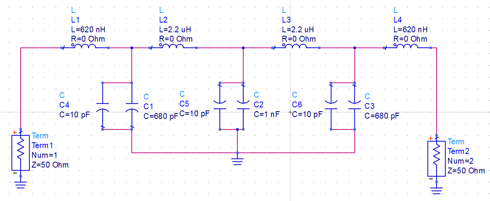{width="5.045833333333333in"
height="2.075in"}

1.   []{#_Toc167441023 .anchor}低通滤波器电路图

在ADS中均采用理想化元器件进行仿真，所以与实际的结果存在一定的误差，在并联支路的位置上均预留调试电容位置，用作实物的调试，在仿真时调试电容的容值均设定为10pF。LC低通滤波器的实物图如下：

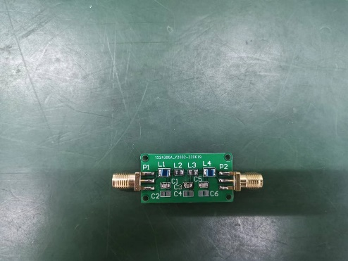{width="3.807638888888889in"
height="2.376388888888889in"}

2.   []{#_Toc167441024 .anchor}低通滤波器实物图

此低通滤波器仿真及实测S21变化曲线如下：

{width="4.913194444444445in"
height="3.0243055555555554in"}

3.   []{#_Toc167441025 .anchor}低通滤波器仿真及实测的S21曲线图

### 系统信号瞬态仿真

在ADS中进行瞬态信号的波形仿真，可以看出初始信号在经历了整个射频前端链路之后的具体变化，并给出了初始信号，发射信号以及差频信号的仿真结果。依照前文方案设计的链路系统，在ADS中进行系统模型搭建，整个链路的仿真电路图如下：

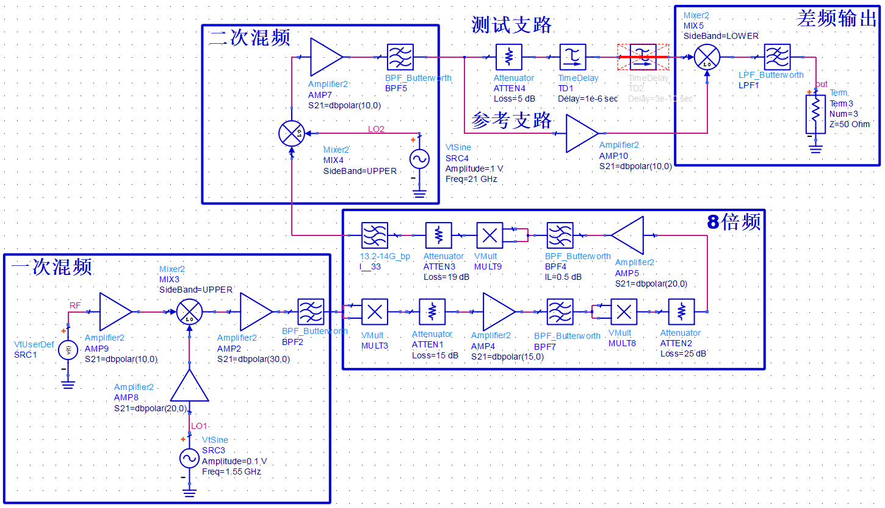{width="5.788194444444445in"
height="3.3333333333333335in"}

1.  []{#_Toc167441026 .anchor}诊断系统链路仿真模型示意图

上述仿真链路中，由于倍频器的内在原理类似于乘法电路，故在链路仿真过程中均采用乘法模块来替代二倍频模块，在信号每次经过乘法模块后都加入了衰减模块，以模拟实际倍频模块的插入损耗。上图链路中在发射信号之后加入了时延模块和衰减模块用来模拟在实际状态下诊断系统的初始时延。

系统的初始输入，100\~200MHz扫频信号仿真频谱如下：

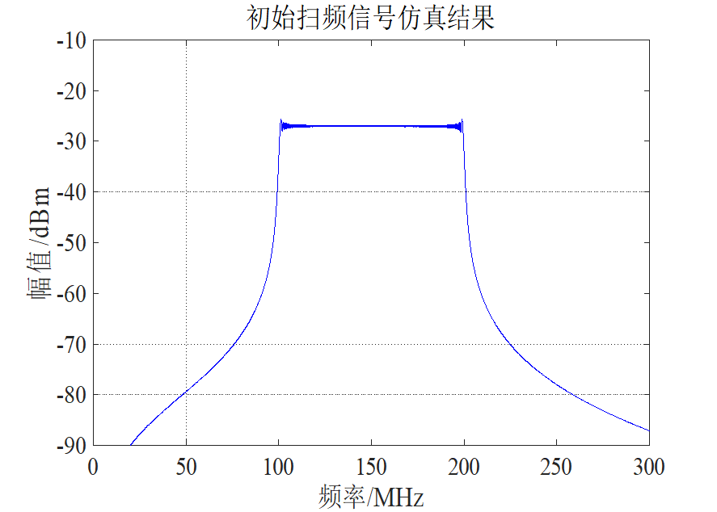{width="4.320833333333334in"
height="2.7618055555555556in"}

2.  []{#_Toc162279092 .anchor}系统初始扫频信号频谱仿真结果

在ADS中选用的模块均是理想化的元件模型，所以在仿真时，几乎是没有谐波频率的影响，所以仿真得到的发射端信号与实际的信号还是存在较大的区别，尤其是扫频带宽内的功率平坦度。仿真得到的输出信号，其扫频带宽内的功率平坦度极好，系统的输出端信号频谱仿真结果如下：

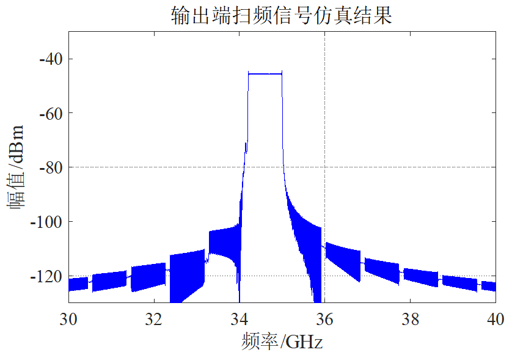{width="3.91875in"
height="2.5840277777777776in"}

3.  []{#_Toc167441028 .anchor}系统输出扫频信号频谱仿真结果

本文的诊断系统主要是测量等离子体的传播时延，来确定等离子体的电子密度，所以进行仿真时，加入两个不同的延时模块，用来模拟真实的实验情况。由于系统初始时延的存在，模型中加入第一个时延模块用来模拟系统在无等离子体时的状态，在此时延基础上再加一个时延模块，用来模拟有等离子体的状态。两次仿真，输出的差频信号频谱结果如下：

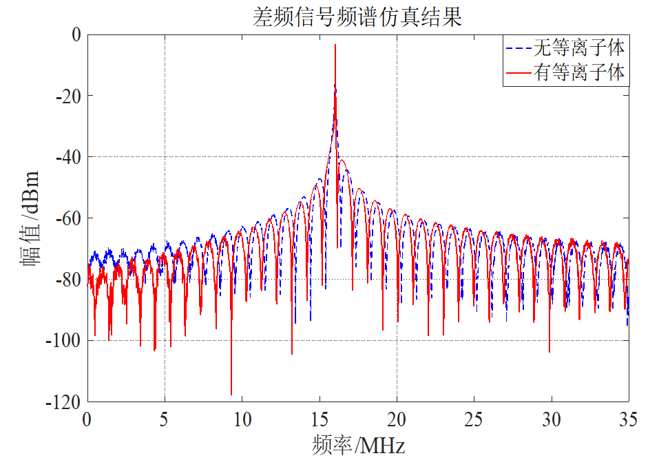{width="4.727083333333334in"
height="3.0166666666666666in"}

4.  []{#_Toc162279094 .anchor}系统差频信号仿真频谱图

从上图可以看出差频信号在小时延状态下带来的频率偏移量，使得整个频谱的能量会右移，但由于偏移量较小，频谱峰值并未变化，这一点也是第四章需要解决的问题。

## 诊断系统实物调试

诊断系统的实物主要包括多个信号源、诊断系统链路机箱、高速示波器及频谱仪。信号源包括了AWG70001A、E8267D
、AFG3102。诊断系统链路机箱包括了频综LMX2820、混频器、倍频器、放大器、滤波器、定向耦合器。在实验过程中，为了方便信号的观测和采集，差频信号由诊断机箱输出后经过功分器，一路给到示波器完成信号采集用作后续的数据处理；另外一路接给频谱仪，其目的是在实验时能够直接观测差频信号，检查整个诊断系统是否正常工作。

诊断系统在正常工作时的实验状态如下：

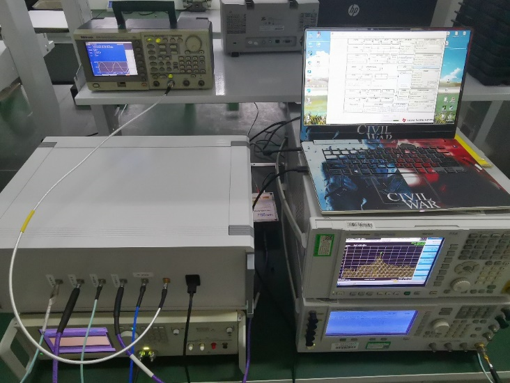{width="3.875in" height="2.90625in"}

1.  []{#_Toc162279095 .anchor}诊断系统正常工作状态示意图

诊断机箱总共包含6个射频端口及一个USB接口。其中USB接口的作用是上位机的TICS
Pro软件控制频率合成器LMX2820的内部程序，使其产生1.55GHz的单频信号。射频端口分别是：100MHz的外部参考信号输入端口、初始扫频信号输入端口、可调21GHz单频信号输入端口、发射信号输出端口、接收信号输入端口及差频信号输出端口。其中100MHz的外部参考输入，是为频率合成器LMX2820提供外部时钟。诊断系统链路机箱内部图如下：

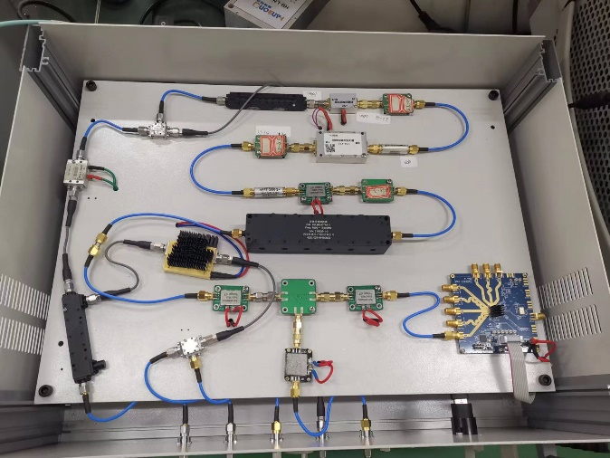{width="3.65625in"
height="2.7430555555555554in"}

2.  []{#_Toc162279096 .anchor}系统链路机箱内部实物图

由泰克AWG70001A信号源输出的初始100\~200MHz扫频信号，其由频谱仪观测得到的实测频谱结果如下：

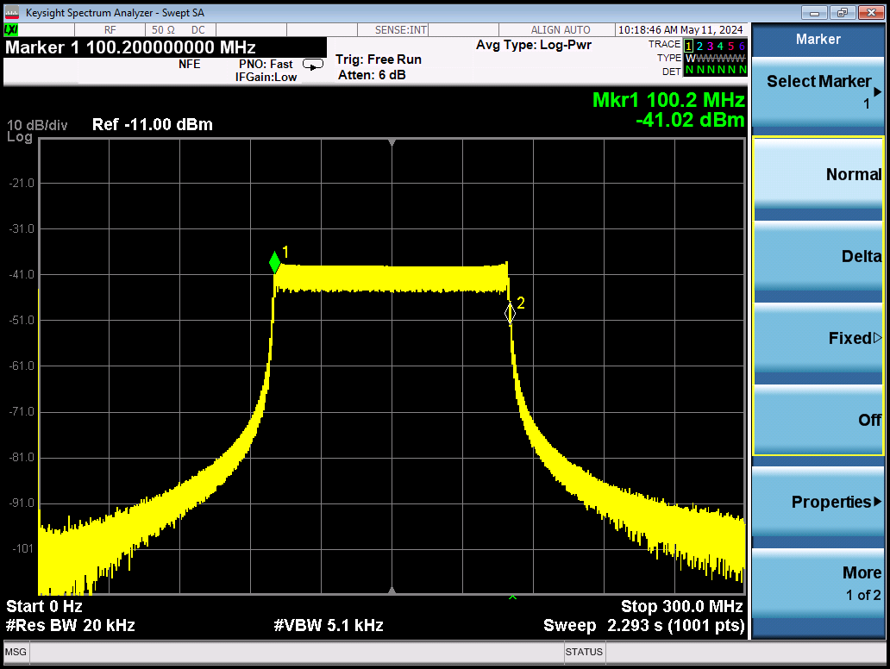{width="3.6041666666666665in"
height="2.709722222222222in"}

3.  []{#_Toc162279097 .anchor}系统初始扫频信号实测频谱图

对于诊断系统链路的实际调试，主要是检测每一级的功率是否达到既定要求，信号功率利用功率计进行测量，由于功率计的频率限制，此处只给出第二次混频之前的功率实测结果：

1.  []{#_Toc167441090 .anchor}链路节点处信号功率实测结果

  -----------------------------------------------------------
      链路节点位置         扫频信号频率          信号功率
  -------------------- --------------------- ----------------
      第一次倍频前         1.65\~1.75GHz          12dBm

  -----------------------------------------------------------

表3.8 链路节点处信号功率实测结果(续)

  -----------------------------------------------------------
      链路节点位置         扫频信号频率          信号功率
  -------------------- --------------------- ----------------
      第二次倍频后          3.3\~3.5GHz           -1dBm

      第三次倍频后           6.6\~7GHz            -2dBm

      第二次混频前          13.2\~14GHz           14 dBm
  -----------------------------------------------------------

初始扫频信号经过诊断系统的混频、倍频等频率变换后，由系统链路机箱的输出端口发射的34.2\~35GHz信号频谱实测如下：

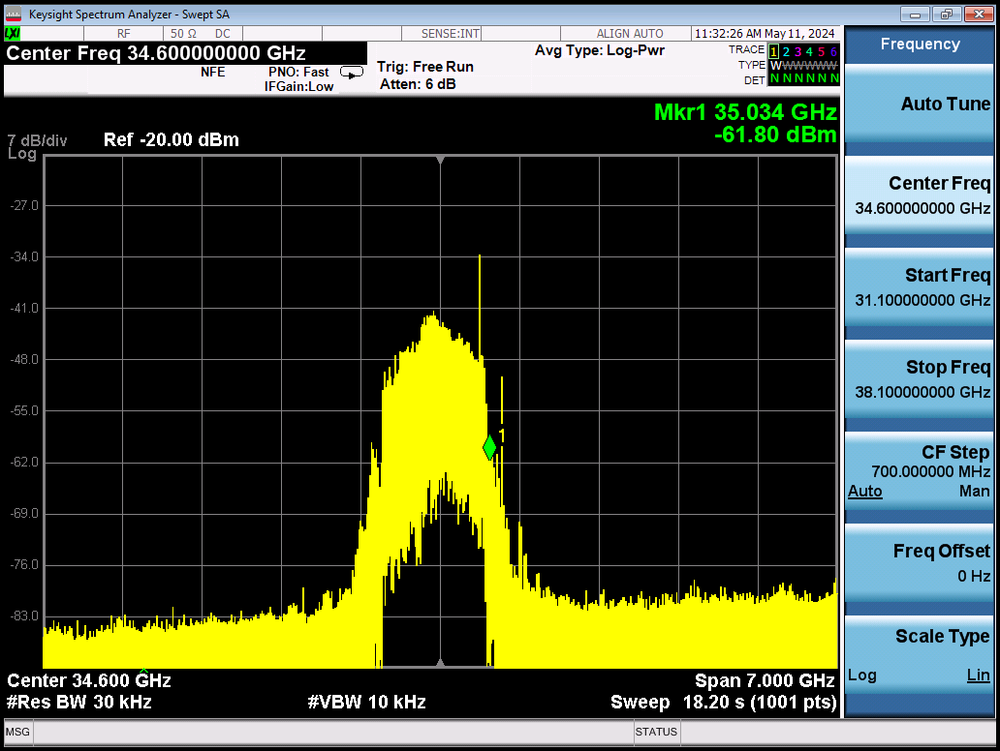{width="3.173611111111111in"
height="2.386111111111111in"}

1.  []{#_Toc162279098 .anchor}系统输出信号实测频谱图

由上图可以看出输出信号在扫频带宽内，其功率平坦度浮动比较大，与仿真结果是存在较大的偏差。在信号经过天线后，发射信号和接收信号混频得到系统的差频信号，下图是由频谱仪观测的系统初始差频信号频谱结果：

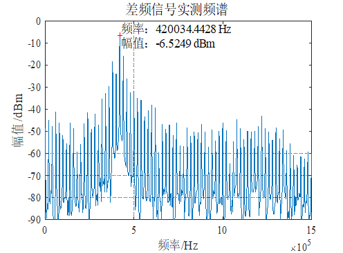{width="3.8847222222222224in"
height="2.5659722222222223in"}

2.  []{#_Toc162279099 .anchor}差频信号实测频谱图

由上图可以看出此时的系统初始差频信号的频域谱峰最大值处的频率值为420kHz，由于每次实验时使用的射频同轴线长短是不同的，其对应带来的初始时延也是变化的，故系统初始差频信号的频率不是一个确定值。经过实测，在等离子体实验装置进行诊断实验时，800MHz扫频带宽下，系统初始差频信号频率会在1\~2MHz之间。

之前的测试结果均是基于系统发射信号扫频带宽为800MHz时的实测情况，在系统扩频后，提高扫频带宽时，系统链路在第一次混频后的谐波频率会对所需的频率信号带来较大影响，如下图所示：

+-------------------------------------------------------------+------------------------------------------------+
| 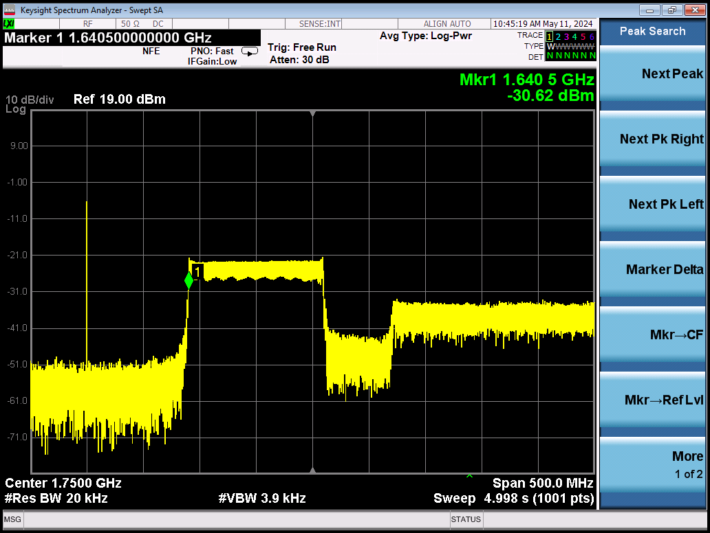{width="2.8673611111111112in" | 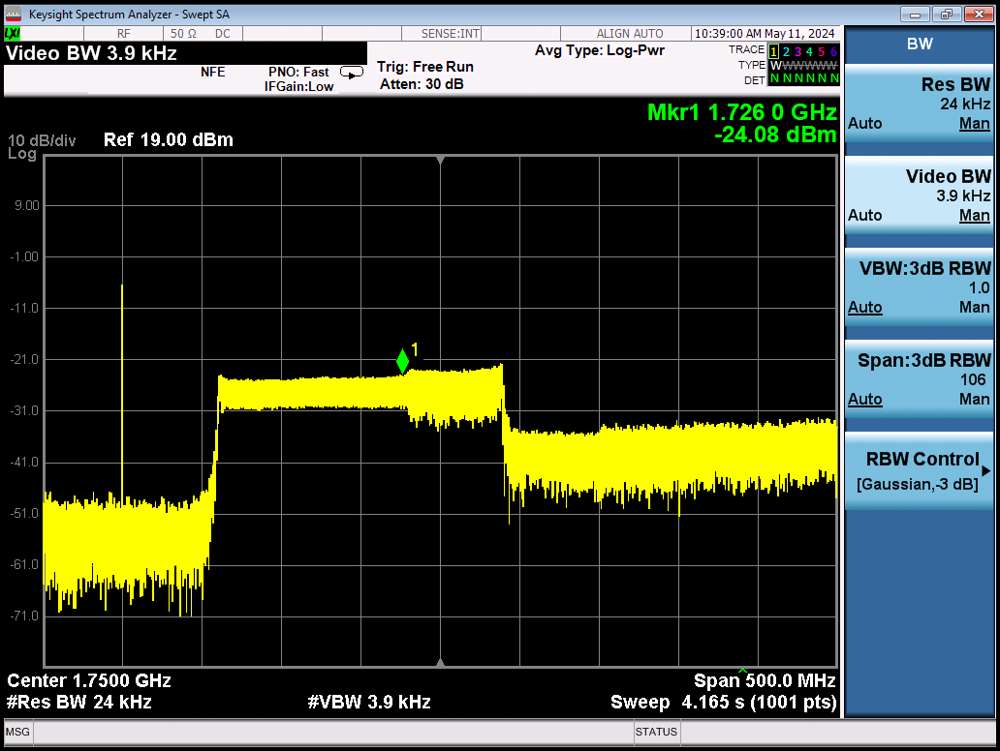{width="2.875in" |
| height="2.15625in"}                                         | height="2.161111111111111in"}                  |
+:===========================================================:+:==============================================:+
| (a)初始120MHz带宽                                           | \(b\) 初始180MHz带宽                           |
+-------------------------------------------------------------+------------------------------------------------+
| 3.  []{#_Toc167441035 .anchor}增大初始扫频信号带宽后谐波影响示意图                                           |
+--------------------------------------------------------------------------------------------------------------+

由上图可以看出，提高带宽后，由于混频时谐波的存在，有可能谐波频率与所希望的信号频率重合，导致扫频信号的不纯粹。为了消除此种情况，需要更改系统在第一次混频时的本振及射频输入信号频率值，但要求混频后得到的八倍频电路输入的扫频信号的中心频率仍为1.7GHz，满足扫频信号频率在1.6\~1.8GHz通带之内，经过多次调试后，确定第一次混频的本振输入频率为1.5GHz，初始扫频信号的中心频率为200MHz，即可消除上述问题。系统初始输入信号频率进行调整后，在系统初始扫频信号频率为100\~300MHz，且第一次混频的本振信号频率为1.5GHz时，系统链路在第一次混频后的频谱结果如下：

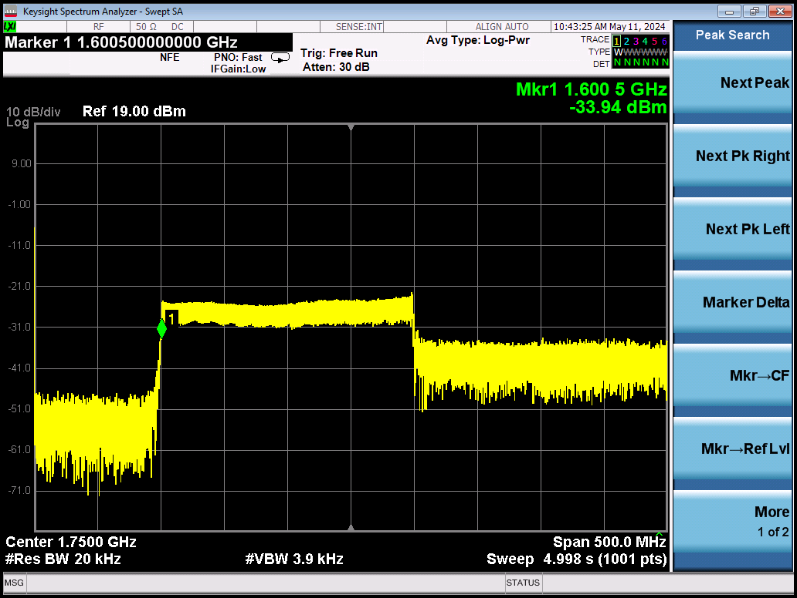{width="3.01875in"
height="2.2694444444444444in"}

4.  []{#_Toc162279101 .anchor}调整后初始带宽为200MHz时第一次混频结果

在系统测试环境不变的情况下，仅仅提高发射信号的扫频带宽时，系统初始的差频信号频率值也会升高。不同扫频带宽条件下，初始差频信号频谱变化如下图所示：

+-------------------------------------------------------------+------------------------------------------------------------+
| 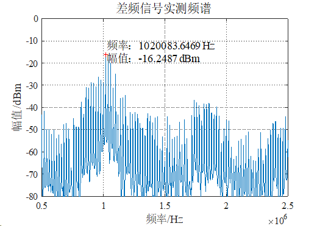{width="3.1006944444444446in" | 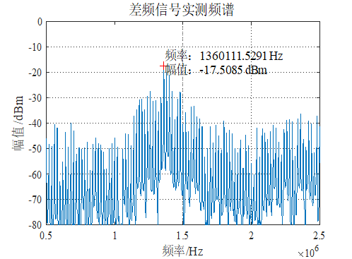{width="3.107638888888889in" |
| height="2.046527777777778in"}                               | height="2.051388888888889in"}                              |
+:===========================================================:+:==========================================================:+
| (a)发射信号带宽1200MHz                                      | \(b\) 初始信号带宽1600MHz                                  |
+-------------------------------------------------------------+------------------------------------------------------------+
| 5.  []{#_Toc167441037 .anchor}增大扫频带宽时差频信号实测频谱变化示意图                                                   |
+--------------------------------------------------------------------------------------------------------------------------+

由上图频谱直接观测，可以看出系统发射信号扫频带宽为1200MHz时，差频信号的谱峰值处频率为1.02MHz，当扫频带宽为1600MHz时，差频信号的谱峰值处频率为1.36MHz。此时意味着当诊断系统搭建在等离子体实验装置上时，初始差频信号频率会进一步提高。

## 本章小结

本章主要介绍了线性调频连续波诊断系统的方案设计及对于系统主要参数的选取，包括诊断频率、调频带宽和调频周期等；对于整个诊断系统的链路方案进行了设计，包括如何实现整个变频电路、各部分的信号输入以及采集系统进行了设计选择；对于整个变频链路及接收端的所用到的具体模块进行了选型；对系统提出了一种扩频方案，在初始系统方案基础上给出了改进时所需要更换的射频模块；基于ADS射频软件仿真了在800MHz带宽下，整个诊断系统的瞬时信号，给出了系统发射端信号和差频信号的仿真及对应实测频域结果；利用功率计对系统链路各级功率进行调试，使每一级器件均工作在最佳的状态，并针对系统扩频后的调试中所遇到的问题，给出了实际的解决方法。

# 系统差频信号数据处理

## 引言

在上一章中提到等离子体产生的时间延迟较小，其对应的频率变化量也比较小，在频谱中仅仅反映在离散谱的各谱线能量有所变化。本章数据分析处理主要是针对由高速示波器采集的差频信号，处理步骤主要包括了对差频信号进行去噪处理以及对差频信号的离散谱进行频率校正处理。经过本章的处理分析，能够得到差频信号的实际谱峰频率值，后根据系统在有、无等离子体时差频信号的频率变化量，便完成时延及电子密度的计算。

## 信号处理方案

在第三章中进行系统调试时，由频谱仪直接观测得到的频谱可以看出，利用线性调频连续波系统测量传播时间延迟时，由于栅栏效应存在，导致实际的频谱最大值无法正好落在采样点上，两个离散点之间的频率及幅值信息无法获得。单频率的正弦信号，经过DFT后的频域理想栅栏效应如下：

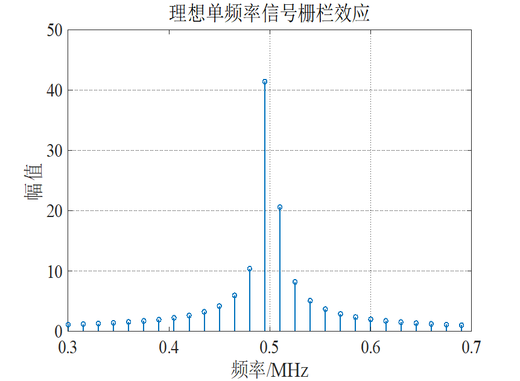{width="4.588888888888889in"
height="2.9625in"}

1.  []{#_Toc162279103 .anchor}理想栅栏效应示意图

产生栅栏效应的原因是因为信号经过DFT变换后得到的频谱被限制在基频的整数倍，其频谱不能被视为连续函数[^\[44\]^](#_Ref156826670)。由于本文诊断系统是对于等离子体进行时延诊断，前文提到了等离子体产生的传播时延时延比较小，在ps的量级，如果以此时频谱的峰值谱线处对应的频率确定为此时的系统的差频信号频率，会存在非常大的偏差。由于离散谱栅栏效应的存在，所以必须对差频信号的离散谱进行校正，使得信号能够最大程度的逼近真实的频率信息。如果不进行频谱校正，甚至无法完成诊断系统的测量要求。

由前文可知增大发射信号的扫频带宽可以提高系统分辨率，但经过多因素的考虑，扫频带宽的调节始终是有限的，此时只能通过对于差频信号的数据分析处理，完成频谱的校正，得到差频信号对应的频率信息。本文对于诊断系统采集到的差频信号进行分析处理的流程主要包括：初始信号的去噪以及离散谱的校正，整个信号处理算法流程可表示如下：

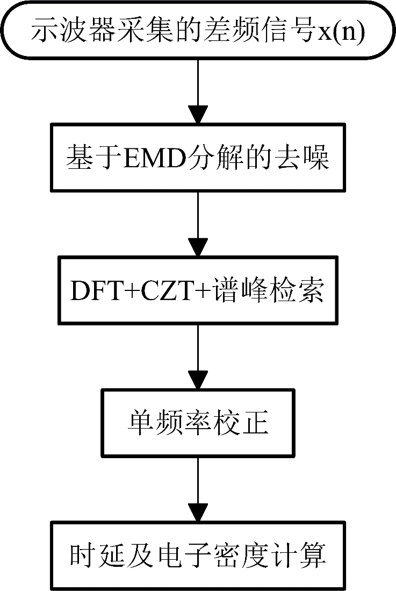{width="1.9430555555555555in"
height="2.895138888888889in"}

2.  []{#_Toc167441039 .anchor}数据处理流程示意图

诊断系统的硬件方案中存在低通滤波器，但仍需要依靠算法得到最主要的频率信息，依据EMD分解的去噪算法得到与信号相关性较高的频率信息。初始差频信号去噪后，需要对于重构信号进行加窗、经过DFT分析得到初始频域结果。

本文设计的诊断系统所输出的差频信号属于单频率成分的信号，故后面讨论的校正方法，也均是对于单频率有较好校正效果的处理方法。常用的频谱校正方法有:比值法、能量重心法、相位差法以及三角形法等^[\[45\]](#_Ref156826690)-[\[47\]](#_Ref162619918)^，而校正方法计算时都是基于谱峰最大值及其相近的几条谱线的频率及幅值信息进行后续校正，所以在整个处理流程中，进行校正之前需要进行谱峰检索，得到各个谱线处的频率信息及其幅值信息，再进行具体的频谱校正。为了获得各个谱线处较为准确的信息，在本文的处理流程设计中需要在对初始差频信号做DFT之后，对于感兴趣的频率区间加入CZT变换，增加此区间的采样点数，使得离散频谱尽可能呈现连续性的状态，在谱峰检索时得到CZT区间内更准确的各谱线频率信息，尽可能使得校正后的频率结果更加准确。

## EMD去噪算法

差频信号包含的噪声成分是比较复杂的，为了提高系统的时延诊断精度，必须滤除混杂在差频信号中的噪声频率信息。虽然硬件系统中对于差频信号有一个低通滤波器，但差频信号的部分频率区间内是叠加了随机噪声的，所以对于差频信号处理的第一步必须进行去噪处理。本节主要讨论的去噪方法为利用EMD分解来实现对于噪音滤除的方法。

### EMD分解基本原理

EMD分解是在1998年由Norden
E．Huang等人提出，对信号来说是一种具有自适应特性的时频分析方法^[\[48\]](#_Ref156826757)-[\[49\]](#_Ref156826759)^，是平稳化处理信号的一种方法。此方法是对信号中不同尺度的波动进行逐项分解，最终得到包含不同特征尺度的多项数据序列，经过EMD分解后得到的数据序列被称作本征模函数(Intrinsic
Mode Function，IMF)分量[^\[44\]^](#_Ref156826670)，
EMD分解同样可以被认为是一种时空滤波器，其度量的原则是信号极值时间维度上的特征尺度。相校小波变换而言，EMD分解的基函数来自信号的本身。

经过分解得到的IMF分量反映出了信号的局部频率特性，IMF分量的对应的阶数越小，其表述的信号频率越高[^\[50\]^](#_Ref166263107)，即EMD分解将信号分解成由高到低的频率成分，根据此特性能够对信号进行滤波、降噪处理。

在EMD分解的理论中，认为任何信号都是可以看作由若干个IMF分量和一个余项组成，经过分解后的信号可以表述成：\\\[x\\left(
n \\right) = \\sum\\limits\_{i = 1}\^n {{c_i}\\left( n \\right) +
r\\left( n \\right)} \\\]，针对IMF分量的两个约束条件如下：

(1) 在信号的时域波形中极值点和过零点的个数相等或着相差数目不能超过一个。

(2) 在信号的任意时刻，由局部极小值点所定义的下包络线与局部极大值点所定义的上包络线相对于时间轴是具有对称性的，即信号局部上、下包络线的平均值等于零[^\[51\]^](#_Ref166263132)。

具体的EMD分解过程如下：

(1) 确定信号的极大值和极小值点，得到信号的上、下包络线；

(2) 计算信号的均值包络线，即对上、下包络线求平均；

(3) 信号减去步骤(2)的均值包络线，得到中间信号；

(4) 判断步骤(3)的中间信号是否同时满足约束条件，若满足，则中间信号就是一个IMF分量；如果不是，则以此中间信号为基础，重复步骤(1)\~步骤(4)。

(5) 以此类推得到第一个IMF分量后，用原始信号减去得到的IMF分量，得到残余信号。每次得到新的IMF分量后需要检查得到的残余信号分量是否满足单调函数或常数条件，如果满足，则从残余信号中不能再筛分出本征模态函数，此时达到分解终止条件。否则利用残余信号继续重复步骤(1)\~步骤(4)，经过多次迭代实现分解。

EMD分解是经过重复性的迭代，最后得到原始信号的各级IMF分量以及最后剩余的中心趋势信号，即余项信号。由于各IMF分量是满足信号频率固定变化趋势的，实现了由高频到低频进行分解，根据去除不同的IMF分量可以实现对于信号的不同滤波形式，可以是带通、带阻、高通及低通任一形式[^\[52\]^](#_Ref166263139)。

### 基于相关函数特性的带通滤波方法

相关函数贯穿了随机信号的处理，相关函数又包括互相关和自相关两种形式。信号的自相关函数能够反映信号自身在不同时刻的相关程度，是对于时域特性的一种平均度量[^\[53\]^](#_Ref162620859)。信号和噪声的自相关函数具有完全不同的特性，信号自相关函数的能量远高于噪音自相关函数的能量，可以依此为判断依据，来选定主要的IMF分量。对于离散信号而言，其集合平均下的自相关函数表达式如下：

(4-1)

自相关函数就是信号x(m)和其延迟信号x(m+n)的乘积之和，自相关函数是关于延迟n的函数，为了确保自相关函数的序列长度N和信号x(n)的长度一致，信号选取的时间延迟n应当满足：\\\[{\\rm{ -
N/2}} \< {\\rm{n}} \< {\\rm{N/2}}\\\]。

离散信号的能量值计算如下：

\\\[E = \\sum\\limits\_{n = 0}\^N {{x\^2}(n)} \\\] (4-2)

本文基于自相关函数特性的EMD去噪算法流程如下：

(1) 对初始差频信号进行EMD分解，得到多级IMF分量。

(2) 对每个IMF分量计算得到其自相关函数，并计算对应能量，根据能量值大小选取占主导地位的内涵模态分量。

(3) 依据带通滤波器的形式进行IMF分量的阶数选取。

(4) 依据步骤(3)选取的主要IMF分量，对信号进行重构，完成去噪。

### 去噪算法测试分析

对于诊断系统在天线中间没有任何介质的情况下，即在信号由透镜天线发射后，直接由接收天线完成接收，天线中间只存在一定距离情况下，进行一次信号采集，故此状态的差频信号属于系统初始状态信号。为了将EMD算法的去噪效果更明显的表示出来，此时去掉前端硬件电路中的5MHz低通滤波器，只在高速示波器中设置50MHz的低通滤波。

由高速示波器保存的差频信号波形数据总共包括了10个周期的信号，信号单周期为\$50{\\rm{\\mu
s}}\$，保存的整个数据段时间长度属于\$ - 250\\mu s\\\~250\\mu
s\$之间。为了使信号去噪效果比较明显，展示两个周期的差频信号如下：

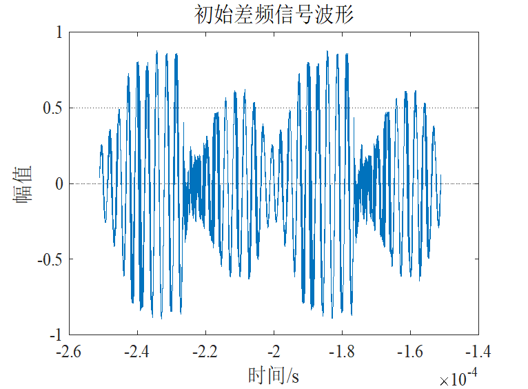{width="3.910416666666667in"
height="2.626388888888889in"}

1.  []{#_Toc167441040 .anchor}系统初始差频信号时域波形图

对于差频信号整个数据段，即10个周期的信号进行EMD分解，经过分解后各阶IMF分量及其对应频谱如下图所示：

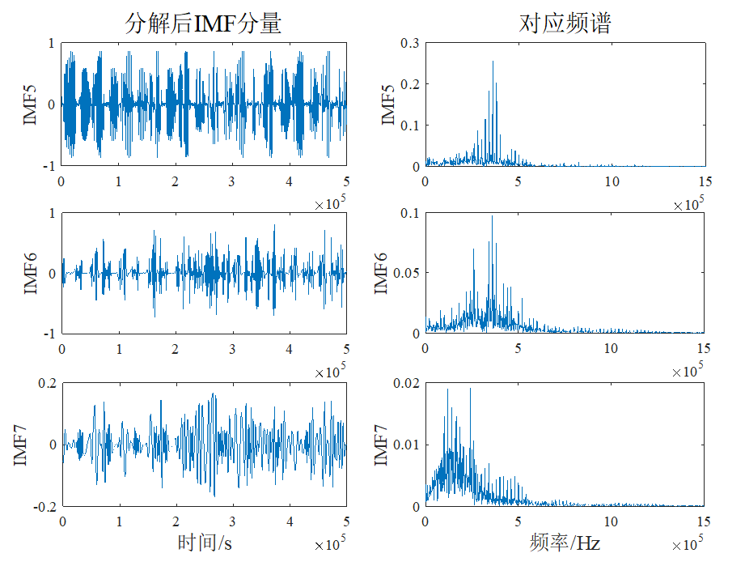{width="4.566666666666666in"
height="3.3930555555555557in"}

2.  []{#_Toc167441041 .anchor}分解后IMF分量的波形及对应频谱

信号在经过分解后，包含的IMF分量总共有十项，上图仅仅展示了第5\~7项的IMF分量，其阶数由上至下分别描述了频率由高到低的变化，上图左边部分展示的是分解得到的各IMF分量的信号时域波形，其对应的各IMF分量频域展示在上图右边，此时根据频域的峰值能量大小同样可以看出哪些IMF分量是属于信号的主导成分。

经过EMD分解后,此时已经得到了各个IMF分量，通过各IMF分量的时域波形，先计算得到其对应的自相关函数信号，再计算每一阶IMF分量的自相关函数的信号能量大小，计算结果如下：

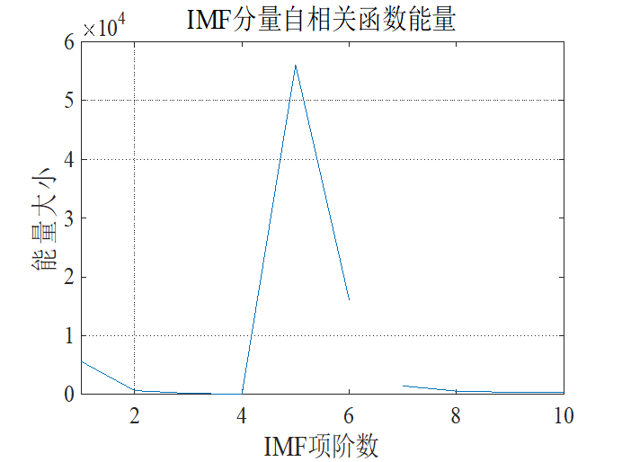{width="3.875in" height="2.51875in"}

3.  []{#_Toc162279107 .anchor}两阶IMF分量主导的自相关函数能量分布图

由上图可看出诊断系统实际得到的差频信号的主导部分包含了两个阶数的IMF分量，故在主导分量选取时需要同时确定5阶和6阶IMF分量为主导阶数，依据带通滤波的选取准则此时需要选取的重构阶数为4\~7阶IMF分量，故重构后的信号可以由如下公式表示：

\\\[x\\left( n \\right) = \\sum\\limits\_{i = 4}\^7 {{c_i}\\left( n
\\right) + r\\left( n \\right)} \\\] (4-3)

每次采集的波形数据，其对应的主导阶数并不是一个确定的值，对于主导阶数的确定，是需要依靠算法去自主去选择的。根据实际的实验数据表明，有时主导阶数是为两个，有时的主导阶数却包含三个，具体相关函数能量变化曲线见图4.6，图中可以看出，此时差频信号的主导阶数为4\~6阶IMF分量，虽然第6阶IMF分量的自相关函数能量大小相较4阶和5阶而言比较小，但为了尽可能保存差频信号有用的细节信息，同样需要把第6阶确定为主导阶数，此时同样依据带通滤波的选择原则，确定此状态下用于信号重构的IMF分量为3\~7阶。

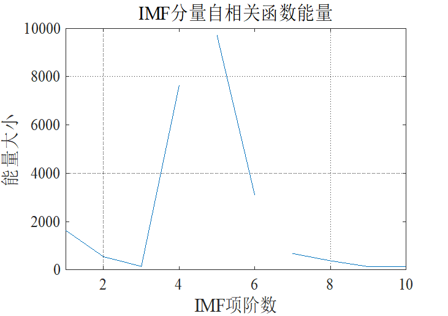{width="4.138888888888889in"
height="2.702777777777778in"}

4.  []{#_Toc162279108 .anchor}三阶IMF分量主导的自相关函数能量分布图

此处展示的是与图4.3相同的数据段信息，经过基于EMD分解的去噪算法后，重构后的信号时域波形图如下所示：

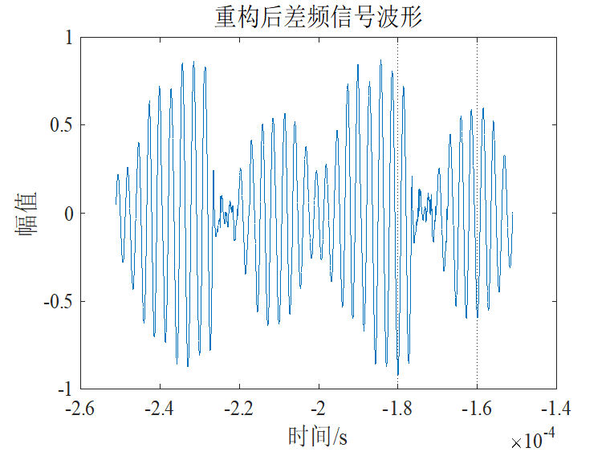{width="4.209027777777778in"
height="2.8256944444444443in"}

5.  []{#_Toc162279109 .anchor}去噪重构后差频信号时域波形图

对比图4.3，初始差频信号前后的时域波形，可以看出基于EMD分解的去噪算法，具有良好的去噪效果。整套算法能够依据自相关函数的能量大小，自主完成对于信号重组所需要的IMF分量进行选取，尽可能的保存了原始差频信号的有用信息，对于后续的高精度频谱校正奠定了基础。

## 频谱校正算法

目前对于离散谱进行的校正方法有很多种，根据差频信号的组成结构不同来说，主要可以分为两类：差频信号仅仅包括单频率成分，或者是多频率成分但各频率成分的间隔较大；另外一种是包含多个紧密相连的频率成分。本次诊断系统采用的是单发单收的测量系统，故诊断系统产生的差频信号理论上应属于单频率成分，故此后对于频谱校正方法的讨论都是基于单频率成分的离散谱校正方法。

### 校正方法分析

由前文内容可知示波器保存的差频信号总共包含了10个周期的波形数据，相当于对连续波形数据进行了截断，相当于加了矩形窗，对于差频信号加不同窗函数得到的频率也是有一定偏差的。从理论上来讲，信号加矩形窗后对于单频率成分的最大测量误差高达36.4%，加其他窗时，虽不能消除误差，但总体误差会有所减小，当给信号加汉宁窗时，单频率成分的最大测量误差为15.3%[^\[54\]^](#_Ref156827000)。

对于单频率成分信号的校正方法包括了：比值法、能量重心法及FFT+DFT连续细化分析法等[^\[57\]^](#_Ref162620397)。以下主要对能量重心法以及三角形法进行详细介绍，两种校正算法均是基于谱线最大值处及其左右的谱线信息进行校正分析。

#### 能量重心法

能量重心法是依据三点卷积法进行改进从而提出的，该方法解决了三点卷积法不能对幅值和相位信息进行校正的不足，即能量重心法可完成对信号的频率、幅值以及相位信息进行校正。其校正基本原理是利用对称窗函数的离散谱能量重心无限逼近坐标原点的思路来进行校正的^[\[54\]](#_Ref156827000)-[\[56\]](#_Ref166263748)^。对称窗函数的频谱模函数是关于坐标纵轴对称的，频谱模函数满足下式：

(4-4)

上式中\$G(x)\$为窗函数的功率谱函数，其中\${x_0}\$是谱函数的峰值谱线对应的横轴坐标点，对于不同的窗函数而言，其对应的功率谱函数也是不相同的。理想差频信号做DFT后得到的功率谱线分布图如下所示：

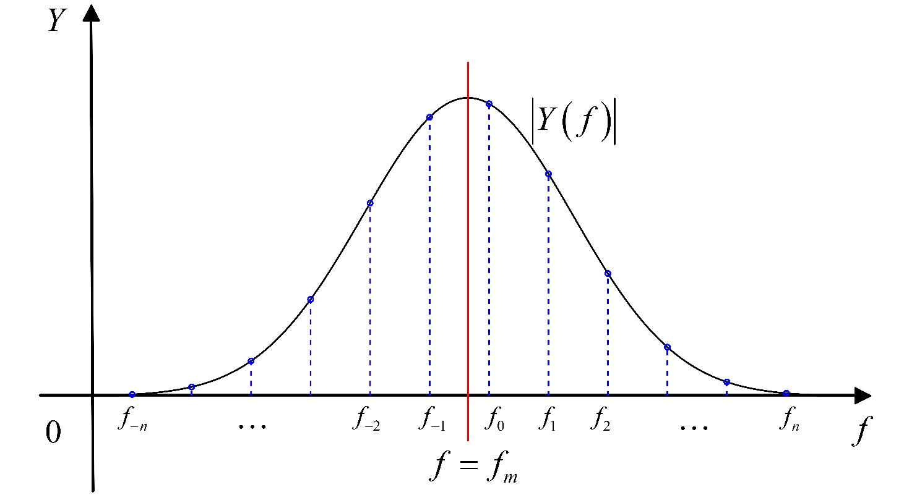{width="4.336805555555555in"
height="2.377083333333333in"}

1.  []{#_Toc167441045 .anchor}理想差频信号功率谱线分布图

针对离散谱的能量重心法，其通用频率校正公式如下：

(4-5)

依据窗函数的能量分布集中在主瓣内的特性，所以一般情况下选取校正的谱线为主瓣内功率较大的几条谱线即可完成对于频率的校正。能量重心法对于幅值信息的校正，由帕斯瓦定理可知，主瓣区域内各谱线幅值绝对值之和就是幅值校正后的峰值处功率谱的理论值，但同时应该考虑到不同窗函数带来的影响，进行幅值校正时应该针对不同窗函数给予不同的能量恢复系数，假定能量恢复系数为\${K_i}\$
,便可得到对于幅值的校正公式如下：

\\\[A = \\sqrt {{K_i}\\sum\\limits\_{i = - n}\^n {\|Y({f\_{0 + i}})\|} }
\\\] (4-6)

能量重心法适用于所有的对称窗函数，但不同的窗函数会对校正精度产生不同的影响，其中汉宁窗具有校高的校正精度，且校正精度与校正选取
的谱线个数也是有关系的，汉宁窗的能量恢复系数为1.633。

#### 三角形法

三角形校正法是利用几何原理进行频率的校正[^\[58\]^](#_Ref156827076)。当分别连接主瓣内谱峰最大值及其左右两条谱线时，可将其近似看作一个三角形。选用谱线最大值左右各一条谱线进行说明，且左边谱线幅值小于右边谱线时，具体频谱效果如下所示：

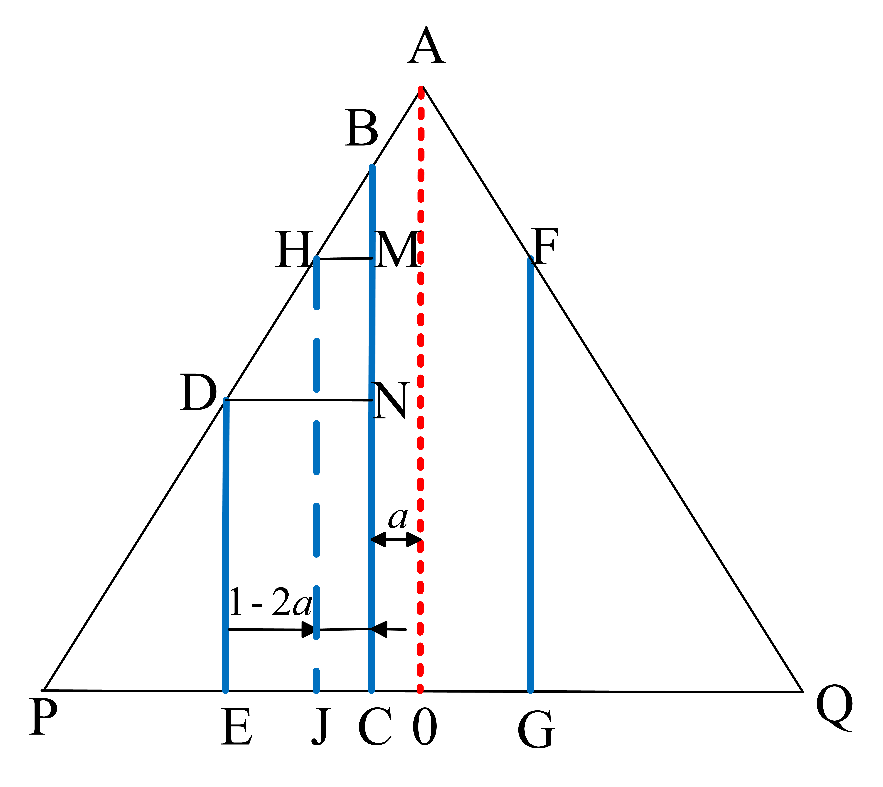{width="2.5in"
height="2.2270833333333333in"}

1.  []{#_Toc167441046 .anchor}三角形法校正示意图

上图中三条谱峰分别是：BC、DE、FG。其中BC为检索到的谱峰最大值，其对应的谱线编号为k，其对应的谱线幅值假定为L(k)，则DE和FG分别对应的编号是k-1和k+1。此时由于FG谱线的幅值大于DE谱线，则谱峰实际最大值应处于k和k+1之间，假定实际谱峰最大值对应谱线为A0，则此时频率的校正量则是C0段长度，假定其长度为\$a\$。将谱线FG以A0为轴，对称到左边形成HJ。在△BHM和△BDN中由等比原理可得到:

\\\[\\frac{{DN}}{{BN}} = \\frac{{HM}}{{BM}}\\\] (4-7)

假定各谱线间距为1，即DN=1，三条谱线的幅值依据其标号分别值L(k-1)，
L(k)，L(k+1)，将对应大小代入到等比关系后通过运算可得关于校正量的关系式如下：

\\\[a = \\frac{{L\\left( {k + 1} \\right) - L\\left( {k - 1}
\\right)}}{{2\\left\[ {L\\left( k \\right) - L\\left( {k - 1} \\right)}
\\right\]}}\\\] (4-8)

三角形法进行校正时得到的校正量\\\[a\\\]的绝对值应当满足小于0.5倍谱线间距的要求，即\\\[\\left\|
a \\right\| \\le
0.5\\\]，当其绝对值大于0.5时保留其符号将其大小设置为0.5[^\[58\]^](#_Ref156827076)。有了偏移量\\\[a\\\]后，便可完成对于频率及幅值信息的校正，对频率的校正公式为：

(4-9)

上式中\$f(k)\$和\$f(k -
1)\$分别表示k处以及k-1处对应的谱线频率值。在实际进行频谱校正时，往往需要选取谱峰最大值左右多条谱线进行校正量的计算，提高校正后频率的准确程度。多条谱线校正时需要先进行平均得到其位置和平均幅值大小，其偏移量\\\[a\\\]校正的公式如下所示：

\\\[a = \\frac{{\\frac{{n + 1}}{4}\[\\frac{1}{n}\\sum\\limits\_{i =
1}\^n {L(k + i)} - \\frac{1}{n}\\sum\\limits\_{i = 1}\^n {L(k - i)}
\]}}{{L(k) - \\frac{1}{n}\\sum\\limits\_{i = 1}\^n {L(k - i)} }}\\\]
(4-10)

三角形校正法具有原理简单及计算量小的优点，同样适用于各种窗函数。校正算法在不同的信噪比下会有不同的校正精度，信噪比越大校正的误差越小，得到的单频率信息越准确，选取不同数量的谱线进行校正，同样会给校正结果的准确度带来影响。高信噪比条件下，能量重心法的校正精度大于三角形法，而在信噪比较低时，三角形法的校正精度大于能量重心法[^\[58\]^](#_Ref156827076)。所以进行频谱校正时，需要系统的差频信号尽可能具有足够好的信噪比，用于校正的谱线个数需要依据不同实验条件情况进行确定，但一般选定的校正谱线数量为谱线幅值最大值处，左右各2\~4条。

### 校正算法流程

整个频谱校正算法包括：初始频域计算，各谱线频率及幅值信息检索，用于校正的谱线选取，频率校正及幅值校正。去噪后信号先经过DFT计算得到初始离散谱，在初始离散谱上进行峰值检索，选定所需的校正谱线数量，为了使得到的各谱线处的频率足够的精确，在选取校正谱线的频率段内对去噪后的差频加入Chirp-Z变换（CZT变换），提高后续校正的精度。

CZT变换可以用来给特定的频率区间进行更密集的采样，这让离散频谱更能够逼近连续频谱的状态[^\[44\]^](#_Ref156826670)。增加FFT的点数同样可以达到更密集采样的要求，但是直接增加FFT的点数，会提高整个算法的运行时间。相比于增加FFT点数而言，在FFT后对所需频率段进行CZT变化能够大幅缩减算法的运行时间。

对N点的序列做Z变化的表达式如下所示：

(4-11)

CZT变换是信号沿Z平面上的一段螺线作等分角的抽样，抽样点\\\[{z_k}\\\]可表示为：

\\\[{z_k} = A{W\^{ - k}},k = 0, \\ldots ,M - 1\\\] (4-12)

A代表变换的起始频率点，W则控制该段螺旋线上的变换角度间隔，M为所需要分析的复频谱的点数，即采样点的总数，不一定等于N。*A*和*W*都是任意复数，可表示为：

\\\[A = {A_0}{e\^{j{\\theta \_0}}},W = {W_0}{e\^{ - j{\\varphi
\_0}}}\\\] (4-13)

去噪后得到的差频信号经过的离散谱校正步骤如下：

(1) 信号去噪后，对信号进行加窗操作，此处对于信号加汉宁窗，直接做DFT变换得到加窗后的差频信号的初始频谱；

(2) 在上述频谱中进行谱峰检索，找到谱峰最大值，设定一个用于校正的谱线数量，得到此数量下的各谱线频率信息及幅值信息；

(3) 在上述用于校正的各谱线中，选定频率起始值和频率终止值，在此频率范围区间内对于加窗信号进行CZT变换；

(4) CZT变换后得到小区间频谱，此时再次进行谱峰检索，得到之前选定用于校正的谱线频率和幅值信息；

(5) 依据离散谱校正公式，计算得到校正后的频率最大值，有了校正频率值后便可对于幅值信息进行后续校正。

### 校正算法测试分析

对于校正算法的验证同样是基于实测数据进行分析，以单发单收天线测试系统的一组实测信号为例，去噪后的差频信号波形如下所示：

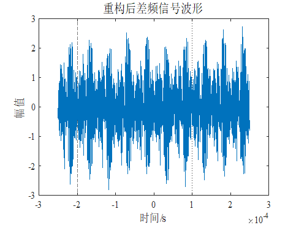{width="3.8118055555555554in"
height="2.515972222222222in"}

1.  []{#_Toc162279112 .anchor}去噪后10个周期差频信号波形图

此时的差频信号同样是10个周期，单个周期为50\${\\rm{\\mu
s}}\$，去噪后的差频信号每个周期都会有一定的细微差别。对于此信号进行加窗操作，算法中对信号加汉宁窗，窗函数长度与差频信号长度相等，加窗后的差频信号时域波形如下：

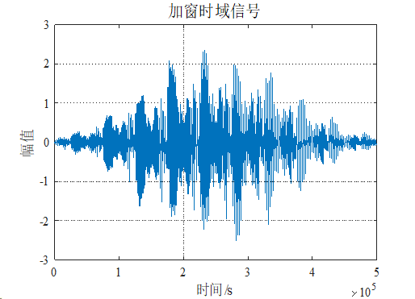{width="4.1375in" height="2.73125in"}

2.  []{#_Toc162279113 .anchor}加汉宁窗后的时域波形图

加窗后的信号按照频谱校正步骤，下一步直接对信号进行DFT变换,得到去噪后差频信号的初始频域谱线结果如下图所示：

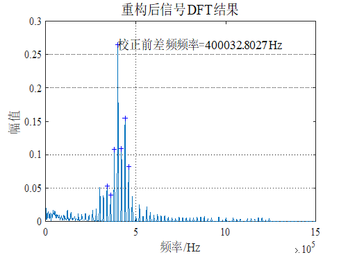{width="4.045833333333333in"
height="2.6708333333333334in"}

3.  []{#_Toc162279114 .anchor}去噪后加窗的差频信号频域谱线图

上图的频谱图中，已经经历了谱峰检索的步骤，标明了选取的校正谱线个数，此时各标记点处的幅值和频率信息已经保存下来。从上图也可以看出由于EMD去噪时对于低频信号并未进行选取重组，所以低频的频谱比较杂乱，但相对于校正点附近的频率及幅值信息并未造成影响。图中对于谱峰最大值点处的频率值进行了标定，此时频率值是未进行校正的，得到的是谱峰最大值处对应的频率点，由上图可以看出此时的差频信号频率为400032.8027Hz。上图中由选取的校正谱线能够确定频率起始点和频率结束点，在此频率区间内对于加窗的差频信号进行CZT变化。CZT计算后的频谱信息如下：

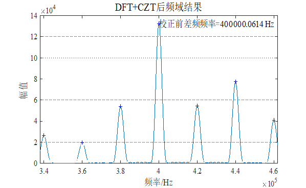{width="4.596527777777778in"
height="2.432638888888889in"}

4.  []{#_Toc162279115 .anchor}小区间CZT变换后的频域谱线图

CZT变换后对于选定的校正频率谱峰之间进行了细化，使得谱峰之间更接近于连续谱，此时得到的谱峰最大值点处的频率为400000.0614Hz，可以看出与直接DFT变换后得到的差频信号峰值频率点有所差异。对于差频信号两种变换下的结果进行归一化处理，对谱峰最大值处的频谱图进行比较：

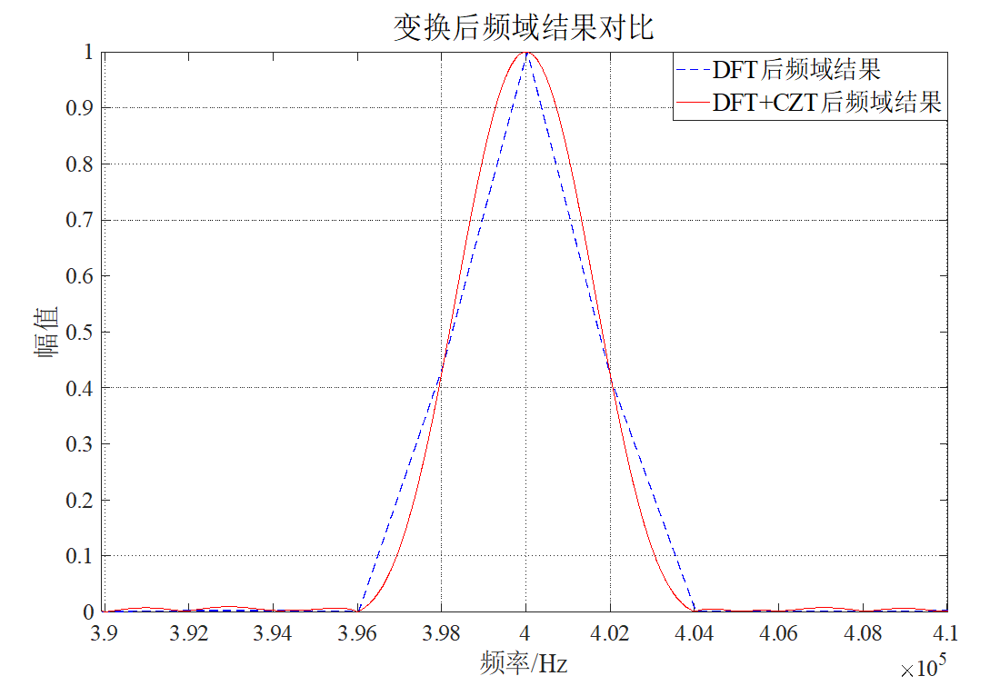{width="4.259722222222222in"
height="2.777083333333333in"}

5.  []{#_Toc167441051 .anchor}CZT变换前后单谱线对比图

有了准确的校正点频率信息后，便可依据不同的校正公式进行单频率的校正算法，本次论文主要的校正方法是能量重心法以及三角形法，经三角形法计算得到的频率信息如下：

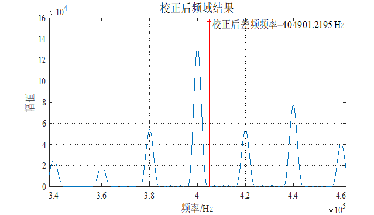{width="4.71875in"
height="2.338888888888889in"}

6.  []{#_Toc167441052 .anchor}三角形法校正后频谱结果图

三角形法得到此组实测差频信号的校正后频率值为404901.2195Hz，此时相对于校正前的频率有了一定的频率偏移量，依据偏移量完成对于幅值的校正，有了校正后的频率和幅值信息，将差频信号的频谱转换成分贝的表示方式。最终经过三角形法得到的校正结果如下：

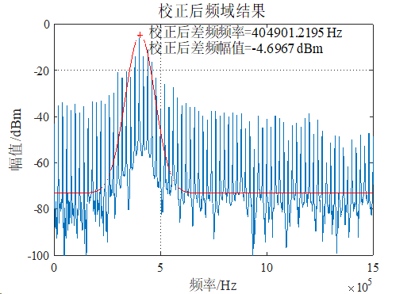{width="3.776388888888889in"
height="2.4923611111111112in"}

7.  []{#_Toc162279118 .anchor}三角形法校正后dBm形式的频谱结果图

上图中将校正后的差频信号频域利用高斯函数近似表示，三角形法得到校正后幅值信息为-4.6967dBm。对于上面初始的差频信号进行能量重心法的校正，能量重心法与三角形法之前步骤都是相同的，信号经过CZT变换后得到用于校正的谱线具体频率和幅值信息后，通过能量重心法的频率校正公式，得到的校正后的结果如下：

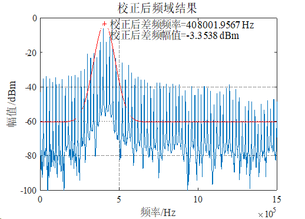{width="3.8409722222222222in"
height="2.533333333333333in"}

8.  []{#_Toc162279119 .anchor}能量重心法校正后dBm形式的频域结果图

能量重心法得到的校正后频率为408001.9567Hz，校正后幅值为-3.3538dBm。两者都能对于单频率校正得到比较好的校正结果，但两种算法得到的校正后频率同样是有所差别的，因为单频率校正是对于一个未知的频率量进行校正分析，所以不能单纯的认为两种校正方法得到的校正频率有一种是错误的。

本文设计的诊断系统旨在测量等离子体相对于空气产生的时延差值，即诊断系统测量的是在有、无等离子的两种情况下对应的单频率的差值，两个算法在不同的应用场景下都是有较高的可信度，在较低信噪比的实验条件下，通过三角形法的得到的时延结果相较能量重心法的误差更小。

## 本章小结

本章主要完成了对诊断系统输出的差频信号的波形数据进行处理分析，由差频信号的时域波形，得到信号准确的单频率信息，主要的处理步骤包括基于EMD分解的去噪处理及单频率的频谱校正分析。通过带通滤波的形式依据相关函数能量值的大小选取在EMD分解后主要的内涵模态分量，从而进行信号重构，完成对于初始差频信号的去噪处理。在傅里叶变换之后引入CZT，对差频信号的期望频率区间进行谱线细化，得到期望区间内各谱线更加准确的频率及幅值信息，后根据检索到的谱线频率信息，通过单频率校正算法完成对于差频信号频率及幅值信息的校正处理。

# 系统标定及诊断实验

## 引言

上一章完成了对诊断系统差频信号的分析处理，本章主要对于诊断系统进行分辨率标定实验、环氧树脂介电常数诊断实验及等离子体电子密度诊断实验。通过标定实验给出系统的极限时延分辨率，对已知介电常数的介质进行诊断实验，在CST中仿真得到不同电子密度等离子体产生的衰减及时延变化，在等离子体电磁实验装置上搭建测试平台，对不同状态下的等离子体进行电子密度的诊断，给出系统能够诊断的电子密度区间及测量误差，并给出系统在扩频后能够分辨的最小时延变化，及能够诊断的最小电子密度。

## 系统极限分辨率标定实验

诊断系统采用单发单收的测试形式，发射和接收天线均采用26\~40GHz的聚焦透镜天线，两天线间隔初始距离，在此距离上将天线沿轴线拉远一定的小距离，每次移动以前一次距离为基准进行数据校正，完成测试实验。具体的测试实验状态如下所示：

{width="5.841666666666667in"
height="1.6472222222222221in"}

1.  []{#_Toc162279120 .anchor}极限分辨率测试环境示意图

此时的诊断系统产生的34.2\~35GHz的扫频信号直接给到发射天线，此时链路损耗较小，所以并未连接外部功放，但是在接收天线后需连接低噪放，扫频信号经过低噪放后接到诊断机箱上的接收信号输入端口。将差频信号输出端口接到功分器上，其后两个输出分别接到频谱仪及高速示波器上，频谱仪实时观测信号的谱峰变换是否正确，高速示波器完成对差频信号波形数据的保存。

极限分辨率测试主要是测试系统能否达到设计之初的诊断要求，测试内容是将两个天线的距离一步一步增加，保存每一步距离变化后的差频信号，最后经过校正算法得到每一步的频率变化量，依据频率变化量计算得到测试的时延。虽然是在空气中直接进行实验，并未保证真空环境，但此时仍然认为电磁波波速等于光速，每次天线会挪动不同的距离，此次测试挪动的距离分别是10mm、8mm、6mm及5mm。以移动10mm距离的一组数据实测图为例，校正后的结果展示如下：

+-------------------------------------------------------------+-------------------------------------------------------------+
| {width="3.1909722222222223in" | {width="3.2152777777777777in" |
| height="2.107638888888889in"}                               | height="2.123611111111111in"}                               |
+:===========================================================:+:===========================================================:+
| (a)初始状态                                                 | (b)移动10mm状态                                             |
+-------------------------------------------------------------+-------------------------------------------------------------+
| 2.  []{#_Toc162279121 .anchor}移动10mm时差频信号频谱变化示意图                                                            |
+---------------------------------------------------------------------------------------------------------------------------+

10mm移动距离带来的理论时延差值为33.33ps，从上图可以看出小时延带来的频率偏移量较小，计算得到上图所示数据的频率差值为497.2465Hz，其对应的时延差值为31.078ps，对应的测量误差为6.76%。

进行多组重复实验，天线移动距离为10mm时得到的实验数据总结如下：

1.  []{#_Toc167441091 .anchor}10mm极限分辨率测试结果

  ------------------------------------------------------
    10mm理论时延(s)     诊断时延(s)          误差
  ------------------- ---------------- -----------------
    \$3.33 \\times    \$3.5019 \\times       5.06%
    {10\^{ - 11}}\$   {10\^{ - 11}}\$  

                      \$2.9538 \\times      11.39%
                      {10\^{ - 11}}\$  

                      \$3.5269 \\times       5.81%
                      {10\^{ - 11}}\$  

                      \$3.0627 \\times       8.12%
                      {10\^{ - 11}}\$  

                      \$3.0205 \\times       9.38%
                      {10\^{ - 11}}\$  
  ------------------------------------------------------

天线移动距离为8mm时得到的实验数据总结如下：

2.  []{#_Toc167441092 .anchor}8mm极限分辨率测试结果

  -------------------------------------------------------
    8mm理论时延(s)       诊断时延(s)          误差
  ------------------- ----------------- -----------------
    \$2.67 \\times    \$2.4587 \\times        7.8%
    {10\^{ - 11}}\$    {10\^{ - 11}}\$  

                      \$2.8270 \\times        6.01%
                       {10\^{ - 11}}\$  
  -------------------------------------------------------

表5.2 8mm极限分辨率测试结果（续）

  -------------------------------------------------------
    8mm理论时延(s)       诊断时延(s)          误差
  ------------------- ----------------- -----------------
    \$2.67 \\times    \$2.4961 \\times        6.4%
    {10\^{ - 11}}\$    {10\^{ - 11}}\$  

                      \$2.3251 \\times       12.81%
                       {10\^{ - 11}}\$  

                      \$2.5647 \\times        3.82%
                       {10\^{ - 11}}\$  
  -------------------------------------------------------

天线移动距离为6mm时得到的实验数据总结如下：

3.  []{#_Toc167441093 .anchor}6mm极限分辨率测试结果

  ------------------------------------------------------
     6mm理论时延(s)      诊断时延(s)         误差
  -------------------- --------------- -----------------
  \$2 \\times {10\^{ -    \$1.9019           4.91%
         11}}\$            \\times     
                       {10\^{ - 11}}\$ 

                          \$1.9030           4.85%
                           \\times     
                       {10\^{ - 11}}\$ 

                          \$2.1652           8.26%
                           \\times     
                       {10\^{ - 11}}\$ 

                          \$2.0411           2.06%
                           \\times     
                       {10\^{ - 11}}\$ 

                          \$1.9330           3.35%
                           \\times     
                       {10\^{ - 11}}\$ 
  ------------------------------------------------------

天线移动距离为5mm时得到的实验数据总结如下：

4.  []{#_Toc167441094 .anchor}5mm极限分辨率测试结果

  -------------------------------------------------------
     5mm理论时延(s)      诊断时延(s)          误差
  -------------------- ---------------- -----------------
     \$1.67 \\times    \$1.8678 \\times      12.07%
    {10\^{ - 11}}\$    {10\^{ - 11}}\$  

                       \$1.4476 \\times      13.15%
                       {10\^{ - 11}}\$  

                       \$1.8892 \\times      13.35%
                       {10\^{ - 11}}\$  

                       \$1.5166 \\times       9.01%
                       {10\^{ - 11}}\$  

                       \$1.4724 \\times      11.65%
                       {10\^{ - 11}}\$  
  -------------------------------------------------------

经过上面的重复实验可以看出系统在对于移动距离为6mm时，有比较小的测量误差，诊断5mm的移动距离时，虽然系统仍然能够进行时延的诊断，但是总体的测量误差在10%之上。兼顾到系统的误差要求，认为800MHz扫频带宽下，系统能够分辨的极限距离为6mm，此时对应的时延为20ps。此时达到诊断系统的设计要求，经过对于差频信号的数据处理，系统能够完成对于20ps时延变化的分辨。

在扫频带宽为800MHz时，诊断信号中心频率为32GHz时，假定等离子体柱的直径d=150mm，20ps时延对应的电子密度为\\\[0.9939
\\times {10\^{18}}{{\\rm{m}}\^{{\\rm{ -
3}}}}\\\]，故理论上诊断系统能够完成对电子密度为\\\[1 \\times
{10\^{18}}{{\\rm{m}}\^{{\\rm{ -
3}}}}\\\]的等离子体诊断实验。且等离子体直径为200mm时，20ps分辨率对应的电子密度为\\\[0.7454
\\times {10\^{18}}{{\\rm{m}}\^{{\\rm{ - 3}}}}\\\]。

## 环氧树脂介电常数诊断实验

上一节完成了对于诊断系统的极限分辨率标定实验，本小节利用诊断系统完成对于环氧树脂的介电常数诊断实验，环氧树脂的介电常数是一个已知值，不同于等离子体，等离子体相对来说是一个色散介质，其时间延迟会随着诊断频率的改变而发生较大的变化，且实验装置产生的等离子体射流属于未知的电子密度状态。利用一个已知介电常数的介质，进行时延诊断，更能够说明系统的可用性及准确性，本文对环氧树脂介电常数诊断实验测试环境如下：

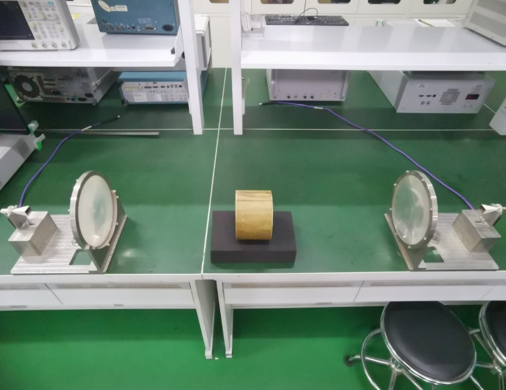{width="4.850694444444445in"
height="1.5631944444444446in"}

1.  []{#_Toc167441057 .anchor}环氧树脂介电常数诊断实验示意图

天线仍然使用26\~40GHz的透镜天线，将圆柱型介质块至于收发天线的正中间，由于透镜对于电磁波的聚焦作用，应当使介质块尽可能地置于透镜的焦距点处，此时能够尽可能的减少绕射带来的测量误差。本次关于环氧树脂的介电常数诊断实验所用到的介质总共是两种，分别是厚度为：52mm及100mm两种，两种厚度的介质块是用来分别模拟大衰减下且大时延和小衰减且小时延的实验状态。环氧树脂介质相对于空气产生的时延可通过下式进行计算：

\$\\tau = \\frac{d}{{{V\_\\varepsilon }}} - \\frac{d}{C} =
\\frac{d}{C}(\\sqrt {{\\varepsilon \_r}} - 1)\$ (5-1)

上式的\${V\_\\varepsilon }\$代表电磁波在介质的传播速度，\${\\varepsilon
\_r}\$代表的是环氧树脂的介质相对介电常数，在常温下环氧树脂的相对介电常数理论值为4.3。故通过上式得到理论计算上52mm环氧树脂产生的时延为0.1861ns，100mm环氧树脂产生的理论时延为0.3579ns。

在CST中分别仿真两种厚度的环氧树脂产生的时间延迟，仿真模型如下所示：

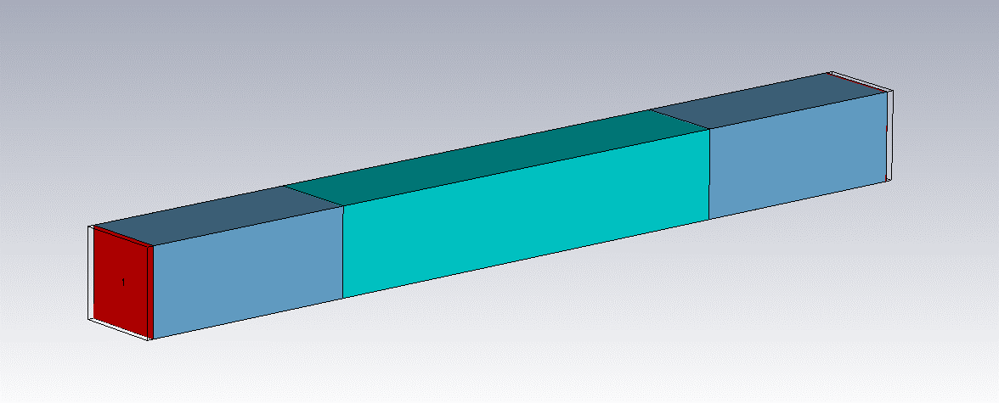{width="4.1546161417322836in"
height="1.2580325896762905in"}

2.  []{#_Toc167441058 .anchor}环氧树脂时延仿真模型

在CST中设置两个波导端口，端口间距为300mm，在波导端口中间设置一个空气矩形块，其中分别加入100mm及52mm两种厚度的环氧树脂介质，此种仿真模型更能够与理论计算相对应。仿真频率段设置为34.2\~35GHz，有两种厚度介质情况下的仿真时延及仅有空气段的仿真时延变化曲线如下所示：

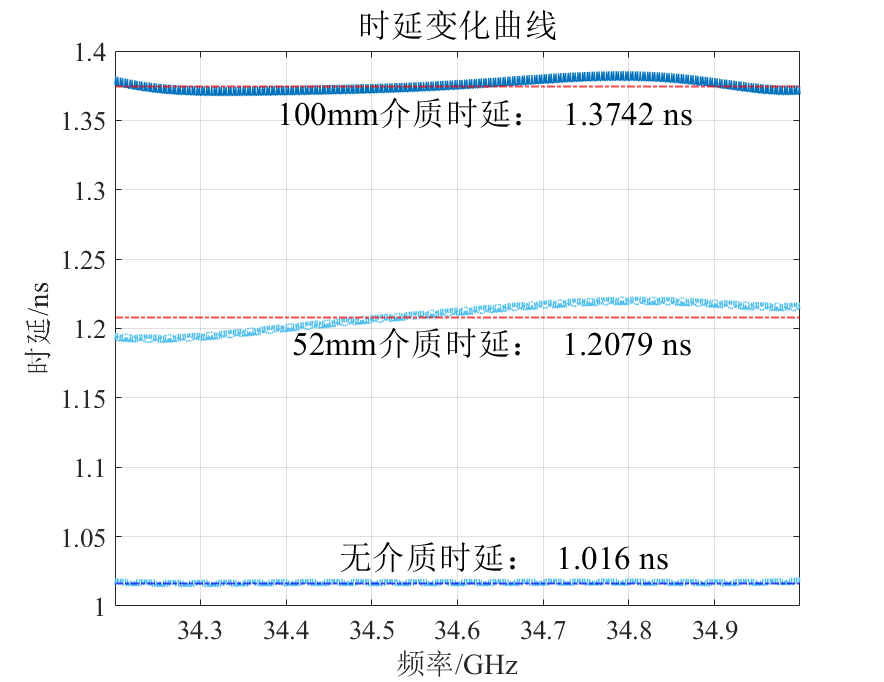{width="4.106323272090989in"
height="3.1679483814523186in"}

3.  []{#_Toc167441059 .anchor}不同厚度环氧树脂介质仿真时延曲线图

由上图可以看出52mm介质相对于空气产生的时延仿真结果为0.1919ns，而100mm产生的时延仿真结果是0.3582ns，两者都与理论计算值有一定的差别，但可以忽略不计。图5.6展示了诊断系统在无介质块时的系统初始频谱实测图及有100mm厚度的环氧树脂介质的情况下差频信号实测频谱图。对比图5.6，可以明确看出天线测试支路中间，有环氧树脂介质块之后整个频谱能量有了明显的右移，且直接观测到的谱峰最大值也有了较大的衰减，100mm的环氧树脂产生的衰减达到了20dB以上。

+-------------------------------------------------+-------------------------------------------------------------+
| 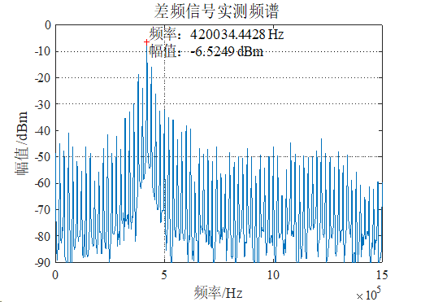{width="3.1125in" | 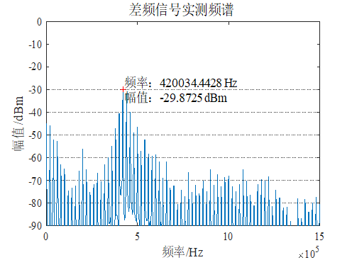{width="3.1444444444444444in" |
| height="2.0527777777777776in"}                  | height="2.0743055555555556in"}                              |
+:===============================================:+:===========================================================:+
| (a)无介质状态                                   | (b)有100mm介质状态                                          |
+-------------------------------------------------+-------------------------------------------------------------+
| 4.  []{#_Toc162279125 .anchor}无介质及有100mm介质时差频信号实测频谱图                                         |
+---------------------------------------------------------------------------------------------------------------+

以图5.6的实测数据为例，对采集到的差频信号进行频谱校正分析，得到无介质时以及有100mm环氧树脂的频谱校正后结果如下：

+------------------------------------------------------------+-------------------------------------------------------------+
| 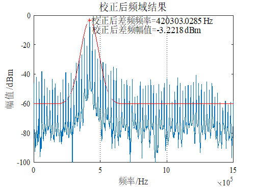{width="3.188888888888889in" | 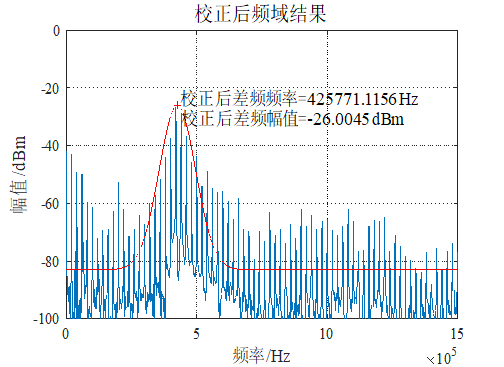{width="3.1819444444444445in" |
| height="2.1041666666666665in"}                             | height="2.0993055555555555in"}                              |
+:==========================================================:+:===========================================================:+
| (a)无介质状态                                              | (b)有100mm介质状态                                          |
+------------------------------------------------------------+-------------------------------------------------------------+
| 5.  []{#_Toc167441061 .anchor}无介质及有100mm介质时差频信号校正后频谱图                                                  |
+--------------------------------------------------------------------------------------------------------------------------+

由上图校正后的单频率与无介质情况下的单频率值求其频率差值，便可以计算出100mm介质带来的频率偏移量为5468.09Hz，其对应的时延为0.3418ns，此时的时延诊断误差为4.58%。有52mm厚度环氧树脂的情况下，差频信号频谱校正后的结果见图5.8。通过计算可以得到52mm的环氧树脂介质带来的频率偏移量为3075.57Hz，其对应的时延为0.1922ns，此时的时延诊断误差为0.16%。

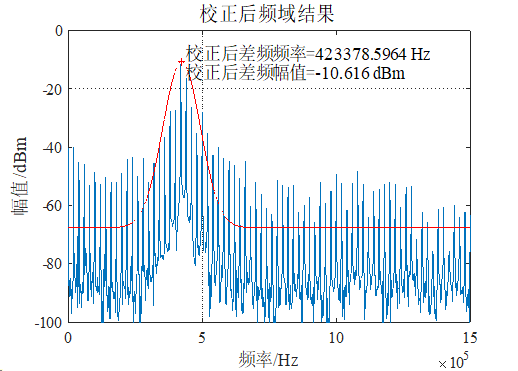{width="3.886111111111111in"
height="2.563888888888889in"}

6.  []{#_Toc162279128 .anchor}52mm介质时差频信号校正后频域图

对于两种厚度的环氧树脂进行多次重复的时延诊断实验，诊断52mm环氧树脂的结果总结成下表：

1.  []{#_Toc167441095 .anchor}52mm环氧树脂诊断结果及误差

  --------------------------------------------------------
     诊断时延(s)         介电常数            诊断误差
  ----------------- ------------------- ------------------
  \$1.7706 \\times         4.09               4.88%
   {10\^{ - 10}}\$                      

  \$1.8560 \\times         4.29               0.23%
   {10\^{ - 10}}\$                      

  \$1.8538 \\times         4.28               0.47%
   {10\^{ - 10}}\$                      

  \$2.1117 \\times         4.92               14.42%
   {10\^{ - 10}}\$                      

  \$1.9848 \\times         4.60               6.98%
   {10\^{ - 10}}\$                      

  \$1.9354 \\times         4.48               4.16%
   {10\^{ - 10}}\$                      

  \$1.8829 \\times         4.35               1.16%
   {10\^{ - 10}}\$                      

  \$1.8391 \\times         4.25               1.16%
   {10\^{ - 10}}\$                      

  \$1.8974 \\times         4.36               2.09%
   {10\^{ - 10}}\$                      

  \$1.7321 \\times         4.00               6.98%
   {10\^{ - 10}}\$                      
  --------------------------------------------------------

100mm厚度环氧树脂的诊断结果及误差总结如下：

2.  []{#_Toc167441096 .anchor}100mm环氧树脂诊断结果及误差

  --------------------------------------------------------
    诊断时延(s)          介电常数            诊断误差
  ---------------- -------------------- ------------------
  \$3.3068 \\times         3.96               7.91%
  {10\^{ - 10}}\$                       

  \$3.4368 \\times         4.13               3.95%
  {10\^{ - 10}}\$                       

  \$3.3243 \\times         3.99               7.21%
  {10\^{ - 10}}\$                       
  --------------------------------------------------------

表5.6 100mm环氧树脂诊断结果及误差（续）

  --------------------------------------------------------
    诊断时延(s)          介电常数            诊断误差
  ---------------- -------------------- ------------------
  \$3.7855 \\times         4.56               6.05%
  {10\^{ - 10}}\$                       

  \$3.5164 \\times         4.22               1.83%
  {10\^{ - 10}}\$                       

  \$3.9626 \\times         4.79               11.4%
  {10\^{ - 10}}\$                       

  \$3.7946 \\times         4.57               6.28%
  {10\^{ - 10}}\$                       

  \$3.3495 \\times         4.02               6.51%
  {10\^{ - 10}}\$                       

  \$3.7696 \\times         4.54               5.58%
  {10\^{ - 10}}\$                       

  \$3.7890 \\times         4.57               6.28%
  {10\^{ - 10}}\$                       
  --------------------------------------------------------

通过以上的多组重复实验，可以看出诊断系统对于已知介电常数的一般介质进行时延诊断，能够有比较好的诊断结果，上表中的介电常数诊断误差也均在15%以内，证明了论文设计的诊断系统是可行的且误差也是在允许范围之内。

## 等离子体电子密度诊断实验

### 等离子体的衰减及时延仿真

前文分析时是将等离子体看作是一种具有色散特性的电介质，在CST中可以选用杜鲁德(Drude)散射模型来对等离子体进行等效模拟，利用自由电子运动模型来进行描述等离子体[^\[14\]^](#_Ref156823794)，其表达式如下：

\\\[{\\varepsilon \_r} = {\\varepsilon \_0} - \\frac{{{\\omega
\_p}\^2}}{{\\omega (j{v_e} + \\omega )}}\\\] (5-2)

上式中\${\\varepsilon \_r}\$为等离子体相对复介电常数，\${\\varepsilon
\_0}\$为真空介电常数，\${\\omega \_p}\$为等离子体特征角频率，\$\\omega
\$为电磁波角频率，\${v_e}\$为等离子体碰撞频率。具体的模型设置界面如下：

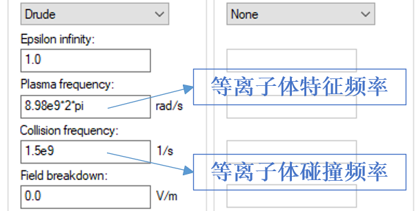{width="3.263888888888889in"
height="1.6611111111111112in"}

1.  []{#_Toc162279129 .anchor}等离子体模型设置界面

而在上图中的设置界面仅需要设置等离子体的特征频率和碰撞频率即可，需要注意的是设置界面对于等离子体的特征频率单位为rad/s。

前文提到了诊断系统实际应用的收发天线均是聚焦透镜天线，用来减少电磁波绕射带来的影响。电磁实验装置产生的是近似圆柱形的等离子体，具体的仿真模型如下：

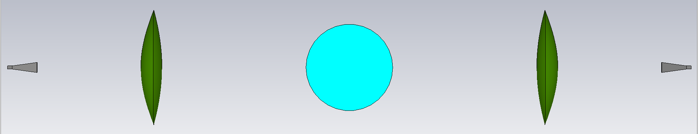{width="5.461805555555555in"
height="1.0520833333333333in"}

2.  []{#_Toc162279130 .anchor}诊断系统电磁仿真模型

模型中为了保证电磁波是垂直入射等离子体的状态，透射的路径应该是沿着圆柱的直径方向。此处与实际的诊断环境还是有细微的区别，实际产生的等离子体柱会有一定的向下倾斜，所以实际的电磁波透射路径并不是完全沿着等离子体柱的直径方向，但造成误差较小，故后续不做讨论。

实际的诊断实验中是利用电磁波在有等离子体的情况减去无等离子体的情况，最后得到等离子体相对于空气的传播衰减及时延，所以仿真时仍然是以无等离子时透镜天线模型结果为基准。在CST中利用杜鲁德模型仿真时，设定等离子体的碰撞频率是不变的，仅仅去调节其特征频率，即仅调节等离子体的电子密度参数，从而分析改变的参数对电磁波衰减和时延的影响。

一、衰减仿真

由于等离子体实验装置产生的等离子体射流直径为150mm以及200mm状态，相同电子密度条件下，150mm等离子体产生的时延变化一定小于200mm状态，由于诊断系统对于小时延的测量存在分辨率限制，故仿真针对150mm状态进行分析。上述仿真模型中等离子体的碰撞频率设定为1.5GHz，其圆柱直径设定为150mm，由于系统的目标电子密度诊断范围为\\\[1
\\times {10\^{18}}{\\rm{\\\~}}1 \\times {10\^{19}}{{\\rm{m}}\^{{\\rm{ -
3}}}}\\\]，所以此次仿真主要是对于电子密度的上、下限及中位值进行仿真，即设定等离子体的电子密度分别为\\\[1
\\times {10\^{18}}{{\\rm{m}}\^{{\\rm{ - 3}}}}\\\]、\\\[5 \\times
{10\^{18}}{{\\rm{m}}\^{{\\rm{ - 3}}}}\\\]、\\\[1 \\times
{10\^{19}}{{\\rm{m}}\^{{\\rm{ -
3}}}}\\\]，其对应的等离子体特征频率8.98GHz、20.1GHz和28.4GHz，CST中设定的是时域求解器，仿真频段为26\~36GHz。仿真的到的S21衰减曲线见图5.11。图中可以看出随着电子密度的升高，等离子体对于电磁波的衰减逐渐增大，随着频率的升高，等离子体带来的传播衰减会逐步减小。其中最能表述黑障现象的便是电子密度为\\\[1
\\times {10\^{19}}{{\\rm{m}}\^{{\\rm{ -
3}}}}\\\]时的仿真结果，此时对应的特征频率28.4GHz，在图5.11中进行了标注。可以看出当频率小于此值时电磁波衰减很大，基本是无法透射过等离子体的，微波频率大于但接近特征频率时，衰减仍然很大，所以在诊断时，需要满足诊断频率大于特征频率的条件，但实际诊断时的诊断频率由于系统硬件原因，仍不会超过40GHz，由图5.11中也可以看出当扫频信号的频率为35GHz时，衰减曲线是比较平缓的，说明可以用此频率诊断电子密度为\\\[1
\\times {10\^{19}}{{\\rm{m}}\^{{\\rm{ - 3}}}}\\\]的等离子体。

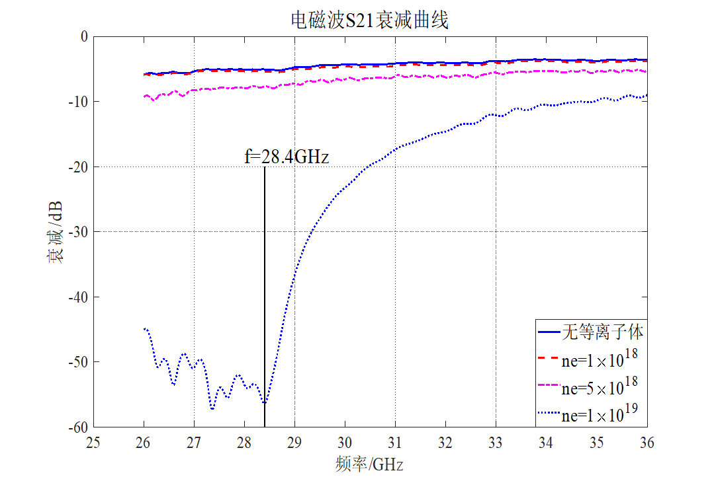{width="5.9631944444444445in"
height="3.5in"}

3.  []{#_Toc167441065 .anchor}不同电子密度等离子体的S21衰减曲线图

为了更直观的说明电磁波的特性，在CST中设置了电场监视器，此处以电子密度为\\\[1
\\times {10\^{19}}{{\\rm{m}}\^{{\\rm{ -
3}}}}\\\]时的结果为例进行说明。由于既定的诊断信号为34.2\~35GHz的扫频信号，电场监视器设置了两个频率点：27GHz和34.6GHz，对应电场结果如下：

+----------------------------------------------------------------------+
| 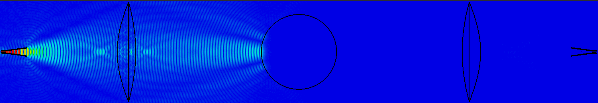{width="5.931800087489064in"           |
| height="1.0276738845144358in"}                                       |
+:====================================================================:+
| (a)f=27GHz                                                           |
+----------------------------------------------------------------------+
| 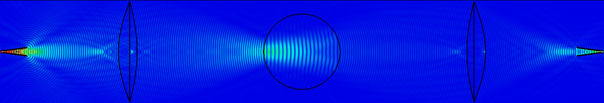{width="5.914127296587926in"           |
| height="1.018915135608049in"}                                        |
+----------------------------------------------------------------------+
| (b)f=34.6GHz                                                         |
+----------------------------------------------------------------------+
| 4.  []{#_Toc162279132 .anchor}CST中电场仿真结果示意图                |
+----------------------------------------------------------------------+

上图可以看出聚焦透镜对电磁波的汇聚作用，使其透射路径尽可能的是等离子体柱的直径。可以看出微波频率小于等离子体特征频率时，等离子体对电磁波会产生屏蔽作用，电磁波无法透射；频率大于特征频率时，可以透射过等离子体，且电磁波在等离子体中的波长大于在空气中的波长，这也是相位超前的体现。

由于系统所用的信号扫频带宽为800MHz，下图展示在34.2\~35GHz频率范围内的衰减曲线：

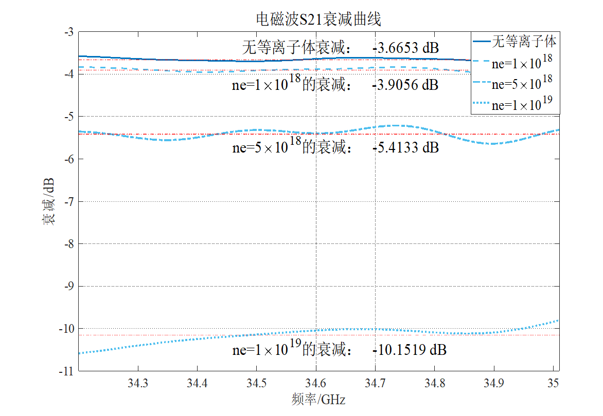{width="5.536111111111111in"
height="3.4805555555555556in"}

5.  []{#_Toc162279133 .anchor}34.2-35GHz范围内等离子体S21衰减曲线图

将衰减曲线中扫频范围内的衰减进行平均，此时将平均衰减定义成等离子体的对电磁波衰减，从上图中可以看出仿真得到电子密度为\\\[1
\\times {10\^{18}}{{\\rm{m}}\^{{\\rm{ -
3}}}}\\\]时衰减比较小，相对于无等离子体的状态下的衰减仅为0.24dB。

二、时延仿真

第二章中提到了差频信号的相位求导后可推出时延信息，在CST中的时延同样是依据S21的相位变化，得到等离子体的传播时延，CST中的后处理模块中也提供了对于时延的计算模板，最终仿真得到不同电子密度下的时延变化曲线如下：

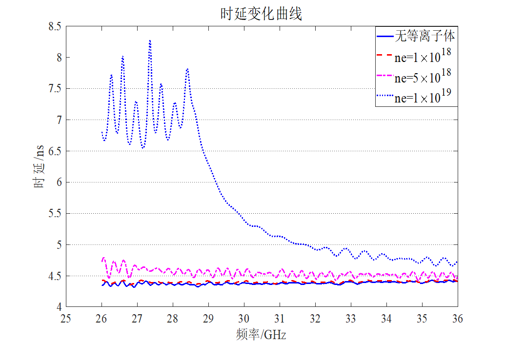{width="5.249305555555556in"
height="3.1145833333333335in"}

6.  []{#_Toc167441068 .anchor}等离子体时延变化曲线图

仿真得到的时延曲线处于纳秒级别，且小电子密度的传播时延相对空气的时延变化是处于皮秒级别，这也说明了等离子体产生的传播时延较小。线性调频连续波诊断系统具有极限时间分辨率的限制，对极小时延变化的测量存在一定的分辨难度。

对于完整的时延仿真曲线，本文更关心扫频带宽内的时延变化，故取处于34.2\~35GHz频率范围内的时延变化曲线如下：

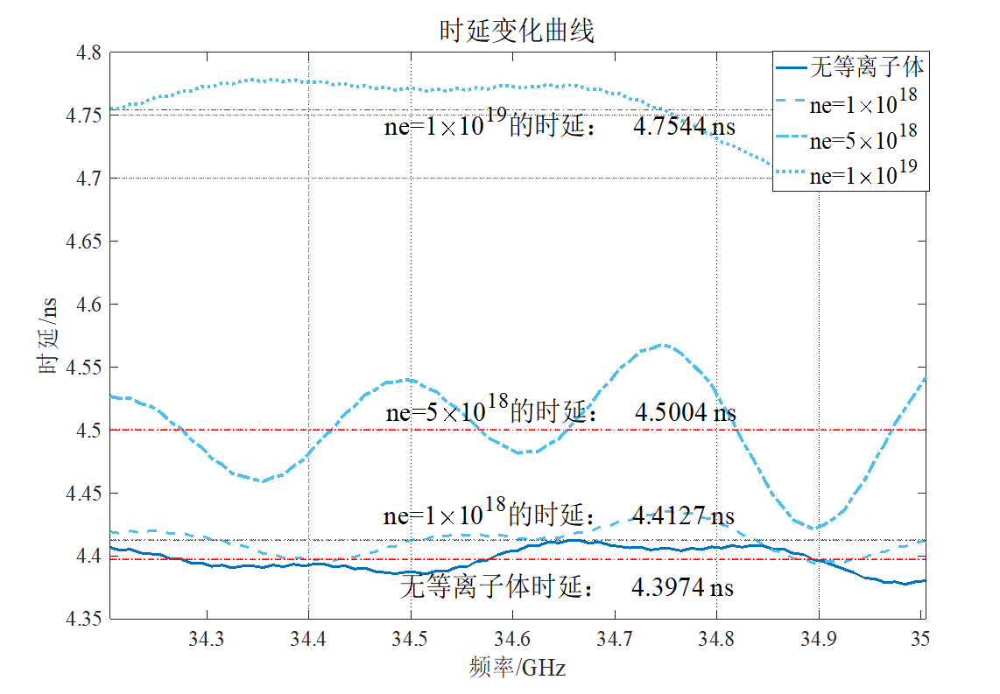{width="5.433333333333334in"
height="3.563888888888889in"}

7.  []{#_Toc167441069 .anchor}34.2-35GHz频率内等离子体时延变化曲线图

将扫频带宽范围内的时延值进行平均，将其确定为此扫频范围内等离子体的传播时延，对于时延的仿真，由于极限分辨率存在，主要关注的是低电子密度处的时延变化，由上图可以看出当电子密度为\\\[1
\\times {10\^{18}}{{\\rm{m}}\^{{\\rm{ -
3}}}}\\\]时，其与无等离子体时传播时延差值为15.3ps，而系统的极限分辨率为20ps，故为了能够诊断此电子密度的等离子体，可适当降低诊断信号的频率。诊断信号设定为32GHz时，等离子体直径为150mm，理论上此电子密度等离子体产生时延为20.133ps，仿真曲线中当扫频信号的中心频率为32GHz时，其对应的时延曲线如下：

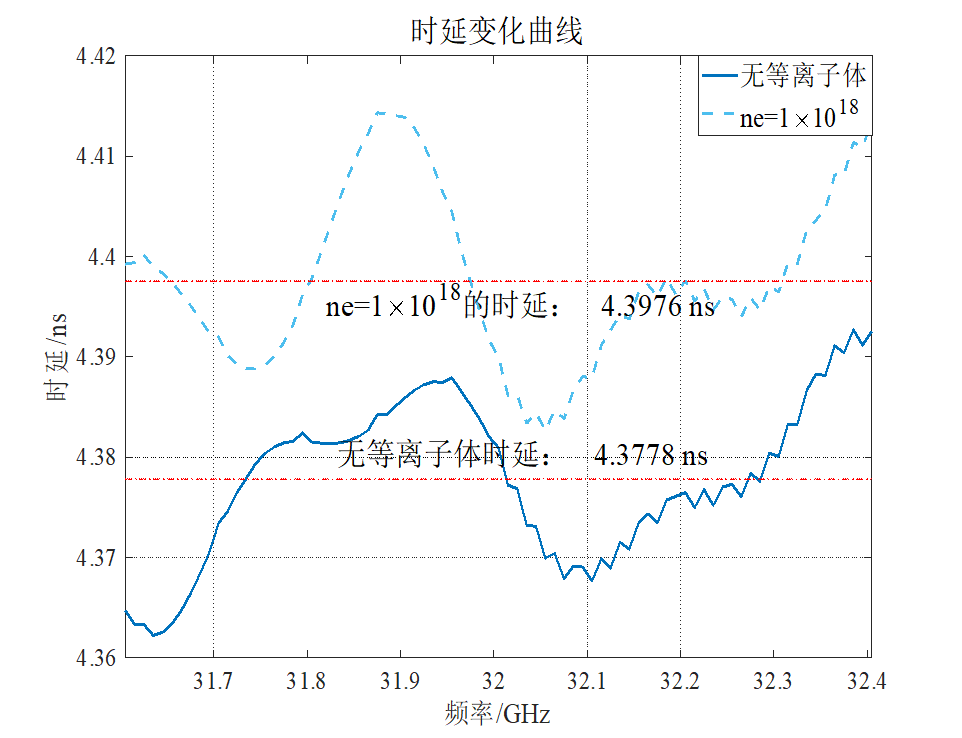{width="4.798611111111111in"
height="3.329861111111111in"}

8.  []{#_Toc162279136 .anchor}31.6-32.4GHz频率内等离子体时延变化曲线图

此时得到的等离子体传播时延为19.72\${\\rm{ps}}\$，可以看出与理论计算存在一定的误差，但误差较小。所以诊断系统发射信号的频率可以依据不同的等离子体环境进行一定量的调节，对于小电子密度可以降低信号频率，反之，当诊断大电子密度的等离子体时应该适当的增加信号频率。但由于系统链路硬件的限制，系统发射的扫频信号频率的上限值应该控制在40GHz以内，且提高频率时系统初始信号功率也会有所下降。

### 等离子体诊断系统搭建

本论文的诊断系统主要应用的等离子体环境是临近空间高速目标等离子体电磁科学实验装置，将聚焦透镜天线搭建在其中的微波暗室中，搭建的诊断系统框架可表示如下图：

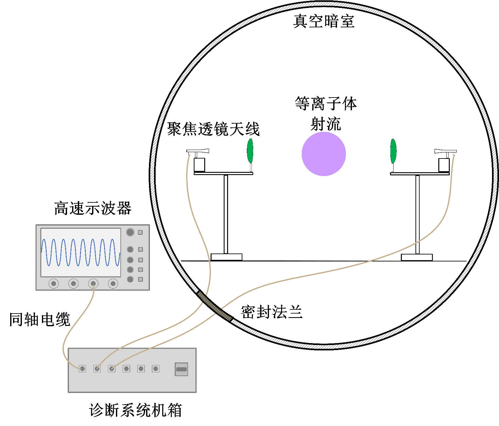{width="4.751388888888889in"
height="4.0569444444444445in"}

1.  []{#_Toc162279137 .anchor}等离子体诊断系统测试示意图

等离子体射流由等离子体喷口处产生，等离子体喷管直径可以进行调节，本论文的实际诊断实验主要是针对喷管直径为220mm时的情况，
220mm喷口产生的等离子体射流柱直径实际只能达到200mm。诊断系统所用的耐高温聚焦透镜天线的焦距为350mm，但实际的应用环境中，由于产生的等离子体射流温度较高，为了保护天线，需要适当增加透镜之间的距离，故收发天线的透镜间距为1000mm。

天线经过长同轴电缆接到底部的法兰盘，由其转接至外部测量系统上。此时整体信号链路的线损较大，此时需要在发射信号一路加上功率放大器，以弥补较大的测量路径损耗。所以诊断系统应用于实验装置上时，由于天线间距增大且整体链路损耗增大，整体测量支路的带来的初始时延变化增大，故诊断系统产生的初始差频信号频率相较于介电常数诊断实验中会有一个较大幅度的升高。

本文诊断系统差频信号的观测及波形存储由频谱仪和高速示波器进行，信号经过功分器后一分二，接到频谱仪和示波器上，虽然每一路都有一定的衰减，但为了存储信号时能够直观的观测频谱变化，尤其是大电子密度下可能会有信号无法透射的情况，可以通过观测频谱的变化去调节诊断信号的频率，能够使得微弱的差频信号不至于淹没进噪音中。所以差频信号经功分器，在实际诊断实验中具有实际意义的。

天线搭建在微波暗室中的实物图如下：

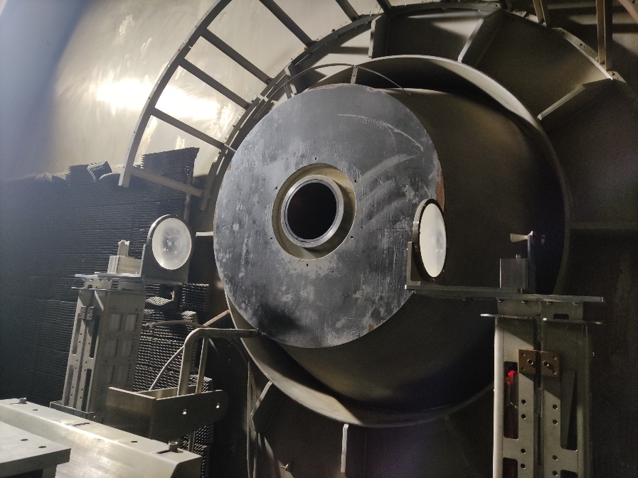{width="4.092361111111111in"
height="3.0694444444444446in"}

2.  []{#_Toc167441072 .anchor}等离子体诊断系统搭建实物图

等离子体射流由喷口产生，根据以往实验结果可知，等离子体发生装置的电压值越高，产生的等离子体电子密度越高；离喷口的距离越近，等离子体的电子密度越高。整个天线系统的轴线据喷口的距离同样是可调节的，一般诊断实验时，天线轴线据喷口的位置是500mm。

### 相同位置下不同电压诊断结果分析及对比

本次系统诊断的电子密度指标要求是\\\[1 \\times {10\^{18}}{\\rm{\\\~}}1
\\times {10\^{19}}{{\\rm{m}}\^{{\\rm{ -
3}}}}\\\]之间，按照实验装置往期的等离子体数据，此电子密度范围对应的电压范围是8\~12kV，此时是在天线轴线据喷口500mm处的等离子体结果。

实际的等离子体诊断实验步骤可以分为以下几步：

(1) 系统初始基准确定。系统搭建完成后，采集一次初始的差频信号，主要是保存示波器差频信号的波形数据，以及频谱仪观测到的初始频谱结果。

(2) 校正谱线个数基准确定。接收天线远离发射天线一个小距离，例如2cm，远离后进行一次差频信号采集，此步骤为了后续对等离子体进行频率校正时校正谱线个数的选取做基准。采集完成后恢复透镜间隔1000mm的距离要求。

(3) 实验装置产生不同电压状态下等离子体，每个等离子体目标状态达到后，进行差频信号的数据采集。

外部的高速摄像机可通过观测窗口对微波暗室中的实验状态进行实时的观测，实际等离子体诊断实验时观测到的实验状态如下图所示：

{width="4.931976159230096in"
height="1.9639227909011374in"}

1.  []{#_Toc167441073 .anchor}等离子体诊断实验实拍示意图

由于系统需要诊断小电子密度的等离子体，即8kV状态，所以调节诊断系统的发射信号为33.2\~34GHz，此时扫频带宽为800MHz。系统搭建完成后初始状态下观测到的频谱结果如下：

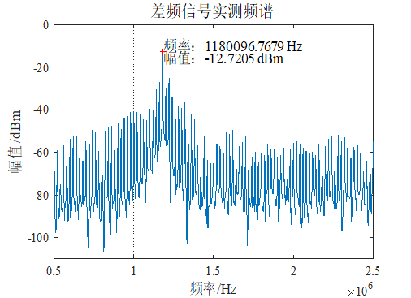{width="3.9944444444444445in"
height="2.6347222222222224in"}

2.  []{#_Toc162279140 .anchor}等离子体诊断时初始差频信号实测频谱图

由上图频谱可以看出此状态下初始的差频信号频率为1.18MHz，频谱最大峰值为-12.72dBm，可以看出长的同轴线缆以及增加功放给测试支路带来的时延增加，从而导致了系统初始差频信号的频率相较环氧树脂诊断实验中有所提高。此时的差频信号是经过功分器的，所以实际由诊断系统输出的初始差频信号功率应该在-10dBm以上。

系统在有等离子体时，8kV和12kV状态下的系统实测频谱结果如下：

+-------------------------------------------------------------+-------------------------------------------------------------+
| 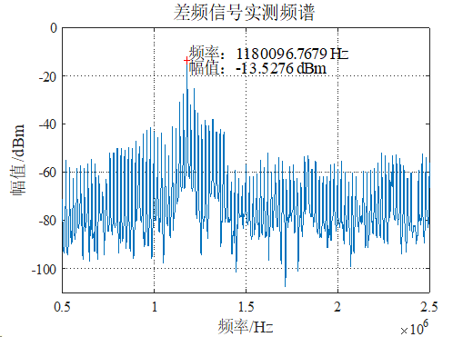{width="3.2159722222222222in" | 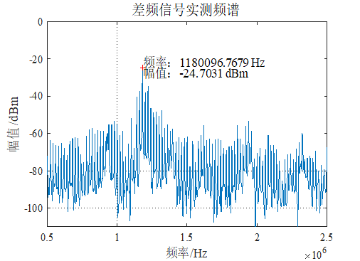{width="3.2020833333333334in" |
| height="2.1215277777777777in"}                              | height="2.1125in"}                                          |
+:===========================================================:+:===========================================================:+
| (a)8kV状态                                                  | (b)12kV状态                                                 |
+-------------------------------------------------------------+-------------------------------------------------------------+
| 3.  []{#_Toc167441075 .anchor}两种电压下有等离子体的差频信号实测频谱图                                                    |
+---------------------------------------------------------------------------------------------------------------------------+

由上图可直接看出，8kV时频谱最大峰处频率仍为1.18MHz，幅度为-13.52dBm，12kV时频谱最大峰处幅度为-24.70dBm，但差频信号的衰减值是不等于等离子体引起的衰减，等离子体带来的信号衰减本系统是不能够进行高精度检测的，这也是微波干涉法只能够测量电子密度的原因，此法并不能精确测量碰撞频率。虽然差频信号的衰减不等于等离子体相对带来的衰减，但其能够表征的不同电子密度的等离子体的衰减规律。差频信号经过高速示波器保存波形数据后，需要利用第四章的数据处理算法，完成对于电子密度的诊断。

由高速示波器直接保存且不做任何处理的10个周期初始差频信号波形以及其直接做傅里叶变换后的结果如下：

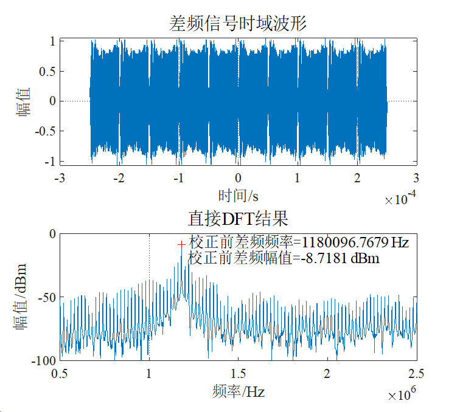{width="3.841666666666667in"
height="3.282638888888889in"}

4.  []{#_Toc162279142 .anchor}系统初始差频信号及其频谱图

上图标注了校正之前的谱峰最大值处的频率和幅值信息，从上图可以看出在MATLAB中做DFT后的结果和频谱仪直接观测的结果是有一定区别的，谱线的峰值功率是不同的，但谱线的频率信息是一致的。诊断系统主要的关注点是频率变化，对于衰减只做参考说明，所以只在意有、无等离子体时的频率差值。依照数据处理流程，整个处理过程包括了去噪、加窗、DFT+CZT等，可如下图所示：

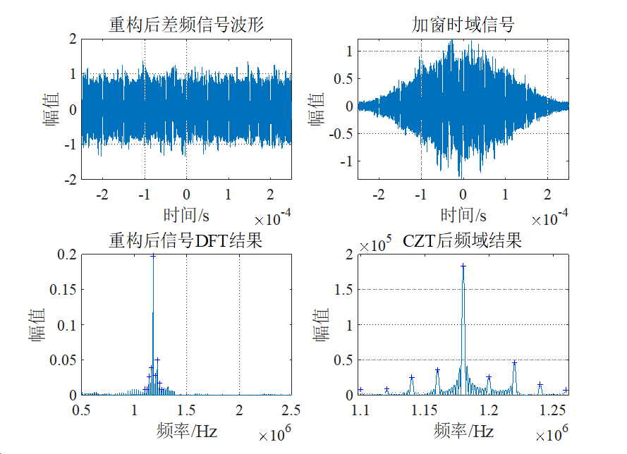{width="5.311805555555556in"
height="3.652083333333333in"}

5.  []{#_Toc162279143 .anchor}差频信号处理步骤示意图

此时校正点数选取为谱峰最大值左、右各4条谱线，选取依据在实验步骤中提及过。最终得到系统初始、8kv和12kv状态下，校正后的差频信号信息如下：

+-------------------------------------------------------------+------------------------------------------------------------+
| 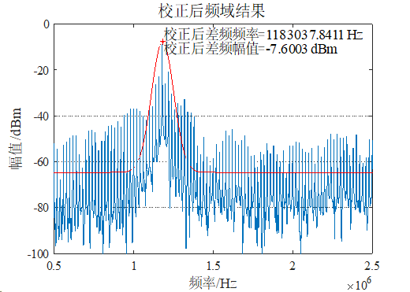{width="3.0701388888888888in" | 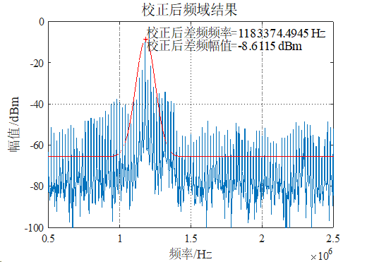{width="3.123611111111111in" |
| height="2.0256944444444445in"}                              | height="2.060416666666667in"}                              |
+:===========================================================:+:==========================================================:+
| (a)初始状态                                                 | (b)8kV状态                                                 |
+-------------------------------------------------------------+------------------------------------------------------------+
| 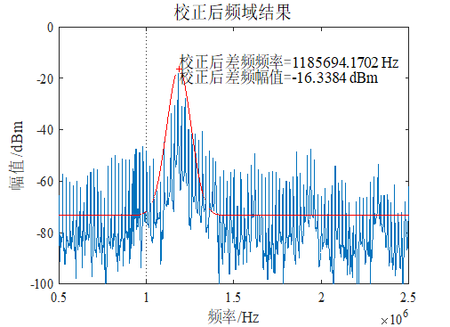{width="3.9298611111111112in" height="2.592361111111111in"}                                |
+--------------------------------------------------------------------------------------------------------------------------+
| (c)12kV状态                                                                                                              |
+--------------------------------------------------------------------------------------------------------------------------+
| 6.  []{#_Toc167441078 .anchor}校正后的差频信号频谱图                                                                     |
+--------------------------------------------------------------------------------------------------------------------------+

由上图可以看出校正后的频域结果，用有等离子体的差频信号频率减去初始状态的频率值，便可得到对应等离子体状态带来的频率偏移，从而得到传播时延，最后得到电子密度参数。此时对应的等离子体射流直径近似为200mm，对应频率点取扫频信号的中间值，为33.6GHz，计算后可得到两种状态下的诊断结果如下表所示：

1.  []{#_Toc167441097 .anchor}8kV和12kV诊断结果

  -------------------------------------------------------------------
   电压状态    衰减      传播时延               电子密度
  ---------- --------- ------------ ---------------------------------
     8kV      1.01dB     21.04ps            \$8.6417 \\times
                                     {10\^{17}}{{\\rm{m}}\^{{\\rm{ -
                                                 3}}}}\$

     12kV     8.74dB     166.02ps           \$6.8187 \\times
                                     {10\^{18}}{{\\rm{m}}\^{{\\rm{ -
                                                 3}}}}\$
  -------------------------------------------------------------------

诊断实验是对多种电压状态下的等离子体进行诊断，将一次实验的所有状态数据总结如下；

2.  []{#_Toc167441098 .anchor}不同电压下电子密度诊断结果

  -------------------------------------------------------------------------------------------------
    电压(kV)    衰减(\${\\rm{dB}}\$)   传播时延(\${\\rm{ps}}\$)   电子密度(\${{\\rm{m}}\^{{\\rm{ -
                                                                              3}}}}\$)
  ------------ ---------------------- -------------------------- ----------------------------------
       8                1.01                    21.04              \$8.6417 \\times {10\^{17}}\$

       9                1.75                    30.81              \$1.2652 \\times {10\^{18}}\$

       10               2.05                    53.95              \$2.2158 \\times {10\^{18}}\$

       11               3.18                    91.54              \$3.7597 \\times {10\^{18}}\$

      11.5              5.69                    130.14             \$5.3452 \\times {10\^{18}}\$

       12               8.74                    166.02             \$6.8187 \\times {10\^{18}}\$
  -------------------------------------------------------------------------------------------------

由于实验装置产生的等离子体具有未知性，所以为了论证诊断结果的准确性，需要与矢量网络分析仪直接检测相位的诊断结果进行对比。相同实验条件下，两套系统仅诊断的频率不同，矢网诊断时信号的频率处于38GHz，将不同电压状态下矢网得到的诊断结果与本文系统诊断结果对比如下：

3.  []{#_Toc167441099 .anchor}与矢网的电子密度诊断结果对比

+----------+---------------------------------------------------------+-------------------------------------------------------------+-------------------+
| 电压(kV) | 时延诊断系统检测                                        | 矢网检测                                                    | \${n_e}\$测量误差 |
|          +----------------------+----------------------------------+----------------------+--------------------------------------+                   |
|          | 衰减(\${\\rm{dB}}\$) | 电子密度(\${{\\rm{m}}\^{{\\rm{ - | 衰减(\${\\rm{dB}}\$) | 电子密度(\${{\\rm{m}}\^{{\\rm{ -     |                   |
|          |                      | 3}}}}\$)                         |                      | 3}}}}\$)                             |                   |
+:========:+:====================:+:================================:+:====================:+:====================================:+:=================:+
| 8        | 1.01                 | \$8.6417 \\times {10\^{17}}\$    | 2.24                 | \${\\rm{8}}{\\rm{.7}} \\times        | 0.67%             |
|          |                      |                                  |                      | {\\rm{1}}{{\\rm{0}}\^{{\\rm{17}}}}\$ |                   |
+----------+----------------------+----------------------------------+----------------------+--------------------------------------+-------------------+
| 9        | 1.75                 | \$1.2652 \\times {10\^{18}}\$    | 2.53                 | \$1.23 \\times {10\^{18}}\$          | 2.86%             |
+----------+----------------------+----------------------------------+----------------------+--------------------------------------+-------------------+
| 10       | 2.05                 | \$2.2158 \\times {10\^{18}}\$    | 2.8                  | \$1.97 \\times {10\^{18}}\$          | 12.47%            |
+----------+----------------------+----------------------------------+----------------------+--------------------------------------+-------------------+
| 11       | 3.18                 | \$3.7597 \\times {10\^{18}}\$    | 4.42                 | \$3.59 \\times {10\^{18}}\$          | 4.73%             |
+----------+----------------------+----------------------------------+----------------------+--------------------------------------+-------------------+
| 12       | 8.74                 | \$6.8187 \\times {10\^{18}}\$    | 10.52                | \$6.94 \\times {10\^{18}}\$          | 1.75%             |
+----------+----------------------+----------------------------------+----------------------+--------------------------------------+-------------------+

上表对比了分别利用矢量网络分析仪直接测量相位方法和线性调频连续波系统测量时延方法诊断得到的电子密度结果，可以看出本系统在电子密度诊断时的可行性和准确性，但同时看到了衰减的差别较大，也说明了本文依据微波扫频干涉法设计的线性调频连续波系统测量信号衰减时存在较大误差，故不能够精确测量等离子体碰撞频率。

### 相同电压下不同位置诊断结果分析及对比

前文提到了透镜轴线距喷口不同位置时，离喷口距离越近，等离子体射流的电子密度越高，故本小节主要分析不同位置下的诊断结果。此时的实验条件：电压12kV,天线轴线据喷口位置分别是300、400、600mm。

在实际的测量时由于电子密度的升高，当诊断频率接近等离子体特征频率时，信号衰减非常大，以300mm位置为例，当诊断频率仍为33.2\~34GHz的扫频信号时，在系统在有、无等离子体时差频信号及其频谱见图5.25。由矢网的测量结果可知300mm位置时等离子体的电子密度为\\\[1.43
\\times {10\^{19}}{{\\rm{m}}\^{{\\rm{ -
3}}}}\\\]，其对应的特征频率为33.95GHz，由于此时诊断频率低于等离子体的截止频率，所以诊断信号衰减极大，导致了差频信号淹没进了噪声信号中，无法识别。

+------------------------------------------------------------+-------------------------------------------------------------+
| 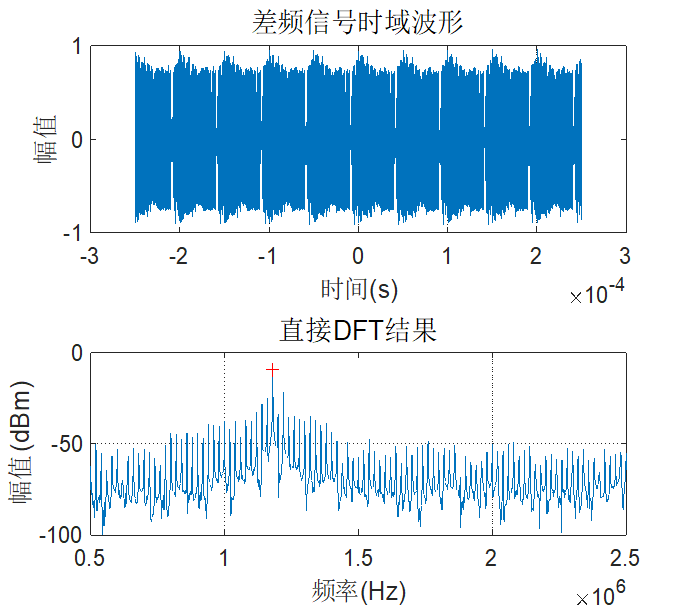{width="3.017361111111111in" | 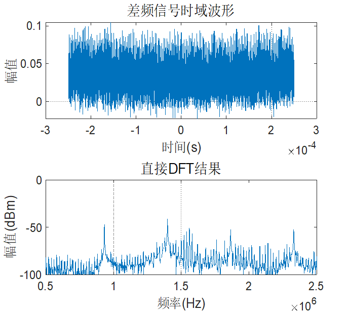{width="3.0652777777777778in" |
| height="2.51875in"}                                        | height="2.4902777777777776in"}                              |
+:==========================================================:+:===========================================================:+
| (a)无等离子体状态                                          | (b)有等离子体状态                                           |
+------------------------------------------------------------+-------------------------------------------------------------+
| 1.  []{#_Toc162279145 .anchor}300mm位置差频信号波形及频谱图                                                              |
+--------------------------------------------------------------------------------------------------------------------------+

400mm位置时，由矢网测量结果可知此时电子密度为\\\[1.21 \\times
{10\^{19}}{{\\rm{m}}\^{{\\rm{ -
3}}}}\\\]，对应的特征频率为31.23GHz，所以理论上而言33.2\~34GHz的扫频信号是能够透射过等离子体的。不改变诊断信号频率的情况下，系统在有等离子体时的差频信号时域和频域结果如下：

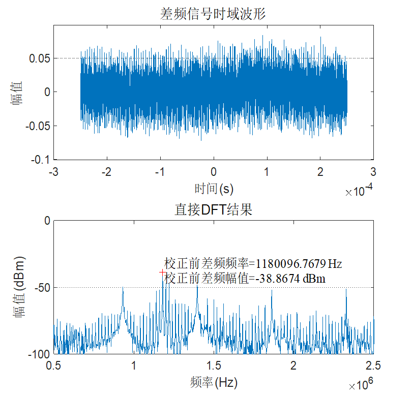{width="4.3909722222222225in"
height="3.8895833333333334in"}

2.  []{#_Toc167441080 .anchor}400mm位置处差频信号频谱图

上图可以看出虽然有等离子体时诊断系统的差频信号非常微弱，但从频域结果是可以看出差频信号的存在，但差频信号的信噪比非常低。此时经过校正后得到的频域结果如下：

+-------------------------------------------------------------+------------------------------------------------------------+
| 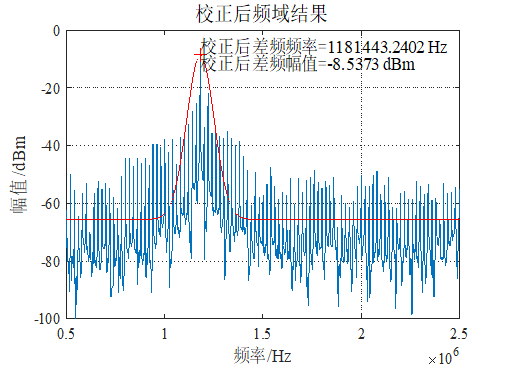{width="3.1215277777777777in" | 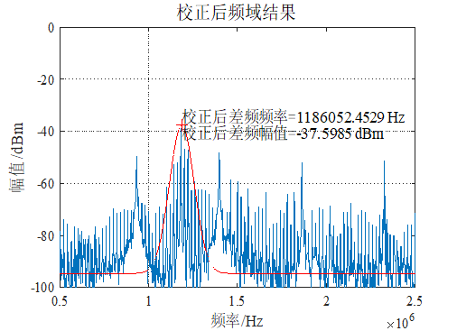{width="3.120833333333333in" |
| height="2.0590277777777777in"}                              | height="2.0590277777777777in"}                             |
+:===========================================================:+:==========================================================:+
| (a)无等离子体状态                                           | (b)有等离子体状态                                          |
+-------------------------------------------------------------+------------------------------------------------------------+
| 3.  []{#_Toc167441081 .anchor}33.2\~34GHz频率时400mm处校正后差频信号频谱图                                               |
+--------------------------------------------------------------------------------------------------------------------------+

可以看出，此时等离子体对于电磁波的衰减很大，经过计算后可得诊断结果如下：

1.  []{#_Toc167441100 .anchor}33.2\~34GHz频率时400mm处诊断结果

  ---------------------------------------------------------------------------------------------------------------
   据喷口位置    衰减     传播时延                          电子密度                           \${n_e}\$对比误差
  ------------ --------- ---------- --------------------------------------------------------- -------------------
     400mm      29.06dB   288.08ps              \${\\rm{1}}{\\rm{.1832}} \\times                     2.21%
                                     {\\rm{1}}{{\\rm{0}}\^{{\\rm{19}}}}{{\\rm{m}}\^{{\\rm{ -  
                                                             3}}}}\$                          

  ---------------------------------------------------------------------------------------------------------------

上表中电子密度的测量结果是通过电子密度的估算公计算得到的，但此时由于测量信号的频率与等离子体的截止频率相近，利用估算公式可能会带来一定的误差，故利用完整电子密度与传播时延的关系式，再次计算电子密度，但计算时需要知道等离子体的碰撞频率，通过矢网的检测结果可知此条件下的碰撞频率为1.4GHz。传播时延为288.08ps，诊断信号频率为33.6GHz，碰撞频率为1.4GHz，等离子体直径为200mm，通过式(2-23)，计算得到的电子密度数值为\\\[1.2953
\\times {10\^{19}}{{\\rm{m}}\^{{\\rm{ -
3}}}}\\\]，较矢网的对比误差为7.05%。可看出与估算公式计算得到的\\\[1.1832
\\times {10\^{19}}{{\\rm{m}}\^{{\\rm{ -
3}}}}\\\]存在一定的误差。但相较矢网的检测结果而言，均在误差允许范围之内。

从上述诊断结果说明了本文设计的线性调频波诊断系统的优点，只要电磁波能够透射过等离子体，即诊断信号频率高于截止频率，哪怕接收信号非常微弱，系统仍然是可行的，能够完成对于电子密度参数的诊断。为了验证提高频率后对于诊断结果的影响，提高扫频信号的频率至36.2\~37GHz，此时得到的校正后结果如下所示：

+-------------------------------------------------------------+-------------------------------------------------------------+
| 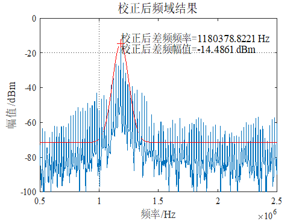{width="3.1041666666666665in" | {width="3.1041666666666665in" |
| height="2.048611111111111in"}                               | height="2.0493055555555557in"}                              |
+:===========================================================:+:===========================================================:+
| (a)无等离子体状态                                           | (b)有等离子体状态                                           |
+-------------------------------------------------------------+-------------------------------------------------------------+
| 1.  []{#_Toc167441082 .anchor}36.2\~37GHz频率时400mm处校正后差频信号频谱图                                                |
+---------------------------------------------------------------------------------------------------------------------------+

从上图可以看出，提高诊断频率后系统的初始差频信号功率有所下降，这是由于系统硬件的原因导致的，提高频率会使得线性调频连续波诊断系统的发射信号功率下降。此时计算可得诊断结果如下：

2.  []{#_Toc167441101 .anchor}36.2\~37GHz频率时400mm处诊断结果

  ---------------------------------------------------------------------------------------
   据喷口位置    衰减     传播时延              电子密度               \${n_e}\$对比误差
  ------------ --------- ---------- --------------------------------- -------------------
     400mm      20.71dB   242.67ps          \$1.1826 \\times                 2.26%
                                     {10\^{19}}{{\\rm{m}}\^{{\\rm{ -  
                                                 3}}}}\$              

  ---------------------------------------------------------------------------------------

提高频率后得到的电子密度诊断结果与扫频信号频率为33.2\~34GHz时，结果是比较一致的，唯一变化的是此状态下等离子体的传播衰减和时延，其变化规律与仿真结果具有一致性，即频率升高，等离子体带来的传播衰减和时延减小。

由于电压在12kV，600mm位置状态下的等离子体电子密度较低，用33.2\~34GHz即可完成诊断。此处直接给出时延诊断系统的测量结果：

3.  []{#_Toc167441102 .anchor}33.2\~34GHz频率时600mm处诊断结果

  --------------------------------------------------------------------------------------
   据喷口位置    衰减    传播时延              电子密度               \${n_e}\$对比误差
  ------------ -------- ---------- --------------------------------- -------------------
     600mm      6.57dB   92.95ps           \$3.8177 \\times                 2.26%
                                    {10\^{18}}{{\\rm{m}}\^{{\\rm{ -  
                                                3}}}}\$              

  --------------------------------------------------------------------------------------

此状态下，由矢网检测的电子密度为\\\[3.61 \\times
{10\^{18}}{{\\rm{m}}\^{{\\rm{ -
3}}}}\\\]，衰减为6.14dB。通过同位置不同电压状态和同电压不同位置下的诊断实验，可以看出，系统的诊断范围已经满足了初始的设计目标，且实际的电子密度诊断范围为\\\[8.6
\\times {10\^{17}}{\\rm{\\\~1}}{\\rm{.2}} \\times
{10\^{19}}{{\\rm{m}}\^{{\\rm{ -
3}}}}\\\]。对于高电子密度状态进行诊断时，可以适度的提高诊断信号的频率，但提高频率后诊断系统初始的发射信号功率会有所降低，进而导致了初始差频信号功率有一定的降低。

## 系统扩频后诊断实验

系统扩频后，对不同扫频带宽进行极限分辨率测试，系统发射端信号的扫频带宽分别确定为：1.2GHz、1.44GHz及1.6GHz。经过多次重复实验，此处直接给出三种扫频带宽下能够诊断到的极限分辨率的结果。扫频带宽为1.2GHz时，能够诊断的最小移动距离为4mm，此处以5次重复实验结果进行说明：

1.  []{#_Toc167441103 .anchor}1.2GHz带宽下极限分辨率测试结果

  -----------------------------------------------------------
     4mm理论时延(s)        诊断时延(s)            误差
  --------------------- ------------------ ------------------
     \$1.33 \\times      \$1.2825 \\times        3.81%
     {10\^{ - 11}}\$     {10\^{ - 11}}\$   

                         \$1.2503 \\times        6.23%
                         {10\^{ - 11}}\$   

                         \$1.4715 \\times        10.35%
                         {10\^{ - 11}}\$   

                         \$1.2032 \\times        9.76%
                         {10\^{ - 11}}\$   

                         \$1.4605 \\times        9.54%
                         {10\^{ - 11}}\$   
  -----------------------------------------------------------

扫频带宽为1.44GHz时，能够诊断的最小移动距离为3mm，测试结果如下：

2.  []{#_Toc167441104 .anchor}1.44GHz带宽下极限分辨率测试结果

  -----------------------------------------------------------
     3mm理论时延(s)        诊断时延(s)            误差
  --------------------- ------------------ ------------------
  \$1 \\times {10\^{ -   \$1.0256 \\times        2.56%
         11}}\$          {10\^{ - 11}}\$   

                         \$9.1551 \\times        8.45%
                         {10\^{ - 12}}\$   

                         \$1.0291 \\times        2.91%
                         {10\^{ - 11}}\$   

                         \$9.7970 \\times        2.03%
                         {10\^{ - 12}}\$   

                         \$9.0528 \\times        9.47%
                         {10\^{ - 12}}\$   
  -----------------------------------------------------------

扫频带宽为1.6GHz时，能够诊断的最小移动距离为2mm，测试结果如下：

3.  []{#_Toc167441105 .anchor}1.6GHz带宽下极限分辨率测试结果

  -----------------------------------------------------------
     2mm理论时延(s)        诊断时延(s)            误差
  --------------------- ------------------ ------------------
     \$6.67 \\times      \$7.0926 \\times        6.39%
     {10\^{ - 12}}\$     {10\^{ - 12}}\$   

                         \$6.0758 \\times        8.86%
                         {10\^{ - 12}}\$   

                         \$7.3673 \\times        10.51%
                         {10\^{ - 12}}\$   

                         \$7.1381 \\times        7.07%
                         {10\^{ - 12}}\$   

                         \$5.9513 \\times        10.73%
                         {10\^{ - 12}}\$   
  -----------------------------------------------------------

随着扫频带宽的逐步增大，系统能够分辨的最小时延变化逐渐的降低，上述诊断结果的误差均在15%之内，扫频带宽为1.6GHz时诊断系统的时延分辨率为6.67ps
。在此带宽时，将系统的极限分辨率确定为7ps，依据电子密度计算公式，即式(2-25)，当诊断信号中心频率为32GHz时，等离子体直径为200mm时，诊断系统7ps分辨率，理论上对应能够诊断到的电子密度下限值为\\\[2.6
\\times {10\^{17}}{{\\rm{m}}\^{{\\rm{ -
3}}}}\\\]。扫频带宽提高后更适合诊断低电子密度的等离子体，在测量大电子密度等离子体时，特征频率与诊断频率相近，由于色散效应，会很大程度影响扫频信号的调频斜率，从而影响时延的测量结果，造成较大误差，故系统在测量大电子密度等离子体时，应调节至800MHz的扫频带宽。

## 本章小结

本章对线性调频连续波诊断系统进行了实验测试，给出了系统的极限分辨率，通过对环氧树脂介电常数的诊断实验，验证了系统的可行性及误差范围。在CST中仿真得到了不同电子密度的等离子体产生的衰减和时延变化曲线，依据电场仿真结果直观的说明了电磁波在等离子体中的传播规律。在等离子体电磁实验装置上搭建测试平台，对产生的等离子体射流进行电子密度的诊断实验，并与直接检相位的微波诊断法互相对比，给出了电子密度诊断范围及测量误差，标定出了系统扩频后的极限分辨率，以及扩频后能够诊断的最小电子密度。从实验结果说明了本文设计的线性调频连续波诊断系统，通过测量传播时延，能够完成电子密度的参数诊断，避免了相位周期模糊问题，且系统达到了设计的指标要求。

# 总结与展望

## 本文工作总结

本文将线性调频连续波诊断传播时延的理论与微波干涉法相结合，完成了对于等离子体传播时延的检测，从而完成电子密度的诊断任务。主要的工作内容可以总结如下几个部分。

1\.
依据电子密度的诊断目标，设计了一套基于线性调频连续波的等离子体诊断系统。整个硬件链路能够完成对于低频扫频信号的上变频以及系统差频信号的滤波采集，整个系统能够发射Ka频段扫频带宽为800MHz的电磁波信号，并且对于整个硬件链路提供了一种扩频方案，最高可提高至扫频带宽为1600MHz的电磁波信号。

2\.
对于系统的差频信号，完成数据分析处理，得到差频信号的实际频率信息。数据处理均是在MATLAB中完成，处理步骤包括了基于EMD分解的去噪算法，DFT+CZT的谱峰检索算法以及离散谱频率校正算法，离散谱校正算法又包括了能量重心法以及三角形法。依靠整个数据处理算法，对于系统差频信号的频率信息进行高精度提取，用于时延及电子密度计算。

3\.
利用聚焦透镜天线进行了极限分辨率标定实验，得到了在扫频带宽为800MHz时，系统的极限分辨率为20ps，系统优化扩频后，在扫频带宽为1600MHz时，对应的极限分辨率为7ps。利用诊断系统完成了对于环氧树脂的介电常数的诊断实验。由于环氧树脂的介电常数为已知且固定不变的数值，更能体现出本文系统的可行性及其误差，最终得到了对于两种厚度环氧树脂的介电常数诊断结果，系统总体的诊断误差小于15%。

4\.
利用本文设计的系统完成了对等离子体电磁实验装置产生的等离子体射流的电子密度诊断实验。利用诊断系统测量了实验装置在8-12kV的电压下且产生等离子体射流直径为200mm条件时，在800MHz的扫频带宽下得到了本文系统能够诊断的电子密度范围为\\\[8.6
\\times {10\^{17}}{\\rm{\\\~1}}{\\rm{.2}} \\times
{10\^{19}}{{\\rm{m}}\^{{\\rm{ -
3}}}}\\\]，与矢量网络分析仪的互相验证误差小于15%。在扫频带宽为1600MHz时，针对等离子体射流直径为200mm时，理论上诊断系统能够测量到的电子密度下限值为\\\[2.6
\\times {10\^{17}}{{\\rm{m}}\^{{\\rm{ - 3}}}}\\\]。

## 后期工作展望

本文设计的基于线性调频连续波的等离子体诊断系统完成了对于等离子体电子密度参数的精确诊断，首次通过测量传播时延的方式得到了电子密度参数，由于时间有限，还有部分研究须在后期进行完善。

1.本文系统虽然标定了等离子体的衰减，但存在较大误差，后期工作可以添加反射支路对等离子体的衰减进行高精度诊断，从而使得系统能够检测等离子体的碰撞频率参数。

2.本文系统对于差频信号的采集是由高速示波器完成，但示波器仅能保存瞬态信号波形，在信噪比较低时，信号波动较大，后期可以对采集方式进行改进，使得能够对于信号进行长时间采集，有望进一步提高电子密度测量的精确性，且后期希望能够实现实时电子密度的诊断.

3.由于等离子体具有色散特性，扫频信号的扫频斜率参数在等离子体中难以保持设计之初的标准，故后续的系统优化中需要考虑到扫频斜率变化所带来的影响。

# 参考文献 {#参考文献 .标题-无编号}

1.  []{#_Ref156823528 .anchor}王晓林.
    动态等离子体信道的研究与建模\[D\].西安电子科技大学,2013.

2.  []{#_Ref156823544
    .anchor}曲馨,方格平."黑障"问题的介绍与分析\[J\].硅谷,2010(10):173+149.

3.  Gusakov E Z, Heuraux S, Popov A Y, et al. Reconstruction of the
    turbulence radial profile from reflectometry phase root mean square
    measurements\[J\]. Plasma Physics and Controlled Fusion, 2012,
    54(4): 045008.

4.  []{#_Ref166255243 .anchor}Takahashi Y, Yamada K, Abe T.Prediction
    Performance of Blackout and Plasma Attenuation in Atmospheric
    Reentry Demonstrator Mission\[J\]. Journal of Spacecraft and
    Rockets, 2014, 51(6): 1954-64.

5.  []{#_Ref166255497 .anchor}谢楷, 李小平, 杨敏等.
    L、S频段电磁波在等离子体中衰减实验研究\[J\]. 宇航学报, 2013, 34(8):
    1166-1171.

6.  Yang M, Li X, Xie K, Liu Y, and Liu D. A large volume uniform plasma
    generator for the experiments of electromagnetic wave propagation in
    plasma\[J\]. Phys. Plasmas, 2013, 20, 012101:1-6.

7.  刘丰,刘江凡,宫晨蓉,等.太赫兹波在等离子鞘套中的传播\[J\].空间电子技术,2013,10(04):10-12.

8.  Zhou H., Li X., Xie K., et al. Characteristics of electromagnetic
    wave propagation in time-varying magnetized plasma in magnetic
    window region of reentry blackout mitigation\[J\]. AIP Advances,
    2017, 7(2): 879-894.

9.  []{#_Ref162881738 .anchor}Evans J. S., Scbexnayder J. C., Jr.
    and P. W. Huber. Boundary-layer electron profiles for entry of a
    blunts slender body at high altitude\[R\]. NASA, TN D-7332, 1973.

10. []{#_Ref162881549 .anchor}李建朋, 吕娜, 张冲.
    高超音速飞行器"黑障"解决方法\[J\]. 火力与指挥控制, 2012, 37(2):
    155-158+162.

11. []{#_Ref156823684 .anchor}谢楷.
    等离子鞘套地面模拟技术及电波传播实验研究\[D\].西安电子科技大学,2016.

12. []{#_Ref156823700 .anchor}赵成伟.
    非均匀等离子体参数高精度微波诊断\[D\].西安电子科技大学,2022.

13. []{#_Ref166266569 .anchor}X.L. Li, Y. Liu, et al. Design and
    characterization of a single-channel microwave interferometer for
    the Helicon Physics Prototype eXperiment\[J\].Fusion Engineering and
    Design,2021:112914.

14. []{#_Ref156823794 .anchor}耿嘉.
    基于宽带微波反射的等离子鞘套参数诊断方法\[D\].西安电子科技大学,2021.

15. []{#_Ref166266089 .anchor}Dong Li, Y.G. Li, et al. Combined analysis
    of laser interferometer and microwave reflectometer for a consistent
    electron density profile on HL-2A\[J\].Fusion Engineering and
    Design,2023: 113903.

16. []{#_Ref166266586 .anchor}Jitendra P Chaudhari, Bhargav Patel, Amit
    V Patel, et al.Highly stable signal generation in microwave
    interferometer using PLLs\[J\].Fusion Engineering and
    Design,2020:111993.

17. []{#_Ref166316729 .anchor}李小良.
    先进微波诊断的研制及其数据解释方法的研究\[D\].中国科学技术大学,2023.

18. []{#_Ref166490449 .anchor}M. Varavin, A. Varavin, et al. Study for
    the microwave interferometer for high densities plasmas on COMPASS-U
    tokamak\[J\].Fusion Engineering and Design, 2019: 1858-1862.

19. []{#_Ref160179224
    .anchor}叶幼璋,钱尚介.微波干涉仪与微波吸收仪\[J\].原子能科学技术,1965(03):201-208.

20. []{#_Ref156823883 .anchor}Stenzel R L, Microwave resonator probe for
    localized density measurements in weakly magnetized plasmas \[J\].
    Review of Scientific Instruments, 1976, 47, 603-607.

21. []{#_Ref156824502 .anchor}Janson S. Microwave interferometry for low
    density plasmas\[C\]: Plasmadynamics & Lasers Conference, 1994.

22. []{#_Ref160179408
    .anchor}曹金祥,俞昌旋,詹如娟等.微波干涉法测量EACVD中等离子体电子密度\[J\].人工晶体学报,1993(03):304-307.

23. []{#_Ref160179421 .anchor}刘发林,窦元珠.
    大动态等离子体密度测量用毫米波扫频干涉仪\[C\].
    //中国电子学会微波分会.1995年全国微波会议论文集（下册）. 1995:4.

24. []{#_Ref156824509 .anchor}Cappelli M, Hermann W, Kodiak M. A 90 GHz
    phasebridge interferometer for plasma density measurements in the
    near field of a hall thruster\[C\]. 40th AIAA/ASME/SAE/ASEE Joint
    Propulsion Conference and Exhibit, Florida, 2004(AIAA-2004-3775):
    1-8.

25. []{#_Ref156824517 .anchor}安士全.
    微波扫频干涉仪系统及实验室测试\[D\].电子科技大学,2005.

26. []{#_Ref156824526 .anchor}毛军见.
    扫频式微波干涉仪系统的研究\[D\].电子科技大学,2016.

27. []{#_Ref156824535 .anchor}Torrisi G, Agnello R，Castro G, Celona L,
    et al. Design of a Microwave Frequency Sweep Interferometer for
    Plasma Density Measurements in ECR Ion Sources\[C\]. Proceedings of
    the 6th International Particle Accelerator Conference (IPAC),
    2015:505-509.

28. []{#_Ref156824542 .anchor}石正雨.
    微波干涉仪设计与射频等离子体诊断\[D\].中国科学技术大学,2018.

29. []{#_Ref156824549 .anchor}Ghaderi M, Moradi G, Mousavi P. Estimation
    of Plasma and Collision Frequencies Using Modified Microwave
    Interferometry Methods for Plasma Antenna Applications\[J\]. IEEE
    Transactions on Plasma Science, 2019,47(1):451-456.

30. []{#_Ref160181319 .anchor}王国豪.
    基于多通道微波干涉仪的等离子体诊断算法研究\[D\].电子科技大学,2023.

31. []{#_Ref166230519 .anchor}欧阳文冲.
    动态再入等离子体鞘套及太赫兹波传输特性理论与实验研究\[D\].中国科学技术大学,2024.

32. []{#_Ref156824209 .anchor}Sabot R, Bottereau C, Casati A, et al.
    Microwave reflectometry: a sensitive diagnostic for electron density
    property measurement in Tore-Supra fusion plasmas\[C\]: First
    International Conference on Advancements in Nuclear Instrumentation
    Measurement Methods & Their Applications, 2009:1-8.

33. []{#_Ref161392289 .anchor}Giacalone J-C, Sabot R, Clairet F,
    Bottereau C, Molina D. Measurement of the density of magnetized
    fusion plasma using microwave reflectometry\[J\]. International
    Journal of Microwave and Wireless Technologies. 2009;1(6):505-509.

34. []{#_Ref156824357 .anchor}Kubota S, Nguyen X V, Peebles W A, et al.
    Millimeter-wave reflectometry for electron density profile and
    fluctuation measurements on NSTX\[J\]. Review of Scientific
    Instruments, 2001,72(1):348-351.

35. []{#_Ref162621222 .anchor}李斌,陈志鹏,李弘,等.
    利用脉冲压缩雷达反射法测量复杂背景等离子体密度剖面\[C\].
    //第十三届全国等离子体科学技术会议论文集. 2007:155-161.

36. []{#_Ref162621206 .anchor}蒋元俊.
    基于微波反射法的等离子体特性研究\[D\].电子科技大学,2017.

37. []{#_Ref156824391 .anchor}M. Rishabhkumar N, Nandurbarkar A B and
    uch J U. Study of various plasma diagnostic techniques with
    microwave reflectometry data processing parameters\[C\]:
    International Conference on Inventive Computing and Informatics
    (ICICI), 2017.

38. []{#_Ref156824401 .anchor}杜晨阳.
    用于等离子体诊断的Vivaldi天线设计及方法研究\[D\].西安电子科技大学,2019.

39. []{#_Ref166252520
    .anchor}杨敏,王佳明,齐凯旋,等.等离子体鞘套宽带微波反射诊断方法\[J\].物理学报,2022,71(23):311-322.

40. []{#_Ref166254416 .anchor}孙斌.
    等离子体鞘套下低频电磁波通信信号传输特性及性能评估\[D\].西安电子科技大学,2022.

41. []{#_Ref166254421 .anchor}BITTENCOURT J A. Fundamentals of Plasma
    Physics \[M\]. New York: Springer, 2004.

42. []{#_Ref166254432 .anchor}PIEL A. Plasma Physics: An Introduction to
    Laboratory, Space and Fusion Plasmas \[M\]. New York: Springer,
    2010.

43. []{#_Ref156825749 .anchor}王保华.
    近程LFMCW雷达测距系统的研究与实现\[D\].重庆大学,2013.

44. []{#_Ref156826670 .anchor}贺星辰.
    FMCW近程测距雷达的差频信号处理技术研究\[D\].中北大学,2015.

45. []{#_Ref156826690
    .anchor}毛育文,涂亚庆,肖玮等.离散密集频谱细化分析与校正方法研究进展\[J\].振动与冲击,2012,31(21):112-119+151.

46. 宋卫东. 三角波雷达信号处理技术研究\[D\].哈尔滨工程大学,2019.

47. []{#_Ref162619918
    .anchor}丁康,郑春松,杨志坚.离散频谱能量重心法频率校正精度分析及改进\[J\].机械工程学报,2010,46(05):43-48.

48. []{#_Ref156826757 .anchor}Sherlock B G, Kakad Y P. Windowed discrete
    cosine and sine transforms for shifting data\[J\]. Signal
    Processing, 2001,81(7):1465-1487.

49. []{#_Ref156826759
    .anchor}沈友东,贺小星,张云涛.EMD与VMD组合站坐标时间序列降噪方法\[J\].海洋测绘,2023,43(01):44-48.

50. []{#_Ref166263107 .anchor}L. Liu,G. Rui and Y. Zhang, Duffing
    Oscillator Weak Sig-nal Detection Method Based on EMD Signal
    Processing\[J\].2020 International Conference on Computer
    Information and Big Data Applications(CIBDA),2020:495-498.

51. []{#_Ref166263132
    .anchor}丁红波,王珍珠,刘东.激光雷达信号去噪方法的对比研究\[J\].光学学报,2021,41(24):9-18.

52. []{#_Ref166263139 .anchor}Boudraa A O and Cexus J C, EMD-Based
    Signal Filtering\[J\]. IEEE Transactions on Instrumentation and
    Measurement. 2007,56(6):2196-2202.

53. []{#_Ref162620859 .anchor}王婷.
    EMD算法研究及其在信号去噪中的应用\[D\].哈尔滨工程大学,2011.

54. []{#_Ref156827000
    .anchor}丁康,江利旗.离散频谱的能量重心校正法\[J\].振动工程学报,2001(03):110-114.

55. 罗涛.相干测风激光雷达多普勒频移估计技术研究\[D\].电子科技大学,2023.

56. []{#_Ref166263748 .anchor}L Huibin,D. Kang.Anti-noise performance of
    energy centrobaric correction method using four points for discrete
    spectrum\[J\]. Journal of Vibration Engineering ,2009,(22):659-664.

57. []{#_Ref162620397 .anchor}曹翌,丁康,杨志坚.
    一种不依赖窗谱函数的通用离散频谱校正方法\[C\].
    //第11届全国设备故障诊断学术会议论文集. 2008:209-211.

58. []{#_Ref156827076
    .anchor}曹延伟,张昆帆,江志红等.一种稳健的离散频谱校正方法\[J\].电子与信息学报,2005(09):1353-1356.

# 致谢 {#致谢 .标题-无编号}

时光荏苒，光阴似箭，三年的研究生生涯转瞬即逝，感谢自己三年前所作出的决定，让自己来到了西安电子科技大学空间科学与技术学院，整个三年的科研学习生活，让我收获颇丰，培养了自我对待问题的独立性，让自己的心性有了如今的成长，让自己眼界有了很大程度的提升。于我而言，短短三年有了如今的提升，离不开老师们的督促指导，离不开同门师兄弟之前的互相探讨，离不开实验室这个大家庭所有人的互相监督。在此离别之际，我要给这三年来所有帮助过我的人说声谢谢。

首先，感谢我的导师，刘彦明教授。刘老师给我的第一印象只有严肃二字可以形容，但在后续的相处的当中，也是发现了刘老师所具有的幽默一面。刘老师作为空间院院长工作繁忙，但仍然会抽出时间询问我们的科研进展，不定期的让我们做汇报，对我们的工作给出指导意见，刚开始也是有一些不习惯，但是三年下来，也明白了刘老师的良苦用心。刘老师在生活中也是非常关心我们，尤其是疫情期间对我们每个人的情况都很关注，刘老师总是提醒我们科研之余一定要记得运动，要懂得劳逸结合。您是我科研上的领路者，也是我人生的导师。在此，我向尊敬的刘老师致以崇高的感谢！
感谢李小平教授，在我的印象里，李老师既严格又和蔼，总是能一针见血指出我们科研中的不足，让我们明白自己应该花费时间去探究的问题难点。感谢孙超老师，研究生这三年的成长之路，每一步都离不开孙老师悉心的指导。孙老师给我指明了研究方向，培养了我在微波射频方向上的研究兴趣，让我对自己的工作有了明确的规划，在工作选择上，孙老师也是给出了建设性的意见。再次感谢孙老师这三年来的教导，学生会一直铭记于心。感谢赵成伟老师，赵老师作为我的师兄，和赵老师相处更加自然，在科研中遇到难题时，赵老师都会给出自己的意见看法。感谢爷爷奶奶和父母对我的支持，让我能够顺利的完成学生生涯，是你们教会了我应该成为怎样的人，以后我会努力成为你们最大的骄傲。感谢我女朋友的一直陪伴，我们互相陪伴共同进步，分享彼快乐，分担彼此的压力，以后的工作生活又可以在一起了，余生有你，我很幸运。感谢魏强师兄，魏师兄为科研小白的我做出了第一步的引导，让我慢慢的能够上手以及后面的精通，感谢师兄在科研难题上提供的具体指导。感谢党辉师姐和李彬师兄在工作方向上给出的指导。感谢我的同门李睿和夏冬，咱们科研和生活一起度过了三年，也一起疯了三年，相较三年前彼此更加熟悉。感谢史梦芯，我们本科研究生一直都是同学，这是莫大的缘分，你们也会是我一生的朋友。感谢王平、张泽元、周俊海，我们作为刘老师的学生相识，感谢实验室的邓伟峰、梁日晖、罗成、牛越、葛昕跃、黄寿宴、江福华、刘鑫等同学在科研上的帮助。想要感谢的人还有很多很多，是你们让我成长了很多，最后，衷心祝愿所有人，以后的生活会越来越好。

# 作者简介 {#作者简介 .标题-无编号}

##### 基本情况

曹杠，男，陕西咸阳人，2000年4月出生，西安电子科技大学空间科学与技术学院仪器科学与技术专业2021级硕士研究生。

##### 教育背景

> 2017.09～2021.07西安理工大学，本科，专业：测控技术与仪器
>
> 2021.09～ 至今 西安电子科技大学，硕士研究生，专业：仪器科学与技术

##### 攻读硕士学位期间的研究成果

###### 参与科研项目及获奖

1.  临近空间高速目标等离子体电磁科学实验研究装置，2021年12月-至今，主要参研人员，研究了基于扫频微波干涉法的线性调频连续波等离子体诊断系统设计，完成对于等离子体电子密度参数的诊断任务。
