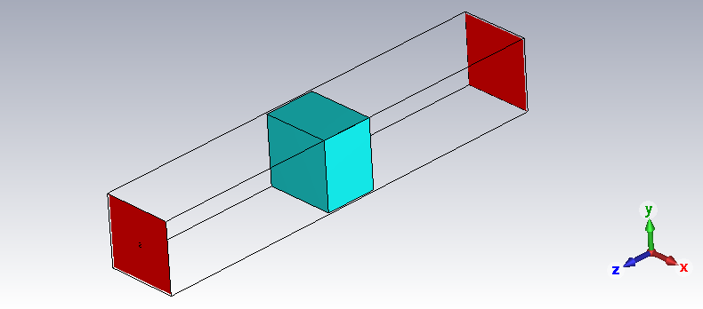

# 第三章 宽带信号在色散介质中的传播机理与方法失效分析

# 3.1 引言

第二章已经从现象层面指出,在强色散条件下传统基于单峰差频读数的LFMCW处理流程会失效,但失效的物理起点、差频畸变如何形成以及传统方法何时仍可近似使用,尚未在章级上完成闭环。为解决这些问题,第三章依次建立等离子体色散信道的正向模型,分析群时延曲线在近截止区的强非线性及单点观测不足,进一步揭示时变时延如何使差频信号由稳态单频转化为非稳态调频信号,并给出传统全频段FFT方法的局部工程适用边界。上述分析的目的并非重复传统差频读数理论,而是为第四章转向新观测量路线提供理论理由:当单峰频谱读数已无法稳定对应真实传播时延时,诊断过程就必须转向基于局部频率演化与群时延轨迹的特征提取和参数反演,以恢复可用于诊断的稳定观测特征。

# 3.2 色散信道的物理建模与参数定义

本节从色散介质的电磁本构关系出发,建立第三章后续分析所需的群时延正向模型与关键参数定义。

## 3.2.1 复介电常数与物理群时延的解析推导

为构建准确的信道模型,首先需明确电磁波在等离子体中的复传播特性。假设等离子体满足非磁化、各向同性冷等离子体近似条件。根据Drude自由电子气模型,等离子体的宏观电磁特性由内部电子在时变电磁场中的动力学行为决定。其复相对介电常数可表示为角频率$\omega$的函数:

$$\tilde{\varepsilon}_r(\omega) = \varepsilon_{r'}(\omega) - j\varepsilon_{r''}(\omega) = \left( 1 - \frac{\omega_p^2}{\omega^2 + \nu_e^2} \right) - j \left( \frac{\nu_e}{\omega} \frac{\omega_p^2}{\omega^2 + \nu_e^2} \right) \tag{3-1}$$

式中，$\omega$为探测电磁波角频率，$\omega_p$为由电子密度$n_e$决定的等离子体特征角频率，$\nu_e$为电子与中性粒子的有效碰撞频率。其复介电常数实部主要决定电磁波的色散与相速度特性，虚部则主要反映碰撞损耗导致的幅度衰减。

电磁波在有耗介质中的复传播常数$\tilde{k}$定义为:

$$\tilde{k}(\omega) = \frac{\omega}{c}\sqrt{\tilde{\varepsilon}_r(\omega)} = \beta(\omega) - j\alpha(\omega) \tag{3-2}$$

其中$\beta$为相位常数,$\alpha$为衰减常数。在本文采用的$e^{j\omega t}$时间因子约定下,前向传播场写为$E(z,\omega)=E_0\exp(-j\tilde{k}z)=E_0\exp(-\alpha z)\exp(-j\beta z)$,因此穿过厚度$d$后的传输函数应写为$H(\omega)=\exp(-j\tilde{k}d)=\exp(-\alpha d)\exp(-j\beta d)$,其相位为$\phi(\omega)=-\beta d$。后续各节涉及传输函数与相位导数时均采用这一记号体系。针对本文研究的Ka波段($f \sim 35\text{ GHz}$)透射诊断场景,通常满足高频弱碰撞条件,即探测频率远大于碰撞频率($\omega \gg \nu_e$),且高于截止频率($\omega > \omega_p$)。在此条件下,介质损耗角正切$\tan\delta = \varepsilon_{r''}/\varepsilon_{r'} \ll 1$,复传播常数的实部(相位常数)主要由介电常数的实部主导。对式(3-2)进行二项式展开并忽略高阶虚部项,可得相位常数$\beta$的近似表达:

$$\beta(\omega) \approx \frac{\omega}{c}\sqrt{1-\frac{\omega_p^2}{\omega^2+\nu_e^2}} \tag{3-3}$$

该式表明,即使在考虑损耗的情况下,相位常数依然保持实数形式的主导地位,这为利用相位或时延信息进行参数反演提供了理论可行性。

对于宽带LFMCW信号,信号包络的传播速度由群速度$v_g$描述。定义电磁波穿过物理厚度为$d$的等离子体层的物理群时延$\tau_g$为相位谱对角频率的一阶导数:

$$\tau_g(\omega) = d \cdot \frac{d\beta(\omega)}{d\omega} \tag{3-4}$$

为了精确量化碰撞频率对群时延的影响,本文不直接使用无碰撞近似,而是对包含$\nu_e$的式(3-3)直接求导并整理,最终得到完整群时延解析表达式:

$$\tau_g(\omega, \omega_p, \nu_e) = \frac{d}{c} \cdot \frac{1}{\sqrt{1-\frac{\omega_p^2}{\omega^2+\nu_e^2}}} \cdot \left[ 1 - \frac{\omega_p^2 \nu_e^2}{(\omega^2+\nu_e^2)^2} \right] \tag{3-5}$$

为了直观量化碰撞频率对群时延的贡献权重,引入无量纲小量$\delta$来表征损耗因子的相对强度:

$$\delta = \left( \frac{\nu_e}{\omega} \right)^2 \tag{3-6}$$

在微波诊断的典型高频条件下($\omega \gg \nu_e$),该因子满足$\delta \ll 1$。利用关系式$\omega^2 + \nu_e^2 = \omega^2(1+\delta)$,将含损耗的群时延解析导数重写为仅包含$\omega_p$、$\omega$与$\delta$的形式:

$$\tau_g(\omega) = \frac{d}{c} \frac{1}{\sqrt{1-\frac{\omega_p^2}{\omega^2(1+\delta)}}} \left[ 1 - \frac{\omega_p^2}{\omega^2} \frac{\delta}{(1+\delta)^2} \right] \tag{3-7}$$

上式精确描述了群时延与微扰量$\delta$的函数关系。为明确各物理量的贡献层级,对式(3-7)作小量展开并忽略$\delta^2$以上高阶项,可得群时延的近似表达式:

$$\tau_g(\omega) \approx \frac{d}{c\sqrt{1-(\omega_p / \omega)^2}} \left[ 1 - \left( \frac{1}{2} \frac{(\omega_p / \omega)^2}{1-(\omega_p / \omega)^2} + \frac{\omega_p^2}{\omega^2} \right) \delta \right] \tag{3-8}$$

基于式(3-8)可直接判断各物理量对群时延的贡献层级。特征角频率$\omega_p$(即电子密度$n_e$)位于主导项分母中,决定了群时延曲线的整体形态;当探测频率逼近截止频率($\omega \to \omega_p$)时,主导项急剧增大,这正是群时延对电子密度高灵敏的物理来源。相比之下,碰撞频率$\nu_e$仅通过$\delta = (\nu_e/\omega)^2$进入修正项,对群时延的影响属于二阶小量,而其对衰减常数$\alpha$的影响则保持一阶主导。由此可见,时延特征更适合表征电子密度,幅度衰减更敏感于碰撞频率,后续可据此固定$\nu_e$并仅反演$n_e$。

## 3.2.2 全频段频率到群时延的非线性关系

上一节推导了群时延的物理解析式,并从数学上证明了群时延是电子密度的强函数、碰撞频率的弱函数。本节将在此基础上,结合LFMCW雷达的实际工作体制,给出射频探测频率$f$与相对群时延$\Delta\tau_g$之间的全频段非线性关系。该关系直接连接雷达测量数据与介质物理参数,也是第四章参数反演所采用的正向模型。

在实际的微波透射诊断实验中,为了消除测试线缆、收发天线及自由空间路径带来的系统固有延迟,通常采用有无等离子体的差分测量模式。雷达系统实际提取的物理量为相对群时延$\Delta\tau_g$,定义为电磁波穿过等离子体介质的物理群时延$\tau_g$与穿过同等物理厚度$d$的真空(或空气)群时延$\tau_0$之差:

$$\Delta\tau_g(\omega) = \tau_g(\omega) - \tau_0 = \tau_g(\omega) - \frac{d}{c} \tag{3-9}$$

为了保证物理模型的完备性,首先建立包含碰撞频率二阶微扰的完整观测方程。依据工程测量标准,将角频率$\omega$转换为线性频率$f$($\omega = 2\pi f$),并将等离子体特征角频率$\omega_p$转换为截止频率$f_p$($f_p = \omega_p / 2\pi$)。

将式(3-5)代入观测定义,全频段内频率到时延的映射关系$\mathcal{M}_{full}$可表述为:

$$\Delta\tau_g(f) = \mathcal{M}_{full}(f; f_p, d, \nu_e) \approx \frac{d}{c} \left\{ \frac{1}{\sqrt{1-(f_p/f)^2}} \left[ 1 - \Psi(f) \cdot \delta(f) \right] - 1 \right\} \tag{3-10}$$

其中,$\delta(f) = (\nu_e / 2\pi f)^2$为无量纲损耗因子,$\Psi(f)$为源自3.3.1节推导的二阶修正系数:

$$\Psi(f) = \frac{1}{2} \frac{(f_p/f)^2}{1-(f_p/f)^2} + \left(\frac{f_p}{f}\right)^2 \tag{3-11}$$

式(3-10)完整描述了色散介质中群时延随频率演化的精细结构。它表明,观测到的群时延曲线不仅受截止频率$f_p$(电子密度)控制,在理论上还受到碰撞频率$\nu_e$的微弱调制。

式(3-10)在物理上更完整,但直接用于多参数($f_p, \nu_e, d$)拟合容易导致病态求解。基于3.3.1节的敏感度量级判定,碰撞频率引入的修正项$\Psi \cdot \delta$属于二阶小量。在Ka波段典型诊断场景下($f \sim 35\text{ GHz}, \nu_e \sim 1.5\text{ GHz}$),该修正项引起的时延偏差远低于系统时间分辨率与噪声基底,因此后续仅保留电子密度的一阶主导项,频率到群时延的简化关系写为:

$$\Delta\tau_g(f) = \mathcal{M}(f; f_p, d) = \frac{d}{c} \left( \frac{1}{\sqrt{1 - (f_p/f)^2}} - 1 \right), \quad (f > f_p) \tag{3-12}$$

该映射模型$\mathcal{M}$具有明显的频率非线性特征。与空气中近似恒定的群时延不同，$\Delta\tau_g(f)$是探测频率$f$的强非线性函数，这意味着宽带LFMCW信号的不同频率分量将经历不同的传播延迟，从而导致时域回波包络发生弥散。当探测频率逼近截止频率($f \to f_p^+$)时,分母趋于零,相对群时延急剧增大并在截止频率处趋于无穷,此处也是对电子密度最敏感的频段,微小的密度变化都会引起时延的显著变化。相反,当$f \gg f_p$时,利用泰勒展开可知$\Delta\tau_g \approx d(f_p/f)^2/(2c)$,此时曲线趋于平坦,色散效应减弱,模型退化为传统单频干涉法的线性近似。

式(3-12)只给出静态频率点$f$与相对群时延$\Delta\tau_g$的映射。在LFMCW体制下,发射信号的瞬时频率$f(t)=f_0+Kt$线性扫描,频率色散会进一步转化为时变群时延。为计算接收信号相位,将总群时延写为

$$\tau_g(t) = \underbrace{\mathcal{M}(f_0 + Kt; f_p, d)}_{\text{时变相对部分}} + \underbrace{\frac{d}{c}}_{\text{恒定真空基底}} \tag{3-13}$$

严格而言,接收端时刻$t$对应的发射时刻$t_e$应满足自洽关系$t=t_e+\tau_g(t_e)$,接收相位应写为$\phi_R(t)=\phi_T(t_e)$。本文后续将$t_e$近似写为$t-\tau_g(t)$,实质上采用的是慢变时延近似:传播时延在一个传播历程内仅发生小幅变化,即

$$\left|\dot{\tau}_g(t)\right|=\left|\frac{d\tau_g}{df}K\right|\ll 1$$

在该条件下,自洽解可一阶近似为$t_e=t-\tau_g(t)+O(\tau_g\dot{\tau}_g)$,相应忽略项导致的相位误差阶为$O([\omega_0+K't]\tau_g\dot{\tau}_g)$。因此,式(3-13)表征的是LFMCW扫频机制下的等效时延轨迹,用于后续局部相位展开,而非任意强色散工况下的精确闭式解。其物理含义也很直接:频域中的非线性映射$\mathcal{M}(f)$经$f \to f_0+Kt$代换后,会转化为时域中的时变群时延轨迹。该结果构成了后续分析差频相位畸变与频谱展宽机理的基础。

以本文第三章后续统一采用的Ka波段工况为例,取$B=3$ GHz、$T_m=1$ ms、$d=0.15$ m,工作带宽为32.5-35.5 GHz,并以3.4节代表性的中等密度工况$f_p=29$ GHz为参照,则在带宽下边缘、中心频率和上边缘处分别有$|\dot{\tau}_g| \approx 4.00\times10^{-7}$、$2.26\times10^{-7}$和$1.47\times10^{-7}$。在$f_c=34$ GHz处,总群时延约为$\tau_g \approx 0.9585$ ns,故$\tau_g\dot{\tau}_g \approx 2.16\times10^{-16}$ s,仅为$2.16\times10^{-4}$ ps量级。该数量级检查表明，在本文典型透射诊断工况下，自洽发射时刻修正远小于皮秒量级，因此慢变时延近似在本章分析范围内是成立的。

## 3.2.3 关键参数定义:群时延非线性度因子($\eta$)的数学表征

为了定量表征色散效应对LFMCW宽带信号的具体影响程度,并为后续章节建立局部工程判据提供数学依据,需引入无量纲参数对信道的非线性强弱进行标定。

群时延的非线性本质上由其对频率的导数决定，而这一导数又受介质参数共同影响。若保留碰撞频率$\nu_e$的完整修正项，则对应表达式会明显复杂化，不利于突出电子密度主导的物理规律。基于3.3.1节关于参数敏感度量级判定的结论，碰撞频率对群时延的贡献仅为二阶微扰；根据微扰理论，若原函数的微扰项可忽略，其一阶导数的趋势通常由主导项决定。

本文定义群时延非线性度因子$\eta$,表征在给定候选带宽$B$下,群时延随频率变化的剧烈程度相对于基础真空时延$\tau_0$的比率。其数学定义基于群时延色散率(Group Delay Dispersion, GDD) $D_2(f) = d\tau_g/df$ 的归一化模值:

$$\eta(f) \triangleq \frac{1}{\tau_0} \cdot \left| \frac{d\tau_g(f)}{df} \right| \cdot B \tag{3-14}$$

其中,$\tau_0 = d/c$为真空中的基础传播时延。该定义本质上描述了在带宽$B$内,由色散引起的线性时延变化量占总时延的比例。

将简化后的工程主导模型$\tau_g(f) = \frac{d}{c} [1-(f_p/f)^2]^{-1/2}$代入式(3-14),对其关于频率求导并整理,可得群时延色散率

$$\frac{d\tau_g(f)}{df} = -\tau_0 \cdot \frac{1}{f} \cdot \frac{(f_p/f)^2}{\left[ 1 - (f_p/f)^2 \right]^{3/2}} \tag{3-15}$$

将式(3-15)的模值代入定义式(3-14),消去$\tau_0$,最终得到$\eta$关于探测频率$f$与截止频率$f_p$的显式解析表达:

$$\eta(f) = \frac{B}{f} \cdot \frac{(f_p/f)^2}{\left[ 1 - (f_p/f)^2 \right]^{\frac{3}{2}}}, \quad (f > f_p) \tag{3-16}$$

式(3-16)揭示了信道非线性与介质参数、雷达参数的耦合关系。当探测频率逼近截止频率时,分母趋于零,$\eta(f)$急剧增大,截止区因而成为对电子密度最敏感的频段;当$f \gg f_p$时,$\eta(f) \approx B(f_p/f)^2/f \propto f^{-3}$,非线性迅速衰减。$\eta$与带宽$B$成正比,增大带宽虽能提高理论分辨率,也会同步放大色散畸变。这里的$\eta(f)$是给定候选带宽后的局部非线性指标,后文的$B \cdot \eta(f_c) \cdot \tau_0$应理解为由$B$、$f_c$、$f_p$和$\tau_0$共同决定的综合判据值。后续3.6.2节将在此基础上给出传统方法的局部工程判据。

# 3.3 色散效应下群时延曲线的非线性演化特征

3.3节从理论层面建立了色散信道的物理模型,推导了群时延的解析表达式,并揭示了电子密度与碰撞频率对时延观测量的不同控制机理。本节通过数值仿真对这些理论预测进行趋势级对比与一致性检验,重点考察群时延曲线在多维参数空间中的演化规律,并说明截止频率附近群时延的急剧增大以及参数映射的局部非唯一性对后续诊断建模的影响。

## 3.3.1 仿真环境与趋势一致性检验

为检验3.3节理论模型在主导趋势层面的适用性,本文在与实验系统一致的Ka波段参数下建立了包含电子密度 $n_e$ 与碰撞频率 $\nu_e$ 的多维参数空间仿真环境。具体采用 CST Microwave Studio 构建全波电磁模型,提取电磁波穿过物理厚度 $d=150\ \text{mm}$ 等离子体平板层时的 $S$ 参数。

图 3-1 CST 仿真模型

图 3-2 等离子体模型设置界面图

探测频段设定为20-40 GHz,既覆盖近截止强色散区,也覆盖高频弱色散区,并与实际系统可用带宽相匹配。频率采样点数取1000点的线性均匀分布,以满足群时延数值微分所需的频率分辨率。

等离子体物理参数参考航天再入黑障场景的典型范围。电子密度基准值取 $n_e = 1.04 \times 10^{19}\ \text{m}^{-3}$,对应截止频率 $f_p \approx 29\ \text{GHz}$;碰撞频率基准值取 $\nu_e = 1.5\ \text{GHz}$;物理厚度取 $d=150\ \text{mm}$,对应真空传播基底时延 $\tau_0=d/c \approx 0.5$ ns。后文图3-3至图3-8统一讨论相对群时延 $\Delta\tau_g$。

仿真过程中,通过3.3.1节推导的完整Drude模型计算复介电常数 $\tilde{\varepsilon}_r(\omega)$,进而求得复传播常数 $\tilde{k}(\omega)$。为与3.3节的观测模型保持一致,本节统一讨论相对于真空传播时延 $\tau_0=d/c$ 的相对群时延 $\Delta\tau_g$;若CST直接输出总群时延,则先减去真空传播基底后再进行比较。采用的前向传播传输函数写为

$$H(\omega) = \exp(-j\tilde{k}d) = \exp(-\alpha d)\exp(-j\beta d)$$

其中传输相位为 $\phi(\omega)=\arg H(\omega)=-\beta d$ ,这与3.3节对$\tilde{k}$的定义保持一致。对相位进行解缠绕(unwrap)处理以消除 $2\pi$ 跳变后,先利用中心差分法计算群时延

$$\tau_g = -\frac{d\phi}{d\omega} = d\frac{d\beta}{d\omega}$$

再通过

$$\Delta\tau_g = \tau_g - \tau_0$$

得到与3.3节式(3-9)至式(3-12)一致的相对群时延观测量。除这一中间计算步骤外,后文凡未特别说明的时延曲线均指相对群时延曲线。

为验证碰撞频率对幅度衰减的影响,同时计算透射系数的幅度 $|H(\omega)|$,并以dB为单位表示。

参数扫描采用单因子变化法。电子密度敏感性分析中固定 $\nu_e = 1.5\ \text{GHz}$,令电子密度在基准值附近变化;碰撞频率敏感性分析中固定 $n_e$ 为基准值,令碰撞频率在0.1-10 GHz范围内变化。该设置足以分离两类参数的主导效应,并为后续图像比较提供统一基准。

## 3.3.2 截止频率附近的群时延陡增现象与参数映射非唯一性
基于上述仿真环境,本节首先检验3.3节理论推导中的核心预测:当探测频率逼近截止频率 $f_p$ 时,相对群时延 $\Delta\tau_g$ 会迅速增大,并在解析极限上满足 $\lim_{f \to f_p^+}\Delta\tau_g = +\infty$。这说明截止频率附近是相对群时延对电子密度最敏感的频段。

图 3-3 MATLAB 理论计算的 Drude 模型相对群时延曲线

图3-3展示了基于Drude模型的MATLAB理论计算结果。在固定碰撞频率条件下,电子密度由 $9.4\times10^{18}\ \text{m}^{-3}$ 增加至 $1.14\times10^{19}\ \text{m}^{-3}$ 时,对应截止频率由约27.6 GHz上升至30.4 GHz,群时延曲线在近截止区域出现显著分离,而在高频端趋于接近。这说明电子密度主要通过改变截止位置和色散强度来控制群时延曲线的整体形态。

相比之下,图3-3(b)表明,当截止频率固定为 $f_p = 29.0\ \text{GHz}$ 且碰撞频率由1.5 GHz变化至5.0 GHz时,相对群时延曲线几乎保持重合,而透射幅度衰减则明显增强。这表明,在本文关注的Ka波段条件下,群时延与幅度衰减对参数的敏感方向并不相同:前者更适合作为电子密度观测量,后者则更多反映碰撞损耗效应。

为比较理论模型与真实电磁环境下主导色散行为的一致性,本文采用CST全波仿真平台对相同参数条件进行数值求解。图3-4展示了固定碰撞频率条件下不同电子密度的CST仿真结果,图3-5展示了固定截止频率条件下不同碰撞频率的CST仿真结果。

图 3-4 固定碰撞频率条件下不同电子密度的相对群时延曲线（CST 全波仿真）

图 3-5 固定截止频率条件下不同碰撞频率的相对群时延曲线（CST 全波仿真）

对比图3-3与图3-4、图3-5可以发现,CST全波仿真结果与Drude理论在整体趋势与包络层面保持一致:电子密度变化导致相对群时延曲线在截止频率附近显著分离,而碰撞频率变化对相对群时延曲线影响甚微。这说明3.3节建立的单程色散模型能够解释Ka波段等离子体诊断中的主导色散行为与参数敏感方向。

为给出量化口径,对代表性曲线进行适度平滑处理后可作进一步评估。结果表明,包络相对理论值的偏差保持在可接受范围内,同时电子密度变化引起的群时延分离量明显大于碰撞频率变化造成的曲线偏移。

然而,CST曲线与理论曲线之间仍存在一个显著差异,即全波结果在平滑色散包络之上叠加了周期性振荡。该振荡并非数值噪声,而主要来源于有限厚度等离子体层两界面之间的多次反射干涉,可视为典型的法布里–珀罗型附加效应。

因此,图3-4和图3-5所比较的是单程色散模型与含界面多次反射的全波结果在主导趋势上的一致性,而非每个频点的逐点重合。后续分析中,本文更关注群时延曲线的跨频段主导趋势,而不将局部振荡峰谷位置作为唯一判据。

进一步分析曲线斜率可以揭示群时延色散率的演化规律。根据式(3-15), $d\tau_g/df$ 与 $\left[1-(f_p/f)^2\right]^{-3/2}$ 成正比,这意味着曲线斜率在截止频率附近会快速增大。仿真数据表明,对于 $f_p = 29\ \text{GHz}$ 的情况,曲线斜率从高频区的约 $-0.02\ \text{ns/GHz}$ 增至近截止区的约 $-0.8\ \text{ns/GHz}$。

对比不同 $f_p$ 的曲线族,可以清晰观察到截止频率对群时延曲线拓扑结构的控制作用。$f_p$ 的微小变化(仅6%,从27.6 GHz到30.4 GHz)导致曲线在20-32 GHz频段发生显著分离,最大时延差异超过10 ns，远大于本文系统所关注的时间分辨量级。这说明截止频率的微小变化即可引起群时延曲线的显著分离，从而为利用群时延特征表征电子密度提供了基础。

当 $f < f_p$ 时,根据Drude模型,介电常数 $\varepsilon_{r'}$ 变为负值,等离子体呈现金属特性,电磁波无法透射,此时复传播常数的实部 $\beta$ 转变为虚部,对应倏逝波的指数衰减。仿真中该区域的群时延计算会因数值解缠绕失效而出现奇异值,这在图3-4中表现为曲线在 $f < f_p$ 处的剧烈波动。这一现象与理论预测一致,也说明在实际LFMCW系统设计时,工作带宽的下限频率必须严格高于等离子体的最大预期截止频率,以避免信号截止导致的诊断失效。

为系统揭示群时延曲线随电子密度的演化规律,本文利用CST仿真平台在26-40 GHz频段对不同量级电子密度条件下的群时延响应进行了系统性仿真。根据电子密度的数量级差异,可将演化规律划分为两个典型区间。

图 3-6 低电子密度区间 CST 仿真相对群时延曲线

低电子密度区间($n_e \leq 5 \times 10^{18}\ \text{m}^{-3}$):如图3-6所示,当电子密度较低时,相对群时延曲线在整个观测频段内近似平坦,整体保持在较低水平,且各曲线之间的差异很小。这是因为此时 $f_p$ 明显低于探测频段下限,根据式(3-12)的渐近展开,色散效应退化为弱非线性传播,非线性度因子 $\eta \ll 1$。

图 3-7 高电子密度区间 CST 仿真相对群时延曲线

高电子密度区间($n_e \geq 7 \times 10^{18}\ \text{m}^{-3}$):如图3-7所示,当电子密度升高后,群时延曲线呈现显著的非线性特征。低频段内不同 $n_e$ 对应的曲线明显分离,而当探测频率逼近截止频率($f \to f_p$)时,曲线斜率迅速增大并出现明显上翘,这与式(3-12)中分母 $\sqrt{1-(f_p/f)^2}$ 趋零一致;在高频段($f > 36$ GHz),各曲线又逐渐收敛,验证了色散效应在 $f \gg f_p$ 时的弱化规律。

对比图3-6与图3-7还可以发现,法布里-珀罗振荡效应与电子密度存在明显的关联规律。在低电子密度区间,当 $f_p \ll f$ 时,波阻抗失配较小,界面反射系数 $\Gamma \approx 0$,多径效应很弱,曲线呈现光滑特征,振荡幅度仅约0.1 ns。然而在高电子密度区间,当 $f_p$ 接近观测频段时,波阻抗失配急剧加大,界面反射显著增强,形成强烈的驻波干涉,曲线振荡幅度可达0.5-1 ns,且在截止频率附近尤为剧烈。

这一干涉现象对参数反演算法设计具有直接影响:振荡引入的局部极值点会严重干扰传统基于峰值检测或过零点检测的测距算法,导致虚假目标或测量跳变。因此，在存在明显界面多径效应时，诊断过程不宜继续依赖单点读数，而更适合利用跨频段整体趋势特征进行表征。

近截止区的高敏感性虽然提高了曲线对电子密度变化的响应,却并不意味着单点观测即可稳定完成参数辨识。若只使用某一频点上的时延值,不同未知量之间仍可能出现等效替代。这里暂时将电子密度 $n_e$ 与等离子体层厚度 $d$ 同时视为未知,其目的并非建立本文后续的联合反演问题,而只是从一般辨识角度说明单点观测为何不足。本文后续仍以 $d$ 已知、$\nu_e$ 固定、仅反演 $n_e$ 为主。

为系统探究这一问题,设计如下多参数扫描仿真实验:在 $f \in [34, 37.5]\ \text{GHz}$ 频段,固定碰撞频率 $\nu_e = 1.5\ \text{GHz}$,构建二维参数空间。电子密度 $n_e$ 在 $[1.4, 1.5] \times 10^{19}\ \text{m}^{-3}$ 范围内均匀取10个值,对应截止频率 $f_p$ 约为33.7-34.9 GHz;等离子体层厚度 $d$ 在 $[0.20, 0.30]\ \text{m}$ 范围内均匀取20个值,共计生成 $10 \times 20 = 200$ 条群时延曲线。每条曲线由Drude模型计算得到

$$\Delta\tau_g(f) = \frac{d}{c}\left[\frac{1}{\sqrt{1-(f_p/f)^2}} - 1\right]$$

其中相对群时延 $\Delta\tau_g$ 表示相对于真空传播时延的额外延迟。

图 3-8 不同参数组合下群时延曲线的相交现象

仿真结果如图3-8所示,图中灰色曲线代表200组不同 $(n_e, d)$ 参数组合生成的群时延曲线,红色圆点标记了物理有效的曲线交点。交点的筛选遵循两个准则:一是交点频率必须高于两条曲线中较大的截止频率,确保交点处于可传播频段;二是两组参数的差异度均超过5%,排除参数近似相等导致的无效交点。仿真结果显示,在可传播频段内存在大量物理有效交点,它们密集分布在35.5-37 GHz的频率区间,对应的时延值约在1.0-2.0 ns范围内。

图3-8表明,在可传播频段内确实存在多组 $(n_e,d)$ 组合在孤立频点产生相同的相对群时延值。其原因在于式(3-12)中$d$主要以线性尺度因子影响曲线高度,而$n_e$通过$f_p$主导曲线弯曲程度;因此,增大$n_e$带来的时延增量在某些频点上可以被减小$d$部分抵消。于是,若雷达系统仅依赖单个频点上的时延值,则观测约束会呈现局部欠定,这正是单点测量不适合强色散诊断的根本原因。

单点相交并不意味着全频段曲线一致。跨频段观察时,$n_e$改变的是曲线形状,$d$改变的是整体尺度,两条曲线即使在某一频点相交,其斜率和曲率通常仍不同。宽带LFMCW提供的并非单个时延值，而是一组跨频段的曲线形状信息，因此后续诊断应更多依赖整体轨迹特征而非孤立频点读数。本文并不将$(n_e,d)$联合作为后续反演目标,本段只用于说明单点观测不足,从而为第四章在已知 $d$、固定 $\nu_e$ 条件下开展电子密度反演提供动机。

# 3.4 色散效应对差频信号的调制机理与误差解析

3.3节建立了色散信道的物理模型,揭示了群时延随频率的非线性演化规律;3.4节通过MATLAB理论曲线与CST全波结果的趋势对比,展示了近截止区群时延急剧增大以及参数映射非唯一性的现象。然而,这些分析均基于静态的频率与时延关系,尚未回答一个核心问题:在LFMCW雷达的动态扫频工作模式下,色散效应如何具体影响差频信号的波形与频谱?传统LFMCW差频解析理论假设群时延为常数,此时差频信号为单频正弦波,FFT可准确反算传播时延并进一步驱动电子密度反演。但在色散介质中,式(3-13)已揭示群时延$\tau_g(t)$是时变函数,这必然导致差频信号相位的非线性畸变,进而引发频谱特征的根本性变化。本节将基于局部泰勒级数展开,推导色散条件下差频信号的时域与频域表达式,定量分析二阶色散导致的频谱散焦效应及其与系统带宽的耦合机制,为理解传统方法的失效机理以及后续特征提取思路提供理论依据。

## 3.4.1 群时延的二阶泰勒级数展开与时变时延模型

为建立色散条件下差频信号的解析表达式,首先需将时变群时延$\tau(\omega)$在角频率轴上展开。LFMCW发射信号的瞬时角频率$\omega(t)$随时间线性变化:$\omega(t) = \omega_0 + K' t$,其中$\omega_0 = 2\pi f_0$为起始角频率,$K' = 2\pi B/T_m$为角频率调制斜率,$B$为带宽,$T_m$为扫频周期。

在等离子体介质中传播时,电磁波的群时延$\tau(\omega)$是角频率$\omega$的函数。为避免与3.3节中真空基底时延$\tau_0=d/c$混淆,本文将扫频起始角频率$\omega_0$处的总群时延记为$\tau_{g,0} \triangleq \tau(\omega_0)$。在$\omega_0$附近对$\tau(\omega)$进行二阶泰勒级数展开:

$$\tau(\omega) = \tau_{g,0} + \tau_1[\omega-\omega_0] + \frac{1}{2}\tau_2[\omega-\omega_0]^2 + \cdots \tag{3-17}$$

其中,$\tau_{g,0} = \tau(\omega_0)$为扫频起点处的总群时延,$\tau_1 = d\tau/d\omega|_{\omega=\omega_0}$为一阶导数,$\tau_2 = d^2\tau/d\omega^2|_{\omega=\omega_0}$为二阶导数。该截断仅用于刻画展开点附近的局部主导机理,其成立前提是分析窗口内的频偏$|\omega-\omega_0|=|K't|$足够小,且工作点与截止奇异点保持一定裕量。若将三阶余项写为$R_3(\omega)=\tau_3(\xi)(\omega-\omega_0)^3/6$,则要求分析区间内满足$|R_3(\omega)| \ll |\tau_2(\omega-\omega_0)^2|/2$。若扫频带宽过大或工作区间进一步逼近截止频率,则该二阶模型只能视为局部近似,不能替代全频段精确描述。

将瞬时角频率$\omega(t) = \omega_0 + K't$代入式(3-17),得到时延随时间的演化:

$$\tau(t) = \tau(\omega(t)) = \tau_{g,0} + \tau_1 K' t + \frac{1}{2}\tau_2 (K')^2 t^2 \tag{3-18}$$

为简化后续推导,引入中间变量:

$$A_0 = \tau_{g,0}, \quad A_1 = \tau_1 K', \quad A_2 = \frac{1}{2}\tau_2 (K')^2$$

则时变时延可紧凑地表示为:

$$\tau(t) = A_0 + A_1 t + A_2 t^2 \tag{3-19}$$

式(3-19)揭示了时延演化的三个层次：$A_0$表示展开点处的总群时延，$A_1$表示群时延的线性漂移项，$A_2$则表征色散曲率导致的非线性漂移。特别地，$A_2 \propto (K')^2 \propto B^2/T_m^2$，说明带宽会显著放大二阶色散效应。此处$\tau_{g,0}$与3.3节用于归一化和工程判据的真空基底时延$\tau_0=d/c$含义不同，后者仅出现在群时延解析式及非线性度因子的定义中。

根据3.3节式(3-12)的物理模型,可计算$\tau_1$和$\tau_2$的显式表达。利用$\tau_g(f) = \frac{d}{c}[1-(f_p/f)^2]^{-1/2}$,通过链式法则$d\tau/d\omega = (d\tau/df)\cdot(df/d\omega) = (1/2\pi)(d\tau/df)$,在$\omega = \omega_0$(即$f = f_0$)处计算,由式(3-12)直接求导并结合链式法则可得:

$$\tau_1 = \frac{1}{2\pi} \cdot \left(-\frac{\tau_0}{f_0} \cdot \frac{(f_p/f_0)^2}{[1-(f_p/f_0)^2]^{3/2}}\right) \tag{3-20}$$

其符号为负($\tau_1 < 0$),表明瞬时频率上升时时延单调下降,反映高频信号在色散介质中传播更快的物理本质。对于二阶项,先直接对物理频率$f$求二阶导数,在$f=f_0$处可化简得到单项主式:

$$\left.\frac{d^2\tau_g}{df^2}\right|_{f=f_0} = \frac{3\tau_0}{f_0^2} \cdot \frac{(f_p/f_0)^2}{[1-(f_p/f_0)^2]^{5/2}}$$

再利用链式法则$d^2\tau/d\omega^2 = (1/(2\pi)^2)(d^2\tau_g/df^2)$,即可将其转换为角频率域下的二阶导数:

$$\tau_2 = \left.\frac{d^2\tau}{d\omega^2}\right|_{\omega=\omega_0} = \frac{1}{(2\pi)^2} \left.\frac{d^2\tau_g}{df^2}\right|_{f=f_0} = \frac{1}{(2\pi)^2} \cdot \frac{3\tau_0}{f_0^2} \cdot \frac{(f_p/f_0)^2}{[1-(f_p/f_0)^2]^{5/2}} \tag{3-21}$$

式(3-21)表明,$\tau_2$在截止频率附近呈奇异性增长,主导项与$[1-(f_p/f_0)^2]^{-5/2}$成正比,这正是二阶色散效应在强色散区显著的根源。

仍以本文Ka波段典型工况$B=3$ GHz、$d=0.15$ m、$f_c=34$ GHz、$f_p=29$ GHz为例,若在中心频率附近考察半带宽$\Delta f=B/2=1.5$ GHz内的局部展开,则二阶项贡献约为27.42 ps,三阶余项约为6.99 ps,余项与二阶主项之比约0.255。该结果表明，二阶模型更适合用于解释差频相位主导畸变和频谱散焦的形成机理，并给出相应的半定量趋势；若需获得更高精度的数值结果，仍应回到3.3节的全频段模型进行评估。

## 3.4.2 差频信号相位的非线性畸变与瞬时频率解析

在3.5.1节建立的时变时延模型基础上,沿用第二章LFMCW发射与接收信号模型,并与3.3节保持一致地采用慢变时延近似。严格而言,接收相位应写为$\phi_R(t)=\phi_T(t_r)$,其中发射时刻$t_r$满足自洽关系$t=t_r+\tau(t_r)$。当$|\dot{\tau}(t)| \ll 1$时,可将该关系作一阶迭代,写为$t_r=t-\tau(t)+O(\tau\dot{\tau})$,相应忽略项引起的相位误差阶为$O([\omega_0+K't]\tau\dot{\tau})$。在仅保留主导相位项的前提下,混频后的差频相位可整理为:

$$\Delta\phi(t) = \omega_0 \tau(t) + \pi\frac{B}{T_m}\left\{2t\,\tau(t) - \tau^2(t)\right\} \tag{3-22}$$

将式(3-19)代入式(3-22),按时间幂次整理并忽略$t^3$及以上高阶项后,差频相位可写为:

$$\Delta\phi(t) = \phi_0 + L t + Q t^2 \tag{3-23}$$

其中$\phi_0$为常数相位项,$L$决定差频中心频率,$Q$决定频率随时间的漂移速率。进一步定义差频中心频率$f_D'$满足$2\pi f_D' = L$,可得:

$$f_D' = \frac{1}{2\pi}\left[\omega_0 \tau_1 K' + 2\pi\frac{B}{T_m}\tau_{g,0}(1-\tau_1 K')\right] = K\tau_{g,0} + K\tau_1(\omega_0-K'\tau_{g,0}) \tag{3-24}$$

同样地,令$\pi\alpha = Q$,即$\alpha = Q/\pi$,再代入$A_1 = \tau_1 K'$、$A_2 = \tau_2(K')^2/2$,并将包含$A_2$的项完全展开到$\tau_{g,0}\tau_2(K')^2$的形式,得到:

$$\alpha = \frac{\omega_0 \tau_2 (K')^2}{2\pi} + \frac{2B}{T_m}\tau_1 K' - \frac{B}{T_m}(\tau_1 K')^2 - \frac{B}{T_m}\tau_{g,0}\tau_2 (K')^2 \tag{3-25}$$

由此,差频相位可等价写为$\Delta\phi(t) = \phi_0 + 2\pi f_D' t + \pi\alpha t^2$,其对应的瞬时频率为:

$$f_D(t) = \frac{1}{2\pi}\frac{d\Delta\phi}{dt} = f_D' + \alpha t \tag{3-26}$$

式(3-26)表明,差频信号已由稳态单频形式转变为瞬时频率随时间线性漂移的非稳态调频信号。如下图所示,无色散条件下瞬时频率近似保持常值,而强色散条件下则呈现明显斜向轨迹。

## 3.4.3 频谱特征量化:二阶色散导致的散焦效应与带宽耦合机制

3.5.2节揭示了色散导致差频信号相位呈二次型畸变,瞬时频率随时间线性漂移。本节将这一时域特征映射到频域,定量分析对FFT频谱的影响,并建立频谱展宽与系统带宽的解析关系。

对于上述Chirp信号$s_D(t) = \exp\{j[\phi_0 + 2\pi f_D' t + \pi\alpha t^2]\}$,瞬时频率在$t \in [0, T_m]$内从$f_D(0) = f_D'$变化到$f_D(T_m) = f_D' + \alpha T_m$。频谱展宽定义为瞬时频率的扫频范围:

$$\Delta f_D = |f_D(T_m) - f_D(0)| = |\alpha| T_m \tag{3-27}$$

式(3-27)揭示了频谱散焦的核心机理:展宽正比于二阶色散系数$\alpha$与扫频周期$T_m$的乘积。这一简洁关系的物理意义在于,$\alpha$量化了色散导致的瞬时频率变化率,而$T_m$决定了这种变化的累积时间。

为建立$\Delta f_D$与带宽$B$的定量关系,将式(3-25)中的$\alpha$改写为$B$的函数并代入式(3-27),可得:

$$\Delta f_D = \left|2\pi\frac{B^2}{T_m}(\omega_0\tau_2+2\tau_1) - 4\pi^2\frac{B^3}{T_m^2}(\tau_1^2+\tau_{g,0}\tau_2)\right| \tag{3-28}$$

当$B$较小时,三次项$4\pi^2 B^3(\tau_1^2+\tau_{g,0}\tau_2)/T_m^2$相对二次项可忽略,此时:

$$\Delta f_D \approx 2\pi\frac{B^2}{T_m}|\omega_0\tau_2+2\tau_1| \tag{3-29}$$

式(3-29)表明,在3.5.1节局部二阶展开仍成立的区间内,频谱展宽对带宽近似呈二次关系:$\Delta f_D \propto B^2$。这意味着增大带宽$B$虽然能够提高群时延分辨率与后续参数反演灵敏度,却也会平方倍地加剧频谱散焦;而当$f_p$接近$f_0$时,由式(3-21)可知,$\tau_2$的急剧增大又会进一步放大这一效应。需要强调的是,式(3-28)和式(3-29)描述的是展开点附近的局部增长律,不应被直接外推为整个工作带宽上的严格全局定律;若工作区间继续逼近截止频率,则必须回到3.3节全频段模型或数值仿真重新评估。

为直观验证上述展宽关系,如下图所示,不同色散强度下差频信号的离散频谱特征会随截止频率逼近而发生明显变化。差频频谱由近似尖锐单峰逐渐演化为明显展宽的主瓣结构,这一趋势在局部近似适用区间内与式(3-29)给出的二次增长规律一致。

常规LFMCW信号处理中,单个调制周期内FFT的固有频率分辨率为 $\Delta f_{\mathrm{FFT}}=1/T_m$。当色散引起的频谱展宽 $\Delta f_D$ 显著突破这一分辨率极限时,其影响已不仅表现为信噪比下降,还会使频谱主峰难以唯一对应真实传播时延,从而引入明显的系统性时延偏置。这说明在强色散区,传统全频段FFT方法的物理基础已不再成立。

当带宽进一步增大时,式(3-28)中的三次项开始显现。如下两图所示,小带宽区仍近似服从$\Delta f_D \propto B^2$,而在更大带宽下高阶修正会使曲线偏离二次近似并出现增速放缓。对于部分参数组合,局部还可能出现展宽极小点,但该现象仅适合作为带宽选取时的辅助参考,不宜作为后续方法设计的主结论。

综上,式(3-26)所示的$f_D(t)=f_D'+\alpha t$意味着差频信号已从稳态单频形式转变为非稳态调频信号。因此,在强色散条件下,后续处理已难以继续依赖单峰FFT读数,而更适合转向局部频率提取与群时延轨迹重构。

# 3.5 传统全频段分析方法的适用性边界与失效判据

色散信道中的群时延随频率变化,传统全频段FFT读数所依赖的恒定时延假设因而不再成立。差频信号不仅会产生中心频率偏移,还会出现频谱散焦,主峰位置也不再稳定对应真实传播时延。

但这一失配并非在所有工况下都同样显著。若系统带宽较窄或工作点远离截止区,色散引起的附加误差仍可能被压制在测量分辨率以内,传统方法便可作为近似工具使用。本节据此直接讨论传统全频段FFT诊断方法的适用边界,并结合代表频率附近的局部线性化近似与FFT分辨率约束,建立工程判据 $B \cdot \eta(f_c) \cdot \tau_0 \lesssim 1$,作为传统方法与后续特征提取、参数反演流程的分界。

## 3.5.1 传统全频段FFT方法的失配机理

传统全频段FFT方法建立在"一个调制周期内传播时延近似为常数"的前提之上，并据此形成 $f_D = K\tau$ 的单峰读数模型。其中 $K = B/T_m$ 为频率调频斜率。传统处理中，对差频信号进行全时长FFT，提取频谱主峰位置 $f_{peak}$，再由 $\tau_{meas} = f_{peak}/K$ 反算传播时延。

然而，3.5节已经表明，在色散信道中差频信号会表现为瞬时频率随时间漂移的非稳态信号，因此FFT主峰不再仅由单一传播时延决定，而同时受到中心偏移与频谱展宽的共同影响。

从频域角度看，传统方法默认差频能量集中于单一主峰，其中心频率 $f_D$ 可唯一对应传播时延。然而，色散导致的频率漂移使差频信号演化为宽带Chirp信号，其频谱能量由局部集中扩展为连续带状分布。这种频谱散焦效应直接破坏了传统峰值检测算法的物理基础，频谱主峰不再能唯一表征时延信息，其位置同时包含了扫频起点总群时延 $\tau_{g,0}$ 与色散误差项的耦合贡献。

基于3.5.2节推导的差频中心频率解析式(3-24),在色散条件下实际测得的频率 $f'_0$ 为:

$$f'_0 = K\tau_{g,0} + K\tau_1(\omega_0-K'\tau_{g,0}) \tag{3-31}$$

其中 $\tau_{g,0}=\tau_g(\omega_0)$ 为扫频起点处的总群时延,与3.3节定义的真空基底时延 $\tau_0=d/c$ 不是同一物理量。前者对应3.5节局部展开点的实际总传播时延,后者则是工程判据中用于归一化的真空基底时延。式(3-31)中的第一项 $K\tau_{g,0}$ 对应局部展开点的主导差频分量,第二项 $K\tau_1(\omega_0-K'\tau_{g,0})$ 则是一阶色散偏置。由于实际系统中通常满足 $K'\tau_{g,0} \ll \omega_0$,式(3-31)可进一步近似为 $f'_0 \approx K\tau_{g,0} + \omega_0 K\tau_1$,此时偏置项仍然显式保留了调频斜率 $K$,量纲为频率。

若仍使用传统公式 $\tau_{meas} = f'_0/K$ 进行时延反算,则测得时延将相对 $\tau_{g,0}$ 产生系统性偏置:

$$\tau_{meas} \approx \tau_{g,0} + \underbrace{\omega_0\tau_1}_{\text{系统误差项 } \Delta\tau_{sys}} \tag{3-32}$$

由于式(3-20)表明 $\tau_1<0$,上述偏置在本文所讨论的反常色散条件下对应向小延时方向的系统漂移。并且随着工作点逼近截止频率,$\tau_1$按$[1-(f_p/f_0)^2]^{-3/2}$迅速放大,使得 $\Delta\tau_{sys}$ 很快达到不可忽略的量级。这一偏差并非随机噪声引起,而是由色散效应系统性引入的模型失配,无法通过多次测量平均消除。

除频率中心的系统性偏移外,二阶色散 $\tau_2$ 引入的频谱展宽 $\Delta f_D$(式(3-27))进一步恶化了传统FFT方法的性能。在有限采样时长 $T_m$ 下,FFT的频率分辨率为 $\delta f = 1/T_m$。若频谱展宽满足 $\Delta f_D \gg \delta f$,意味着差频能量分散到多个频率采样点上,主瓣峰值幅度按 $\sim 1/\Delta f_D$ 的比例下降,导致信噪比(SNR)严重劣化。

更严重的是,由于FFT采用的是离散频率网格,真实的峰值频率 $f'_0$ 往往不落在某个采样点上,而是位于两个相邻频点之间。栅栏效应在频谱尖锐时可通过插值或加窗缓解,但当频谱严重展宽时,主瓣形态失真,传统的抛物线插值或质心法将引入附加估计误差。一旦 $\Delta f_D$ 与 $\delta f$ 同量级甚至更大,差频能量便不再由单个FFT分辨单元主导,峰值位置将显著依赖窗函数、插值策略与采样相位;此时误差已不宜再用单一固定阈值概括,而应结合具体系统配置作数值评估。

综上所述,传统LFMCW全频段FFT模型在色散介质中的失效,本质上源于其隐含了介质透明假设,即默认所有频率成分经历相同的传播速度。而等离子体的Drude色散特性从根本上违背了这一前提。色散效应将静态的频域非线性强制映射为动态的时域非平稳特性,使得差频信号从单频信号退化为调频信号。传统模型基于稳态信号设计的参数提取流程(FFT峰值检测),在处理非稳态信号时必然产生系统性失配。

这一失配机理的揭示,为下一节建立定量判据奠定了理论基础:只有当色散引入的时变效应足够微弱,使得 $|\alpha| \approx 0$ 且 $|\Delta\tau_{sys}|$ 被抑制在测量噪声以下时,传统方法才能安全使用。

## 3.5.2 工程判据与适用边界

为了建立传统全频段FFT诊断方法与后续特征提取和参数反演方法的定量分界线,本节基于FFT频率分辨率限制和局部线性化近似,从物理量纲分析的角度推导色散效应可忽略的工程判据,并结合Ka波段等离子体诊断的实际参数进行量级分析,给出明确的适用性边界。

色散效应是否可忽略,其核心判定标准是色散引入的差频频率误差(或展宽)是否小于雷达系统的固有频率分辨率。若误差被淹没在测量的最小可分辨单元内,则该误差在工程上不具有可观测性,可视为可忽略。

LFMCW雷达通过对时长为 $T_m$ 的差频信号进行FFT分析,其频率分辨率(瑞利限)由采样定理严格决定:

$$\delta f = \frac{1}{T_m} \tag{3-33}$$

该分辨率为FFT频谱的主瓣宽度。物理上,它规定了系统能够区分两个相邻频率成分的最小间隔。因此,在本文采用的局部线性化近似与FFT分辨率约束下,传统方法近似有效的工程条件可写为:

$$\Delta f_D \le \delta f = \frac{1}{T_m} \tag{3-34}$$

在传统常时延近似下,差频频率满足 $f_D = K \cdot \tau_g$,其中 $K = B/T_m$ 为调频斜率。介质色散引起的带宽内群时延变化量 $\Delta \tau_g^{(B)}$ 因而会直接映射为差频信号的频率展宽。

根据3.3.3节的分析,在雷达带宽 $B$ 范围内,群时延随频率发生非线性漂移。定义带宽内的总时延变化量(取绝对值)为:

$$\Delta \tau_g^{(B)} = \left| \tau_g(f_{start} + B) - \tau_g(f_{start}) \right| \tag{3-35}$$

为避免将3.5节的局部展开误读为全频段定理,这里明确将代表频率取为带宽中点 $f_c = f_{start} + B/2$,并在区间 $I=[f_{start},\,f_{start}+B]$ 内对 $\tau_g(f)$ 作中点展开。此时带宽两端的时延差可写为

$$\Delta \tau_g^{(B)} = \left| \tau_g'(f_c) \right| B + R_3,\qquad |R_3| \le \frac{B^3}{24}\max_{f \in I}\left|\tau_g'''(f)\right| \tag{3-36}$$

因此,只有当工作带宽完全位于可传播区($f_{start}>f_p$),且展开余项满足

$$\frac{B^2}{24}\max_{f \in I}\left|\tau_g'''(f)\right| \ll \left|\tau_g'(f_c)\right| \tag{3-37}$$

时,才能把带宽内总时延变化近似为代表频率处局部斜率的线性外推。对于弱色散或中等色散区,上述条件通常成立,于是该变化量可进一步写为:

$$\Delta \tau_g^{(B)} \approx \left| \frac{d\tau_g}{df}\bigg|_{f=f_c} \right| \cdot B \approx \eta(f_c) \cdot \tau_0 \tag{3-38}$$

代入差频公式,得到由色散引起的总频率展宽:

$$\Delta f_D \approx K \cdot \Delta \tau_g^{(B)} \approx \frac{B}{T_m} \cdot [\eta(f_c) \cdot \tau_0] \tag{3-39}$$

以下推导均基于物理频率 $f$ (Hz),并将$\eta(f_c)$视为代表频率 $f_c$ 处的一阶工程估计。若式(3-37)失效,或工作点继续逼近截止频率使$\tau_g'''(f)$急剧放大,式(3-38)至式(3-41)便只适用于代表频率附近的局部工程评估,此时应回到3.3节全频段模型或数值仿真。

将式(3-39)代入分辨率限制条件 $\Delta f_D \le 1/T_m$,得

$$\frac{B \cdot \eta(f_c) \cdot \tau_0}{T_m} \lesssim \frac{1}{T_m} \tag{3-40}$$

在不等式两边同时消去调制周期 $T_m$,即可得到用于判断传统方法是否近似适用的局部工程判据:

$$\boxed{B \cdot \eta(f_c) \cdot \tau_0 \lesssim 1} \tag{3-41}$$

为减轻记号负担,定义综合判据值

$$\chi(f_c) \triangleq B \cdot \eta(f_c) \cdot \tau_0 = \tau_0 \cdot \frac{B^2}{f_c} \cdot \frac{(f_p/f_c)^2}{[1-(f_p/f_c)^2]^{3/2}}$$

则式(3-41)可简写为$\chi(f_c)\lesssim 1$。$\chi(f_c)$将$f_c$、$f_p$、带宽$B$与传播时延$\tau_0$合并为一个综合边界量;由于$\eta(f_c)$按3.3节定义已包含$B$,这里不再把$B$与$\eta$视为两个独立自由量。

为说明该局部判据在其适用域内的量级意义并明确传统方法的适用边界,现以典型Ka波段LFMCW诊断系统为例进行定量分析。考虑工作频段32.5-35.5 GHz、带宽 $B = 3$ GHz、调制周期 $T_m = 1$ ms的系统配置,介质厚度取 $d = 0.15$ m,对应基础时延 $\tau_0 = 0.5$ ns。以下非线性度均按代表频率 $f_c = 34$ GHz 处的 $\eta(f_c)$ 进行工程估算。

先对式(3-37)给出的余项控制条件和式(3-41)给出的局部判据作数量级核查。对代表性的中等密度工况$f_p=29$ GHz,在32.5 GHz、34 GHz和35.5 GHz处分别有$|\dot{\tau}_g| \approx 4.00\times10^{-7}$、$2.26\times10^{-7}$和$1.47\times10^{-7}$;按中点线性化得到的带宽内时延变化量为$\Delta\tau_g^{(B,lin)} \approx 0.2258$ ns,而由全频段模型直接计算的精确值为$\Delta\tau_g^{(B,exact)} \approx 0.2409$ ns,两者相差约6.26%。与此同时,余项控制比值$\frac{B^2}{24}\max_I|\tau_g'''(f)|/|\tau_g'(f_c)| \approx 0.218$,说明式(3-38)至式(3-41)在该工况下可作为数量级正确的局部工程判据使用。

对于中等密度的安全工况,当电子密度约为 $n_e \approx 1.04 \times 10^{19}$ m$^{-3}$、对应截止频率 $f_p = 29$ GHz时,按 $f_c = 34$ GHz 处的代表频率近似,根据式(3-16)计算得非线性度因子 $\eta(f_c) \approx 0.45$,代入工程判据可得 $\chi_A \approx 0.68$。该值小于临界阈值1,表明色散引入的频率展宽尚在FFT分辨率限制内,传统峰值检测方法可以正常工作。

若截止频率上升至 $f_p = 30$ GHz,则按代表频率 $f_c = 34$ GHz 评估有 $\chi \approx 0.99$,已逼近局部判据边界,同时余项控制比值增至约0.50,说明局部线性化裕量已经明显不足。因此,该工况更适合被视为临界过渡工况或边界附近工况,用于说明$\chi \approx 1$与余项条件开始同时收紧,而不应再被理解为局部判据仍稳健成立的安全示例。继续升至 $f_p = 31$ GHz时,$\chi \approx 1.59$,余项控制比值约1.88,式(3-41)的局部线性化基础已明显恶化,应切换到后续特征提取与参数反演流程。

更强的截止逼近工况可用$f_p = 33.5$ GHz说明。若仅按代表频率$f_c = 34$ GHz作局部代入,可得$\chi \approx 25.76$,表明代表频率处的非线性已远超弱色散区;但此时工作带宽下边缘已满足$32.5<f_p$,整段带宽不再完全位于传播区,式(3-41)的适用前提本身已经失效。因此,该数值只能作为局部非线性急剧恶化的预警量,不能再当作判据的有效适用示例;对这类工况应直接回到3.3节全频段模型或数值仿真进行评估。

图3-13给出了上述约束在参数空间中的表现。由式(3-41)得到的临界边界$\chi = 1$可将工作点划分为近似安全区与失效区:位于边界下方时,传统FFT主峰读数仍可作为近似工具;越过边界后,则应转入后续特征提取与反演流程。

上述分析表明,在临近空间再入环境的典型密度范围内,判据值$\chi$很容易逼近或越过阈值1,强色散区内传统方法的稳定性和精度都会明显下降。工程上可由$\chi = \tau_0 \cdot \frac{B^2}{f_c} \cdot \frac{(f_p/f_c)^2}{[1-(f_p/f_c)^2]^{3/2}}$反算允许的最大带宽$B_{max} = \sqrt{\frac{f_c}{\tau_0} \cdot \frac{[1-(f_p/f_c)^2]^{3/2}}{(f_p/f_c)^2}}$;若该带宽仍不足以满足分辨率要求，则应采用后续的特征提取与参数反演方案。运行阶段则可实时估计$\chi$,当其接近或超过1,或式(3-37)不再满足时,直接转入全频段评估与后续算法流程。第四章将在此基础上进一步讨论强色散条件下的特征提取与参数反演方法。

# 3.6 本章小结

本章围绕强色散条件下LFMCW诊断的理论前提展开分析。基于Drude自由电子气模型得到的群时延表达式表明,电子密度$n_e$通过截止频率主导群时延曲线的整体形态,碰撞频率$\nu_e$对群时延仅表现为二阶微扰,其主要作用体现在幅度衰减而非时延主项。这一结果说明,后续反演中将$\nu_e$固定为常数、仅反演$n_e$是有物理依据的降维处理。进一步的仿真与解析还表明,群时延在近截止区对电子密度最敏感,而单点观测不足以支撑稳定辨识,必须利用跨频段的曲线形状信息。

差频信号层面,色散信道中的时变群时延会破坏稳态单频假设,使混频输出转化为瞬时频率随时间漂移的非稳态信号,并进一步引发频谱散焦与中心频率偏移。传统全频段FFT方法因此只能在局部工程近似意义下使用,其适用性需同时满足判据$B \cdot \eta(f_c) \cdot \tau_0 \lesssim 1$及余项受控条件。超出这一范围后,诊断过程便不能继续依赖单峰时延观测,而应转向基于局部频率演化与群时延轨迹的特征提取和参数反演方法,这也构成了第四章开展特征提取与参数反演的理论出发点。
