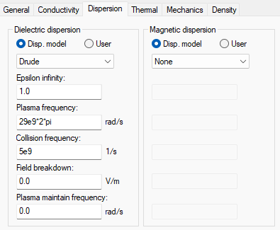

# 宽带信号在色散介质中的传播机理与误差量化

## 引言

传统LFMCW雷达假设电磁波在自由空间或非色散介质中传播,此时群时延为常数,差频信号呈现为单一频率的正弦波。然而,等离子体作为典型的色散介质,其折射率随频率变化,导致不同频率分量的传播速度存在显著差异。为了建立色散条件下的准确信道模型,本节将从等离子体的复介电常数出发,严格推导群时延的解析表达式,并揭示电子密度与碰撞频率对时延观测量的不同控制机理;在此基础上,构建全频段"频率-群时延"非线性映射关系,为后续反演算法提供正向算子;最后,定义群时延非线性度因子 $\eta$,为定量评估色散效应的严重程度提供数学工具。

## 3.1 色散信道的物理建模与参数定义

传统LFMCW雷达假设电磁波在自由空间或非色散介质中传播,此时群时延为常数,差频信号呈现为单一频率的正弦波。然而,等离子体作为典型的色散介质,其折射率随频率变化,导致不同频率分量的传播速度存在显著差异。为了建立色散条件下的准确信道模型,本节将从等离子体的复介电常数出发,严格推导群时延的解析表达式,并揭示电子密度与碰撞频率对时延观测量的不同控制机理;在此基础上,构建全频段"频率-群时延"非线性映射关系,为后续反演算法提供正向算子;最后,定义群时延非线性度因子$\eta$,为定量评估色散效应的严重程度提供数学工具。

### 3.1.1 复介电常数与物理群时延的解析推导

为构建准确的信道模型,首先需明确电磁波在等离子体中的复传播特性。假设等离子体满足非磁化、各向同性冷等离子体近似条件。根据Drude自由电子气模型,等离子体的宏观电磁特性由内部电子在时变电磁场中的动力学行为决定。其复相对介电常数可表示为角频率$\omega$的函数:

$$\tilde{\varepsilon}_r(\omega) = \varepsilon_{r'}(\omega) - j\varepsilon_{r''}(\omega) = \left( 1 - \frac{\omega_p^2}{\omega^2 + \nu_e^2} \right) - j \left( \frac{\nu_e}{\omega} \frac{\omega_p^2}{\omega^2 + \nu_e^2} \right) \tag{3-1}$$

上式中,$\omega$为探测电磁波的角频率;$\omega_p$为等离子体特征角频率,其数值直接由电子密度$n_e$决定,表征了介质的本征振荡属性;$\nu_e$为电子与中性粒子的有效碰撞频率,表征了电磁能量转化为热能的损耗机制。从物理意义上解析,实部$\varepsilon_{r'}$决定了电磁波的相速度与色散特性,而虚部$\varepsilon_{r''}$则主导了信号幅度的衰减特性。

电磁波在有耗介质中的复传播常数$\tilde{k}$定义为:

$$\tilde{k}(\omega) = \frac{\omega}{c}\sqrt{\tilde{\varepsilon}_r(\omega)} = \beta(\omega) - j\alpha(\omega) \tag{3-2}$$

其中$\beta$为相位常数,$\alpha$为衰减常数。针对本文研究的Ka波段($f \sim 35\text{ GHz}$)透射诊断场景,通常满足高频弱碰撞条件,即探测频率远大于碰撞频率($\omega \gg \nu_e$),且高于截止频率($\omega > \omega_p$)。在此条件下,介质损耗角正切$\tan\delta = \varepsilon_{r''}/\varepsilon_{r'} \ll 1$,复传播常数的实部(相位常数)主要由介电常数的实部主导。对式(3-2)进行二项式展开并忽略高阶虚部项,可得相位常数$\beta$的近似表达:

$$\beta(\omega) \approx \frac{\omega}{c}\sqrt{1-\frac{\omega_p^2}{\omega^2+\nu_e^2}} \tag{3-3}$$

该式表明,即使在考虑损耗的情况下,相位常数依然保持实数形式的主导地位,这为利用相位或时延信息进行参数反演提供了理论可行性。

对于宽带LFMCW信号,信号包络的传播速度由群速度$v_g$描述。定义电磁波穿过物理厚度为$d$的等离子体层的物理群时延$\tau_g$为相位谱对角频率的一阶导数:

$$\tau_g(\omega) = d \cdot \frac{d\beta(\omega)}{d\omega} \tag{3-4}$$

为了精确量化碰撞频率对群时延的影响,本文不直接使用无碰撞近似,而是对包含$\nu_e$的式(3-3)进行严格的解析微分。应用复合函数求导法则(链式法则):

$$\frac{d\beta}{d\omega} = \frac{1}{c} \frac{d}{d\omega} \left[ \omega \left( 1 - \frac{\omega_p^2}{\omega^2+\nu_e^2} \right)^{1/2} \right] \tag{3-5}$$

展开计算过程,第一项为对$\omega$求导,第二项为对根号内函数求导:

$$\frac{d\beta}{d\omega} = \frac{1}{c} \left[ \sqrt{1-\frac{\omega_p^2}{\omega^2+\nu_e^2}} + \omega \cdot \frac{1}{2} \left( 1 - \frac{\omega_p^2}{\omega^2+\nu_e^2} \right)^{-1/2} \cdot \frac{2\omega\omega_p^2}{(\omega^2+\nu_e^2)^2} \right] \tag{3-6}$$

经过通分与代数化简,提取公因子,最终得到完整群时延解析表达式:

$$\tau_g(\omega, \omega_p, \nu_e) = \frac{d}{c} \cdot \frac{1}{\sqrt{1-\frac{\omega_p^2}{\omega^2+\nu_e^2}}} \cdot \left[ 1 - \frac{\omega_p^2 \nu_e^2}{(\omega^2+\nu_e^2)^2} \right] \tag{3-7}$$

为了直观量化碰撞频率对群时延的贡献权重,引入无量纲小量$\delta$来表征损耗因子的相对强度:

$$\delta = \left( \frac{\nu_e}{\omega} \right)^2 \tag{3-8}$$

在微波诊断的典型高频条件下($\omega \gg \nu_e$),该因子满足$\delta \ll 1$。利用关系式$\omega^2 + \nu_e^2 = \omega^2(1+\delta)$,将含损耗的群时延解析导数重写为仅包含$\omega_p$、$\omega$与$\delta$的形式:

$$\tau_g(\omega) = \frac{d}{c} \frac{1}{\sqrt{1-\frac{\omega_p^2}{\omega^2(1+\delta)}}} \left[ 1 - \frac{\omega_p^2}{\omega^2} \frac{\delta}{(1+\delta)^2} \right] \tag{3-9}$$

上式精确描述了群时延与微扰量$\delta$的函数关系。为了明确各物理量的贡献层级,利用泰勒级数近似$(1+\delta)^{-1/2} \approx 1-\delta/2$及$(1+\delta)^{-2} \approx 1-2\delta$,并将式(3-9)展开,忽略$\delta^2$的高阶项,可得群时延的近似表达式:

$$\tau_g(\omega) \approx \frac{d}{c\sqrt{1-(\omega_p / \omega)^2}} \left[ 1 - \left( \frac{1}{2} \frac{(\omega_p / \omega)^2}{1-(\omega_p / \omega)^2} + \frac{\omega_p^2}{\omega^2} \right) \delta \right] \tag{3-10}$$

基于式(3-10)的近似解析表达,可以清晰地揭示物理参数对群时延观测量的控制规律。首先,特征角频率$\omega_p$(即电子密度$n_e$)位于主导项的分母中,直接决定了群时延曲线的整体拓扑形态;特别是当探测频率逼近截止频率($\omega \to \omega_p$)时,主导项呈奇异性增长,表现为群时延的"渐近发散"特征——这正是利用群时延信息高灵敏度反演电子密度的物理基础。与之相对,碰撞频率$\nu_e$对群时延的所有修正贡献均通过无量纲量$\delta = (\nu_e/\omega)^2$引入;由于$\delta \ll 1$,群时延对碰撞频率的敏感度仅为二阶无穷小量,即便在强损耗环境下,其引发的时延修正量级也远低于电子密度主导的一阶变化。进一步地,若对比电磁波的衰减特性可知,衰减常数$\alpha$与$\nu_e$呈一阶线性关系,这意味着群时延特征对电子密度表现出"高敏感性"、对碰撞频率表现出"强钝感性",而幅度衰减特征则恰好相反。这种"时延-衰减"敏感度的各向异性,为后续参数解耦策略的确立提供了物理依据。

上述推导从数学本质上证明了:在LFMCW透射诊断中,群时延是电子密度的强函数、碰撞频率的弱函数。这一物理事实为第四章的反演策略提供了坚实的理论支撑——即在基于时延/频率特征的参数反演模型中,可以安全地忽略$\nu_e$的二阶时延贡献(或将其固化为先验常数),从而将原本数学上不适定的多参数反演问题转化为良态的单参数优化问题,且不会引入显著的系统性模型误差。

### 3.1.2 全频段"频率-群时延"非线性映射观测模型构建

上一节推导了群时延的物理解析式,并从数学上证明了群时延是电子密度的强函数、碰撞频率的弱函数。本节将在此基础上,结合LFMCW雷达的实际工作体制,构建从射频探测频率$f$到相对群时延$\Delta\tau_g$的全频段宏观观测模型。该模型是连接雷达测量数据与介质物理参数的直接桥梁,也是第四章反演算法中的核心正向算子(Forward Operator)。

在实际的微波透射诊断实验中,为了消除测试线缆、收发天线及自由空间路径带来的系统固有延迟,通常采用"有无等离子体"的差分测量模式。雷达系统实际提取的物理量为**相对群时延(Relative Group Delay)** $\Delta\tau_g$,定义为电磁波穿过等离子体介质的物理群时延$\tau_g$与穿过同等物理厚度$d$的真空(或空气)群时延$\tau_0$之差:

$$\Delta\tau_g(\omega) = \tau_g(\omega) - \tau_0 = \tau_g(\omega) - \frac{d}{c} \tag{3-11}$$

为了保证物理模型的完备性,首先建立包含碰撞频率二阶微扰的完整观测方程。依据工程测量标准,将角频率$\omega$转换为线性频率$f$($\omega = 2\pi f$),并将等离子体特征角频率$\omega_p$转换为截止频率$f_p$($f_p = \omega_p / 2\pi$)。

将式(3-7)代入观测定义,全频段内的频率-时延映射关系$\mathcal{M}_{full}$可表述为:

$$\Delta\tau_g(f) = \mathcal{M}_{full}(f; f_p, d, \nu_e) \approx \frac{d}{c} \left\{ \frac{1}{\sqrt{1-(f_p/f)^2}} \left[ 1 - \Psi(f) \cdot \delta(f) \right] - 1 \right\} \tag{3-12}$$

其中,$\delta(f) = (\nu_e / 2\pi f)^2$为无量纲损耗因子,$\Psi(f)$为源自3.1.1节推导的二阶修正系数:

$$\Psi(f) = \frac{1}{2} \frac{(f_p/f)^2}{1-(f_p/f)^2} + \left(\frac{f_p}{f}\right)^2 \tag{3-13}$$

式(3-12)完整描述了色散介质中群时延随频率演化的精细结构。它表明,观测到的群时延曲线不仅受截止频率$f_p$(电子密度)控制,在理论上还受到碰撞频率$\nu_e$的微弱调制。

尽管式(3-12)在物理上最为严谨,但在反演工程中,直接使用该模型进行多参数($f_p, \nu_e, d$)拟合面临"病态求解"风险。基于3.1.1节"参数敏感度量级判定"的结论:**碰撞频率引入的修正项$\Psi \cdot \delta$属于二阶无穷小量**。在Ka波段典型诊断场景下($f \sim 35\text{ GHz}, \nu_e \sim 1.5\text{ GHz}$),该修正项引起的时延偏差远低于雷达系统的时间分辨率及噪声基底。

因此,为了构建鲁棒的参数反演算子,可安全地剔除碰撞频率的二阶微扰项,仅保留电子密度的一阶主导项。简化后的**"频率-群时延"非线性映射算子** $\mathcal{M}$定义为:

$$\Delta\tau_g(f) = \mathcal{M}(f; f_p, d) = \frac{d}{c} \left( \frac{1}{\sqrt{1 - (f_p/f)^2}} - 1 \right), \quad (f > f_p) \tag{3-14}$$

该映射模型$\mathcal{M}$具有以下关键数学特征,决定了后续信号处理算法的设计方向。与空气中恒定的群时延不同,$\Delta\tau_g(f)$是探测频率$f$的强非线性函数,这意味着宽带LFMCW信号的每一个频率分量都将经历不同的延迟,导致时域回波包络的弥散。当探测频率逼近截止频率($f \to f_p^+$)时,分母趋于零,相对群时延呈双曲线形式急剧发散($\lim \Delta\tau_g \to +\infty$),此处为电子密度的"高灵敏度观测区",微小的密度变化都会引起时延的显著变化。相反,当$f \gg f_p$时,利用泰勒展开可知$\Delta\tau_g \approx d(f_p/f)^2/(2c)$,此时曲线趋于平坦,色散效应减弱,模型退化为传统单频干涉法的线性近似。

值得注意的是,式(3-14)仅描述了静态频率点$f$与相对群时延$\Delta\tau_g$的映射关系。然而,在LFMCW雷达体制下,发射信号的瞬时频率$f(t)$是随时间$t$线性扫描的($f(t) = f_0 + Kt$,其中$K$为调频斜率)。这意味着,当宽带信号在介质中传播时,介质固有的"频率色散特性"将被雷达的扫频机制强制转化为回波信号的"时变时延特性"。为了后续能准确计算接收信号的相位,需要恢复信号传播的**总物理群时延** $\tau_g(t)$:

$$\tau_g(t) = \tau_{total}(t) = \underbrace{\mathcal{M}(f_0 + Kt; f_p, d)}_{\text{时变相对部分}} + \underbrace{\frac{d}{c}}_{\text{恒定真空基底}} \tag{3-15}$$

式(3-15)揭示了LFMCW系统中色散效应的特殊表现形式。原本在频域上依赖于$f$的非线性函数$\mathcal{M}(f)$,通过$f \to f_0+Kt$的变量代换,在时域上直接映射为随时间$t$大幅变化的时延函数$\tau_g(t)$。传统FMCW测距依赖于"回波时延$\tau$为常数"这一核心假设,而上式表明,在色散介质中,$\tau_g(t)$不再是常数,而是一个与时间相关的变量。**这种"时变时延"直接破坏了差频信号的稳态特性**——即回波与发射信号混频后,将不再产生单一频率的正弦波,而是产生一个频率随时间滑动的类Chirp信号。式中的$\mathcal{M}$项包含了截止频率$f_p$的高度非线性信息,这预示着,如果仍然沿用传统的线性FFT算法处理该信号,这种时变特性将直接导致频谱能量的**非线性弥散(散焦)**与**主峰偏移(测距误差)**,这也正是后续章节进行误差量化与算法改进的物理根源。

### 3.1.3 关键参数定义:群时延非线性度因子($\eta$)的数学表征

为了定量表征色散效应对LFMCW宽带信号的具体影响程度,并为后续章节建立色散忽略阈值提供数学依据,需引入无量纲参数对信道的非线性强弱进行标定。

从严格的数学角度,群时延的非线性特性(即群时延对频率的导数)由介质的复介电常数全参数决定。理论上,包含碰撞频率$\nu_e$的完整非线性度表达极其复杂,且缺乏直观的物理指向性。基于3.1.1节"参数敏感度量级判定"的结论,碰撞频率对群时延的贡献仅为二阶微扰;根据微扰理论,若原函数的微扰项可忽略,其一阶导数的趋势通常由主导项决定。

本文定义群时延非线性度因子$\eta$,表征在雷达信号带宽$B$范围内,群时延随频率变化的剧烈程度相对于基础真空时延$\tau_0$的比率。其数学定义基于**群时延色散率(Group Delay Dispersion, GDD)** $D_2(f) = d\tau_g/df$ 的归一化模值:

$$\eta(f) \triangleq \frac{1}{\tau_0} \cdot \left| \frac{d\tau_g(f)}{df} \right| \cdot B \tag{3-16}$$

其中,$\tau_0 = d/c$为真空中的基础传播时延。该定义本质上描述了在带宽$B$内,由色散引起的线性时延变化量占总时延的比例。

将简化后的工程主导模型$\tau_g(f) = \frac{d}{c} [1-(f_p/f)^2]^{-1/2}$代入式(3-16)。首先计算群时延对频率的一阶导数(GDD):

$$\frac{d\tau_g(f)}{df} = \frac{d}{c} \cdot \frac{d}{df} \left[ 1 - \left(\frac{f_p}{f}\right)^2 \right]^{-\frac{1}{2}} = \frac{d}{c} \cdot \left( -\frac{1}{2} \right) \left[ 1 - \left(\frac{f_p}{f}\right)^2 \right]^{-\frac{3}{2}} \cdot \left( -2f_p^2 f^{-3} \right) \tag{3-17}$$

化简整理得:

$$\frac{d\tau_g(f)}{df} = -\tau_0 \cdot \frac{1}{f} \cdot \frac{(f_p/f)^2}{\left[ 1 - (f_p/f)^2 \right]^{3/2}} \tag{3-18}$$

将式(3-18)的模值代入定义式(3-16),消去$\tau_0$,最终得到$\eta$关于探测频率$f$与截止频率$f_p$的**显式解析表达**:

$$\eta(f) = \frac{B}{f} \cdot \frac{(f_p/f)^2}{\left[ 1 - (f_p/f)^2 \right]^{\frac{3}{2}}}, \quad (f > f_p) \tag{3-19}$$

式(3-19)深刻揭示了信道非线性与介质参数及雷达参数的内禀关系。当探测频率逼近截止频率时,分母趋于零,$\eta(f)$急剧增大($\lim_{f \to f_p} \eta = \infty$),这表明在截止区附近,微小的频率变化也会引发显著的时延变化,这也是3.2.3节仿真中"电子密度高敏感性"的数学根源。相反,当探测频率远高于截止频率时,分母近似为1,此时$\eta(f) \approx B(f_p/f)^2/f \propto f^{-3}$,非线性度迅速衰减,信道近似线性。此外,$\eta$与信号带宽$B$成正比,这揭示了一个重要的工程权衡:增大带宽$B$虽然能提高理论分辨率,但也会直接导致非线性度$\eta$升高,从而加剧色散带来的波形畸变,这一矛盾正是本文第四章提出非线性反演算法的出发点。

非线性度因子$\eta$的引入,为定量评估色散效应提供了明确的数学工具。该参数将介质物理特性($f_p$)、雷达系统参数($B$)与传播特性($\tau_0$)有机结合,能够直观反映信道非线性的强弱程度。基于$\eta$的量化表征,可以预判在特定工作条件下色散效应对测量精度的影响,从而为系统设计与算法选择提供理论依据。后续3.4.2节将在此基础上,进一步推导色散效应忽略阈值的工程判据,明确传统方法的适用边界与高级算法的引入时机。

## 3.2 色散效应下群时延曲线的非线性演化特征

3.1节从理论层面建立了色散信道的物理模型,推导了群时延的解析表达式,并揭示了电子密度与碰撞频率对时延观测量的不同控制机理。本节将通过数值仿真的方式,对这些理论预测进行定量验证,重点考察群时延曲线在多维参数空间中的演化规律。通过构建典型等离子体参数空间的仿真环境,本节将直观展示截止频率附近的时延渐近发散特征,并揭示一个对参数反演具有重要指导意义的物理现象:不同参数组合可能导致时延曲线在某些频段发生相交,这种"多解性问题"将直接影响反演算法的设计策略。

### 3.2.1 多维参数空间的仿真环境构建

为验证3.1节推导的理论模型,需要建立包含电子密度 $n_e$ 与碰撞频率 $\nu_e$ 的多维参数空间仿真环境。仿真环境的构建遵循Ka波段LFMCW雷达的典型工作条件,并与本文实验系统的物理参数保持一致。

为了探究宽带电磁波在强色散区域的传播行为,本文基于 CST Microwave Studio 构建了全波电磁仿真模型,对电磁波穿过物理厚度 $d=150\ \text{mm}$ 的等离子体平板层时的 $S$ 参数进行提取。仿真设定等离子体电子密度对应截止频率,碰撞频率作为可调参数,具体模型与材料设置如下。

图 3-1 CST 仿真模型

图 3-2 等离子体模型设置界面图

探测频段设定为20-40 GHz,涵盖Ka波段中心频率34 GHz及其扩展范围。该频段选择基于以下考虑:首先,低频边界(20 GHz)接近典型等离子体的截止频率,能够观察到强色散效应;其次,高频边界(40 GHz)对应弱色散区,可验证模型在不同色散强度下的适用性;此外,该频段与实际雷达系统的可用带宽($B \approx 4$ GHz)相匹配,确保仿真条件的工程真实性。频率采样点数设置为1000点,采用线性均匀分布,满足数值微分计算群时延时对频率分辨率的要求。

等离子体物理参数的选取参考航天再入黑障场景的典型值。电子密度 $n_e$ 的基准值设定为 $1.04 \times 10^{19}\ \text{m}^{-3}$,对应的截止频率 $f_p \approx 29\ \text{GHz}$,处于探测频段的中央位置,既能展现截止频率附近的奇异性,又能在高频段观察到色散减弱的趋势。碰撞频率 $\nu_e$ 的基准值取 $1.5\ \text{GHz}$,这是典型再入条件下电子与中性粒子碰撞的合理估计。等离子体层的物理厚度 $d$ 设定为150 mm,这是实验室尺度诊断腔体的常见尺寸,也符合飞行器鞘套的典型量级。

仿真过程中,通过3.1.1节推导的完整Drude模型计算复介电常数 $\tilde{\varepsilon}_r(\omega)$,进而求得复传播常数 $\tilde{k}(\omega)$。群时延的计算采用相位谱数值微分法:首先计算传递函数

$$H(\omega) = \exp(-\tilde{k}d)$$

并对相位进行解缠绕(unwrap)处理以消除 $2\pi$ 跳变,随后利用中心差分法计算群时延

$$\tau_g = -\frac{d\phi}{d\omega}$$

为验证碰撞频率对幅度衰减的影响,同时计算透射系数的幅度 $|H(\omega)|$,并以dB为单位表示。

参数扫描策略采用单因子变化法,即固定其他参数,仅改变目标参数,以分离各物理量的独立影响。对于电子密度敏感性分析,保持 $\nu_e = 1.5\ \text{GHz}$ 不变,令电子密度在基准值附近变化 ±10%,对应截止频率范围为26-32 GHz;对于碰撞频率敏感性分析,保持 $n_e$ 为基准值,令碰撞频率在0.1-10 GHz范围内变化,跨越两个数量级,覆盖弱碰撞到强碰撞的全谱范围。这种参数配置既能清晰展现各参数的独立效应,又能避免参数耦合带来的解释困难,为定量验证3.1节的理论结论提供了坚实基础。

### 3.2.2 截止频率附近的群时延渐近发散特征与演化规律

基于上述仿真环境,本节首先验证3.1节理论推导中最核心的物理预测:群时延在截止频率附近的渐近发散特征。根据式(3-14),当探测频率 $f$ 逼近截止频率 $f_p$ 时,相对群时延 $\Delta\tau_g$ 呈双曲线形式发散,即 $\lim_{f \to f_p^+}\Delta\tau_g = +\infty$。这一奇异性不仅是色散效应的直接体现,也是电子密度高灵敏度反演的物理基础。

图 3-3 MATLAB 理论计算的 Drude 模型时延曲线

图3-3展示了基于Drude模型的MATLAB理论计算结果,其中子图(a)为电子密度敏感性分析,子图(b)为碰撞频率敏感性分析。在电子密度敏感性分析中,仿真设置三组电子密度: $n_e = 9.4 \times 10^{18}\ \text{m}^{-3}$、$1.04 \times 10^{19}\ \text{m}^{-3}$ 和 $1.14 \times 10^{19}\ \text{m}^{-3}$,分别对应 $f_p \approx 27.6\ \text{GHz}$、$29.0\ \text{GHz}$ 和 $30.4\ \text{GHz}$,碰撞频率均固定为 $\nu_e = 1.5\ \text{GHz}$。如图所示,三条曲线在高频区($f > 35$ GHz)趋于重合,时延值约为4.5 ns,这验证了式(3-14)的高频渐近特性:当 $f \gg f_p$ 时,非线性项退化为二阶小量,不同 $f_p$ 导致的差异被 $f^{-2}$ 衰减掩盖。然而,当频率向低频方向移动,逼近各自的截止频率时,曲线形态发生剧烈分化,呈现典型的渐近发散特征。

图3-3(b)展示了碰撞频率对群时延的影响。固定截止频率 $f_p = 29.0\ \text{GHz}$,令碰撞频率分别取 $\nu_e = 1.5$、$3.0$、$5.0\ \text{GHz}$。结果表明,三条群时延曲线几乎完全重合,验证了3.1.1节关于碰撞频率对群时延影响仅为二阶微扰的理论判断。然而,透射幅度 $|S_{21}|$ 对碰撞频率高度敏感: $\nu_e$ 从1.5 GHz增至5.0 GHz时,截止区的衰减从约-15 dB增至-30 dB以上。这种"时延钝感、幅度敏感"的解耦特性揭示了两个参数在观测量空间中的正交性,为后续反演算法的设计提供了物理依据。

为验证理论模型在真实电磁环境中的适用性,本文采用CST全波仿真平台对相同参数条件进行数值求解。图3-4展示了固定碰撞频率条件下不同电子密度的CST仿真结果,图3-5展示了固定截止频率条件下不同碰撞频率的CST仿真结果。

图 3-4 固定碰撞频率条件下不同电子密度的群时延曲线（CST 全波仿真）

图 3-5 固定截止频率条件下不同碰撞频率的群时延曲线（CST 全波仿真）

对比图3-3与图3-4、图3-5可以发现,CST全波仿真结果在整体趋势上与Drude理论高度吻合:电子密度变化导致曲线在截止频率附近显著分离,而碰撞频率变化对群时延曲线影响甚微。这一致性验证了3.1节建立的色散模型在Ka波段等离子体诊断中的有效性。

然而,CST仿真曲线与理论曲线存在一个显著差异:CST结果在平滑的色散基线之上叠加了周期性振荡。这一振荡现象并非仿真数值噪声,而是真实的物理干涉效应,即法布里-珀罗干涉。其物理机制可解释如下:等离子体介质的波阻抗 $Z_p = Z_0/\sqrt{\varepsilon_r} = Z_0/\sqrt{1-(f_p/f)^2}$ 与自由空间波阻抗 $Z_0$ 存在失配。当电磁波入射到有限厚度的等离子体板时,在前后两个介质界面处发生部分反射与透射,形成多径传播。这些多次反射的电磁波相互叠加,产生了类似于光学法布里-珀罗腔的干涉效应,导致传输相位,进而使群时延呈现周期性调制。

进一步分析曲线的斜率可以揭示群时延色散率(GDD)的演化规律。根据式(3-18), $d\tau_g/df$ 与 $\left[1-(f_p/f)^2\right]^{-3/2}$ 成正比,这意味着曲线斜率在截止频率附近呈超线性增长。仿真数据表明,对于 $f_p = 29\ \text{GHz}$ 的情况,在高频区 $f = 40\ \text{GHz}$ 处,曲线斜率约为 $-0.02\ \text{ns/GHz}$;而在 $f = 30\ \text{GHz}$ 处,斜率已陡化至 $-0.8\ \text{ns/GHz}$,增大了40倍。

对比不同 $f_p$ 的曲线族,可以清晰观察到截止频率对群时延曲线拓扑结构的决定性控制作用。$f_p$ 的微小变化(仅6%,从27.6 GHz到30.4 GHz)导致曲线在20-32 GHz频段发生显著分离,最大时延差异超过10 ns,远大于现代雷达系统的时间分辨率(通常优于0.1 ns)。这种"微小参数变化→宏观曲线分离"的物理机制,正是利用群时延进行电子密度高精度反演的信号基础。

值得注意的是,曲线在截止频率以下($f < f_p$)的行为同样具有物理意义。根据Drude模型,当 $f < f_p$ 时,介电常数 $\varepsilon_{r'}$ 变为负值,等离子体呈现金属特性,电磁波无法透射,此时复传播常数的实部 $\beta$ 转变为虚部,对应倏逝波的指数衰减。仿真中该区域的群时延计算会因数值解缠绕失效而出现奇异值,这在图3-4中表现为曲线在 $f < f_p$ 处的剧烈波动。这一仿真现象与理论预测完全一致,也提示在实际LFMCW系统设计时,工作带宽的下限频率必须严格高于等离子体的最大预期截止频率,以避免信号截止导致的诊断失效。

为系统揭示群时延曲线随电子密度的演化规律,本文利用CST仿真平台在26-40 GHz频段对不同量级电子密度条件下的群时延响应进行了系统性仿真。根据电子密度的数量级差异,可将演化规律划分为两个典型区间。

图 3-6 低电子密度区间 CST 仿真群时延曲线

低电子密度区间($n_e \leq 5 \times 10^{18}\ \text{m}^{-3}$):如图3-6所示,当电子密度较低时,分别取 $n_e = 1 \times 10^{17}$、$1 \times 10^{18}$、$5 \times 10^{18}\ \text{m}^{-3}$,对应截止频率 $f_p$ 分别约为2.8 GHz、9.0 GHz、20.1 GHz。此时群时延曲线在整个观测频段内呈现近似平坦的特征,时延值在4.3-4.7 ns范围内波动,且各曲线之间的差异极小(约0.1-0.3 ns)。这是因为在该参数区间, $f_p$ 远低于探测频段下限(26 GHz),即 $f/f_p > 1.3$,根据式(3-14)的渐近展开, $\sqrt{1-(f_p/f)^2} \approx 1$,色散效应退化为线性传播,非线性度因子 $\eta \ll 1$。此时曲线对 $n_e$ 的敏感性很弱,不同电子密度导致的曲线几乎完全重叠,提示低密度等离子体难以通过群时延进行精确诊断。

图 3-7 高电子密度区间 CST 仿真群时延曲线

高电子密度区间($n_e \geq 7 \times 10^{18}\ \text{m}^{-3}$):如图3-7所示,当电子密度升高至 $n_e = 7 \times 10^{18}$、$1.2 \times 10^{19}$、$1.4 \times 10^{19}\ \text{m}^{-3}$ 时,对应 $f_p$ 分别约为23.8 GHz、31.2 GHz、33.7 GHz,群时延曲线的演化呈现显著的非线性特征。首先,曲线分离度急剧增大:在低频段(26-32 GHz),不同 $n_e$ 对应的曲线发生明显分离,最大时延差异可达数ns量级。其次,当探测频率逼近截止频率($f \to f_p$)时,曲线斜率陡然增大,呈现明显的上翘趋势,这正是式(3-14)中分母 $\sqrt{1-(f_p/f)^2}$ 趋零导致的渐近发散特征。此外,在高频段($f > 36$ GHz),各曲线逐渐趋于收敛,差异减小至0.5 ns以内,验证了色散效应在 $f \gg f_p$ 时的弱化规律。

对比图3-6与图3-7还可以发现,法布里-珀罗振荡效应与电子密度存在明显的关联规律。在低电子密度区间,当 $f_p \ll f$ 时,波阻抗失配较小,界面反射系数 $\Gamma \approx 0$,多径效应很弱,曲线呈现光滑特征,振荡幅度仅约0.1 ns。然而在高电子密度区间,当 $f_p$ 接近观测频段时,波阻抗失配急剧加大,界面反射显著增强,形成强烈的驻波干涉,曲线振荡幅度可达0.5-1 ns,且在截止频率附近尤为剧烈。

这一干涉现象对参数反演算法设计具有重要启示:振荡引入的局部极值点会严重干扰传统基于"峰值检测"或"过零点检测"的测距算法,导致虚假目标或测量跳变。因此,本文所提算法必须通过滑动时频分析提取群时延的趋势特征,而非依赖单点的相位测量,以有效滤除界面多径效应的干扰。这一需求将在第四章的算法设计中得到具体体现。

综合上述分析,群时延曲线的演化规律可总结为:电子密度通过截止频率 $f_p$ 控制曲线的整体形态,低密度对应平坦曲线(弱色散),高密度对应陡峭曲线(强色散);当 $f_p$ 进入探测频段时,曲线非线性度急剧增强,不同 $n_e$ 导致的曲线分离度最大化,这为高密度等离子体的精确反演提供了理想的信号条件。同时,高密度条件下的法布里-珀罗干涉效应引入了额外的曲线振荡,这要求反演算法具备趋势提取与噪声抑制的能力。

### 3.2.3 多解性问题:不同参数组合下时延曲线的相交现象

3.2.2节的仿真揭示了群时延曲线对电子密度的高度敏感性,这为参数反演提供了物理基础。然而,灵敏度分析仅考察了单一参数变化对曲线的影响,并未回答一个关键问题:若同时改变电子密度 $n_e$ 和等离子体层厚度 $d$ 这两个待反演参数,是否可能出现不同参数组合 $(n_e^{(1)}, d^{(1)})$ 与 $(n_e^{(2)}, d^{(2)})$ 在某些频点产生相同群时延值的情况?若这种"等效替代"现象存在,则基于单点时延测量的参数反演将面临本征的多解性问题,即使测量精度无限高,也无法唯一确定等离子体参数。

为系统探究这一问题,设计如下多参数扫描仿真实验:在 $f \in [34, 37.5]\ \text{GHz}$ 频段,固定碰撞频率 $\nu_e = 1.5\ \text{GHz}$,构建二维参数空间。电子密度 $n_e$ 在 $[1.4, 1.5] \times 10^{19}\ \text{m}^{-3}$ 范围内均匀取10个值,对应截止频率 $f_p$ 约为33.7-34.9 GHz;等离子体层厚度 $d$ 在 $[0.20, 0.30]\ \text{m}$ 范围内均匀取20个值,共计生成 $10 \times 20 = 200$ 条群时延曲线。每条曲线由Drude模型计算得到

$$\tau_g(f) = \frac{d}{c}\left[\frac{1}{\sqrt{1-(f_p/f)^2}} - 1\right]$$

其中相对群时延 $\tau_g$ 表示相对于真空传播时延的额外延迟。

图 3-8 不同参数组合下群时延曲线的多解性交点

仿真结果如图3-8所示,图中灰色曲线代表200组不同 $(n_e, d)$ 参数组合生成的群时延曲线,红色圆点标记了物理有效的曲线交点。交点的筛选遵循两个准则:一是交点频率必须高于两条曲线中较大的截止频率,确保交点处于可传播频段;二是两组参数的差异度均超过5%,排除参数近似相等导致的"伪交点"。仿真结果显示,在可传播频段内存在大量物理有效交点,它们密集分布在35.5-37 GHz的频率区间,对应的时延值约在1.0-2.0 ns范围内。

这些交点的物理意义可从式(3-14)的结构进行解释。群时延 $\tau_g$ 是 $f_p$ 与 $d$ 的函数,其中 $d$ 以线性乘法因子出现,而 $f_p$ 通过分母中的双曲项控制曲线的非线性形态。因此,对于给定的观测频率 $f_0$,增大 $n_e$ 会导致时延增大;但若同时减小 $d$,两种效应可能相互抵消,使得不同 $(n_e, d)$ 组合产生相同的时延值 $\tau_g(f_0)$。数学上,方程 $\tau_g(f_0; n_e, d) = \tau_{\text{meas}}$ 定义了参数平面上的一条等值线,该等值线上的任意点都是单点测量的合法解。

这一现象揭示了参数反演中的多解性本质:若雷达系统仅在单个频点进行时延测量,则测得某一特定时延值时,存在无穷多组 $(n_e, d)$ 的组合满足观测约束,问题本征欠定。单一观测量无法唯一确定两个未知参数,其根源在于信息维度的不匹配。

然而,图3-8同时揭示了破解多解性的关键线索:虽然不同参数组合的曲线可能在某些频点相交,但它们的整体形状截然不同。根据式(3-14)的数学结构, $n_e$ 通过 $f_p$ 控制曲线的弯曲程度,而 $d$ 仅改变曲线的整体高度。因此,两条曲线即使在某一频点相交,其斜率和曲率也不可能同时相等,相交只能发生在孤立的离散频点,而无法在整个频段内保持。

这一几何特性为多点观测破解多解性提供了理论依据:若在多个频点进行时延测量,获得一组观测数据 $\{\tau_g(f_i)\}_{i=1}^N$ ,则可通过曲线拟合同步提取曲线的高度信息和形状信息,从而唯一确定两个参数。信息论角度而言,多点观测将单一的欠定约束升级为超定约束系统,通过冗余信息抑制参数耦合带来的不确定性。

这一结论对反演算法设计具有重要指导意义:传统的单频干涉法或单点相位测量方法,在色散介质诊断中面临本征的多解性风险,必须拓展为全频段曲线测量与拟合策略。对于LFMCW雷达而言,其宽带扫频特性天然契合这一需求,通过对差频信号进行时频分析,可提取全频段的群时延曲线,进而通过曲线拟合唯一确定 $(n_e, d)$ 参数对。这正是本文第四章提出滑动窗口时频分析与加权非线性反演方法的物理动机:利用雷达的频谱信息冗余度,将病态的欠定问题转化为良态的超定问题,从理论上消除多解性,确保反演结果的唯一性与鲁棒性。

## 3.3 色散效应对差频信号的调制机理与误差解析

3.1节建立了色散信道的物理模型,揭示了群时延随频率的非线性演化规律;3.2节通过CST与Matlab双重仿真验证了理论预测,展示了时延曲线的渐近发散特征与多解性问题。然而,这些分析均基于静态的"频率-时延"映射关系,尚未回答一个核心问题:在LFMCW雷达的动态扫频工作模式下,色散效应如何具体影响差频信号的波形与频谱?传统LFMCW测距理论假设群时延为常数,此时差频信号为单频正弦波,FFT可准确提取目标距离。但在色散介质中,式(3-15)已揭示群时延$\tau_g(t)$是时变函数,这必然导致差频信号相位的非线性畸变,进而引发频谱特征的根本性变化。本节将基于泰勒级数展开,严格推导色散条件下差频信号的时域与频域表达式,定量分析二阶色散导致的频谱散焦效应及其与系统带宽的耦合机制,为理解传统方法失效原因与设计新型反演算法提供理论依据。

### 3.3.1 群时延的二阶泰勒级数展开与时变时延模型

为建立色散条件下差频信号的解析表达式,首先需将时变群时延$\tau(\omega)$在角频率轴上展开。LFMCW发射信号的瞬时角频率$\omega(t)$随时间线性变化:$\omega(t) = \omega_0 + K' t$,其中$\omega_0 = 2\pi f_0$为起始角频率,$K' = 2\pi B/T_m$为角频率调制斜率,$B$为带宽,$T_m$为扫频周期。

在等离子体介质中传播时,电磁波的群时延$\tau(\omega)$是角频率$\omega$的函数。在$\omega_0$处对$\tau(\omega)$进行二阶泰勒级数展开:

$$\tau(\omega) = \tau_0 + \tau_1[\omega-\omega_0] + \frac{1}{2}\tau_2[\omega-\omega_0]^2 + \cdots \tag{3-20}$$

其中,$\tau_0 = \tau(\omega_0)$为起始角频率处的群时延,$\tau_1 = d\tau/d\omega|_{\omega=\omega_0}$为一阶导数,$\tau_2 = d^2\tau/d\omega^2|_{\omega=\omega_0}$为二阶导数。截断误差主要来自三阶及更高阶项,在扫频周期内可忽略。

将瞬时角频率$\omega(t) = \omega_0 + K't$代入式(3-20),得到时延随时间的演化:

$$\tau(t) = \tau(\omega(t)) = \tau_0 + \tau_1 K' t + \frac{1}{2}\tau_2 (K')^2 t^2 \tag{3-21}$$

为简化后续推导,引入中间变量:

$$A_0 = \tau_0, \quad A_1 = \tau_1 K', \quad A_2 = \frac{1}{2}\tau_2 (K')^2 \tag{3-22}$$

则时变时延可紧凑地表示为:

$$\tau(t) = A_0 + A_1 t + A_2 t^2 \tag{3-23}$$

该展开式揭示了时延演化的三个物理层次。零阶项$A_0 = \tau_0$为恒定基底,反映介质固有的传播时延;一阶项$A_1 t = \tau_1 K' t$描述时延的线性变化,物理上源自探测频率上升导致的群速度改变,由群时延对角频率的一阶导数$\tau_1$决定;二阶项$A_2 t^2 = \tau_2 (K')^2 t^2/2$表征时延变化的非线性度,源自色散率随频率的非均匀分布,由二阶导数$\tau_2$控制。值得注意的是,$A_2$与调频斜率平方$(K')^2 \propto B^2/T_m^2$成正比,预示着带宽$B$对非线性效应具有平方放大作用。

根据3.1节式(3-14)的物理模型,可计算$\tau_1$和$\tau_2$的显式表达。利用$\tau_g(f) = \frac{d}{c}[1-(f_p/f)^2]^{-1/2}$,通过链式法则$d\tau/d\omega = (d\tau/df)\cdot(df/d\omega) = (1/2\pi)(d\tau/df)$,在$\omega = \omega_0$(即$f = f_0$)处计算,结合式(3-18)可得:

$$\tau_1 = \frac{1}{2\pi} \cdot \left(-\frac{\tau_0}{f_0} \cdot \frac{(f_p/f_0)^2}{[1-(f_p/f_0)^2]^{3/2}}\right) \tag{3-24}$$

其符号为负($\tau_1 < 0$),表明瞬时频率上升时时延单调下降,反映高频信号在色散介质中传播更快的物理本质。二阶导数$\tau_2 = d^2\tau/d\omega^2$可通过对式(3-24)再次求导获得。利用链式法则$d^2\tau/d\omega^2 = (1/(2\pi)^2)(d^2\tau/df^2)$,并对式(3-18)求二阶频率导数,在$f=f_0$处计算可得:

$$\tau_2 = \frac{1}{(2\pi)^2} \cdot \frac{\tau_0}{f_0^2} \left[ \frac{3(f_p/f_0)^4}{[1-(f_p/f_0)^2]^{5/2}} + \frac{(f_p/f_0)^2}{[1-(f_p/f_0)^2]^{3/2}} \right] \tag{3-25}$$

式(3-25)表明,$\tau_2$在截止频率附近呈奇异性增长,主导项与$[1-(f_p/f_0)^2]^{-5/2}$成正比,这正是二阶色散效应在强色散区显著的根源。

### 3.3.2 差频信号相位的非线性畸变与瞬时频率解析

在3.3.1节建立的时变时延模型基础上,本节推导色散条件下差频信号的精确相位表达式。LFMCW雷达发射信号的复包络为:

$$s_T(t) = \exp\left\{j\left[\omega_0 t + \pi \frac{B}{T_m} t^2\right]\right\} \tag{3-26}$$

其相位为$\phi_T(t) = \omega_0 t + \pi B t^2/T_m$。接收信号经过色散介质传播后,产生时变时延$\tau(t)$,接收信号可表示为:

$$s_R(t) = \exp\left\{j\left[\omega_0[t-\tau(t)] + \pi\frac{B}{T_m}[t-\tau(t)]^2\right]\right\} \tag{3-27}$$

混频器输出差频信号$s_D(t) = s_T(t) s_R^*(t)$,其相位为:

$$\Delta\phi(t) = \phi_T(t) - \phi_R(t) \tag{3-28}$$

展开接收信号的相位:

$$\phi_R(t) = \omega_0[t-\tau(t)] + \pi\frac{B}{T_m}[t-\tau(t)]^2 \tag{3-29}$$

因此差频相位为:

$$\Delta\phi(t) = \omega_0 t + \pi\frac{B}{T_m}t^2 - \left\{\omega_0[t-\tau(t)] + \pi\frac{B}{T_m}[t-\tau(t)]^2\right\} \tag{3-30}$$

整理得:

$$\Delta\phi(t) = \omega_0 \tau(t) + \pi\frac{B}{T_m}\left\{2t\,\tau(t) - \tau^2(t)\right\} \tag{3-31}$$

将式(3-23)的泰勒展开$\tau(t) = A_0 + A_1 t + A_2 t^2$代入,并保留至$t^2$项(忽略$t^3$及更高阶)。计算过程需分别展开各项:

**第一部分**:$\omega_0 \tau(t)$的展开

$$\omega_0 \tau(t) = \omega_0[A_0 + A_1 t + A_2 t^2] = \omega_0 A_0 + \omega_0 A_1 t + \omega_0 A_2 t^2 \tag{3-32}$$

**第二部分**:$2t\,\tau(t)$的展开

$$2t\,\tau(t) = 2t[A_0 + A_1 t + A_2 t^2] = 2A_0 t + 2A_1 t^2 + 2A_2 t^3 \tag{3-33}$$

其中$2A_2 t^3$为三阶项,舍去,故:

$$2t\,\tau(t) \approx 2A_0 t + 2A_1 t^2 \tag{3-34}$$

**第三部分**:$\tau^2(t)$的展开

$$\tau^2(t) = [A_0 + A_1 t + A_2 t^2]^2 = A_0^2 + 2A_0 A_1 t + (A_1^2 + 2A_0 A_2)t^2 + \text{(高阶)} \tag{3-35}$$

**合并第二部分**:$\pi B\{2t\,\tau(t) - \tau^2(t)\}/T_m$

$$\pi\frac{B}{T_m}\left\{2A_0 t + 2A_1 t^2 - [A_0^2 + 2A_0 A_1 t + (A_1^2+2A_0 A_2)t^2]\right\} \tag{3-36}$$

按各阶次整理:

- 常数项:$-\pi B A_0^2/T_m$
- 线性项:$\pi B[2A_0 t - 2A_0 A_1 t]/T_m = 2\pi B A_0(1-A_1)t/T_m$
- 二次项:$\pi B[2A_1 t^2 - (A_1^2+2A_0 A_2)t^2]/T_m$

**最终相位展开**:将两部分相加

$$\Delta\phi(t) = \phi_0 + L t + Q t^2 \tag{3-37}$$

其中各系数为:

**常数项**:

$$\phi_0 = \omega_0 A_0 - \pi\frac{B}{T_m}A_0^2 = \omega_0 \tau_0 - \pi\frac{B}{T_m}\tau_0^2 \tag{3-38}$$

**线性项系数**:

$$L = \omega_0 A_1 + 2\pi\frac{B}{T_m}A_0 - 2\pi\frac{B}{T_m}A_0 A_1 \tag{3-39}$$

将$A_0 = \tau_0$、$A_1 = \tau_1 K'$代入:

$$L = \omega_0 \tau_1 K' + 2\pi\frac{B}{T_m}\tau_0(1-\tau_1 K') \tag{3-40}$$

定义差频中心频率$f_D'$使得$2\pi f_D' = L$,即:

$$f_D' = \frac{1}{2\pi}\left[\omega_0 \tau_1 K' + 2\pi\frac{B}{T_m}\tau_0(1-\tau_1 K')\right] \tag{3-41}$$

**二次项系数**:

$$Q = \omega_0 A_2 + 2\pi\frac{B}{T_m}A_1 - \pi\frac{B}{T_m}(A_1^2+2A_0 A_2) \tag{3-42}$$

定义$\pi\alpha = Q$,即$\alpha = Q/\pi$,代入$A_1 = \tau_1 K'$、$A_2 = \tau_2(K')^2/2$:

$$\alpha = \frac{\omega_0 \tau_2 (K')^2}{2\pi} + \frac{2B}{T_m}\tau_1 K' - \frac{B}{T_m}[(\tau_1 K')^2 + 2\tau_0 A_2] \tag{3-43}$$

由此,差频信号相位可最终表示为:

$$\Delta\phi(t) = \phi_0 + 2\pi f_D' t + \pi\alpha t^2 \tag{3-44}$$

式(3-44)揭示了色散效应对LFMCW差频信号的核心影响:相位不再是时间的线性函数,而是呈现抛物线型畸变。这一非线性特征直接体现在瞬时频率的时变性上。差频信号的瞬时频率定义为相位对时间的导数:

$$f_D(t) = \frac{1}{2\pi}\frac{d\Delta\phi}{dt} = f_D' + \alpha t \tag{3-45}$$

式(3-45)表明,瞬时频率随时间线性漂移,斜率为$\alpha$(单位:Hz/s)。这与传统无色散情况($\alpha=0$,$f_D=f_D'=$常数)形成鲜明对比。当$\alpha \neq 0$时,差频信号实际上是一个Chirp信号,其频率在扫频周期$T_m$内跨越范围$\Delta f_D = |\alpha| T_m$。物理上,$\alpha$的符号和大小由二阶色散系数$\tau_2$主导:若$\tau_2 > 0$(时延随角频率上凸),则$\alpha > 0$,瞬时频率上升;反之则下降。

为直观展示上述瞬时频率的时变特征,图3-2通过时频分析(Spectrogram)对比了无色散与强色散条件下差频信号的频率演化轨迹。如图3-2(a)所示,在理想无色散情况下,瞬时频率在整个调制周期内保持为恒定的水平线,验证了$\alpha=0$时$f_D(t)=f_D'$的理论预测。相比之下,图3-2(b)展示的强色散场景($f_p=29$ GHz)中,瞬时频率呈现显著的斜向Chirp轨迹,其斜率即为式(3-43)定义的$\alpha$。这一"水平线vs斜线"的鲜明对比,从时频域直观验证了式(3-45)描述的线性漂移机制,也清晰揭示了色散效应将差频信号从"稳态单频"强制转化为"非稳态Chirp"的物理过程。

### 3.3.3 频谱特征量化:二阶色散导致的散焦效应与带宽耦合机制

3.3.2节揭示了色散导致差频信号相位呈二次型畸变,瞬时频率随时间线性漂移。本节将这一时域特征映射到频域,定量分析对FFT频谱的影响,并建立频谱展宽与系统带宽的解析关系。

对于式(3-44)描述的Chirp信号$s_D(t) = \exp\{j[\phi_0 + 2\pi f_D' t + \pi\alpha t^2]\}$,瞬时频率在$t \in [0, T_m]$内从$f_D(0) = f_D'$变化到$f_D(T_m) = f_D' + \alpha T_m$。频谱展宽定义为瞬时频率的扫频范围:

$$\Delta f_D = |f_D(T_m) - f_D(0)| = |\alpha| T_m \tag{3-46}$$

式(3-46)揭示了频谱散焦的核心机理:展宽正比于二阶色散系数$\alpha$与扫频周期$T_m$的乘积。这一简洁关系的物理意义深刻:$\alpha$量化了色散导致的瞬时频率变化率,而$T_m$决定了这种变化的累积时间,二者乘积即为总的频率偏移量。

为建立$\Delta f_D$与带宽$B$的定量关系,需将式(3-43)中的$\alpha$展开为$B$的函数。注意到$K' = 2\pi B/T_m$,将$A_2 = \tau_2(K')^2/2 = 2\pi^2\tau_2 B^2/T_m^2$代入式(3-43),经过细致的代数运算:

$$\alpha = \frac{\omega_0 \tau_2}{2\pi} \cdot \left(2\pi\frac{B}{T_m}\right)^2 + \frac{2B}{T_m}\tau_1 \cdot 2\pi\frac{B}{T_m} - \frac{B}{T_m}\left[\left(\tau_1 \cdot 2\pi\frac{B}{T_m}\right)^2 + 4\pi^2\tau_0\tau_2\frac{B^2}{T_m^2}\right] \tag{3-47}$$

整理各项:

$$\alpha = 2\pi\frac{B^2}{T_m^2}(\omega_0\tau_2 + 2\tau_1) - 4\pi^2\frac{B^3}{T_m^3}(\tau_1^2 + \tau_0\tau_2) \tag{3-48}$$

将式(3-48)代入式(3-46):

$$\Delta f_D = T_m \left|2\pi\frac{B^2}{T_m^2}(\omega_0\tau_2+2\tau_1) - 4\pi^2\frac{B^3}{T_m^3}(\tau_1^2+\tau_0\tau_2)\right| \tag{3-49}$$

化简:

$$\Delta f_D = \left|2\pi\frac{B^2}{T_m}(\omega_0\tau_2+2\tau_1) - 4\pi^2\frac{B^3}{T_m^2}(\tau_1^2+\tau_0\tau_2)\right| \tag{3-50}$$

式(3-50)揭示了频谱展宽与带宽的复杂非线性关系。当$B$较小时,三次项$4\pi^2 B^3(\tau_1^2+\tau_0\tau_2)/T_m^2$相对二次项可忽略,此时:

$$\Delta f_D \approx 2\pi\frac{B^2}{T_m}|\omega_0\tau_2+2\tau_1| \tag{3-51}$$

式(3-51)表明频谱展宽与带宽呈二次方关系:$\Delta f_D \propto B^2$。这一非线性耦合机制具有深刻的工程含义。首先,增大带宽$B$虽然能提高理论距离分辨率($\delta r = c/(2B)$),但同时会平方倍地加剧频谱散焦,稀释信号能量,降低峰值信噪比。其次,系数$(\omega_0\tau_2+2\tau_1)$依赖于截止频率$f_p$和工作频率$f_0$,根据式(3-24),当$f_p$接近$f_0$时(强色散区),$\tau_2$呈奇异性增长,即使带宽不变,$\Delta f_D$也会急剧放大。

为直观验证上述展宽关系，图3-4展示了不同色散强度下差频信号的离散频谱特征。如图所示，在弱色散条件下（图3-4(a)，$f_p=25$~GHz），差频频谱呈现出近似理想的尖锐单峰结构，其 3~dB 主瓣宽度约为 20~kHz；随着色散程度的增强（图3-4(b)，$f_p=31$~GHz），主瓣宽度扩大至约 40~kHz；而在强色散区（图3-4(c)，$f_p=34$~GHz），频谱散焦进一步加剧，3~dB 带宽达到约 80~kHz。上述结果与式(3-51)所揭示的 $\Delta f_D \propto B^2$ 理论趋势一致，表明频谱主瓣宽度的变化直接反映了二阶色散系数随截止频率 $f_p$ 的非线性增长特性。

常规 LFMCW 信号处理中，单个调制周期内 FFT 的固有频率分辨率为 $\Delta f_{\mathrm{FFT}}=1/T_m$，该分辨率通常远小于强色散条件下产生的差频信号展宽。当色散引起的频谱展宽 $\Delta f_D$ 显著突破这一分辨率极限时，其影响已不仅表现为信噪比的下降，而是从根本上动摇了传统 LFMCW 测距方法所依赖的物理假设基础。具体而言，其破坏作用主要体现在两个方面：一是距离模糊与测距唯一性的削弱。频谱能量由原本集中的单一频点扩散至多个离散频格，本质上反映了介质色散将确定性的传播时延映射为分布式的时变时延过程，使得频谱峰值难以唯一对应目标的真实物理距离；二是显著的系统性时延偏置。在严重的频谱展宽与 FFT 栅栏效应共同作用下，传统峰值定位方法不仅会产生较大的随机估计误差，还会由于一阶色散系数 $\tau_1$ 的调制引入明显的系统性频移，从而导致纳秒量级的时延测量偏差。在强色散区，这意味着传统全频段 FFT 方法所得到的测距结果不仅趋于模糊，且在物理意义上已不再可靠。这一分析从物理层面揭示了引入本文所提出的滑动时频特征提取算法的必要性。

当带宽进一步增大时,式(3-50)的三次项开始显现。注意到式(3-50)可等价改写为更具物理洞察力的形式。定义$C_1 = \omega_0\tau_2+2\tau_1$、$C_2 = \tau_1^2+\tau_0\tau_2$,并引入角频率调频斜率$K' = 2\pi B/T_m$,则:

$$\Delta f_D = \frac{2\pi B^2}{T_m}\left|C_1 - 2\pi\frac{B}{T_m}C_2\right| = \frac{B \cdot K'}{2\pi}\left|C_1 - K' C_2\right| \tag{3-52}$$

式(3-52)揭示了一个反直觉的物理现象：随着调频斜率$K'$增加（即快速扫频），高阶色散项$C_2$的负贡献($-K' C_2$)可能部分抵消一阶项$C_1$的展宽效应，从而使$\Delta f_D$随$B$呈现非单调变化。当$C_1$与$C_2$符号相反时，存在满足$|C_1-K' C_2|=0$的带宽$B_0$，理论上对应“展宽最小点/零点”。仿真中选取一组$C_1,C_2$符号相反的参数，得到$B_0$位于1–3 GHz的多条解（图3-7），曲线呈“V”形，零点处展宽被压缩到极小值，直观验证了“展宽压缩”现象的存在。

当$2\pi B C_2/T_m$与$C_1$可比时，$\Delta f_D$将偏离简单的$B^2$规律并出现饱和甚至下降趋势。图3-5给出了$\Delta f_D$随$B$（1–5 GHz）的仿真曲线：小带宽区仍近似服从$\Delta f_D \propto B^2$（虚线为二次近似），当$B$增大后三次项修正显现，实线逐渐偏离二次近似并出现增速放缓。这表明系统存在“有效带宽”窗口，应在分辨率提升与散焦抑制之间权衡带宽取值；同时，$B_0$可作为理论上的参考点，为带宽优化提供定量依据。
在图3-5中，三条曲线分别对应两组色散系数与二次近似。虚线为$\Delta f_D \propto B^2$的二次近似曲线，体现随带宽平方增长的基准趋势；两条实线为完整模型结果。当$\tau_1$与$\tau_2$异号时，高阶项的叠加会使展宽随$B$的增长更“陡峭”，表现为加速增长；当$\tau_1$与$\tau_2$同号时，曲线相对更平缓，增长速度被抑制。这一对比说明色散系数的符号关系直接影响展宽随带宽的增长速率。

由此可见，色散并非仅带来“分辨率—散焦”的二元矛盾，而是揭示了差频信号的非稳态本质。传统FFT方法隐含假设差频信号为单频稳态信号,这在色散条件下已被根本性打破。利用第四章将提出的滑动窗口时频分析方法,可在时频平面上精确追踪瞬时频率$f_D(t)$的演化轨迹,**将传统方法眼中的"频谱噪声"还原为携带介质信息的"时变特征"**,从而实现从干扰源到信息源的根本性转变。这种范式转换的核心在于:不再将式(3-45)描述的$f_D(t) = f_D' + \alpha t$视为"相位畸变",而是将其视为可供反演的"时频编码"——$\alpha$的符号和大小直接关联二阶色散系数$\tau_2$,后者又由截止频率$f_p$(即电子密度$n_e$)唯一决定。因此,通过高精度估计$\alpha$,即可反推$n_e$,从"被动接受散焦"升级为"主动利用散焦"。

## 3.4 传统全频段分析方法的适用性边界

前述章节分别从物理建模(3.1)、仿真验证(3.2)和误差解析(3.3)三个层面,系统揭示了等离子体色散效应对LFMCW差频信号的调制机理。已经证明:在色散信道中,由于介质群速度的频率依赖性,传统测距方法依赖的"恒定时延假设"被根本性破坏,差频信号呈现出频率偏移与频谱散焦的双重失真特征。

然而,在工程实践中并非所有诊断场景都需要采用高级信号处理算法。若雷达系统带宽较窄或电子密度适中,色散引入的二阶效应可能被抑制在测量精度阈值以下,此时基于全频段FFT的传统方法仍可正常工作。建立量化的色散效应判别准则,对于系统设计具有重要的工程指导意义——既可避免算法过度设计导致的计算冗余,也能在强色散区提前预警并切换至高级处理模式。

本节将从信号失真机理与工程容差两个维度,系统建立传统测距方法的适用性边界。首先基于频率尺度畸变的物理本质,解析传统单频点检测模型在色散条件下的失配机理,说明为何简单的峰值频率提取会导致系统性测距偏差。在此基础上,通过严格的数学推导,建立"色散效应可忽略条件"的定量判据 $B \cdot \eta \cdot \tau_0 \le 1$,该判据综合了雷达带宽、介质非线性度和传播时延三个核心参数,为系统设计提供明确的参数界定。最后结合Ka波段等离子体诊断的实际工况,对该判据进行工程化量级分析,给出传统方法与高级算法的定量分界线。

---

### 3.4.1 频率尺度非线性扭曲下的传统模型失配机理分析

传统LFMCW测距算法的核心假设是:目标(或介质)引入的传播时延 $\tau$ 为常数,与发射信号的瞬时频率无关。在此前提下,经混频得到的差频信号 $s_D(t)$ 为单频正弦波,其频率 $f_D$ 与时延满足严格的线性关系:

$$f_D = K \cdot \tau \tag{3-53}$$

其中 $K = B/T_m$ 为频率调频斜率。该模型的信号处理流程极其简洁:对差频信号进行全时长FFT,提取频谱主峰位置 $f_{peak}$,直接反算时延 $\tau_{meas} = f_{peak}/K$。进而根据时延与距离的关系 $R = c\tau/2$(双程测距)或电子密度的关系 $n_e \propto f^2\tau$ 完成参数反演。

然而,上述线性映射关系的成立,严格依赖于"频率尺度的一致性"——发射信号的频率变化速率与回波信号的频率变化速率严格相等。这在数学上等价于要求信道的群时延 $\tau_g(f)$ 为常数,即介质不引入任何色散效应。从3.3.1节推导的时变时延模型 $\tau_g(t) = A_0 + A_1 t + A_2 t^2$ 可知,色散介质将这一假设完全打破。

##### 3.4.1.1 频率尺度非线性压缩的物理机制

为了直观揭示色散引起的失配根源,考察发射信号与接收信号在时频平面上的映射关系。发射信号在调制周期 $T_m$ 内,其瞬时频率从 $f_0$ 线性增加至 $f_0 + B$,频率增长速率恒为 $K$。然而,对于接收信号,由于其每个瞬时频率成分 $f(t)$ 经历的传播时延 $\tau_g[f(t)]$ 不同,回波信号的"有效频率轴"发生了非线性的畸变。

具体而言,当发射频率为 $f(t) = f_0 + Kt$ 时,该频率成分的回波抵达接收端的时刻为 $t' = t + \tau_g(f(t))$。由于 $\tau_g(f)$ 随 $f$ 单调递减(反常色散条件下),较高频率成分的回波到达时刻相对提前,导致接收信号的瞬时频率演化曲线在时间轴上发生"非线性压缩"。这种压缩效应在混频过程中表现为:不同时刻的差频频率 $f_D(t) = f_{TX}(t) - f_{RX}(t)$ 不再恒定,而是随时间 $t$ 线性漂移,对应于3.3.2节推导的 $f_D(t) = f'_0 + \alpha t$。

从频域角度看,传统方法假设差频信号的频谱为一个尖锐的Dirac函数(理想化)或窄带sinc函数(实际情况),其中心频率 $f_D$ 唯一确定。然而,色散导致的频率漂移使差频信号演化为宽带Chirp信号,其频谱能量从理论上的"单点集中"扩散为"连续带状分布"。这种频谱散焦效应直接破坏了传统峰值检测算法的物理基础——频谱主峰不再能唯一表征时延信息,其位置同时包含了真实时延 $\tau_0$ 与色散误差项的耦合贡献。

##### 3.4.1.2 传统模型的系统性测距偏差来源

基于3.3.2节推导的差频中心频率解析式(式3-41),在色散条件下实际测得的频率 $f'_0$ 为:

$$f'_0 = K\tau_0 + \frac{\omega_0}{2\pi}\tau_1 + \text{高阶项} \tag{3-54}$$

其中第一项 $K\tau_0$ 为理想无色散情况下的真实差频,第二项由一阶色散系数 $\tau_1$ 引入。由于载波角频率 $\omega_0$ 通常远大于带宽(Ka波段中 $\omega_0 \sim 2\times10^{11}$ rad/s,$B \sim  2\pi \times 3 \times 10^9$ rad/s),即便 $|\tau_1|$ 数值很小(约 $10^{-21}$ s²量级),该项也会引入显著的频率偏置。

若仍使用传统公式 $\tau_{meas} = f'_0/K$ 进行时延反算,测量值将系统性偏大:

$$\tau_{meas} = \tau_0 + \underbrace{\frac{\omega_0}{2\pi K}\tau_1}_{\text{系统误差项 } \Delta\tau_{sys}} \tag{3-55}$$

从3.3.3节的数值估算可知,在强色散区(接近截止频率),该系统误差可达真实时延的30%以上。这一偏差并非随机噪声引起,而是由色散效应系统性引入的模型失配,无法通过多次测量平均消除。

##### 3.4.1.3 栅栏效应与频谱展宽的耦合劣化

除频率中心的系统性偏移外,二阶色散 $\tau_2$ 引入的频谱展宽 $\Delta f_D$(式3-46)进一步恶化了传统FFT方法的性能。在有限采样时长 $T_m$ 下,FFT的频率分辨率为 $\delta f = 1/T_m$。若频谱展宽满足 $\Delta f_D \gg \delta f$,意味着差频能量分散到多个频率采样点上,主瓣峰值幅度按 $\sim 1/\Delta f_D$ 的比例下降,导致信噪比(SNR)严重劣化。

更严重的是,由于FFT采用的是离散频率网格,真实的峰值频率 $f'_0$ 往往不落在某个采样点上,而是位于两个相邻频点之间。这种"栅栏效应"在频谱尖锐时可通过插值或加窗缓解,但当频谱严重展宽时,主瓣形态失真,传统的抛物线插值或质心法将引入附加估计误差。定量分析表明,当 $\Delta f_D > 10\delta f$ 时,峰值定位误差可达数个分辨单元,换算为时延误差约0.1~1 ns量级,已超出诊断精度要求。

##### 3.4.1.4 物理失配的本质归因

综上所述,传统LFMCW测距模型在色散介质中的失效,本质上源于其隐含了"介质透明假设"——假定所有频率成分经历相同的传播速度。而等离子体的Drude色散特性从根本上违背了这一前提。色散效应将静态的频域非线性强制映射为动态的时域非平稳特性,使得差频信号从单频信号退化为调频信号。传统模型基于"稳态信号"设计的参数提取流程(FFT峰值检测),在处理"非稳态信号"时必然产生系统性失配。

这一失配机理的揭示,为下一节建立定量判据奠定了理论基础:只有当色散引入的时变效应足够微弱,使得 $|\alpha| \approx 0$ 且 $|\Delta\tau_{sys}|$ 被抑制在测量噪声以下时,传统方法才能安全使用。

---

### 3.4.2 色散效应忽略阈值($B \cdot \eta \cdot \tau_0 \le 1$)的理论推导与工程界定

为了建立传统测距方法与高级算法的定量分界线,本节基于FFT频率分辨率限制,从物理量纲分析的角度,严格推导色散效应可忽略的工程判据,并结合Ka波段等离子体诊断的实际参数进行量级分析,给出明确的适用性边界。

##### 3.4.2.1 判据推导的物理出发点:FFT分辨率限制

色散效应是否可忽略,其核心判定标准是:**色散引入的差频频率误差(或展宽)是否小于雷达系统的固有频率分辨率**。若误差被淹没在测量的最小可分辨单元内,则该误差在工程上不具有可观测性,可视为"忽略"。

LFMCW雷达通过对时长为 $T_m$ 的差频信号进行FFT分析,其频率分辨率(瑞利限)由采样定理严格决定:

$$\delta f = \frac{1}{T_m} \tag{3-56}$$

该分辨率为FFT频谱的主瓣宽度。物理上,它规定了系统能够区分两个相邻频率成分的最小间隔。因此,色散忽略的充要条件是频率展宽 $\Delta f_{beat}$ 满足:

$$\Delta f_{beat} \le \delta f = \frac{1}{T_m} \tag{3-57}$$

##### 3.4.2.2 差频展宽与群时延变化的线性映射

在LFMCW体制中,差频频率 $f_{beat}$ 与群时延 $\tau_g$ 之间满足严格的线性映射关系 $f_{beat} = K \cdot \tau_g$,其中 $K = B/T_m$ 为调频斜率。因此,由介质色散引起的群时延变化量 $\Delta \tau_{total}$,将直接通过调频斜率 $K$ 映射为差频信号的频率展宽。

根据3.1.3节的分析,在雷达带宽 $B$ 范围内,群时延随频率发生非线性漂移。定义带宽内的总时延变化量(取绝对值)为:

$$\Delta \tau_{total} = \left| \tau_g(f_{start} + B) - \tau_g(f_{start}) \right| \tag{3-58}$$

在弱色散或中等色散区,利用泰勒展开的线性化近似,该变化量可表示为:

$$\Delta \tau_{total} \approx \left| \frac{d\tau_g}{df} \right| \cdot B \tag{3-59}$$

代入差频公式,得到由色散引起的总频率展宽:

$$\Delta f_{beat} = K \cdot \Delta \tau_{total} = \frac{B}{T_m} \cdot \left( \left| \frac{d\tau_g}{df} \right| \cdot B \right) \tag{3-60}$$

注意,此处推导全程基于物理频率 $f$ (Hz),避免了角频率 $\omega$ 引入的 $2\pi$ 系数混淆,使得物理量纲分析更加清晰。

##### 3.4.2.3 引入非线性度因子 $\eta$ 与最终判据

为了使判据具有普适性,引入3.1.3节定义的无量纲非线性度因子 $\eta$。回顾定义式(3-16),$\eta$ 本质上表征了带宽内时延变化量相对于基础时延 $\tau_0$ 的比率:

$$\eta = \frac{1}{\tau_0} \cdot \Delta \tau_{total} \implies \Delta \tau_{total} = \eta \cdot \tau_0 \tag{3-61}$$

其中 $\tau_0 = d/c$ 为介质基础传播时延。将式(3-63)代入式(3-62),频率展宽可简洁地表示为三个核心参数的乘积:

$$\Delta f_{beat} = \frac{B}{T_m} \cdot (\eta \cdot \tau_0) \tag{3-62}$$

最后,将此结果代入分辨率限制条件 $\Delta f_{beat} \le 1/T_m$:

$$\frac{B \cdot \eta \cdot \tau_0}{T_m} \le \frac{1}{T_m} \tag{3-63}$$

在不等式两边同时消去调制周期 $T_m$,即得到最终的**色散效应忽略阈值工程判据**:

$$\boxed{B \cdot \eta \cdot \tau_0 \le 1} \tag{3-64}$$

该判据物理内涵极其清晰:雷达带宽 ($B$)、介质非线性度 ($\eta$) 和传播距离 ($\tau_0$) 三者的乘积必须小于1。这构成了系统设计的**"不可能三角"**——若要追求高分辨率(大 $B$)或诊断高密度等离子体(大 $\eta$),则必须缩短传播距离;反之亦然。

##### 3.4.2.4 Ka波段等离子体诊断的工程量级分析

为验证判据的实用性并明确传统方法的适用边界,现以典型Ka波段LFMCW诊断系统为例进行定量分析。考虑工作频段32.5-35.5 GHz、带宽 $B = 3$ GHz、调制周期 $T_m = 1$ ms的系统配置,介质厚度取 $d = 0.15$ m,对应基础时延 $\tau_0 = 0.5$ ns。

首先考察中等密度的安全工况。当电子密度约为 $n_e \approx 1.04 \times 10^{19}$ m$^{-3}$、对应截止频率 $f_p = 29$ GHz时,根据式(3-18)计算得非线性度因子 $\eta \approx 0.45$,代入工程判据可得 $\xi_A = B \cdot \eta \cdot \tau_0 \approx 0.68$。该值小于临界阈值1,表明色散引入的频率展宽尚在FFT分辨率限制内,传统峰值检测方法可以正常工作。

然而,当电子密度进一步升高、截止频率逼近 $f_p = 33.5$ GHz时,情形发生根本性改变。此时归一化频率比 $f_p/f_c \approx 0.985$,非线性度因子急剧恶化至 $\eta \approx 17.17$,相比前一工况增长约38倍。代入判据得 $\xi_B \approx 25.76$,显著突破临界阈值。对应的允许带宽仅约 $B_{max} \approx 0.59$ GHz,远低于系统带宽,频谱主瓣将显著展宽、峰值幅度衰减,传统峰值检测难以锁定真实时延。

图3-7从参数空间拓扑的角度直观展示了上述约束关系。判据临界曲线($\xi = 1$)呈现双曲线衰减特征,将参数空间划分为安全区与失效区。图中标注的两个典型工况形成鲜明对比:工况A位于曲线下方的安全区,而工况B则落入曲线上方的失效区。这种对比直观印证了判据突破的工程后果——当工作点越过临界曲线时,传统FFT峰值检测的可靠性将显著下降。

##### 3.4.2.5 工程启示与方法论展望

上述分析揭示了一个重要事实:在临近空间再入环境的典型密度范围内,判据值 $\xi$ 极易突破阈值1。这一结论具有双重工程意义。

从算法需求角度而言,强色散区的传统方法稳定性和精度存在明显局限,引入时频分析与非线性反演有助于提升诊断的鲁棒性与适用范围。从系统设计角度而言,若要同时追求高分辨率与长探测距离,则适用的电子密度上限将受到压缩,这对黑障峰值密度诊断提出了更高的工程权衡要求。

正是基于上述物理约束,本文第四章将提出滑动窗口特征提取、MDL多径抑制和MCMC贝叶斯反演算法,从根本上突破式(3-64)的约束限制,为强色散区诊断开辟新的技术路径。

#### 判据的应用模式与决策流程

基于上述推导与对比分析,可建立如下工程决策流程:

**模式A:系统设计阶段预判**  
根据预期诊断的电子密度范围,估算最大非线性度 $\eta_{max}$ 和传播时延 $\tau_0$,由判据反算允许的最大带宽 $B_{max} = 1/(\eta_{max} \cdot \tau_0)$。若该带宽无法满足分辨率要求(如 $B_{max} < 2$ GHz),则必须在系统设计中预留高级算法模块,避免传统方法失效。

**模式B:实时判别与自适应切换**  
在诊断运行过程中,通过粗略估计截止频率(如利用幅度衰减特征),实时计算 $B \cdot \eta \cdot \tau_0$ 的数值。当该值接近或超过1时,系统自动切换至滑动时频分析模式,避免传统算法引入的系统性误差。这种自适应策略可兼顾计算效率(弱色散区仍用FFT)与鲁棒性(强色散区启用高级算法)。

**模式C:误差容限权衡**  
对于允许较大测距误差的应用(如粗略密度趋势监测),可放宽判据至 $B \cdot \eta \cdot \tau_0 \le 5$,此时频谱展宽约为5个分辨单元,峰值仍可粗略定位,但测距精度下降至亚纳秒量级,需在误差分析中明确标注该限制。

---

### 本章小结

本章围绕等离子体色散效应对LFMCW雷达信号的调制机理展开系统研究,从物理建模、仿真验证、误差解析到适用性判据,构建了完整的理论分析框架。

在信道物理建模方面,本章基于Drude自由电子气模型,从复介电常数出发推导了群时延的解析表达式。通过引入无量纲损耗因子$\delta = (\nu_e/\omega)^2$的微扰展开,证明了群时延对电子密度具有一阶敏感性、对碰撞频率仅具二阶钝感性,这一敏感度各向异性为后续参数解耦策略的确立奠定了物理基础。在此基础上构建的"频率-群时延"非线性映射算子$\mathcal{M}(f; f_p, d)$,为反演算法提供了核心正向模型。群时延非线性度因子$\eta$的定义,则为定量评估色散效应强弱提供了明确的数学工具。

在仿真验证方面,本章采用CST电磁场仿真与Matlab解析计算相结合的双重验证策略。CST全波仿真与Matlab解析计算的群时延曲线高度吻合,验证了Drude模型在Ka波段的适用性。仿真结果直观展示了截止频率附近的时延渐近发散特征,揭示了不同参数组合下时延曲线可能在某些频点相交的"多解性"现象。进一步的数值实验表明,这种多解性可通过多点曲线拟合有效消除,为基于全频段信息的参数反演提供了唯一性保证。

在误差解析方面,本章基于泰勒级数展开建立了时变时延模型$\tau(t) = A_0 + A_1 t + A_2 t^2$,严格推导了色散条件下差频信号的相位表达式。理论分析表明,色散效应将差频信号从传统假设的"稳态单频"强制转化为"非稳态Chirp",其瞬时频率随时间线性漂移,斜率由二阶色散系数$\tau_2$主导。这种时变特性导致频谱能量从理论上的单点集中扩散为连续带状分布,产生显著的散焦效应。频谱展宽与带宽呈现$\Delta f_D \propto B^2$的非线性耦合关系,揭示了"分辨率-散焦"权衡的内在矛盾。

在适用性边界方面,本章从FFT频率分辨率限制出发,严格推导出色散效应忽略阈值的工程判据$B \cdot \eta \cdot \tau_0 \le 1$。该判据综合了雷达带宽、介质非线性度和传播时延三个核心参数,物理内涵清晰,构成了系统设计的"不可能三角"约束。针对Ka波段等离子体诊断的典型参数进行量级分析表明,在临近空间再入环境的典型密度范围内,判据值极易突破阈值,传统FFT峰值检测方法的可靠性将显著下降。

综上所述,本章建立的色散信道物理模型与适用性边界判据,系统阐明了传统LFMCW测距方法在色散介质中的失效机理,为LFMCW色散诊断系统提供了"传统方法-高级算法"的定量分界线。这些理论成果既避免了算法过度设计导致的计算冗余,也为强色散区及时切换至鲁棒的非线性反演模式提供了判别依据,同时为第四章提出的滑动窗口时频特征提取与MCMC贝叶斯反演算法奠定了坚实的理论基础。

## 本章小结

本章围绕等离子体色散效应对LFMCW雷达信号的调制机理展开系统研究,从物理建模、仿真验证、误差解析到适用性判据,构建了完整的理论分析框架。

在信道物理建模方面,本章基于Drude自由电子气模型,从复介电常数出发推导了群时延的解析表达式。通过引入无量纲损耗因子 $\delta = (\nu_e/\omega)^2$ 的微扰展开,证明了群时延对电子密度具有一阶敏感性、对碰撞频率仅具二阶钝感性,这一敏感度各向异性为后续参数解耦策略的确立奠定了物理基础。在此基础上构建的“频率-群时延”非线性映射算子 $\mathcal{M}(f; f_p, d)$,为反演算法提供了核心正向模型。群时延非线性度因子 $\eta(f)$ 的定义,则为定量评估色散效应强弱提供了明确的数学工具。

在仿真验证方面,本章采用CST电磁仿真与MATLAB解析计算相结合的双重验证策略。结果表明,群时延曲线在截止频率附近呈现渐近发散特征,且不同参数组合可能在局部频点产生相交现象,揭示了单点观测下的多解性风险。进一步的多点曲线拟合分析表明,完整的频率-群时延轨迹能够有效破除这种参数耦合,为后续反演提供唯一性基础。

在误差解析与工程判据方面,本章建立了时变时延模型 $\tau(t) = A_0 + A_1 t + A_2 t^2$,严格推导了色散条件下差频信号的相位表达式。理论分析表明,色散效应会将传统“稳态单频”差频信号强制转化为“非稳态Chirp”,其瞬时频率漂移主要受二阶色散系数 $\tau_2$ 控制,从而引发频谱散焦与主峰偏移。基于FFT分辨率约束,本章进一步得到工程适用性判据 $B \cdot \eta \cdot \tau_0 \le 1$,明确给出了传统全频段FFT方法可忽略色散效应的边界条件。

综上,本章系统阐明了传统LFMCW测距方法在色散介质中的失效机理,并为第四章的滑动窗口时频特征提取、MDL信源估计、ESPRIT超分辨与MCMC贝叶斯反演奠定了必要的物理与数学基础。
