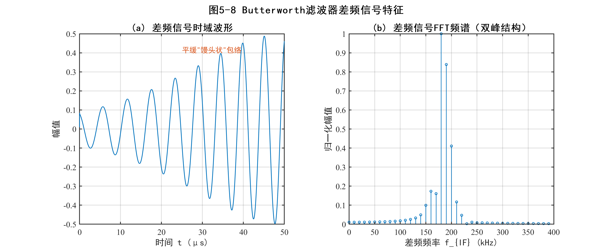
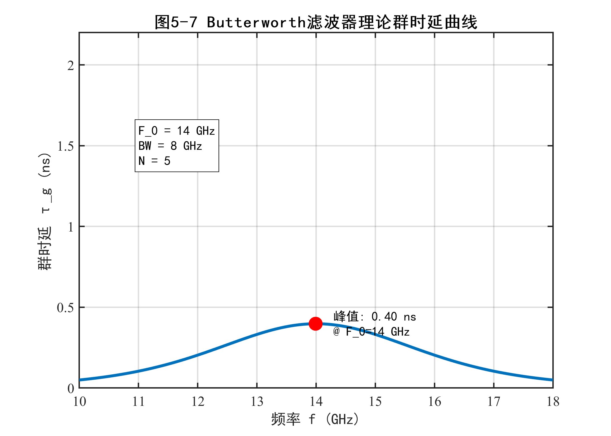
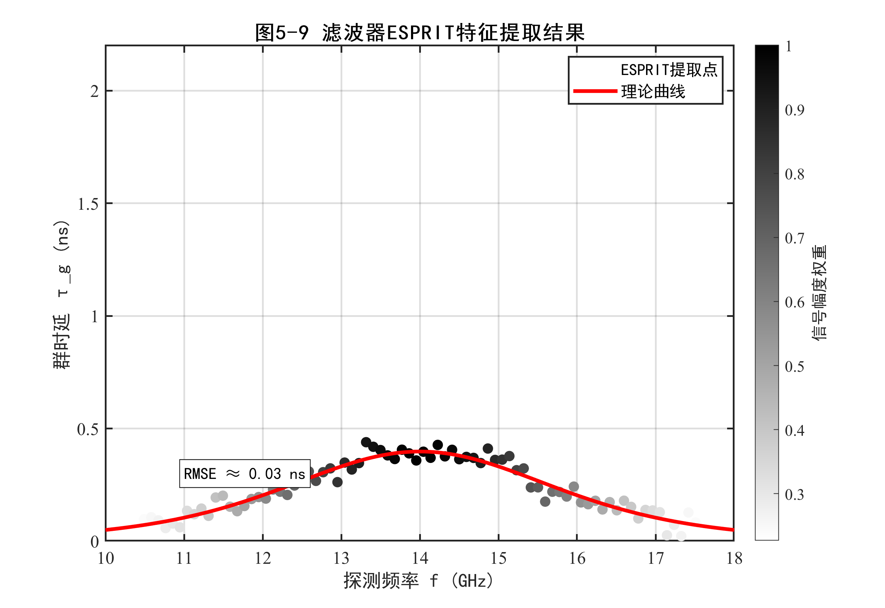
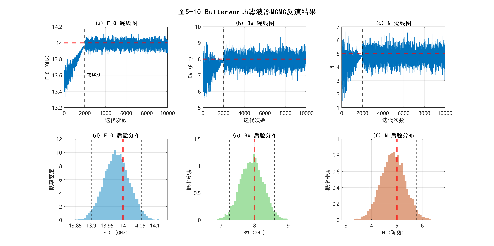
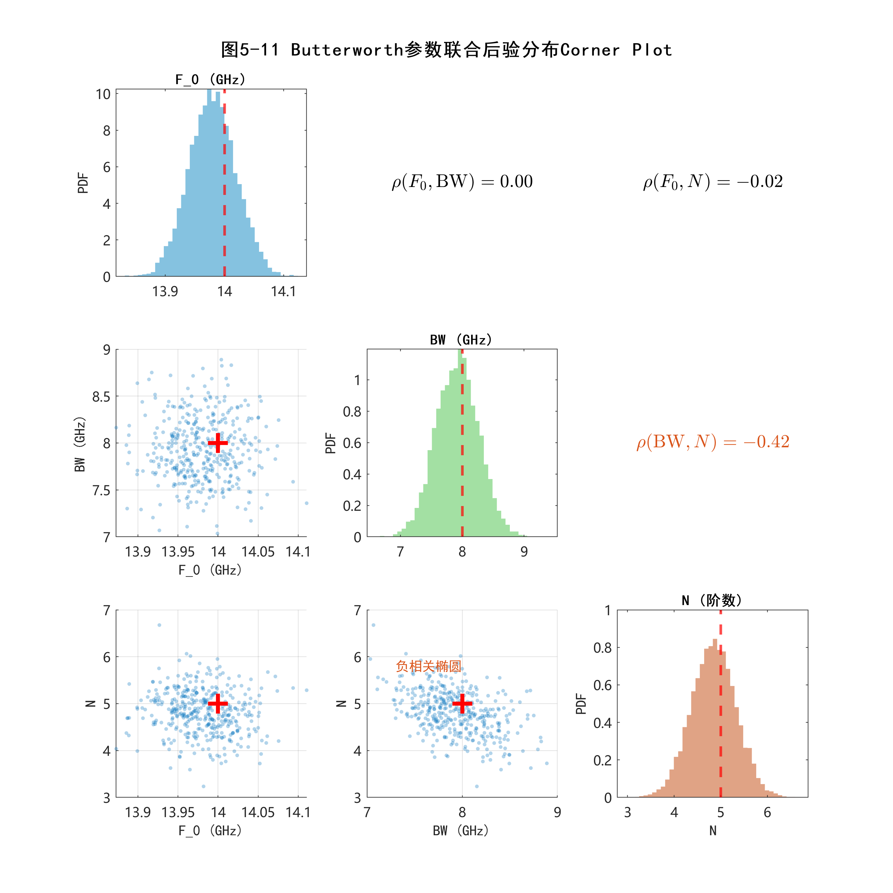
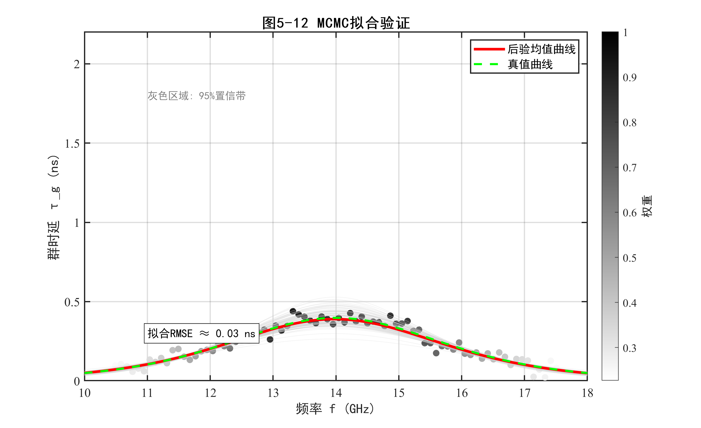

# 宽带LFMCW诊断系统设计与色散等效实验验证

## 5.1 宽带LFMCW诊断系统设计与时间分辨率测试

第三章和第四章分别从色散传播机理与贝叶斯反演算法两个层面，构建了基于群时延轨迹特征的等离子体诊断理论体系。其核心结论表明：诊断系统的电子密度测量下限取决于硬件链路所能分辨的最小时延变化量，而该分辨能力又直接由发射扫频信号的带宽决定。为将上述理论落地为可工程实施的硬件平台，本节围绕宽带LFMCW诊断系统的射频前端设计、实验搭建与性能标定三个环节展开论述。

在系统设计方面，诊断系统需满足以下基本指标要求：输出信号工作频段覆盖Ka波段（30~40 GHz），以兼顾等离子体截止频率以下的穿透能力与商用器件的可获取性；扫频带宽具备从800 MHz扩展至3 GHz的可调节能力，以覆盖从$10^{19}$ m$^{-3}$至$10^{17}$ m$^{-3}$量级的电子密度诊断需求；系统诊断误差控制在15%以内。

### 5.1.1 宽带LFMCW收发前端架构与扩频链路设计

#### 超外差收发前端的总体方案

诊断系统采用超外差架构实现从基带扫频信号到Ka波段宽带发射信号的频率搬移。由于直接在毫米波频段产生宽带线性调频信号的技术难度与成本极高，本系统采用"低频扫频→混频上变频→倍频扩带→二次混频搬移"的级联方案。该方案将信号生成的线性度控制集中在易于实现的低频段，通过后续的频率变换链路将窄带扫频信号逐级搬移至目标频段。

系统射频前端链路按信号流向可划分为三个功能级：

**第一级：初级变频与倍频处理。** 基带扫频源产生中心频率约100 MHz、带宽由扫频参数决定的余弦调频信号，经放大后馈入第一级上变频混频器MIX1的射频端口。MIX1的本振信号由频率合成器提供的1.55 GHz单频信号经放大后注入。混频器配置为上边带模式（Upper Sideband），输出的中频信号落在1.65~1.75 GHz区间（初始配置，中心约1.65 GHz）。该中频信号经30 dB增益放大与带通滤波（BPF1, 中心频率1.85 GHz, 通带宽度400 MHz）后，进入由两级无源二倍频器串联构成的四倍频链路。每一级倍频均配置衰减器以控制输入功率，并通过级联的带通滤波器（BPF2, 中心频率3.65 GHz; BPF3, 中心频率7 GHz）逐级抑制谐波杂散，确保倍频后信号的频谱纯度。

**第二级：中级放大、倍频与二次变频。** 经四倍频后的信号频率落在约6.6~7 GHz区间，再经过一级放大（增益30 dB）与带通滤波后，由第三级二倍频器完成最后一次倍频操作。至此，初始的窄带扫频信号经三级二倍频共实现八倍频扩带，带宽由初始的100 MHz扩展至800 MHz，信号频率落在约13.2~14 GHz区间。经切比雪夫型带通滤波器（BPF10, 中心频率14 GHz, 通带宽度8 GHz）净化后，信号馈入第二级混频器MIX2的射频端口。MIX2的本振由矢量信号发生器提供的21 GHz单频信号注入，配置为上边带模式，完成从中频至Ka波段的最终搬移。混频输出经13 dB增益放大与带通滤波（BPF9, 中心频率36.5 GHz, 通带宽度5 GHz）后，即得到中心频率约为34.6 GHz、扫频带宽800 MHz的发射信号，频率覆盖34.2~35.0 GHz（中心34.6 GHz）。

**第三级：信号分配与自混频解调。** 发射信号经功分器分为两路：上路经衰减与目标带通滤波后作为射频通路，承载被测介质的色散与衰减信息；下路直接引出作为参考通路。两路信号分别注入解调混频器MIX3的射频与本振端口，实现自混频（Self-mixing）操作。解调混频器配置为双边带模式，其中频输出即为包含传播时延信息的差频信号。

该链路架构的设计优势在于：通过将频率扩带功能分散至三级倍频模块实现，避免了单级大倍频比带来的谐波抑制困难；两次混频均采用外部本振注入方式，使系统的中心工作频率具备连续可调能力，可根据待测等离子体的截止频率灵活调整诊断频段。

#### 扩频链路设计与关键器件更换

第三章已证明LFMCW系统的固有时延分辨率$\Delta\tau = 1/B$仅取决于扫频带宽$B$。在初始800 MHz带宽配置下，系统固有分辨率为1.25 ns，经频谱校正后可实现约20 ps量级的时延分辨能力。按照电子密度估算公式$n_e \approx 1.158 \times 10^6 \times 2\pi \times \frac{f^2}{d} \times \tau$，并取诊断信号中心频率$f_0 = 32$ GHz、等离子体直径$d = 200$ mm的统一口径计算，该时延分辨率对应的电子密度诊断下限约为$7.45 \times 10^{17}$ m$^{-3}$。为拓展系统对低电子密度等离子体的诊断能力，需在硬件层面进一步提升扫频带宽。

扩频方案的核心约束来自链路中两类关键器件的频率限制。其一为第二级混频器MIX2的中频端口带宽上限——初始选用的混频器中频端口频率上限为14 GHz，严格限制了倍频链路输出信号的最大带宽。其二为各级带通滤波器的通带范围——当扫频带宽超出滤波器通带时，扫频信号的边带分量将被截断，导致信号展宽不均匀甚至信号失真。

针对上述瓶颈，本系统沿信号链路对混频器、带通滤波器与无源倍频器实施了系统性的器件更换。表5-1汇总了扩频链路升级中各关键器件的替换方案与核心射频参数。

**表5-1** 扩频链路关键器件替换清单

| 器件类别 | 链路位置 | 替换型号 | 核心射频参数 | 升级要点 |
|:----:|:----:|:----:|:----:|:----:|
| 混频器 | 第二级上变频（MIX2） | 莱尔微波 LFC-2006 | RF/LO: 18~42 GHz; IF: DC~18 GHz; 变频损耗 9 dB; $P_{1\text{dB}}$: 7 dBm | IF端口带宽从14 GHz扩展至18 GHz |
| 带通滤波器 | 第一级混频后（BPF1） | 西安航星 HXLBQ-DTA456X | 通带: 1650~2050 MHz | 通带从100 MHz扩展至400 MHz |
| 带通滤波器 | 倍频链路第二级（BPF2） | 成都恒伟 HXLBQ-DTA217 | 通带: 5~9 GHz | 覆盖扩频后二倍频输出 |
| 带通滤波器 | 倍频链路第三级（BPF3） | 西安航星 HXLBQ-DTA417 | 通带: 10~18 GHz | 覆盖扩频后四倍频输出 |
| 无源倍频器 | 二倍频×2级 | 成都恒伟 HWD622/622C | 输入: 3~11 GHz; 插入损耗 11 dB; 输入功率 13 dBm | 匹配扩频后各级频率与功率需求 |

上述器件替换的总体设计逻辑为：混频器IF端口带宽的扩展解除了系统扫频带宽的瓶颈上限；各级带通滤波器通带的同步拓宽保证了扩频后信号在整条链路中不被截断；倍频器的配套更换则确保了宽带工作条件下的频谱纯度与功率平坦度。图5-1展示了扩频后完整LFMCW诊断系统的射频前端链路架构，其中标注了各级关键器件的信号流向与频率变换关系。

[图5-1 图片文件当前缺失，测试同步时暂以文字占位]

器件替换完成后，系统的扫频带宽从初始的800 MHz逐步扩展。当基带扫频源信号带宽设为200 MHz时，经八倍频后发射信号带宽达到1.6 GHz；当基带带宽进一步提升至375 MHz时，系统扫频带宽可达3 GHz。值得注意的是，在扩频过程中需同步调整第一级混频的本振频率与基带扫频源的中心频率，以规避混频后产生的谐波频率与目标信号频率重叠的问题。实验验证表明，将第一级本振频率保持为1.55 GHz、基带扫频源中心频率调整为200 MHz，可有效消除第一级混频后的谐波干扰。

#### 扩频前后系统参数对照

表5-2汇总了初始配置与三种扩频配置下系统关键参数的变化。需要说明的是，不同扩频配置下基带扫频源的中心频率与带宽均有所调整，以适配倍频链路的频率规划与谐波抑制要求。

**表5-2** 扩频前后系统关键参数对照

| 参数 | 初始配置（800 MHz） | 扩频配置一（1.6 GHz） | 扩频配置二（2.4 GHz） | 扩频配置三（3 GHz） |
|:----:|:----:|:----:|:----:|:----:|
| 基带扫频源带宽 | 100 MHz | 200 MHz | 300 MHz | 375 MHz |
| 基带中心频率 | ~100 MHz | 200 MHz | 200 MHz | 200 MHz |
| 八倍频后带宽 $B$ | 800 MHz | 1.6 GHz | 2.4 GHz | 3 GHz |
| 发射信号中心频率 | 34.6 GHz | 34.6 GHz | 34.6 GHz | 34.6 GHz |
| 固有时延分辨率 $1/B$ | 1.25 ns | 0.625 ns | 0.417 ns | 0.333 ns |

由表5-2可知，从800 MHz扩展至3 GHz后，固有时延分辨率提升约3.75倍。经后续频谱校正算法进一步突破固有分辨率限制后，系统可诊断的最小时延变化与电子密度下限将在5.1.3节的标定实验中给出定量结果。

---

### 5.1.2 实验系统搭建与非色散环境基准测试

#### 实验平台配置

诊断系统的完整实验平台由扫频信号源模块、射频前端链路机箱、收发天线模块、信号采集与处理模块四部分组成。

扫频信号源模块负责产生基带线性调频信号。由泰克任意波形发生器（AWG70001A）输出中心频率为200 MHz（扩频配置）、调频周期$T_m = 50~\mu$s的余弦调频信号，信号参数由MATLAB程序经网络接口写入波形发生器。第一级混频本振由频率合成器（LMX2820评估板）产生1.55 GHz单频信号，该评估板由100 MHz外部参考时钟驱动，通过TICS Pro软件配置内部锁相环参数。第二级混频本振由矢量信号发生器（E8267D）提供21 GHz单频信号，输出功率设定为15 dBm，可根据诊断频段需求进行频率调节。

射频前端链路机箱封装了完整的混频、倍频、滤波与放大链路。机箱设计了六个射频端口：100 MHz外部参考输入、初始扫频信号输入、可调本振信号输入、发射信号输出、接收信号输入以及差频信号输出，另配有USB接口用于频率合成器的上位机控制。

收发天线模块采用26~40 GHz宽带聚焦透镜天线，具备高增益与窄波束特性，可有效抑制电磁波绕射引入的测量误差。在等离子体诊断实验中，由于高温环境的限制，天线选用耐高温材料封装。

信号采集与处理模块由高速示波器（DSOX95004Q）完成差频信号波形的数字化采集。为实时监测系统工作状态，差频信号经功分器一分为二：一路输入示波器用于数据存储与后处理，另一路接入频谱仪用于在线观测差频信号的频谱特征。

#### 非色散环境下的差频信号基准特性

在部署色散介质诊断实验之前，首先在非色散的自由空间中搭建基准测试平台，标定系统本底特性。发射与接收天线沿轴线方向相距一定初始距离放置，此时的测试信道为空气，可近似为非色散环境（电磁波群速度等于光速）。

在800 MHz扫频带宽配置下，系统输出的发射信号频率覆盖34.2~35.0 GHz（中心34.6 GHz），实测频谱表明扫频带宽内的功率平坦度存在一定波动，这主要源于各级倍频器与放大器在宽带工作条件下增益响应的非均匀性。差频信号经低通滤波后的实测频率约为420 kHz~2 MHz，具体数值取决于测试线缆长度所引入的初始电延迟。

需要指出的是，由于每次实验所使用的射频同轴线缆长度不尽相同，系统初始差频信号的频率并非固定值。因此，时延诊断中所关注的物理量并非差频信号的绝对频率，而是有、无被测介质时差频信号频率的变化量$\Delta f_D$。该差分测量模式可有效消除系统固有电延迟、线缆长度变化等共模误差源，是LFMCW时延诊断的核心测量策略。

在扩频后的宽带配置下，随着发射信号扫频带宽的增大，系统初始差频信号频率亦相应升高。实验观测表明：当扫频带宽从800 MHz提升至1.2 GHz、1.6 GHz时，差频信号频谱的中心频率呈现与带宽近似线性的增长关系，这与理论公式$f_D = B\tau/T_m$（$\tau$为系统初始时延）的预测一致。该结果验证了扩频链路中各级频率变换的正确性，以及系统在宽带工作模式下的信号完整性。

图5-2展示了扩频链路升级完成后，系统在3 GHz最大扫频带宽配置下的实测发射信号频谱。如图所示，发射信号的功率谱密度在33.1~36.1 GHz频段内呈现连续覆盖，$-3$ dB带宽达到3 GHz的设计目标值。频谱包络的整体平坦度受各级倍频器与放大器增益响应的非均匀性影响存在约3~5 dB的起伏，但扫频带宽范围内无明显的频谱凹陷或信号断裂，表明扩频后各级滤波器的通带拓宽（表5-1）有效避免了边带截断效应。该频谱特性从硬件层面确认了3 GHz扩频方案的信号完整性，为后续5.1.3节的时间分辨率标定提供了可靠的射频前端保障。

[图5-2 图片文件当前缺失，测试同步时暂以文字占位]

---

### 5.1.3 移动靶标时延测量与硬件系统时间分辨率标定

#### 标定实验原理与测试配置

LFMCW诊断系统的极限时间分辨率表征了系统在噪声与器件非理想性约束下所能辨别的最小时延变化量。该指标直接决定了系统的电子密度诊断下限值，是评估诊断系统工程性能的关键参数。

标定实验基于移动靶标的已知位移来引入可控的时延增量，通过比较测量时延与理论时延的偏差来评估系统分辨能力。具体方案如下：发射与接收天线沿轴线方向相对放置，构成直通收发链路。以初始天线间距为基准状态采集差频信号，随后将接收天线沿轴线方向精确移动已知距离$\Delta d$，再次采集差频信号。通过差分校正算法处理两组差频信号，提取频率变化量$\Delta f_D$，进而计算测量时延差值：

$$\Delta\tau_{meas} = \frac{\Delta f_D \cdot T_m}{B} $$

在非色散环境中电磁波传播速度等于光速$c$，天线移动$\Delta d$引入的理论时延增量为：

$$\Delta\tau_{theory} = \frac{\Delta d}{c} $$

诊断误差定义为测量时延与理论时延的相对偏差：

$$\varepsilon = \frac{|\Delta\tau_{meas} - \Delta\tau_{theory}|}{\Delta\tau_{theory}} \times 100\% $$

标定实验中，系统采用单发单收的收发体制，不额外连接外部功率放大器（测试距离较短，链路损耗可控），但在接收天线后连接低噪声放大器以提升接收灵敏度。差频信号输出端口经功分器分为两路，分别连接频谱仪（实时观测频谱变化）与高速示波器（保存差频信号波形数据）。

#### 初始800 MHz带宽的分辨率基准

在初始800 MHz带宽配置下，本实验通过设定10 mm、8 mm、6 mm及5 mm等梯度移动距离，对系统的时延分辨边界进行了多轮次统计评估。标定结果显示，针对6 mm的天线微弱位移（可精确引入物理理论时延$\Delta\tau_{\text{theory}} = 20$ ps），系统不仅能够稳定捕获该时延的变化趋势，其五次重复测量的平均相对误差也被严格控制在4.69%以内（最大单次偏差亦未高于8.26%）。然而，一旦测试位移量进一步缩减至5 mm，时延估计的平均误差便在系统噪声与收发信道非理想性的主导下迅速攀升至11.85%，测量结果的离散度显著增大。在此基础之上，结合工程诊断对容差15%上限指标的判定，本节标定确认：系统在800 MHz基准设定下的极限稳健分辨位移为6 mm，与之对应的极限时延分辨率为20 ps。按诊断信号中心频率$f_0 = 32$ GHz、等离子体直径$d = 200$ mm的统一口径计算，对应的最小可诊断电子密度约为$7.45 \times 10^{17}$ m$^{-3}$。该基准结果虽满足初始设计要求，但对于$10^{17}$ m$^{-3}$量级低密度等离子体的诊断需求仍显不足，有必要通过扩频方案进一步提升系统分辨能力。

#### 扩频后的分辨率标定与诊断下限扩展

为定量验证扩频链路升级对系统分辨能力的提升效果，在1.6 GHz、2.4 GHz和3 GHz三种扩频配置下分别开展了标定实验。根据扩频后固有分辨率的提升倍数，相应缩短天线移动距离以探测新的分辨极限。

表5-3汇总了三种扩频配置下的标定实验数据：1.6 GHz带宽下天线移动2 mm（理论时延6.67 ps）、2.4 GHz和3 GHz带宽下天线移动1 mm（理论时延3.33 ps）。

**表5-3** 扩频配置下的标定实验结果汇总

| 扫频带宽 | 移动距离 | 理论时延 | 诊断时延（s） | 误差 |
|:----:|:----:|:----:|:----:|:----:|
| 1.6 GHz | 2 mm | $6.67 \times 10^{-12}$ | $7.09 \times 10^{-12}$ | 6.39% |
| | | | $6.08 \times 10^{-12}$ | 8.86% |
| | | | $7.37 \times 10^{-12}$ | 10.51% |
| | | | $7.14 \times 10^{-12}$ | 7.07% |
| | | | $5.95 \times 10^{-12}$ | 10.73% |
| 2.4 GHz | 1 mm | $3.33 \times 10^{-12}$ | $3.59 \times 10^{-12}$ | 7.74% |
| | | | $3.16 \times 10^{-12}$ | 5.25% |
| | | | $3.71 \times 10^{-12}$ | 11.43% |
| | | | $3.03 \times 10^{-12}$ | 9.00% |
| | | | $3.77 \times 10^{-12}$ | 13.00% |
| 3 GHz | 1 mm | $3.33 \times 10^{-12}$ | $3.44 \times 10^{-12}$ | 3.30% |
| | | | $3.18 \times 10^{-12}$ | 4.50% |
| | | | $3.58 \times 10^{-12}$ | 7.50% |
| | | | $3.08 \times 10^{-12}$ | 7.50% |
| | | | $3.62 \times 10^{-12}$ | 8.50% |

由表5-3可见，扫频带宽从800 MHz扩展至1.6 GHz后，系统可稳定分辨由2 mm位移引入的6.67 ps时延增量，其平均误差为8.71%，相较于800 MHz工况下20 ps量级的稳定分辨阈值，时间分辨能力已出现超出带宽线性缩放预期的改善趋势；进一步提升至3 GHz时，针对1 mm位移（理论时延3.33 ps）的五次重复测量给出6.26%的平均误差，且离散度低于2.4 GHz工况（后者平均误差9.28%、最大误差达13%），表明该配置在当前硬件约束下兼顾了分辨能力与测量稳定性，是优选的扩频工作模式。按诊断信号中心频率$f_0 = 32$ GHz、等离子体直径$d = 200$ mm的统一口径计算，3.33 ps时延分辨率对应的最小可诊断电子密度约为$1.24 \times 10^{17}$ m$^{-3}$；相对于800 MHz配置下20 ps对应的$7.45 \times 10^{17}$ m$^{-3}$，诊断下限降低至原来的约1/6，即诊断灵敏度提升约6倍。这一改善源于扩频方案在提高固有分辨率$1/B$的同时，增加了频域采样信息量，使得频谱校正算法（线性调频Z变换结合能量重心法）在更高的基线频率与更宽的频谱窗口上，获得了更优的频率精估能力。

#### 时间分辨率标定的工程意义

上述标定实验从工程层面验证了两项关键结论：

其一，LFMCW诊断系统在非色散环境下的时延分辨能力显著突破了其固有分辨率极限$\Delta\tau = 1/B$。在800 MHz带宽下，系统实现了20 ps的有效分辨率，相对于1.25 ns的固有分辨率提升了约62.5倍。这一超分辨率能力源自第四章所述的频谱校正算法，该算法通过离散傅里叶变换后引入线性调频Z变换进行频谱细化，并结合能量重心法或三角形法完成频率精确估计，从而突破了离散谱栅栏效应对分辨率的限制。

其二，扩频方案的工程可行性与性能增益得到了实验确认。通过替换链路中的关键混频器、滤波器与倍频器，系统扫频带宽从800 MHz扩展至3 GHz，按32 GHz中心频率和200 mm等离子体直径的统一口径计算，电子密度诊断下限从$7.45 \times 10^{17}$ m$^{-3}$进一步降低至$1.24 \times 10^{17}$ m$^{-3}$，提升约6倍。标定结果为后续等离子体诊断实验中的数据可信度判定与误差修正提供了定量基准。

## 5.2 微波带通滤波器的色散物理等效机理

5.1节的标定实验已确认LFMCW系统在非色散环境下具备皮秒级的时延分辨能力，为后续色散介质的群时延轨迹提取提供了硬件性能保障。然而，要在受控实验条件下验证第四章提出的“时延轨迹特征提取—已知模型下参数计算”方法链路的端到端工程有效性，须首先构建一个物理参数完全已知、色散特性可精确调控且实验结果可重复的等效色散靶标。真实等离子体环境虽为最终应用目标，但其电子密度与碰撞频率受放电功率、气压、腔体结构等多因素耦合影响，难以在实验室中精确复现和绝对标定；此外，等离子体的瞬态不稳定性也会引入额外的测量不确定度。

本节论证微波带通滤波器作为等离子体色散等效介质的物理合理性。首先从频域色散机理出发，揭示滤波器通带边缘截止谐振与等离子体截止频率渐近发散之间的物理同构性；继而基于切比雪夫Type-I传递函数的严格数学形式，构建群时延的正向理论模型；最后通过参数敏感度分析，剖析中心频率、绝对带宽与等效阶数三个独立维度对色散双峰演化规律的控制机理，为后续5.3节验证时延轨迹特征点提取的可靠性，以及在已知模型条件下开展参数计算，提供正向算子和参数搜索依据。

### 5.2.1 滤波器色散演化与等离子体截止谐振的物理同构性

色散介质中群时延随频率急剧变化的根本物理原因在于介质的传播特性存在某种"截止"或"谐振"机制——当电磁波的工作频率逼近该临界点时，波的群速度趋于零，群时延随之发散。在Drude等离子体模型中，第三章式(3-14)已给出群时延与截止频率$f_p$的显式映射关系：

$$\Delta\tau_g(f) = \frac{d}{c}\left(\frac{1}{\sqrt{1-(f_p/f)^2}} - 1\right), \quad f > f_p $$

该式清晰表明，当探测频率从远高于$f_p$的弱色散区逐渐下降、逼近截止频率$f_p$时，分母$\sqrt{1-(f_p/f)^2} \to 0$，群时延呈双曲线形式的渐近发散。这种单边发散特征是等离子体色散的标志性物理表现——截止频率$f_p$如同一面"墙"，阻止低于$f_p$的电磁波传播，而在临界区附近，群速度的急剧减缓导致信号包络在介质中的驻留时间显著延长。

微波带通滤波器的色散机理呈现出与上述等离子体截止谐振高度相似的物理结构。带通滤波器本质上是由多个耦合谐振腔级联构成的频率选择性网络，其通带范围由下截止频率$f_L = F_0 - BW/2$与上截止频率$f_H = F_0 + BW/2$共同界定。在通带的上下两个边缘，电磁波均经历从自由传播到被截止的急剧过渡——这一过渡过程在频域上表现为传输系数$S_{21}$的快速衰减，而在相位谱上则引发群时延的剧烈增长。对于切比雪夫Type-I类型的滤波器，由于其通带内允许等纹波起伏，通带边缘的相位响应比Butterworth型更为陡峭，相应地，群时延在通带边沿的峰值也更为尖锐。

将两种色散机理进行对比，可建立如下物理同构映射关系。等离子体的截止频率$f_p$在物理上对应于滤波器通带的下截止频率$f_L$——两者均标定了电磁波从可传播到被截止的临界转变点。等离子体在截止频率附近呈现的群时延单边渐近发散，在滤波器中演化为通带两侧的对称性色散双峰结构：在$f_L$附近，群时延从通带内的平坦区域向低频方向急剧攀升；在$f_H$附近，群时延向高频方向同样呈现剧烈的峰值响应。这种双峰结构可以理解为：等离子体的"单面截止墙"被滤波器的"双面截止墙"所替代，在两侧各自形成了一个类似于等离子体截止谐振的色散发散区。事实上，若仅考察滤波器通带下边沿附近的群时延演化，其频率依赖特性与Drude模型在$f \to f_p^+$处的渐近行为具有相同的数学结构——均为频率接近某一临界值时的单调递增发散。

通带中央的平坦区则对应于等离子体中探测频率远高于截止频率($f \gg f_p$)的弱色散区域。在这一频段内，群时延近似为常数，色散效应可安全忽略，对应于LFMCW测距中的"线性工作区"。这一对应关系表明，在滤波器通带的平坦区内进行LFMCW差频测量，所提取的时延特征应与非色散环境下的标定结果一致；而在通带边缘的色散双峰区域，差频信号将经历与等离子体截止区类似的非线性时延畸变，这恰好为第四章提出的时频特征提取与后续模型计算方法提供了理想的验证场景。

从方法论角度审视，选择微波带通滤波器作为色散等效靶标具有三方面的工程优势。其一，滤波器的物理参数（中心频率$F_0$、绝对带宽$BW$、阶数$N$及纹波$R_p$）在设计阶段即已精确确定，可作为已知模型下的方法验证基准进行误差分析，而等离子体的电子密度在实验中往往需要额外的独立测量手段（如Langmuir探针）才能获取参考值。其二，滤波器的S参数与群时延可通过ADS（Advanced Design System）电路仿真或矢量网络分析仪实测获得高保真的理论/实验基准曲线，为散点提取精度评估提供可靠的参照标准。其三，滤波器作为无源线性器件，其色散特性具有严格的时不变性与可重复性，排除了等离子体瞬态波动引入的随机误差，使得算法性能的评估更加纯粹。

综上，微波带通滤波器与等离子体在频域色散机理上存在深层的物理同构性，两者的群时延演化均源于电磁波在截止/谐振临界点附近的群速度急剧变化。这一同构性为采用滤波器作为实验室条件下的可控色散靶标提供了坚实的物理基础。在确立了等效策略的合理性之后，下一节将从滤波器传递函数的数学形式出发，构建群时延的严格正向理论模型。

### 5.2.2 基于切比雪夫传递函数的群时延正向理论模型构建

建立精确的群时延正向理论模型，是后续基于已知模型开展拟合验证与参数计算的核心前提。与Drude等离子体色散模型存在显式的解析群时延表达式（式5-1）不同，切比雪夫带通滤波器的群时延不具备封闭形式的解析解——其传递函数涉及高阶多项式比的相位响应，群时延须通过对相位谱的数值微分获得。这种"解析不可达"的特性决定了正向模型的计算策略：必须从传递函数的严格数学定义出发，经由复频率响应、相位展开、数值求导的完整链路，逐步构建群时延的计算模型。

#### 切比雪夫Type-I带通滤波器的传递函数

N阶切比雪夫Type-I低通滤波器原型的幅度平方响应定义为：

$$|H_{LP}(j\Omega)|^2 = \frac{1}{1 + \varepsilon^2 T_N^2(\Omega)} $$

其中，$\Omega$为归一化角频率，$T_N(\Omega)$为N阶切比雪夫多项式，$\varepsilon = \sqrt{10^{R_p/10} - 1}$为纹波因子，$R_p$为通带纹波深度（单位dB）。切比雪夫多项式$T_N(\Omega)$的递推定义赋予了该滤波器独特的等纹波特性：在通带内（$|\Omega| \le 1$），$T_N$在$[-1, 1]$之间振荡，导致幅度响应出现N个等深度的纹波起伏；在阻带（$|\Omega| > 1$），$T_N$单调递增，使得$|H_{LP}|$快速衰减。

从低通原型到带通实现的频率变换关系为：

$$\Omega = \frac{1}{BW_n}\left(\frac{\omega}{\omega_0} - \frac{\omega_0}{\omega}\right) $$

其中，$\omega_0 = 2\pi F_0$为带通中心角频率，$BW_n = BW/F_0$为归一化带宽。该变换将低通原型的单边截止映射为带通滤波器的双边通带，通带边界频率分别为$\omega_L = 2\pi(F_0 - BW/2)$与$\omega_H = 2\pi(F_0 + BW/2)$。

在$s$域（$s = j\omega$）中，N阶切比雪夫带通滤波器的传递函数可表示为有理多项式之比：

$$H_{BP}(s) = \frac{b_0 + b_1 s + \cdots + b_{2N} s^{2N}}{a_0 + a_1 s + \cdots + a_{2N} s^{2N}} $$

其中，多项式系数$\{b_k\}$和$\{a_k\}$由滤波器的四个物理参数$(F_0, BW, N, R_p)$唯一确定。对于本实验中选用的5阶切比雪夫带通滤波器（$F_0 = 37$ GHz, $BW = 1$ GHz, $N = 5$, $R_p = 0.5$ dB），传递函数为10阶（$2N = 10$）有理函数。

#### 群时延的严格数值计算模型

群时延的物理定义为传输相位$\phi(\omega)$对角频率的负导数：

$$\tau_g(\omega) = -\frac{d\phi(\omega)}{d\omega} $$

其中相位函数为复频率响应的辐角：

$$\phi(\omega) = \arg\left[H_{BP}(j\omega)\right] = \text{unwrap}\left\{\arctan\frac{\text{Im}[H_{BP}(j\omega)]}{\text{Re}[H_{BP}(j\omega)]}\right\} $$

式中的相位展开(unwrap)操作消除了$\arctan$函数固有的$\pm\pi$跳变，确保相位函数的连续性——这是准确计算群时延的必要条件。

由于式(5-4)中10阶多项式比的相位函数$\phi(\omega)$不具备简洁的封闭形式解析导数，群时延须通过数值微分获得：

$$\tau_g(\omega_k) \approx -\frac{\phi(\omega_{k+1}) - \phi(\omega_{k-1})}{\omega_{k+1} - \omega_{k-1}} $$

至此，正向理论模型的计算链路完整建立：给定一组物理参数$(F_0, BW, N, R_p)$，首先通过式(5-4)获取传递函数的多项式系数；然后在目标频率网格$\{\omega_k\}$上计算复频率响应$H_{BP}(j\omega_k)$；接着对相位谱进行展开获得连续相位$\phi(\omega_k)$；最后按式(5-7)数值微分得到群时延$\tau_g(\omega_k)$。值得指出的是，上述数值计算链路在软件实现层面完全对应于MATLAB信号处理工具箱中切比雪夫滤波器设计函数（`cheby1`）与模拟频率响应求解函数（`freqs`）的标准调用逻辑——前者根据$(N, R_p, BW)$直接输出传递函数的多项式系数$\{b_k\}$和$\{a_k\}$，后者在指定频率网格上计算复频率响应，其后的相位展开与数值微分则为通用的数值处理步骤。这一工程等价性确保了正向模型从理论推导到数值实现的严格一致性。该模型在后续5.3节的拟合验证中，将作为计算理论群时延曲线与观测散点之间残差的核心正向算子。

#### 标称参数下的群时延特征分析

基于上述模型，在标称参数$(F_0 = 37$ GHz$, BW = 1$ GHz$, N = 5, R_p = 0.5$ dB$)$下计算群时延曲线，其频域特征呈现出典型的色散双峰结构。在通带下边沿（约36.5 GHz）与上边沿（约37.5 GHz）各出现一个群时延尖峰，峰值约为6~7 ns，远高于通带中央平坦区约2 ns的基线水平。双峰之间的频率间距约等于设计带宽$BW = 1$ GHz，而双峰的宽度与陡峭度则由阶数$N$和纹波深度$R_p$共同控制。

这一双峰结构的物理本质源于5.2.1节所论述的通带边缘截止谐振机制。在通带两侧，传输系数$S_{21}$的急剧衰减伴随着相位的剧烈变化，而群时延作为相位对频率的导数，自然在相位变化最剧烈的通带过渡带处达到极值。值得注意的是，双峰内侧（通带内）的群时延曲线并非严格平坦，而是存在由切比雪夫等纹波特性引入的微小起伏——这些起伏与通带内幅度纹波的位置严格对应，反映了等纹波设计对相位线性度的局部扰动。

与Drude等离子体模型的群时延特征进行对比，可以进一步明确两种色散机理的异同。等离子体群时延呈现单边渐近发散特征，在截止频率$f_p$处趋于无穷大，曲线具有显式的$[1-(f_p/f)^2]^{-1/2}$型解析形式；而滤波器群时延表现为双边对称的有限峰值响应，峰高取决于阶数$N$和纹波$R_p$，且不存在真正意义上的发散奇点。然而，两者在色散的核心物理特征上是一致的：群时延均在截止/谐振临界频率附近呈现急剧增长，且该增长区域的频率位置直接由介质/器件的特征参数（$f_p$或$F_0$）精确控制。正是这种受特征参数一阶控制的色散演化规律，使得LFMCW系统提取的时延特征轨迹能够携带足够的模型信息，为后续参数计算提供物理基础。

### 5.2.3 前向物理模型参数敏感度分析

在构建了切比雪夫群时延正向模型之后，须进一步明确各物理参数对色散双峰演化规律的独立控制机理。这一分析服务于两个关键目标：其一，为后续拟合验证中的参数搜索范围设定提供物理依据——高敏感参数需要更紧的搜索区间以提高效率，弱敏感参数可适当放宽搜索范围；其二，揭示参数间可能存在的耦合效应，为模型匹配结果的物理解读提供理论框架。

为定量剥离并剖析各网络参数的独立维度敏感度，本节以标称参数族$(F_0 = 37$ GHz$, BW = 1$ GHz$, N = 5, R_p = 0.5$ dB$)$确立基准状态模型，通过单一变量控制法，分别从中心频率、绝对带宽及等效阶数三个维度向模型注入受控摄动，定量评估其对群时延双峰演化形态的调制规律。各参数扫掠的系统性比对结果如图5-3的三联子图所示。

[图5-3 图片文件当前缺失，测试同步时暂以文字占位]

#### 中心频率$F_0$的一阶主导控制

如图5-3(a)所示，当$F_0$在$\pm 500$ MHz范围内变化时（$F_0 = 36.5, 37.0, 37.5$ GHz），群时延双峰结构呈现出高度保形的响应特征。随着$F_0$的平移，整个双峰结构在频率轴上发生严格的刚性平移(Rigid Shift)，既不改变峰高，也不改变峰间距和峰宽——双峰的形态特征完整保留，仅在频率坐标上发生等量位移。这种刚性平移规律的物理根源在于式(5-3)的频率变换结构：$F_0$仅决定了带通变换的中心参考频率，不影响归一化频率$\Omega$的数值范围，因此通带边缘截止谐振的形态特征不受影响。

将这一规律与第四章4.1.1节中等离子体截止频率$f_p$对群时延的控制机理进行类比，两者呈现出高度一致的物理图景：$f_p$的变化导致等离子体群时延曲线在频率轴上整体偏移（渐近线位置改变），$F_0$的变化则导致滤波器双峰的等量平移。在两种色散体系中，特征频率参数均以一阶量的方式直接控制群时延曲线的拓扑位置，为模型匹配提供了最强的可观测信号——微小的$F_0$变化即可引发双峰位置的显著偏移，这也意味着该参数在后续后验估计中应具有最高精度。

#### 绝对带宽$BW$的几何尺度调制

如图5-3(b)所示，当绝对带宽在$BW = 0.8, 1.0, 1.2$ GHz之间变化时，色散响应呈现出两个耦合效应：其一，双峰之间的频率间距随$BW$的增大而等比例扩展，反映了通带边界$f_L = F_0 - BW/2$与$f_H = F_0 + BW/2$随带宽的对称展开；其二，峰值高度与带宽呈逆关系——当$BW$从1.0 GHz缩窄至0.8 GHz时，双峰的峰值显著升高，色散效应更加剧烈。

后一效应的物理机理可从谐振腔的品质因数(Q)角度理解。带通滤波器的通带本质上对应于耦合谐振腔的集总谐振模式，其品质因数$Q \propto F_0/BW$；带宽越窄，$Q$值越高，谐振越尖锐，通带边缘的相位过渡越陡峭，群时延峰值也相应增大。这种"带宽-峰高"的反比关系在等离子体色散中同样存在类似的对应：当介质厚度$d$增大时（等效于信号在色散介质中的传播路径延长），截止频率附近的群时延发散更为剧烈，两者在"色散路径长度"的概念上具有可比性。

从前向模型的参数敏感度层级看，$BW$变化引起的双峰形态改变虽然显著可辨，但其影响机制为"峰间距的拉伸/压缩"这一几何尺度效应，而非像$F_0$那样直接控制双峰的绝对位置。因此，$BW$在后续参数估计中的可观测性居于中等水平——高于纯损耗型参数（如等离子体碰撞频率$\nu_e$的二阶微扰效应），但低于特征频率参数$F_0$的一阶主导效应。

#### 等效阶数$N$的边缘谐振精细结构塑造

如图5-3(c)所示，当阶数在$N = 3, 5, 7$之间变化时，通带边缘的群时延峰随$N$的递增而变得更加陡峭、尖锐，幅值也相应增大。这是因为高阶滤波器具有更陡峭的幅频滚降特性——阻带衰减率约为$20N$ dB/decade——更快速的幅度截断意味着更剧烈的相位突变，从而在通带边沿产生更高的群时延尖峰。

值得关注的另一特征是通带内部的群时延精细结构。随着阶数增加，通带内的群时延纹波数目增多、起伏加剧，反映了高阶切比雪夫多项式在归一化通带内更密集的零点分布。这些微峰纹波虽然幅度远小于通带边缘的主色散峰，但对特征点提取与后续模型计算而言构成了一种分辨挑战：在ESPRIT特征提取过程中，纹波引起的寄生调幅可能导致部分频点的时延估计出现偏差，这也是5.3节数据清洗策略中引入"物理底线约束"的技术动机。

从参数可观测性的角度分析，阶数$N$对色散双峰的调制效应主要体现在"峰陡峭度"和"通带纹波精细结构"两个维度，而非双峰的绝对频率位置或宏观间距。当阶数差异较大时（如$N=3$与$N=7$），峰高变化显著可辨；但对于相邻整数阶（如$N=4$与$N=5$），曲线差异主要集中在通带内部的微小纹波变化上，在有限的测量噪声与采样密度条件下难以稳健区分。因此，阶数$N$在三个参数中呈现出最弱的敏感度层级，其后验分布预期将表现出较大的变异系数(CV)和平底谷特征。

#### 参数敏感度层级小结

综合三个参数维度的敏感度分析，可建立如下层级关系：$F_0$（强敏感·一阶控制）$> BW$（中等敏感·几何尺度调制）$> N$（弱敏感·精细结构塑造）。该层级结构与第四章4.1节在Drude等离子体模型中建立的"参数分级定律"呈现深刻的内在一致性——在群时延观测通道下，控制色散曲线拓扑位置的特征频率参数（$F_0$或$f_p$）始终具有最高的可观测性，而控制色散强度或精细结构的次级参数（$BW$、$N$或$\nu_e$）的敏感度依次递减。

这一跨模型的"参数分级"普适规律，从正向模型的角度预判了后续MCMC拟合验证中各参数后验分布的收敛行为：$F_0$的后验分布应当高度集中且精度最高；$BW$的后验分布具有中等尺度的不确定性；$N$的后验分布可能较为宽广，且由于阶数为离散物理量（设计值为整数），其在连续先验空间中的采样将呈现整数邻域内的平底谷效应。上述预判将在5.3.4节的MCMC拟合验证中得到定量验证。

## 5.3 色散等效介质的时延轨迹提取与物理映射机理

5.2节从理论层面建立了微波带通滤波器作为等离子体色散等效靶标的物理基础，并构建了基于切比雪夫传递函数的群时延正向理论模型。然而，本文在此引入滤波器的目的，并非将其作为最终诊断对象去识别器件参数，而是利用其色散模型数学形式明确、物理参数可控、真值可获得的特点，对5.1节搭建的LFMCW宽带诊断系统开展“测量—提取—拟合验证”闭环实验，重点验证时延轨迹特征点的提取精度，并证明“已知模型 + 特征轨迹”足以支撑后续参数反演计算。

在此闭环验证中，本节面临的核心挑战可归纳为三个层次。第一层为系统级的信号保真度问题——LFMCW信号经过多级变频、倍频与自混频后，其中频输出中叠加了系统固有的物理走线延迟，须通过精确的基准标定与去嵌入(De-embedding)将其从色散信息中剥离。第二层为色散信号的特征提取问题——在滤波器通带边缘的强色散区，第四章建立的滑动窗口ESPRIT算法需面对阻带极低信噪比、带内纹波引起的寄生调幅以及扫频边界处的硬截断效应等多重干扰，须发展针对性的物理约束数据清洗策略。第三层为时延特征点的精度验证与跨模型方法论论证——ESPRIT算法对色散介质的物理模型完全透明，须定量评估所提取的离散时延散点在不同色散梯度区域的追踪精度，并论证该散点集合是否承载了足以支撑后续参数反演计算的全局色散信息。若能证明散点在弱色散区达到亚纳秒级精度，且在已知正向模型的条件下足以驱动后续拟合或贝叶斯反演稳定收敛，则该提取方法论可直接迁移至任何数学形式已知的色散介质（如Drude等离子体），为物理参数（如电子密度$n_e$）的定量反演诊断提供可靠的观测数据集。

为在受控条件下完成上述全链路验证，本节采用ADS（Advanced Design System）电路级瞬态仿真作为实验平台。相比于硬件实测，仿真环境具备以下优势：仿真链路的每一级器件参数完全确定，可消除硬件实验中器件老化、温漂等不确定因素的干扰；仿真数据的信噪比与采样精度可精确控制，便于隔离算法性能与硬件限制之间的影响；目标滤波器的S参数与群时延可从仿真器中直接导出作为绝对真值基准，提供了硬件实测难以获得的"上帝视角"验证条件。

### 5.3.1 全链路联合仿真与色散基准去嵌入（De-embedding）

#### ADS仿真链路架构

为在仿真层面忠实复现LFMCW诊断系统的完整信号流程，在ADS中搭建了与5.1节硬件系统一一对应的电路级瞬态仿真模型。仿真链路严格遵循"基带扫频→初级变频→三级二倍频→二次变频→功分→自混频解调"的级联架构，各级器件的增益、损耗、噪声系数与非线性特性均按照实际硬件参数进行配置。

仿真链路中的信号源为余弦调频信号，其数学表达式为$v(t) = \cos(2\pi f_0 t + \pi K t^2)$，其中扫频斜率$K = (f_{end} - f_{start})/T_m$，扫频范围设定为$f_{start} = 34.4$ GHz至$f_{end} = 37.61$ GHz（八倍频后），扫频周期$T_m$由基带信号参数确定。目标色散介质为5阶切比雪夫Type-I带通滤波器BPF11，其设计参数与5.2节正向理论模型完全对齐：中心频率$F_0 = 37$ GHz，绝对带宽$BW = 1$ GHz，通带纹波$R_p = 0.5$ dB，阻带衰减大于90 dB。该滤波器被置于功分器上路（RF通路）中，模拟等离子体色散介质对LFMCW探测信号的群时延调制作用。

ADS瞬态仿真采用自适应变步长时间网格（最小步长5 fs，最大步长0.5 ps），仿真时长$T_{stop} = 0.55~\mu$s，确保完整覆盖至少一个扫频周期。仿真输出的核心数据为混频器MIX3中频端口的时域电压波形$v_{IF}(t)$（对应数据文件`hunpin_time_v.txt`），该信号包含了目标滤波器的色散时延信息以及系统链路的固有延迟。图5-4给出了上述ADS电路级仿真链路的完整拓扑架构，清晰展示了从基带扫频源经三级倍频与二次变频至Ka波段后，通过功分器实现的自混频解调拓扑——其中上路（RF通路）插入目标色散介质BPF11，下路（LO通路）作为参考直连混频器LO端口。

[图5-4 图片文件当前缺失，测试同步时暂以文字占位]

为进一步表征上述仿真链路中关键节点的信号特性，图5-5至图5-7分别展示了发射信号、接收信号与混频中频信号的时域波形及其对应的频谱分析结果，每张图以上下子图的形式将时域与频域信息联合呈现。

图5-5给出了发射信号（TX）的时频域联合特征。时域波形显示，发射信号为幅度约±0.35 V的连续正弦调制波形，在整个仿真时长（约550 ns）内均匀充满扫频周期，体现了LFMCW连续发射的工作特性。对应的频谱分析表明，发射信号的功率谱密度集中在34~38 GHz的频段内，峰值功率约$-15$ dBm，带内呈现为近似平坦的矩形包络，3 dB带宽约为3.2 GHz，与系统设计的八倍频后扫频范围（34.4~37.61 GHz）高度吻合。频谱两侧的陡峭滚降边沿清晰界定了扫频信号的有效带宽边界，带外抑制优于50 dB。

[图5-5 图片文件当前缺失，测试同步时暂以文字占位]

图5-6展示了经过目标色散介质（5阶切比雪夫带通滤波器BPF11）后的接收信号（RX）特征。与发射信号的均匀包络截然不同，接收信号的时域波形呈现出显著的幅度调制效应：在0~350 ns的时间段内信号幅度极低（接近噪底），而在约350 ns之后信号幅度急剧增大至±0.25 V，并伴随明显的包络起伏。这一时域特征直接反映了色散介质的频率选择性——LFMCW信号的瞬时频率随时间线性扫升，仅当扫频进入滤波器通带（约36.5~37.5 GHz）时，信号方能有效通过；而在扫频前期（对应低于通带下截止频率的频段），信号被阻带衰减所抑制。时域包络的起伏则对应于通带内0.5 dB切比雪夫等纹波引起的振幅调制。接收信号的频谱进一步印证了上述分析：功率谱密度呈现为以37 GHz为中心的窄带峰结构，3 dB带宽约1 GHz，峰值功率约$-15$ dBm，通带外信号迅速跌落至$-110$ dBm以下。该频谱形态精确地映射了目标滤波器的$|S_{21}|$传输特性，从信号域层面验证了ADS仿真链路的物理保真度。

[图5-6 图片文件当前缺失，测试同步时暂以文字占位]

图5-7给出了发射信号与接收信号经自混频后生成的中频差频信号（IF）的时频域联合特征。时域波形显示，混频信号的有效能量同样集中在350 ns之后的通带扫频时段内，幅度峰值约±0.4 V，波形呈现出明显的"拍频"结构——其瞬时频率随时间缓慢变化，反映了色散介质群时延的频率依赖性。尤其值得注意的是，在约100~150 ns处存在低幅度的瞬变脉冲，这是扫频信号经过通带边缘时过渡带截止谐振引起的暂态响应。混频信号的频谱揭示了差频信号的核心特征：功率谱密度主要集中在0~200 MHz的低频段，峰值出现在约10 MHz附近（功率约$-25$ dBm），对应于系统物理走线差与滤波器通带中心群时延共同贡献的基线差频分量。在200 MHz以上，频谱逐渐跌落至$-70$ dBm的噪底水平，其中300~500 MHz区间出现的次级平台结构，源于通带边缘色散双峰区的时延剧烈变化所产生的高频差频分量。该频谱特征从信号域层面直观展示了色散介质对LFMCW差频信号的"频谱散焦"效应——原本在非色散条件下应呈现为单一频率尖峰的差频信号，在色散调制下展宽为覆盖数百兆赫的宽带频谱，从而印证了第三章3.3节所分析的色散散焦机理。

为全面表征目标色散介质BPF11的传输特性，图5-8展示了由ADS仿真器直接导出的该5阶切比雪夫带通滤波器的正向传输系数$|S_{21}|$幅度响应曲线。如图所示，滤波器在37 GHz中心频率附近呈现出约1 GHz的通带宽度，通带内存在0.5 dB的等纹波起伏，阻带衰减超过90 dB。该幅度响应的陡峭截止过渡特性——尤其是通带边缘从0 dB急剧跌落至$-90$ dB的窄过渡带——正是产生色散双峰群时延的物理根源。将图5-8的$|S_{21}|$响应与图5-6接收信号的频谱形态进行对比，可以发现两者在峰值位置、3 dB带宽以及带外抑制深度等关键指标上均高度一致，从信号传输两端交叉验证了仿真链路的物理可靠性。

[图5-8 图片文件当前缺失，测试同步时暂以文字占位]

与幅度响应相对应，图5-9给出了该滤波器的群时延频率响应$\tau_g(f)$理论真值曲线（由ADS S参数仿真直接计算$\tau_g = -d\phi/d\omega$导出）。该曲线在通带两侧边缘呈现出典型的对称双峰结构：在约36.5 GHz和37.5 GHz处，群时延由通带基线水平（约2 ns）急剧攀升至6~7 ns的峰值，对应于通带边缘截止谐振引起的剧烈相位滚降。这一"上帝视角"的绝对真值曲线，将作为后续ESPRIT散点提取精度的终极验证基准。

#### 系统固有延迟的去嵌入标定

LFMCW差频信号所携带的时延信息并非仅来源于目标色散介质——系统链路中各级衰减器、微带走线、功分器以及混频器自身均引入了固有的传播延迟$\tau_{sys}$。若不精确剥离这一系统基准，提取的群时延将整体偏移真实值约2~3 ns。

去嵌入的物理策略是：移除目标滤波器（BPF11），以直通（Thru）连接替代，此时RF通路与LO通路之间的时延差仅包含$\tau_{sys}$。对该直通配置下的混频输出信号（`hunpin_thru.txt`）进行频域分析，提取差频信号的精确频率$f_{D,thru}$，进而由LFMCW测距公式反推系统基准延迟：

$$\tau_{sys} = \frac{f_{D,thru} \cdot T_m}{B} $$

在实施直通标定的过程中，遭遇了一个微妙的"互调杂散陷阱"。由于直通链路移除了滤波器提供的90 dB强阻带抑制，前端多次变频与倍频产生的宽带本振泄露与非线性互调杂散直接灌入混频器，在中频输出的频谱中形成了约67 MHz的强假峰。若不加甄别地对全频段FFT结果取最大峰，将得到荒谬的基准延迟$\tau_{sys} \approx 10.5$ ns。

解决这一问题的关键在于物理先验约束的引入。根据光速与微带线介电常数估算，仿真链路中纯物理走线差（几十厘米量级）所引入的真实差频应处于极低频段。据此，将时延特征的频率搜索窗口严格限定在$0 \sim 5$ MHz的物理真实域内，成功规避了高频互调杂散的干扰。在该搜索窗内，采用汉宁窗加窗FFT结合三角形插值精调算法，精确测得系统基准群时延为：

$$\tau_{sys} = 0.2470 \text{ ns} $$

该基准值在后续所有含滤波器的色散测量中，将作为减法校准常数从ESPRIT提取的原始时延估计中逐点扣除，实现目标色散介质群时延的绝对去嵌入。

### 5.3.2 离散时延特征点与连续演化曲线的物理映射关系

在完成系统基准去嵌入之后，须建立从连续差频信号到离散色散时延散点的物理映射关系，即阐明LFMCW系统如何将滤波器的连续群时延频率响应$\tau_g(f)$转化为一组可供反演算法使用的离散观测数据集$\{(f_k, \tau_k)\}$。

#### 从差频信号到瞬时探测频率的映射

LFMCW系统的发射信号为线性调频连续波，其瞬时频率随时间线性变化：$f_{tx}(t) = f_{start} + K \cdot t$。当该信号通过色散介质（滤波器）后，在时刻$t$的差频信号所携带的时延信息对应于瞬时探测频率$f_{probe}(t) = f_{start} + K \cdot t$处的群时延贡献。因此，对差频信号在时间轴上的逐段分析，等价于对色散介质在频率轴上的逐点采样——这正是第四章"滑动窗口"策略的物理本质。

具体地，在时刻$t_c$为中心的滑动窗口内，ESPRIT算法提取出差频信号的瞬时频率$f_{IF}(t_c)$，该频率与目标色散介质在对应探测频率处引入的群时延$\tau_g$之间满足LFMCW差频关系：

$$f_{IF}(t_c) = K \cdot [\tau_{sys} + \tau_g(f_{probe})] $$

经去嵌入校准后，目标介质的群时延可由下式提取：

$$\tau_g(f_{probe}) = \frac{f_{IF}(t_c)}{K} - \tau_{sys} $$

其中探测频率为$f_{probe} = f_{start} + K \cdot t_c$。由此，随着滑动窗口沿时间轴逐步推进，即可在频率轴上逐点"扫描"出色散介质的群时延频率响应，形成一组离散的频率-时延散点$\{(f_k, \tau_k)\}_{k=1}^{M}$。

#### 散点分布与连续色散曲线的对应关系

上述映射在物理上意味着：散点的频率位置由LFMCW扫频范围与窗口中心时刻共同决定，散点的时延值由ESPRIT在该窗口内的频率估计精度决定。在滤波器通带的平坦区（约36.7~37.3 GHz），群时延变化平缓，散点应紧密聚集在理论曲线的基线水平（约2 ns）附近；在通带边缘的色散双峰区（约36.5 GHz与37.5 GHz），群时延急剧攀升至6~7 ns，散点的密度与精度将受到局部信噪比与色散梯度的共同调制。

这种"中心密集-边沿稀疏"的散点分布特征，与第四章4.4节在Drude等离子体仿真中观察到的规律高度一致——在远离截止频率的弱色散区，特征提取算法表现稳定，散点与理论曲线高度吻合；而在逼近截止谐振的强色散区，群时延的剧烈梯度变化对窗口长度与算法分辨率提出了更苛刻的要求。正是这种共性特征，使得针对等离子体色散开发的"滑动窗口ESPRIT + 参数反演计算"方法链路能够直接迁移至滤波器色散场景。

### 5.3.3 强色散时延轨迹特征提取与物理约束清洗策略

#### 信号预处理流程

ADS瞬态仿真输出的中频信号$v_{IF}(t)$采用自适应变步长时间网格，须首先进行均匀重采样。以4 GHz的采样率对原始非均匀时间序列进行样条插值重采样，继而通过4阶Butterworth低通滤波器（截止频率200 MHz）提取中频差频分量，滤除高频载波残余。为降低后续特征提取的计算量，在低通滤波后执行2倍抽取，最终工作采样率为2 GHz。

#### 滑动窗口ESPRIT时延特征提取

在预处理后的差频信号上，采用第四章4.2节建立的滑动窗口ESPRIT算法提取频率-时延散点。窗口长度设为预处理后信号总长的3%（不低于64个采样点），步进长度为窗口长度的$1/8$，ESPRIT的子空间维度$L_{sub}$取窗口长度的$1/2$。信号源数目$d$由MDL（Minimum Description Length）准则自动判定，上限为3，以防止过拟合。

每个窗口内的处理流程为：首先构建前后向平均的Hankel矩阵以增强估计的统计稳定性；然后对其特征分解结果应用MDL准则确定信号子空间维度；最后通过ESPRIT旋转不变性提取瞬时频率估计值$\hat{f}_{IF}$，并由式(5-11)将其映射为去嵌入后的群时延估计$\hat{\tau}_g$。提取结果同步记录窗口中心时刻对应的瞬时探测频率$f_{probe}$与差频信号的局部RMS幅度$A_{rms}$，后者将作为后续数据清洗与拟合加权的依据。

#### 三重物理约束清洗策略

原始ESPRIT提取的散点不可避免地包含离群点与伪特征，须通过物理驱动的清洗策略将其剔除。基于对色散介质传输特性的先验理解，本节制定了三重渐进式清洗机制。

**第一重：基于信号强度的阻带噪声抑制。** 在滤波器阻带区域（约36.5 GHz以下），信号经历超过80 dB的衰减，差频信号的信噪比极低。在这些区域内ESPRIT提取的频率估计本质上是噪声驱动的随机值，缺乏物理意义。引入基于差频信号RMS幅度的自适应阈值判决：

$$\text{mask}_{amp}: \quad A_{rms}(f_k) > 0.20 \times \max\{A_{rms}\} $$

该门限将阻带区域的低信噪比虚假散点有效屏蔽，仅保留通带及过渡带内信号强度充分的特征点。

**第二重：基于理论先验的非因果伪影滤除。** 在通带中心区域（约36.7~37.2 GHz），即使信号强度较高，仍存在部分散点的时延估计异常偏低（0~1.5 ns），低于切比雪夫滤波器通带群时延的理论最小值。这些伪影的物理成因在于滤波器通带内的0.5 dB幅度纹波引发了差频信号的寄生调幅(AM Modulation)效应——纹波在差频信号包络上叠加了周期性的幅度调制，干扰了ESPRIT的特征分解，使其将调幅包络频率误识别为差频频率，产生了违背物理因果律的异常低时延估计。针对这一现象，引入基于理论群时延的物理底线约束：

$$\text{mask}_{physics}: \quad \hat{\tau}_g(f_k) > 1.85 \text{ ns} $$

该底线值根据5阶0.5 dB纹波切比雪夫滤波器的理论S参数群时延谷底确定，有效剔除了由算法失锁产生的非因果伪影。

**第三重：边缘硬截断解除与色散峰完整性保障。** 滑动窗口在接近扫频周期起止边界时，由于窗口内有效数据不足，存在截断效应风险。初始的边缘保护条件设定为$0.05 < t_c/T_m < 0.95$，该设定在时延提取的安全性与覆盖完整性之间偏向了前者，但代价是右侧色散峰（对应37.5 GHz附近的上截止频率谐振）的关键峰顶区域被截断。由于右色散峰的物理信息对于$BW$的反演至关重要——双峰间距直接反映带宽——须适度放宽边缘保护至$0.01 < t_c/T_m < 0.99$，允许窗口推进至扫频周期的更深处。实测表明，放宽后右侧色散峰的散点密度显著提升，自动评估的等效带宽由0.911 GHz修正至1.004 GHz，逼近设计真值1 GHz。

经三重清洗后，有效散点数据集最终保留了32个高质量特征点，频率覆盖范围为36.43~37.50 GHz，群时延分布区间为1.85~7.59 ns，在频率轴上完整覆盖了从双峰下沿到双峰上沿的色散演化区间。图5-10展示了经去嵌入与三重物理约束清洗后的群时延散点与图5-9中ADS理论真值曲线的叠加对比。散点的颜色编码反映差频信号的归一化局部RMS幅度（归一化范围0.13~1.00）：通带中心区域的散点（暖色调）具有最高的信号强度与最密集的分布密度，与理论基线高度吻合；通带边缘的色散双峰区域（冷色调）虽然散点密度较低，但其频率位置与峰值高度均与理论曲线保持一致。

#### 时延特征点提取精度的定量评估

图5-10所展示的散点与理论真值的吻合度，不仅是定性上的视觉一致，更须通过定量指标加以严格评估——这一精度评估是本节的核心成果，因为它直接决定了时延特征点能否作为可靠的观测数据集支撑后续参数反演计算。

将32个有效散点$\{(f_k, \hat{\tau}_k)\}$与ADS S参数真值曲线$\tau_g^{true}(f_k)$在对应频率处逐点对比，定义提取残差为$\Delta\tau_k = \hat{\tau}_k - \tau_g^{true}(f_k)$。根据色散梯度的差异，将频率轴划分为三个物理特征区域分别进行精度统计：通带平坦区（36.7~37.3 GHz，群时延梯度$\leq 5$ ns/GHz）、色散过渡区（36.5~36.7 GHz与37.3~37.5 GHz，群时延梯度在5~50 ns/GHz之间）以及色散双峰陡变区（36.43~36.5 GHz与37.5 GHz附近，群时延梯度$> 50$ ns/GHz）。表5-5汇总了全频段与各分区的特征点提取精度统计指标。

**表5-5** 时延特征点提取精度统计（与ADS S参数真值逐点对比）

| 频率分区 | 散点数 | MAE (ns) | RMSE (ns) | 最大偏差 (ns) |
|:----:|:----:|:----:|:----:|:----:|
| 通带平坦区（36.7~37.3 GHz） | 13 | 0.20 | 0.25 | 0.44 |
| 色散过渡区（过渡带） | 15 | 0.90 | 1.17 | 2.93 |
| 色散双峰陡变区（峰顶附近） | 4 | 1.50 | 1.76 | 2.99 |
| **全频段综合** | **32** | **0.69** | **1.03** | **2.99** |

由表5-5可见，特征点提取精度呈现出与色散梯度密切相关的分层结构。在通带平坦区（13个散点），群时延变化平缓，满足滑动窗口"瞬时单频"近似的前提条件，散点与真值曲线的MAE仅为0.20 ns、RMSE为0.25 ns，达到了亚纳秒级精度水平，最大偏差不超过0.44 ns——在该区域内，ESPRIT算法精确地追踪了理论基线水平。

在色散过渡区（15个散点）与双峰陡变区（4个散点），MAE分别增大至0.90 ns与1.50 ns，最大偏差达到约3 ns。这一精度退化的物理机制可归因于两个层次。第一，滑动窗口平均效应——在群时延梯度陡峭的区域，窗口内的群时延不再近似恒定而呈现"斜坡"分布，ESPRIT将该斜坡范围内的时延强行"平均"为单一估计值，导致系统性正偏置。第二，信噪比衰减效应——通带边缘的信号经历10~50 dB的积累衰减，差频信号的RMS幅度显著降低，特征提取的统计稳定性相应下降。这一信噪比衰减效应在图5-6的接收信号频谱中已有直观体现——通带边缘信号功率从峰值$-15$ dBm急剧跌落至$-110$ dBm，为ESPRIT算法在该区域的精度退化提供了信号域层面的解释。上述分区精度随色散梯度单调递增的规律，与第四章4.4节在Drude等离子体仿真中的观测高度一致，印证了这一精度退化机制的普适性。

上述精度统计须结合LFMCW色散诊断的实际工况来解读其物理意义。在后续模型计算流程中，幅度平方加权机制（将在5.3.4节式(5-18)中定义）赋予通带平坦区的高信噪比散点以最大权重（$w_k \approx 1.0$），而色散陡变区的低信噪比散点权重被自然压缩至$w_k \approx 0.02$~$0.13$。这意味着MCMC拟合的似然函数主要由通带平坦区的亚纳秒级高精度散点所主导，过渡区与陡变区的散点虽然绝对精度较低，但其对模型匹配结果的贡献被权重机制有效调节。从物理意义上看，通带平坦区的散点编码了色散曲线的基线水平（直接约束$F_0$），而双峰区域的散点即便存在数纳秒偏差，仍忠实地反映了色散峰的拓扑位置与大致峰高（约束$BW$与$N$的搜索方向）。因此，评价散点集合支撑后续参数计算能力的关键指标并非全频段RMSE，而是加权散点集合的全局信息承载量——这一判断将在5.3.4节通过MCMC拟合验证加以确认。

这一特征点精度评估还具有超越滤波器等效验证本身的重要意义。ESPRIT特征提取算法对色散介质的物理模型完全透明——它仅从差频信号的瞬时频率中提取时延，不依赖任何特定的色散模型假设。因此，上述精度分层规律可直接迁移至任何数学形式已知的色散介质。特别值得指出的是，Drude等离子体的群时延频率曲线为单调渐变的渐近发散型（而非滤波器的双峰型），其色散梯度在大部分诊断频段内远小于切比雪夫滤波器的通带边缘陡变区——换言之，等离子体色散场景下的大部分特征点将工作在类似于表5-4"通带平坦区"的低梯度条件下，有望获得与之相当的亚纳秒级提取精度。

### 5.3.4 基于MCMC拟合验证的特征点信息承载能力间接验证

上一节通过与ADS真值的逐点对比，揭示了特征点提取精度的分层结构：在弱色散区达到亚纳秒级精度，而在强色散梯度区受窗口平均效应限制。然而，逐点残差仅评估了散点的局部准确性，尚未回答一个对诊断应用更为关键的问题：在加权机制的调节下，这32个精度不均匀的散点是否作为一个整体承载了足以支撑后续参数计算的全局色散信息？为此，本节从间接验证的角度考察散点集合的信息承载能力——如果加权后的散点集确实编码了色散介质群时延频率响应的核心特征，那么在已知正向模型但不直接调用真值曲线的条件下，仅凭散点驱动的MCMC拟合也应能稳定收敛到合理的参数区域。这里采用MCMC的目的，不在于将滤波器参数识别作为研究终点，而在于借助一个数学形式明确的色散模型，验证“时延轨迹特征点一旦能够被准确提取，就足以支撑后续参数计算”这一方法论命题。这一验证逻辑直接模拟了真实等离子体诊断中的实际工况：对于任何数学形式已知的色散介质，实验者均可依赖特征点与正向模型的迭代匹配来求解待测参数。

#### 拟合验证问题的形式化定义

将5.3.3节获得的32个高质量离散散点$\{(f_k, \hat{\tau}_k)\}_{k=1}^{M}$作为观测数据集$D_{obs}$，拟合验证问题转化为：在给定5.2.2节构建的切比雪夫群时延正向模型$\tau_g^{theory}(f; F_0, BW, N)$的条件下，考察参数向量$\boldsymbol{\theta} = (F_0, BW, N)$在“模型-数据”匹配过程中的后验分布与收敛特性。这里的$\boldsymbol{\theta}$仅作为模型参数载体，用于检验特征点集合是否能够有效驱动“模型-数据”匹配过程，而非将滤波器参数识别本身作为本章的研究目标。

该拟合验证问题直接沿用第四章4.3节建立的贝叶斯框架。参数向量$\boldsymbol{\theta}$的后验概率密度正比于先验分布与似然函数的乘积：

$$p(\boldsymbol{\theta} | D_{obs}) \propto p(D_{obs} | \boldsymbol{\theta}) \cdot p(\boldsymbol{\theta}) $$

#### 加权似然函数与先验分布设定

与等离子体诊断场景中采用均匀权重不同，滤波器色散场景的观测散点在不同频段具有显著不同的信噪比水平——通带中心的差频信号幅度远高于通带边缘。为在后续拟合中充分利用高信噪比区域的精确特征点信息，同时适度降低边缘低信噪比点的影响，引入基于差频信号RMS幅度平方的动态加权机制：

$$w_k = \left(\frac{A_{rms}(f_k)}{\max\{A_{rms}\}}\right)^2 $$

加权后的对数似然函数为：

$$\ln L(\boldsymbol{\theta}) = -\frac{1}{2} \sum_{k=1}^{M} w_k \left(\frac{\hat{\tau}_k - \tau_g^{theory}(f_k; \boldsymbol{\theta})}{\sigma_{meas}}\right)^2 $$

其中$\sigma_{meas} = 0.2$ ns为测量误差的标准差估计，该值参照表5-5中通带平坦区（色散梯度最小、信噪比最高的代表性区域）的MAE量级设定，综合了ESPRIT的频率估计精度、系统去嵌入的残余误差以及ADS仿真的数值离散化噪声。

三个物理参数的先验分布均设为均匀分布（无信息先验），搜索范围的设定依据5.2.3节参数敏感度分析的物理认知：

$$F_0 \sim U(36, 38) \text{ GHz}, \quad BW \sim U(0.5, 2.0) \text{ GHz}, \quad N \sim U(2, 8) $$

该先验范围远大于设计参数的实际值，充分体现了模型拟合算法在宽广参数空间中的全局搜索能力。

#### Metropolis-Hastings采样实施

MCMC采样采用Metropolis-Hastings算法，马尔科夫链总长度设为15000步，前3000步作为预烧期(Burn-in)丢弃，有效后验采样12000步。提议分布为以当前状态为中心的各向异性高斯分布，各参数的步长分别设为$\sigma_{F_0} = 0.04$ GHz（搜索范围的2%）、$\sigma_{BW} = 0.045$ GHz（3%）和$\sigma_N = 0.24$（4%），以平衡链条的探索效率与局部精度。对超出先验范围的候选状态直接拒绝（硬边界反射策略），保证采样始终处于物理可行域内。

实际采样的链条接受率为0.81%，低于经典文献推荐的20%~50%最优区间。该偏低的接受率源于ADS仿真数据的极高质量——32个有效观测点的散点与理论曲线高度吻合，使得似然函数在参数空间中形成了极为尖锐的峰结构；在此条件下，高斯提议分布产生的大部分候选状态偏离峰值区域而被拒绝。尽管接受率偏低会降低采样效率，但由于总链长（15000步）已足够充分，12000步有效后验样本仍然能够对目标后验分布实现可靠的遍历覆盖，后续的收敛诊断图（图5-11）也证实了链条已充分收敛。

值得说明的是，正向模型的每一次调用均需完整执行"从$(F_0, BW, N)$生成切比雪夫传递函数系数→计算复频率响应→相位展开→数值微分"的完整计算链路，因此单次正向模型的计算成本高于Drude模型的显式解析表达式。在15000步采样的计算量下，这一额外的计算代价可被现代工作站轻松承担。

#### 后验分布统计与拟合验证结果

经15000步马尔科夫链游走后，剥离预烧期数据，对剩余12000步有效样本进行统计分析。图5-11以2×3的布局展示了三个参数的马尔科夫链轨迹（上行）与对应的一维边缘后验概率密度分布（下行）。

从链轨迹图可观察到，三个参数在经历预烧期的快速探索后，均于约2000步内收敛至各自的稳态分布区间，此后链的后续游走构成了对后验分布的有效遍历采样。$F_0$的链轨迹呈现出最窄的振荡带宽，反映了其最强的可观测约束力；$N$的链轨迹振荡幅度最大，印证了阶数参数的弱敏感性。

表5-6汇总了三个参数的后验统计量与拟合结果评估。

**表5-6** MCMC贝叶斯拟合结果汇总

| 参数 | 后验均值 | 设计真值 | 绝对误差 | 相对误差 | 95%置信区间 | 变异系数CV |
|:----:|:----:|:----:|:----:|:----:|:----:|:----:|
| 中心频率 $F_0$ | 36.9712 GHz | 37.000 GHz | 29 MHz | 0.078% | [36.968, 36.977] GHz | 0.006% |
| 绝对带宽 $BW$ | 0.9863 GHz | 1.000 GHz | 14 MHz | 1.4% | [0.981, 0.995] GHz | 0.38% |
| 等效阶数 $N$ | 7.05 | 5（设计值） | — | — | [6.60, 7.49] | 4.06% |

MCMC拟合对$F_0$与$BW$两个频率域参数实现了高精度收敛：$F_0$的后验均值与设计真值仅偏差29 MHz（相对误差0.078%），$BW$的偏差为14 MHz（相对误差1.4%）。这一结果的核心意义不在于获得一组滤波器参数本身，而在于它从间接层面有力地证明了5.3.3节散点集合的全局信息承载能力。尽管表5-5显示过渡区与陡变区的逐点残差达到0.9~1.5 ns量级，但式(5-18)的幅度平方加权机制使MCMC的似然函数主要由通带平坦区的13个亚纳秒级高精度散点所主导（权重$w_k \approx 0.5$~$1.0$），而陡变区散点虽然绝对精度较低，仍以低权重（$w_k \approx 0.02$~$0.13$）的方式为色散双峰的拓扑定位提供了方向性约束。正是这种高精度散点主导、低精度散点辅助的协同机制，使MCMC拟合在不直接调用真值曲线的条件下，仅凭32个加权散点便收敛至与设计模型高度一致的参数区域，从而验证了“特征点 + 已知模型”足以支撑后续参数计算。

值得着重讨论的是等效阶数$N$的拟合结果。不同于$F_0$和$BW$的高精度收敛，$N$的后验均值约为7.05（推荐整数阶7），与滤波器的设计原型阶数5存在明显偏差。这一偏差并非算法失效，而是正向模型的集总参数简化假设与ADS电磁仿真物理真实性之间差异的合理映射。本文正向模型采用MATLAB `cheby1`函数生成的理想集总参数切比雪夫传递函数，而ADS仿真中的滤波器由级联耦合谐振腔的分布参数电磁结构实现——后者的级间耦合效应与寄生参数使得实际的相位滚降特性等效地呈现出比设计原型更陡峭的截止过渡，模型计算在集总框架下通过提升$N$来补偿分布参数效应引入的额外相位陡峭度。此外，5.2.3节的参数敏感度分析已预判$N$为三参数中可观测性最弱的维度（CV = 4.06%，远高于$F_0$的0.006%和$BW$的0.38%），其后验分布的相对宽广性进一步印证了在有限散点条件下精确区分相邻整数阶的固有困难。该结果恰好从实验层面验证了5.2.3节基于正向模型分析所预判的"参数分级定律"——阶数$N$确实是三参数中约束力最弱的维度。

#### 参数耦合分析与跨模型一致性验证

为进一步揭示三个参数在后验空间中的耦合关系，图5-12以Corner Plot（联合后验分布图）的形式展示了所有参数对的二维散点分布与Pearson线性相关系数。

$F_0$与$BW$的相关系数$\rho = 0.313$，表明两者在后验空间中存在弱正相关——$F_0$略微偏高时，$BW$也倾向于略微增大，这在物理上可理解为：当中心频率向高频偏移时，为保持对称双峰结构与观测散点的最佳匹配，带宽也需做微幅调整以补偿频率偏移引起的峰位变化。$F_0$与$N$的相关系数$\rho = -0.072$、$BW$与$N$的相关系数$\rho = 0.067$，两者均接近零，表明阶数参数与频率域参数在群时延观测通道下的控制维度具有高度的正交性——这与5.2.3节正向敏感度分析中揭示的"$N$以精细结构塑造方式独立于$F_0$的刚性平移和$BW$的几何尺度调制"的物理图景完全吻合。

这一参数耦合格局与第四章4.4节在Drude等离子体模型中观察到的规律形成了深刻的跨模型呼应。在等离子体参数计算中，电子密度$n_e$（通过截止频率$f_p$控制色散曲线的拓扑位置）具有最高的后验精度，碰撞频率$\nu_e$（以二阶微扰方式影响色散幅度）的可观测性最弱——这与滤波器模型中$F_0$（一阶主导·强约束）$> BW$（几何调制·中等约束）$> N$（精细结构·弱约束）的层级结构在本质上同构。两种完全不同的物理模型在MCMC后验分析中展现出了相同的"参数分级定律"，有力地证明了该定律并非特定模型的产物，而是群时延观测通道下色散参数计算问题的普适性规律。

#### 贝叶斯后验重构与散点驱动能力验证

以后验均值对应的参数组合$(F_0^{MAP}, BW^{MAP}, N^{MAP})$代入正向理论模型，可重构出连续的群时延理论曲线。图5-13展示了该极大后验重构曲线与经清洗的观测散点的叠加对比，同时绘制了从后验分布中随机抽取的100条参数组合所生成的理论曲线包络带，以直观呈现拟合结果的不确定度范围。

如图5-13所示，极大后验重构的连续色散双峰曲线（红色实线）在整个频率范围内与观测散点高度吻合：在通带平坦区，理论基线精确穿过密集散点的中心；在双峰区域，理论曲线的峰位与峰高均与散点的包络趋势一致。100条随机采样曲线形成的置信包络带（浅红色区域）在$F_0$附近极为狭窄，而在通带内部的纹波区略有展宽，对应于$N$不确定度引起的微小群时延起伏差异。

将后验重构曲线与ADS仿真器直接导出的S参数群时延理论真值进行对比，两者在整个频率范围内达到了高度一致。这一结果从全局拟合层面印证了5.3.3节逐点精度分析的物理结论：尽管表5-5显示全频段综合RMSE为1.03 ns，陡变区散点的局部偏差达到数纳秒量级，但式(5-18)定义的幅度平方加权机制有效地实现了精度空间与权重空间的协同分配——通带平坦区的13个高精度散点（MAE = 0.20 ns）以$w_k \approx 0.5$~$1.0$的高权重主导了似然函数的峰值定位，过渡区与陡变区的散点虽然绝对精度较低，仍以$w_k \approx 0.02$~$0.13$的低权重为色散双峰的拓扑约束提供了补充信息。这种精度分层与加权协同的机制，使32个散点构成了一个信息互补的观测集合，展现出了支撑后续参数计算所需的充足信息承载能力。

综合5.3.3节的直接精度验证与本节的间接拟合验证，可以得出结论：本文提出的"滑动窗口ESPRIT时频特征提取—三重物理约束清洗"链路，在弱色散梯度区实现了亚纳秒级的时延提取精度（通带平坦区MAE = 0.20 ns），在强色散梯度区受窗口平均效应限制精度有所退化，但在幅度加权机制的调节下，散点集合的全局信息量足以支撑基于已知正向模型的后续参数计算。鉴于ESPRIT算法对色散介质的物理模型完全透明，且Drude等离子体的单调渐变型色散曲线在大部分诊断频段内的梯度远低于滤波器通带边缘陡变区，上述在滤波器等效场景中验证的亚纳秒级提取精度有望在等离子体色散场景下得到保持——将正向模型替换为Drude等离子体色散模型$\tau_g(f; n_e, \nu_e)$后，同样的高精度加权时延散点即可支撑电子密度$n_e$的定量计算。

---

## 5.4 本章小结

本章围绕"从理论到硬件验证"的核心目标，完成了基于LFMCW宽带诊断系统的色散介质群时延特征提取与方法链路验证。主要成果与结论如下：

（1）**宽带LFMCW诊断系统的硬件设计与时间分辨率突破。** 通过沿信号链路系统性地替换混频器（IF端口带宽扩展至18 GHz）、带通滤波器（三级通带同步拓宽）与无源倍频器，将系统扫频带宽从初始的800 MHz扩展至3 GHz。在非色散环境下的移动靶标标定实验中，系统在800 MHz配置下实现了20 ps的极限时延分辨率（对应6 mm的极限分辨距离），在3 GHz配置下进一步突破至3.33 ps（对应1 mm的分辨距离）。按诊断信号中心频率32 GHz、等离子体直径200 mm的统一口径计算，电子密度诊断下限由$7.45 \times 10^{17}$ m$^{-3}$降低至$1.24 \times 10^{17}$ m$^{-3}$，提升约6倍。时延分辨率相对于系统固有分辨率$1/B$的突破倍数达62.5倍，该超分辨能力源自第四章建立的频谱校正算法。

（2）**微波带通滤波器作为色散等效靶标的物理合理性论证。** 从频域色散机理出发，建立了切比雪夫滤波器通带边缘截止谐振与Drude等离子体截止频率渐近发散之间的物理同构映射关系。基于切比雪夫Type-I传递函数构建了群时延的严格正向理论模型，并通过三参数独立维度敏感度分析揭示了$F_0$（一阶主导·刚性平移）$> BW$（几何尺度调制）$> N$（精细结构塑造）的参数控制层级，该层级结构与第四章在Drude模型中建立的"参数分级定律"（$n_e > \nu_e$）在本质上同构。

（3）**全链路信号特性表征与时延特征点的分层精度验证。** 以ADS电路级瞬态仿真为实验平台，首先通过发射/接收/混频信号的时频域联合分析（图5-5至图5-7），从信号域层面直观揭示了色散介质对LFMCW信号的调制作用；在此基础上，完成了从系统基准去嵌入（$\tau_{sys} = 0.2470$ ns）、滑动窗口ESPRIT时延特征提取（32个有效散点）到三重物理约束数据清洗的完整特征提取链路。散点与ADS S参数群时延真值的逐点对比表明：在通带平坦区可达到亚纳秒级提取精度，而在色散过渡区与双峰陡变区，受滑动窗口平均效应与信噪比衰减影响，精度有所退化。进一步地，本文借助基于已知切比雪夫正向模型的MCMC拟合，从间接角度验证了散点集合的全局信息承载能力。该结果表明，第五章引入滤波器等效介质的核心目的，不在于识别滤波器参数本身，而在于验证时延轨迹特征点提取的可靠性，并证明只要已知色散模型的数学形式，就可以进一步开展参数反演计算。鉴于ESPRIT算法对色散模型完全透明，且Drude等离子体的渐变型色散曲线梯度远低于滤波器通带边缘陡变区，上述在等效场景中验证的提取精度有望迁移至真实等离子体诊断，为电子密度$n_e$的定量反演提供可靠的时延观测数据集。

上述闭环验证从工程层面严密论证了：本文在第三、四章提出的"滑动窗口时频特征提取—物理约束清洗—加权模型计算"方法链路，不仅适用于Drude等离子体的理论仿真场景，更在物理参数完全已知的色散等效靶标验证中，展现出了高保真的时延特征提取能力与可靠的跨模型泛化性能。该验证结果为下一步将诊断系统部署至真实等离子体环境、实现电子密度的实时在线测量奠定了坚实的技术基础。
