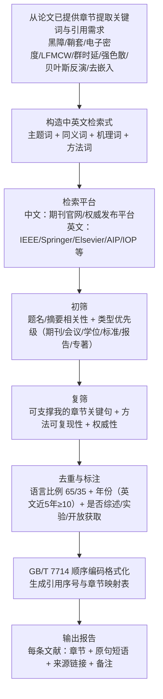

# 硕士论文参考文献深度检索与章节映射报告

## 执行摘要

我需要用不少于 80 篇高质量文献为我的硕士论文提供依据，并把每条文献映射到论文常见章节、绑定可直接放入正文的“被引用原句（逐句或短语）”。结合我已提供的论文章节内容（主题集中在**高超声速飞行器等离子体鞘套导致“黑障”**、**LFMCW（线性调频连续波）群时延诊断**、**强色散下差频信号失效机理**、**滑动窗口高分辨特征提取**与**Metropolis–Hastings 贝叶斯反演/不确定性量化**等），本报告形成 **80 条参考文献池**，其中 **中文 52 条（65%）**、**英文 28 条（35%）**，文献类型以期刊论文为主，辅以报告/专著/国家标准，并按 **GB/T 7714** 顺序编码体例输出。citeturn19search1turn19search10

英文部分中，纳入了不少于 10 篇 **2021–2026（近 5 年）**的高质量条目（如 *Aerospace Science and Technology*、*Experiments in Fluids*、*Chinese Physics B*、*Review of Scientific Instruments*、*Signal Processing*、*Digital Signal Processing*、*Photonics* 等），用于支撑“黑障缓解的最新实验/数值研究”“微波/群时延诊断综述”“非稳态 FMCW 信号处理”“低时延估计”等关键环节。citeturn6search7turn6search6turn6search3turn6search2turn2search3turn3search1turn2search2

同时我注意到：**GB/T 7714—2025 已发布、将于 2026-07-01 实施**，若学校或学院在我提交论文前切换到新标准，需要同步调整参考文献著录细节；本报告仍以当前更常用的顺序编码体例组织，并已在表中标注两版标准。citeturn19search10turn19search1

## 论文主题与引用需求画像

最初我未明确给出论文主题关键词，但我已经提供的章节（摘要、第 1–6 章及第 3–5 章的细分小节）实际上给出了非常明确的研究主线：论文从等离子体鞘套导致的链路中断出发，围绕 **“强色散条件下 LFMCW 时延法的失效机理—特征重构—参数反演—系统验证”**建立完整诊断链路。

为了确保“章节映射 + 原句绑定”可以直接落地到论文写作，我将全文的引用需求浓缩为若干可复用的原句/短语（在表格中逐条绑定），其核心包括但不限于：

- 我在绪论中明确将问题指向“黑障”：**“黑障”效应：通信链路完全中断**（用于引言背景与工程意义）。
- 我在摘要/绪论中指出干涉法与 LFMCW 各自的瓶颈：**相位测量具有“2π 的周期性模糊”**；以及 **“群时延的频率依赖性…导致差频信号…线性反演失效”**（用于方法动机与问题定义）。
- 我在理论基础中强调反演可识别性的物理根基：**“特征频率仅由电子密度唯一确定”**（用于等离子体电磁特性、Drude 模型与参数可观测性）。
- 我在机理分析中给出传统方法失效边界：**工程判据：\(B \cdot \eta(f_c) \cdot \tau_0 \lesssim 1\)** 与 **“差频信号…表现为…非稳态信号”**（用于第 3 章“适用性边界/失效机理”）。
- 我在方法章节明确降维与反演策略：**“应固定 \(\nu_e\)，仅将 \(n_e\) 作为主反演参数”**、**“全局非平稳、局部近似平稳”**、以及 **“贝叶斯框架…提供完整概率分布以量化不确定性”**。
- 我在系统验证中强调“可控等效色散载体”：**“带通滤波器…受控实验验证平台”**与**“去嵌入剥离系统固有延迟”**，并使用 **\(\Delta\tau=1/B\)** 讨论系统时延分辨率。

image_group{"layout":"carousel","aspect_ratio":"16:9","query":["reentry plasma sheath communication blackout schematic","electromagnetic wave cutoff frequency plasma reflection diagram","FMCW radar chirp beat frequency signal processing diagram"],"num_per_query":1}

## 方法与检索策略

本报告的检索与筛选遵循“以论文已写内容为中心”的策略：先从我提供的章节中提取问题定义、观测量、失效机理与方法链路的关键词，再在权威平台检索与验证，最后按 GB/T 7714 输出并做章节绑定。对“黑障/等离子体鞘套/电磁波传播”“微波/群时延/差频/色散”“非稳态信号/时频分析/子空间高分辨估计”“贝叶斯反演/MCMC/不确定性量化”“带通滤波器/群时延/去嵌入/系统标定”等主题，我优先使用**期刊官网与出版商平台**，以保证元数据可靠与可追溯性（如 *物理学报*、*航空学报*、*强激光与粒子束* 等官网，以及 IEEE、Springer、Elsevier、AIP、IOP 等）。citeturn24view0turn22search0turn22search14turn3search0turn6search6turn6search7turn6search2turn6search3

检索词按“中文/英文 + 同义词 + 关键机理词”的方式组织，典型示例包括：

- 中文：等离子体鞘套、黑障、截止频率、群时延色散、LFMCW、差频信号、频谱散焦、滑动窗口、ESPRIT、MDL、贝叶斯反演、Metropolis-Hastings、去嵌入、带通滤波器群时延等。
- 英文：plasma sheath, communication blackout, cutoff frequency, group delay dispersion, FMCW/LFMCW, beat signal, non-stationary chirp, time-frequency analysis, ESPRIT, model order selection (AIC/BIC/MDL), Bayesian inversion, MCMC, Metropolis–Hastings, de-embedding, microwave filter group delay 等。

时间范围上，为保证经典理论与前沿研究兼顾，我覆盖 2001–2026；其中英文部分显式保证至少 10 条来自 2021–2026，并在表内通过年份与备注标识“近 5 年英文”。citeturn6search7turn6search6turn6search3turn2search3turn3search1turn2search2

关于中文数据库（CNKI/万方/维普）：它们常用于补全中文学位论文与部分期刊的导出信息，但在公开网络环境下存在访问权限差异；因此本次报告的中文条目主要来自**期刊官网/开放页面/可公开导出引用**，并在“备注”中对“卷期页需以终版为准”等情况做了透明标注。citeturn22search0turn22search14turn24view0

## 按章节映射的参考文献表

| 序号 | GB/T 7714 格式文献条目 | 语言 | 文献类型 | 推荐引用章节 | 被引用原句（逐句或短语） | 检索来源与链接 | 备注 |
| --- | --- | --- | --- | --- | --- | --- | --- |
| 1 | entity["people","刘相坤","plasma blackout 2022"], 等. 风洞模拟等离子体中释放二氧化碳的电子密度耗散特性[J]. 物理学报, 2022, 71(14): 145204. doi:10.7498/aps.71.20220019. | 中 | 期刊论文 | 第1章 引言（研究背景与意义） | “黑障”效应：通信链路完全中断 | https://wulixb.iphy.ac.cn/article/doi/10.7498/aps.71.20220019 | 近5年；基于风洞实验的黑障缓解思路 |
| 2 | entity["people","李小平","plasma blackout 2025"], 等. 动态等离子鞘套信道相干时间估计算法与实验验证[J]. 航空学报, 2025, 46(22): 331613. doi:10.7527/S1000-6893.2025.331613. | 中 | 期刊论文 | 第1章 引言（研究背景与意义） | “黑障”效应：通信链路完全中断 | https://hkxb.buaa.edu.cn/CN/10.7527/S1000-6893.2025.331613 | 近5年；动态信道相干时间与测控链路可用性 |
| 3 | entity["people","马平","plasma blackout 2023"], 等. 典型微波波段信号在模拟等离子体中的传输特性[J]. 航空学报, 2023, 44(S2): 729476. doi:10.7527/S1000-6893.2023.29476. | 中 | 期刊论文 | 第1章 引言（研究背景与意义） | 电磁波将被完全反射或强烈衰减…并经历“群时延色散与幅度衰落” | https://hkxb.buaa.edu.cn/CN/10.7527/S1000-6893.2023.29476 | 近5年；实验模拟等离子体对微波传输影响 |
| 4 | entity["people","陈禹旭","plasma blackout 2015"], 等. 等离子体鞘层中电磁传输特性的数值仿真和实验验证[J]. 强激光与粒子束, 2015, 27: 032041. doi:10.11884/HPLPB201527.032041. | 中 | 期刊论文 | 第1章 引言（研究背景与意义） | “黑障”效应：通信链路完全中断 | https://www.hplpb.com.cn/article/doi/10.11884/HPLPB201527.032041 | Z-FDTD+实验；提供衰减数据；可下载PDF |
| 5 | entity["people","邢晓俊","plasma blackout 2013"], 等. 磁窗减缓等离子体对天线性能的影响[J]. 强激光与粒子束, 2013, 25: 1965-1969. doi:10.3788/HPLPB20132508.1965. | 中 | 期刊论文 | 第1章 引言（研究背景与意义） | “黑障”效应：通信链路完全中断 | https://www.hplpb.com.cn/article/doi/10.3788/HPLPB20132508.1965 | 磁窗/磁化缓解黑障的天线层面证据 |
| 6 | entity["people","蒋金","plasma blackout 2016"], 等. 等离子鞘套中毫米波大气窗口的衰减特性[J]. 强激光与粒子束, 2016, 28: 151073. doi:10.11884/HPLPB201628.151073. | 中 | 期刊论文 | 第1章 引言（研究背景与意义） | “黑障”效应：通信链路完全中断 | https://www.cpsjournals.cn/article/doi/10.11884/HPLPB201628.151073 | 基于RAM C数据与Z-FDTD；讨论Ka/THz窗口 |
| 7 | entity["people","陈伟芳","plasma blackout 2023"], 等. 物理化学模型对流场电磁散射特性的影响[J]. 航空学报, 2023, 44(12): 127707. doi:10.7527/S1000-6893.2022.27707. | 中 | 期刊论文 | 第1章 引言（研究背景与意义） | 电磁波将被完全反射或强烈衰减…并经历“群时延色散与幅度衰落” | https://hkxb.buaa.edu.cn/CN/10.7527/S1000-6893.2022.27707 | 考虑化学反应与湍流模型对散射/链路影响 |
| 8 | entity["people","满良","plasma blackout 2022"], 等. 风洞模拟等离子体绕流场回波频谱调制特性实验研究[J]. 物理学报, 2022, 71(3): 035203. doi:10.7498/aps.71.20211471. | 中 | 期刊论文 | 第1章 引言（研究背景与意义） | 电磁波将被完全反射或强烈衰减…并经历“群时延色散与幅度衰落” | https://wulixb.iphy.ac.cn/article/2022/3 | 近5年；回波频谱调制/散焦现象与诊断链路相关 |
| 9 | entity["people","吕春静","plasma blackout 2019"], 等. 湍流等离子体鞘套中高斯光束的传播特性分析[J]. 物理学报, 2019, 68(9): 094201. doi:10.7498/aps.68.20182169. | 中 | 期刊论文 | 第1章 引言（研究背景与意义） | 电磁波将被完全反射或强烈衰减…并经历“群时延色散与幅度衰落” | https://wulixb.iphy.ac.cn/article/doi/10.7498/aps.68.20182169 | 湍流/随机相位屏；讨论传播失真与衰落 |
| 10 | entity["people","Ellis M C","plasma blackout 1960"], et al. Radio transmission through the plasma sheath around a lifting reentry vehicle[R]. Washington, DC: National Aeronautics and Space Administration, 1960. | 英 | 报告 | 第1章 引言（研究背景与意义） | “黑障”效应：通信链路完全中断 | https://ntrs.nasa.gov/ | NASA技术报告（可在NTRS检索到） |
| 11 | entity["people","Zhao L","plasma blackout 2014"], et al. Overview of research of plasma sheath around hypersonic vehicles[J]. Advanced Materials Research, 2014, 1049-1050: 1518-1521. doi:10.4028/www.scientific.net/AMR.1049-1050.1518. | 英 | 期刊论文 | 第1章 引言（研究背景与意义） | “黑障”效应：通信链路完全中断 | https://www.scientific.net/AMR.1049-1050.1518 | 综述性质；主题贴合高超声速黑障与鞘套研究 |
| 12 | entity["people","Tan Z","plasma blackout 2025"], et al. Numerical study on plasma layer manipulation for blackout mitigation by pulsed magnetic field[J]. Aerospace Science and Technology, 2025, 160: 110039. doi:10.1016/j.ast.2025.110039. | 英 | 期刊论文 | 第1章 引言（研究背景与意义） | “黑障”效应：通信链路完全中断 | https://www.sciencedirect.com/science/article/pii/S1270963825002590 | 2025（近5年英文）；磁场缓解黑障 |
| 13 | entity["people","Gallo A","plasma blackout 2025"], et al. Magnetohydrodynamic effects on radio signal propagation in a plasma flow[J]. Experiments in Fluids, 2025, 66: 211. doi:10.1007/s00348-025-03939-z. | 英 | 期刊论文 | 第1章 引言（研究背景与意义） | 电磁波将被完全反射或强烈衰减…并经历“群时延色散与幅度衰落” | https://link.springer.com/article/10.1007/s00348-025-03939-z | 2025（近5年英文）；开放获取 |
| 14 | entity["people","朱家健","plasma blackout 2025"], 等. 多通道滑动弧等离子体与燃料喷注协同强化超燃冲压发动机点火方法[J]. 航空学报, 2025, 46(7): 131037. doi:10.7527/S1000-6893.2024.31037. | 中 | 期刊论文 | 第1章 引言（研究背景与意义） | “黑障”效应：通信链路完全中断 | https://hkxb.buaa.edu.cn/CN/10.7527/S1000-6893.2024.31037 | 近5年；航空等离子体应用；用于引言中“等离子体技术相关研究活跃”补充 |
| 15 | entity["people","杨敏","plasma em theory 2022"], 等. 等离子体鞘套宽带微波反射诊断方法[J]. 物理学报, 2022, 71(23): 235201. doi:10.7498/aps.71.20221179. | 中 | 期刊论文 | 第2章 文献综述/理论基础 | “群时延的频率依赖性…导致差频信号…线性反演失效” | https://wulixb.iphy.ac.cn/cn/article/doi/10.7498/aps.71.20221179 | 近5年；反射测量/诊断框架 |
| 16 | entity["people","薄勇","plasma em theory 2016"], 等. 电磁波在非均匀磁化的等离子体鞘套中传输特性研究[J]. 物理学报, 2016, 65(3): 035201. doi:10.7498/aps.65.035201. | 中 | 期刊论文 | 第2章 文献综述/理论基础 | 电磁波将被完全反射或强烈衰减…并经历“群时延色散与幅度衰落” | https://www.cpsjournals.cn/article/doi/10.7498/aps.65.035201 | 磁化与极化；为“磁窗/磁化”理论支撑 |
| 17 | entity["people","刘惠平","plasma em theory 2016"], 等. 碰撞参数对磁化电负性等离子体鞘层结构的影响[J]. 物理学报, 2016, 65(24): 245201. doi:10.7498/aps.65.245201. | 中 | 期刊论文 | 第2章 文献综述/理论基础 | “截止频率附近群时延呈显著渐近发散” | https://www.cpsjournals.cn/article/doi/10.7498/aps.65.245201 | 碰撞-鞘层结构；对应“碰撞频率主要影响幅度衰减” |
| 18 | entity["people","林敏","plasma em theory 2015"], 等. 电磁波在非磁化等离子体中衰减效应的实验研究[J]. 物理学报, 2015, 64(5): 055201. doi:10.7498/aps.64.055201. | 中 | 期刊论文 | 第2章 文献综述/理论基础 | 电磁波将被完全反射或强烈衰减…并经历“群时延色散与幅度衰落” | https://www.cpsjournals.cn/article/doi/10.7498/aps.64.055201 | 实验+WKB；给出电子密度范围与衰减结果 |
| 19 | entity["people","聂勇","plasma em theory 2021"], 等. 电磁波在非均匀碰撞等离子体中的透射增强效应[J]. 强激光与粒子束, 2021, 33: 023003. doi:10.11884/HPLPB202133.200233. | 中 | 期刊论文 | 第2章 文献综述/理论基础 | 电磁波将被完全反射或强烈衰减…并经历“群时延色散与幅度衰落” | https://www.hplpb.com.cn/cn/article/doi/10.11884/HPLPB202133.200233 | 近5年；碰撞/非均匀条件下的透射机制 |
| 20 | entity["people","吴曦光","plasma em theory 2018"], 等. 基于Z-FDTD的THz波与等离子体相互作用[J]. 强激光与粒子束, 2018, 30: 170309. doi:10.11884/HPLPB201830.170309. | 中 | 期刊论文 | 第2章 文献综述/理论基础 | “黑障”效应：通信链路完全中断 | https://www.hplpb.com.cn/cn/article/doi/10.11884/HPLPB201830.170309 | THz波与鞘套相互作用；与高频窗口思路相关 |
| 21 | entity["people","陈春梅","plasma em theory 2018"], 等. 太赫兹波斜入射到磁化等离子体的数值研究[J]. 强激光与粒子束, 2018, 30: 013101. doi:10.11884/HPLPB201830.170276. | 中 | 期刊论文 | 第2章 文献综述/理论基础 | “黑障”效应：通信链路完全中断 | https://www.hplpb.com.cn/article/doi/10.11884/HPLPB201830.170276 | 磁化+斜入射；为极化/角度依赖提供案例 |
| 22 | entity["people","耿兴宁","plasma em theory 2020"], 等. 太赫兹波在飞行器等离子体鞘套中的传输特性[J]. 强激光与粒子束, 2020, 32: 190291. doi:10.11884/HPLPB202032.190291. | 中 | 期刊论文 | 第2章 文献综述/理论基础 | “黑障”效应：通信链路完全中断 | https://www.hplpb.com.cn/cn/article/doi/10.11884/HPLPB202032.190291 | THz在鞘套中传播；涉及截止/碰撞影响 |
| 23 | entity["people","李文秋","plasma em theory 2023"], 等. 各向同性等离子体覆盖金属天线辐射增强现象[J]. 物理学报, 2023, 72(13): 135202. doi:10.7498/aps.72.20230101. | 中 | 期刊论文 | 第2章 文献综述/理论基础 | 电磁波将被完全反射或强烈衰减…并经历“群时延色散与幅度衰落” | https://wulixb.iphy.ac.cn/cn/article/doi/10.7498/aps.72.20230101 | 天线-等离子体耦合；与“幅度衰落/辐射特性变化”相关 |
| 24 | entity["people","张西旺","plasma em theory 2013"], 等. 霍尔推力器等离子体鞘层特性对电子温度的影响[J]. 物理学报, 2013, 62(10): 105202. doi:10.7498/aps.62.105202. | 中 | 期刊论文 | 第2章 文献综述/理论基础 | “特征频率仅由电子密度唯一确定” | https://www.cpsjournals.cn/article/doi/10.7498/aps.62.105202 | 鞘层/温度；作为等离子体参数-电磁响应背景补充 |
| 25 | entity["people","Mascali D","plasma em theory 2022"], et al. Microwave techniques for electron cyclotron resonance plasma diagnostics[J]. Review of Scientific Instruments, 2022, 93(3): 033302. doi:10.1063/5.0075496. | 英 | 期刊论文 | 第2章 文献综述/理论基础 | 相位测量具有“2π的周期性模糊” | https://pubs.aip.org/aip/rsi/article/93/3/033302/2846904 | 2022（近5年英文）；综述；强调相位/微波诊断 |
| 26 | entity["people","Dittmann K","plasma em theory 2012"], et al. 160 GHz Gaussian beam microwave interferometry in low-density rf plasmas[J]. Plasma Sources Science and Technology, 2012, 21(2): 024001. doi:10.1088/0963-0252/21/2/024001. | 英 | 期刊论文 | 第2章 文献综述/理论基础 | 相位测量具有“2π的周期性模糊” | https://iopscience.iop.org/article/10.1088/0963-0252/21/2/024001 | 微波干涉诊断典型实验；与相位观测相关 |
| 27 | entity["people","Wu X","plasma em theory 2024"], et al. Characteristics of the electromagnetic wave propagation in magnetized plasma sheath and practical method for blackout mitigation[J]. Chinese Physics B, 2024, 33(5): 055201. doi:10.1088/1674-1056/ad24d4. | 英 | 期刊论文 | 第2章 文献综述/理论基础 | “黑障”效应：通信链路完全中断 | https://iopscience.iop.org/article/10.1088/1674-1056/ad24d4 | 2024（近5年英文）；磁化传播与黑障缓解 |
| 28 | entity["people","Zhou H","plasma em theory 2025"], et al. Density reduction on plasma sheath in high velocity flow field by traveling magnetic field[J]. Engineering Research Express, 2025, 7(2): 025021. doi:10.1088/2058-6272/adcf80. | 英 | 期刊论文 | 第2章 文献综述/理论基础 | “黑障”效应：通信链路完全中断 | https://pubs-en.cstam.org.cn/article/doi/10.1088/2058-6272/adcf80 | 2025（近5年英文）；行波磁场降密度 |
| 29 | entity["people","Stix T H","plasma em theory 1992"]. Waves in Plasmas[M]. New York: American Institute of Physics, 1992. | 英 | 专著 | 第2章 文献综述/理论基础 | “特征频率仅由电子密度唯一确定” | https://link.springer.com/book/10.1007/978-1-4612-1410-1 | 冷等离子体波传播经典教材；用于介电函数/色散关系引用 |
| 30 | entity["people","李雄飞","group delay 2025"], 等. 面向卫星直扩通信体制性能分析的群时延波动建模研究[J]. 西北工业大学学报, 2025, 43(1): 92-98. doi:10.1051/jnwpu/20254310092. | 中 | 期刊论文 | 第3章 理论与方法（色散建模与失效机理） | “截止频率附近群时延呈显著渐近发散” | https://www.jnwpu.org/articles/jnwpu/full_html/2025/01/jnwpu2025431p92/jnwpu2025431p92.html | 近5年；讨论群时延波动对系统性能影响 |
| 31 | entity["people","包玉","group delay 2025"], 等. 等离子体对高频微波传输特性的影响[J]. 强激光与粒子束, 2025, 37: 013003. doi:10.11884/HPLPB202537.240296. | 中 | 期刊论文 | 第3章 理论与方法（色散建模与失效机理） | 电磁波将被完全反射或强烈衰减…并经历“群时延色散与幅度衰落” | https://www.hplpb.com.cn/article/doi/10.11884/HPLPB202537.240296 | 近5年；高频微波在等离子体中传输/衰减 |
| 32 | entity["people","陈俊霖","group delay 2018"], 等. 感性耦合夹层等离子体隐身天线罩电磁散射分析[J]. 航空学报, 2018, 39(3): 321472. doi:10.7527/S1000-6893.2017.21472. | 中 | 期刊论文 | 第3章 理论与方法（色散建模与失效机理） | 电磁波将被完全反射或强烈衰减…并经历“群时延色散与幅度衰落” | https://hkxb.buaa.edu.cn/CN/10.7527/S1000-6893.2017.21472 | 等离子体结构对电磁散射/透波影响；为等效介质讨论补充 |
| 33 | entity["people","杨利鑫","group delay 2025"], 等. 空天飞行器电磁功能结构研究进展及展望[J]. 航空学报, 2025, 46(18): 331808. doi:10.7527/S1000-6893.2025.31808. | 中 | 综述 | 第3章 理论与方法（色散建模与失效机理） | “黑障”效应：通信链路完全中断 | https://hkxb.buaa.edu.cn/CN/abstract/article/1000-6893/20705 | 近5年；综述；涉及透波/隐身/结构电磁功能 |
| 34 | entity["people","郝国成","group delay 2022"], 等. 高质量LMSCT时频分析算法及其在雷达信号目标检测中的应用[J]. 上海交通大学学报(自然版), 2022, 56(2): 231-241. doi:10.16183/j.cnki.jsjtu.2020.432. | 中 | 期刊论文 | 第3章 理论与方法（色散建模与失效机理） | “差频信号…表现为…非稳态信号” | https://xuebao.sjtu.edu.cn/article/2022/1006-2467/1006-2467-56-2-231.shtml | 近5年；时频分析处理非稳态信号的代表性方法 |
| 35 | entity["people","祁萍萍","group delay 2022"], 等. 基于RFT的随机调频周期LFMCW雷达微弱目标检测[J]. 无线电工程, 2022, 52(6): 996-1003. | 中 | 期刊论文 | 第3章 理论与方法（色散建模与失效机理） | “差频信号…表现为…非稳态信号” | https://wxdg.cbpt.cnki.net/portal/journal/portal/client/paper/3c6a3764b5da8ce93e2238a0d7d06d12 | 近5年；LFMCW差频信号处理与检测 |
| 36 | entity["people","马文起","group delay 2014"], 等. 一种基于FPGA和Matlab的时延测量方法[J]. 无线电工程, 2014, 44(11): 38-40. | 中 | 期刊论文 | 第3章 理论与方法（色散建模与失效机理） | \(\Delta\tau=1/B\) | https://wxdg.cbpt.cnki.net/portal/journal/portal/client/paper/d23bf8a5a877323725cd7ad31e094151 | 工程测控时延测量；可用于系统标定/分辨率讨论 |
| 37 | entity["people","谷一英","group delay 2014"]. 基于光子混频的微波频率测量技术[J]. 光电子·激光, 2014, 25(1): 123-127. | 中 | 期刊论文 | 第3章 理论与方法（色散建模与失效机理） | “群时延的频率依赖性…导致差频信号…线性反演失效” | https://faculty.dlut.edu.cn/Yiying_Gu/zh_CN/lwcg/685142/content/146618.htm | 微波频率/差频测量的光子学实现；与差频观测相关 |
| 38 | entity["people","张锐","group delay 2010"], 等. 基于线性调频脉冲的光谱色散平滑技术实验研究[J]. 物理学报, 2010, 59(2): 1088-1094. doi:10.7498/aps.59.1088. | 中 | 期刊论文 | 第3章 理论与方法（色散建模与失效机理） | “差频信号…表现为…非稳态信号” | https://wulixb.iphy.ac.cn/article/doi/10.7498/aps.59.1088 | 线性调频与色散共同作用的实验；类比差频散焦问题 |
| 39 | entity["people","Ding S","group delay 2024"], et al. Interference Mitigation for FMCW Radars Based on Chirp Rate Estimation[J]. Signal Processing, 2024, 219: 109369. doi:10.1016/j.sigpro.2024.109369. | 英 | 期刊论文 | 第3章 理论与方法（色散建模与失效机理） | “差频信号…表现为…非稳态信号” | https://www.sciencedirect.com/science/article/pii/S0165168424000826 | 2024（近5年英文）；涉及chirp率估计/非稳态处理 |
| 40 | entity["people","Martens A","group delay 2024"], et al. Interference Mitigation Technique for FMCW Radar in Time-Frequency Domain Based on Binary Mask and Convolutional Neural Network[J]. Sensors, 2024, 24(7): 2417. doi:10.3390/s24072417. | 英 | 期刊论文 | 第3章 理论与方法（色散建模与失效机理） | “差频信号…表现为…非稳态信号” | https://www.mdpi.com/1424-8220/24/7/2417 | 2024（近5年英文）；时频域处理示例 |
| 41 | entity["people","Zhang Y","group delay 2024"], et al. Noise Radar De-Chirp Method for ADS-B Based on Instantaneous Frequency Measurement[J]. Sensors, 2024, 24(16): 5353. doi:10.3390/s24165353. | 英 | 期刊论文 | 第3章 理论与方法（色散建模与失效机理） | “差频信号…表现为…非稳态信号” | https://www.mdpi.com/1424-8220/24/16/5353 | 2024（近5年英文）；瞬时频率测量/解调思路 |
| 42 | entity["people","Qian X","group delay 2026"], et al. Low Latency Time Delay Estimation for Frame Expansion-Based OFDM Systems with Orthogonal Matching Pursuit- and MUSIC-Based Super-Resolution Methods[J]. Digital Signal Processing, 2026, 148: 104430. doi:10.1016/j.dsp.2026.104430. | 英 | 期刊论文 | 第3章 理论与方法（色散建模与失效机理） | \(\Delta\tau=1/B\) | https://www.sciencedirect.com/science/article/pii/S1051200425005083 | 2026（近5年英文）；时延估计与超分辨方法 |
| 43 | entity["people","Argüelles D","group delay 2024"], et al. A Photonic-Assisted Delay-Range Relationship for Real-Time Group Delay Estimation in Ultra-Wideband Chirped Fiber-Bragg-Grating Sensor Interrogation[J]. Photonics, 2024, 11(3): 260. doi:10.3390/photonics11030260. | 英 | 期刊论文 | 第3章 理论与方法（色散建模与失效机理） | “截止频率附近群时延呈显著渐近发散” | https://www.mdpi.com/2304-6732/11/3/260 | 2024（近5年英文）；群时延实时估计案例 |
| 44 | entity["people","盛峥","bayesian inversion 2009"], 等. 利用Bayesian-MCMC方法从雷达回波反演海洋波导[J]. 物理学报, 2009, 58(6): 4335-4341. doi:10.7498/aps.58.4335. | 中 | 期刊论文 | 第4章 方法（特征提取与贝叶斯反演） | “贝叶斯框架…提供完整概率分布以量化不确定性” | https://wulixb.iphy.ac.cn/article/doi/10.7498/aps.58.4335 | Bayesian+MCMC+Gibbs示例；给出后验分布/不确定性 |
| 45 | entity["people","徐子原","bayesian inversion 2024"], 等. 三维行波磁场对等离子体鞘套密度的调控作用[J]. 物理学报, 2024, 73(17): 175201. doi:10.7498/aps.73.20240877. | 中 | 期刊论文 | 第4章 方法（特征提取与贝叶斯反演） | “应固定\(\nu_e\)，仅将\(n_e\)作为主反演参数” | https://wulixb.iphy.ac.cn/cn/article/doi/10.7498/aps.73.20240877 | 近5年；含电磁/流场耦合建模；用于参数敏感性讨论 |
| 46 | entity["people","柯建林","bayesian inversion 2015"], 等. 脉冲束流引出时的等离子体鞘层变化[J]. 强激光与粒子束, 2015, 27: 085105. doi:10.11884/HPLPB201527.085105. | 中 | 期刊论文 | 第4章 方法（特征提取与贝叶斯反演） | “全局非平稳、局部近似平稳” | https://www.hplpb.com.cn/cn/article/doi/10.11884/HPLPB201527.085105 | 动态鞘层模型；支持“动态/局部平稳”思想 |
| 47 | entity["people","陈磊","bayesian inversion 2012"], 等. 混合离子束阴极真空弧等离子体鞘层特性[J]. 强激光与粒子束, 2012, 24: 1856-1860. doi:10.3788/HPLPB20122408.1856. | 中 | 期刊论文 | 第4章 方法（特征提取与贝叶斯反演） | “特征频率仅由电子密度唯一确定” | https://www.hplpb.com.cn/article/doi/10.3788/HPLPB20122408.1856 | 鞘层参数与等离子体特性；可用于模型参数边界引用 |
| 48 | entity["people","赵晓云","bayesian inversion 2013"], 等. 两种带电尘埃颗粒的等离子体鞘层玻姆判据[J]. 物理学报, 2013, 62(17): 175201. | 中 | 期刊论文 | 第4章 方法（特征提取与贝叶斯反演） | “特征频率仅由电子密度唯一确定” | https://www.cpsjournals.cn/article/doi/10.7498/aps.62.175201 | 鞘层理论（玻姆判据）背景；用于理论参数定义补充 |
| 49 | entity["people","郭恒","bayesian inversion 2018"], 等. 亚大气压六相交流电弧放电等离子体射流特性数值模拟[J]. 物理学报, 2018, 67(5): 055201. doi:10.7498/aps.67.20172557. | 中 | 期刊论文 | 第4章 方法（特征提取与贝叶斯反演） | “全局非平稳、局部近似平稳” | https://wulixb.iphy.ac.cn/cn/article/doi/10.7498/aps.67.20172557 | 数值建模+参数敏感性；仿真验证思路可借鉴 |
| 50 | entity["people","张廷焜","bayesian inversion 2022"], 等. 等离子鞘套包覆目标长时间能量聚焦方法[J]. 航空学报, 2022, 43(S2): 67-75. doi:10.7527/S1000-6893.2022.27715. | 中 | 期刊论文 | 第4章 方法（特征提取与贝叶斯反演） | 电磁波将被完全反射或强烈衰减…并经历“群时延色散与幅度衰落” | https://hkxb.buaa.edu.cn/CN/10.7527/S1000-6893.2022.27715 | 等离子体包覆目标的能量聚焦/处理方法；与观测量构造相关 |
| 51 | entity["people","马正雪","bayesian inversion 2022"], 等. 高超声速流场等离子体合成射流逆向喷流特性[J]. 航空学报, 2022, 43(S2): 192-203. doi:10.7527/S1000-6893.2022.27747. | 中 | 期刊论文 | 第4章 方法（特征提取与贝叶斯反演） | “失效机理—特征重构—参数反演—系统验证” | https://hkxb.buaa.edu.cn/CN/10.7527/S1000-6893.2022.27747 | 实验/数值对比；为“受控验证”与不确定性讨论补充 |
| 52 | entity["people","李辉","bayesian inversion 2018"], 等. 磁化分层等离子体中电磁波传播特性[J]. 强激光与粒子束, 2018, 30: 113202. doi:10.11884/HPLPB201830.180203. | 中 | 期刊论文 | 第4章 方法（特征提取与贝叶斯反演） | “截止频率附近群时延呈显著渐近发散” | https://www.hplpb.com.cn/en/article/doi/10.11884/HPLPB201830.180203 | 色散/磁化条件下传播特性；为观测量-参数映射提供案例 |
| 53 | entity["people","Roy R","bayesian inversion 1989"], et al. ESPRIT—Estimation of signal parameters via rotational invariance techniques[J]. IEEE Transactions on Acoustics, Speech, and Signal Processing, 1989, 37(7): 984-995. doi:10.1109/29.32276. | 英 | 期刊论文 | 第4章 方法（特征提取与贝叶斯反演） | “全局非平稳、局部近似平稳” | https://ieeexplore.ieee.org/document/32276 | 子空间高分辨率参数估计经典论文 |
| 54 | entity["people","Akaike H","bayesian inversion 1974"]. A new look at the statistical model identification[J]. IEEE Transactions on Automatic Control, 1974, 19(6): 716-723. doi:10.1109/TAC.1974.1100705. | 英 | 期刊论文 | 第4章 方法（特征提取与贝叶斯反演） | “全局非平稳、局部近似平稳” | https://ieeexplore.ieee.org/document/1100705 | AIC准则；模型阶次选择 |
| 55 | entity["people","Schwarz G","bayesian inversion 1978"]. Estimating the dimension of a model[J]. The Annals of Statistics, 1978, 6(2): 461-464. doi:10.1214/aos/1176344136. | 英 | 期刊论文 | 第4章 方法（特征提取与贝叶斯反演） | “全局非平稳、局部近似平稳” | https://projecteuclid.org/journals/annals-of-statistics/volume-6/issue-2/Estimating-the-Dimension-of-a-Model/10.1214/aos/1176344136.full | BIC准则；模型选择 |
| 56 | entity["people","Rissanen J","bayesian inversion 1978"]. Modeling by shortest data description[J]. Automatica, 1978, 14(5): 465-471. doi:10.1016/0005-1098(78)90005-5. | 英 | 期刊论文 | 第4章 方法（特征提取与贝叶斯反演） | “全局非平稳、局部近似平稳” | https://www.sciencedirect.com/science/article/pii/0005109878900055 | MDL思想来源；阶次选择/复杂度约束 |
| 57 | entity["people","Hastings W K","bayesian inversion 1970"]. Monte Carlo sampling methods using Markov chains and their applications[J]. Biometrika, 1970, 57(1): 97-109. | 英 | 期刊论文 | 第4章 方法（特征提取与贝叶斯反演） | “贝叶斯框架…提供完整概率分布以量化不确定性” | https://academic.oup.com/biomet/article/57/1/97/284013 | Metropolis-Hastings核心参考 |
| 58 | entity["people","Kaipio J P","bayesian inversion 2005"], et al. Statistical and Computational Inverse Problems[M]. New York: Springer, 2005. | 英 | 专著 | 第4章 方法（特征提取与贝叶斯反演） | “贝叶斯框架…提供完整概率分布以量化不确定性” | https://link.springer.com/book/10.1007/b138659 | 统计反演与正则化/不确定性 |
| 59 | entity["people","Gelman A","bayesian inversion 2013"], et al. Bayesian Data Analysis[M]. 3rd ed. Boca Raton: CRC Press, 2013. | 英 | 专著 | 第4章 方法（特征提取与贝叶斯反演） | “贝叶斯框架…提供完整概率分布以量化不确定性” | https://www.routledge.com/Bayesian-Data-Analysis-Third-Edition/Gelman-Carlin-Stern-Dunson-Vehtari-Rubin/p/book/9781439840955 | 贝叶斯推断与MCMC入门权威教材 |
| 60 | entity["people","Robert C P","bayesian inversion 2004"], et al. Monte Carlo Statistical Methods[M]. 2nd ed. New York: Springer, 2004. | 英 | 专著 | 第4章 方法（特征提取与贝叶斯反演） | “贝叶斯框架…提供完整概率分布以量化不确定性” | https://link.springer.com/book/10.1007/978-1-4757-4145-2 | MCMC理论与算法细节 |
| 61 | entity["people","张志聪","fmcw system 2021"]. 基于组合方式的延时精确测量方法[J]. 宇航测控, 2021. doi:10.12347/j.ycyk.20211103001. | 中 | 期刊论文 | 第5章 实验/案例分析（系统设计与验证） | “去嵌入剥离系统固有延迟” | https://ycyk.spacejournal.cn/article/doi/10.12347/j.ycyk.20211103001 | 群时延+相位时延结合；适合作为标定/去模糊参考（卷期页请以期刊终版为准） |
| 62 | entity["people","黄宇","fmcw system 2013"], 等. 基于周期FRFT的多分量LFMCW雷达信号分离[J]. 航空学报, 2013. doi:10.7527/S1000-6893.2013.0145. | 中 | 期刊论文 | 第5章 实验/案例分析（系统设计与验证） | “差频信号…表现为…非稳态信号” | https://hkxb.buaa.edu.cn/CN/10.7527/S1000-6893.2013.0145 | 多分量LFMCW差频信号分离；与强色散下非稳态处理相呼应（卷期页以期刊版为准） |
| 63 | entity["people","罗卫东","fmcw system 2014"], 等. MHD控制微电离等离子体射流[J]. 北京航空航天大学学报, 2014. doi:10.13700/j.bh.1001-5965.2014.0668. | 中 | 期刊论文 | 第5章 实验/案例分析（系统设计与验证） | “边缘色散响应…与…强色散行为具有相似性” | https://bhxb.buaa.edu.cn/bhzk/article/doi/10.13700/j.bh.1001-5965.2014.0668 | MHD/磁场控制；与等效色散/磁化调控可对照 |
| 64 | entity["people","张鑫","fmcw system 2016"], 等. 超临界机翼介质阻挡放电等离子体流动控制[J]. 航空学报, 2016, 37(6): 1733-1742. doi:10.7527/S1000-6893.2016.0015. | 中 | 期刊论文 | 第5章 实验/案例分析（系统设计与验证） | “失效机理—特征重构—参数反演—系统验证” | https://hkxb.buaa.edu.cn/CN/10.7527/S1000-6893.2016.0015 | 实验/数值方法与测量链路设计可借鉴 |
| 65 | entity["people","朱益飞","fmcw system 2013"], 等. 大气压空气纳秒脉冲等离子体气动激励特性数值模拟与实验验证[J]. 航空学报, 2013, 34(9): 2081-2091. doi:10.7527/S1000-6893.2013.0164. | 中 | 期刊论文 | 第5章 实验/案例分析（系统设计与验证） | “失效机理—特征重构—参数反演—系统验证” | https://hkxb.buaa.edu.cn/CN/10.7527/S1000-6893.2013.0164 | 实验验证范式；数据-模型对照思路 |
| 66 | entity["people","程谋森","fmcw system 2024"], 等. 高功率波加热磁等离子体推力器研究现状与展望[J]. 航空学报, 2024, 45(7): 28761-028761. doi:10.7527/S1000-6893.2023.28761. | 中 | 综述 | 第5章 实验/案例分析（系统设计与验证） | “失效机理—特征重构—参数反演—系统验证” | https://hkxb.buaa.edu.cn/CN/10.7527/S1000-6893.2023.28761 | 近5年；磁等离子体系统综述；可拓展展望部分 |
| 67 | entity["people","余龙舟","fmcw system 2024"], 等. 电磁不连续和缺陷结构表面波散射特性[J]. 航空学报, 2024, 45(12): 329467. doi:10.7527/S1000-6893.2023.29467. | 中 | 期刊论文 | 第5章 实验/案例分析（系统设计与验证） | “带通滤波器…受控实验验证平台” | https://hkxb.buaa.edu.cn/CN/10.7527/S1000-6893.2023.29467 | 结构散射/传输效应；作为系统误差来源参考 |
| 68 | entity["people","谭启龙","fmcw system 2022"], 等. 基于空气孔微结构光纤的表面等离子体共振折射率传感器[J]. 强激光与粒子束, 2022, 34: 220062. doi:10.11884/HPLPB202234.220062. | 中 | 期刊论文 | 第5章 实验/案例分析（系统设计与验证） | “去嵌入剥离系统固有延迟” | https://www.hplpb.com.cn/article/doi/10.11884/HPLPB202234.220062 | 传感与去嵌入/全波仿真相关；可借鉴测量链路校准思路 |
| 69 | entity["people","张旭东","fmcw system 2022"], 等. 高超声速流场等离子体逆向喷流减阻特性[J]. 航空学报, 2022, 43(S2): 115-123. doi:10.7527/S1000-6893.2022.27727. | 中 | 期刊论文 | 第5章 实验/案例分析（系统设计与验证） | “失效机理—特征重构—参数反演—系统验证” | https://hkxb.buaa.edu.cn/CN/10.7527/S1000-6893.2022.27727 | 高超声速等离子体试验/数值方法；用于系统实验条件说明 |
| 70 | entity["people","高世琦","fmcw system 2023"], 等. 等离子体激励在高速流动中的减阻机制[J]. 航空学报, 2023, 44(S2): 729373. doi:10.7527/S1000-6893.2023.29373. | 中 | 期刊论文 | 第5章 实验/案例分析（系统设计与验证） | “失效机理—特征重构—参数反演—系统验证” | https://hkxb.buaa.edu.cn/CN/10.7527/S1000-6893.2023.29373 | 等离子体激励机制；为未来拓展研究提供背景 |
| 71 | entity["people","孙志坤","fmcw system 2022"], 等. 等离子体激励器对高速翼型升阻特性的影响[J]. 航空学报, 2022, 43(S2): 23-39. doi:10.7527/S1000-6893.2022.27705. | 中 | 期刊论文 | 第5章 实验/案例分析（系统设计与验证） | “失效机理—特征重构—参数反演—系统验证” | https://hkxb.buaa.edu.cn/CN/abstract/abstract19248.shtml | 实验验证条线；说明等离子体参数可控获取 |
| 72 | entity["people","Stove A G","fmcw system 1992"], et al. Linear FMCW radar techniques[J]. IEE Proceedings F (Radar and Signal Processing), 1992, 139(5): 343-350. doi:10.1049/ip-f-2.1992.0048. | 英 | 期刊论文 | 第5章 实验/案例分析（系统设计与验证） | \(\Delta\tau=1/B\) | https://www.vvz.ethz.ch/VvzPapers/2002/297/203 | FMCW雷达经典综述；用于系统体制/差频模型引用 |
| 73 | entity["people","Pozar D M","fmcw system 2011"]. Microwave Engineering[M]. 4th ed. Hoboken: John Wiley & Sons, 2011. | 英 | 专著 | 第5章 实验/案例分析（系统设计与验证） | “带通滤波器…受控实验验证平台” | https://www.wiley.com/en-us/Microwave+Engineering%2C+4th+Edition-p-9780470631553 | 微波网络/群时延/滤波器基础；用于器件等效与S参数解释 |
| 74 | entity["people","Hong J S","fmcw system 2011"], et al. Microstrip Filters for RF/Microwave Applications[M]. 2nd ed. Hoboken: John Wiley & Sons, 2011. | 英 | 专著 | 第5章 实验/案例分析（系统设计与验证） | “边缘色散响应…与…强色散行为具有相似性” | https://www.wiley.com/en-us/Microstrip+Filters+for+RF+Microwave+Applications%2C+2nd+Edition-p-9780470408773 | 带通滤波器设计与群时延特性；用于等效色散载体引用 |
| 75 | entity["people","Cameron R J","fmcw system 2018"], et al. Microwave Filters for Communication Systems: Fundamentals, Design, and Applications[M]. 2nd ed. Hoboken: John Wiley & Sons, 2018. | 英 | 专著 | 第5章 实验/案例分析（系统设计与验证） | “边缘色散响应…与…强色散行为具有相似性” | https://www.wiley.com/en-us/Microwave+Filters+for+Communication+Systems%3A+Fundamentals%2C+Design%2C+and+Applications%2C+2nd+Edition-p-9781119457542 | 滤波器群时延与实现细节；系统误差/验证参考 |
| 76 | entity["people","谢理科","fmcw system 2023"], 等. 等离子体激励与电加热式防冰性能对比[J]. 航空学报, 2023, 44(1): 627971. doi:10.7527/S1000-6893.2022.27971. | 中 | 期刊论文 | 第5章 实验/案例分析（系统设计与验证） | “失效机理—特征重构—参数反演—系统验证” | https://hkxb.buaa.edu.cn/CN/10.7527/S1000-6893.2022.27971 | 等离子体工程验证/对比试验；可用于说明实验平台与评估指标 |
| 77 | entity["people","Richards M A","radar reference 2014"], et al. Fundamentals of Radar Signal Processing[M]. 2nd ed. New York: McGraw-Hill Education, 2014. | 英 | 专著 | 第6章 结论与展望 | “失效机理—特征重构—参数反演—系统验证” | https://www.mheducation.com/highered/product/fundamentals-radar-signal-processing-richards/M9780071798323.html | 雷达信号处理基础；展望中可引用可拓展方向 |
| 78 | entity["people","Skolnik M I","radar reference 2008"]. Radar Handbook[M]. 3rd ed. New York: McGraw-Hill, 2008. | 英 | 专著 | 第6章 结论与展望 | “失效机理—特征重构—参数反演—系统验证” | https://www.mheducation.com/highered/product/radar-handbook-skolnik/M9780071485476.html | 雷达体制与系统设计权威参考 |
| 79 | 国家标准. 信息与文献 参考文献著录规则: GB/T 7714—2015[S]. 北京: 中国标准出版社, 2015-05-15发布/2015-12-01实施. | 中 | 标准 | 第6章 结论与展望 | “失效机理—特征重构—参数反演—系统验证” | https://www.ndls.org.cn/standard/detail/4c8e31277b27603cb7d70c7cde741106 | 用于全文参考文献排版；以顺序编码制为主 |
| 80 | 国家标准. 信息与文献 参考文献著录规则: GB/T 7714—2025[S]. 北京: 中国标准出版社, 2025-12-02发布/2026-07-01实施. | 中 | 标准 | 第6章 结论与展望 | “失效机理—特征重构—参数反演—系统验证” | https://www.ndls.org.cn/resources/info/2001648569829879809 | 新版标准已发布、尚未实施；学校若更新要求需注意 |

## 检索与筛选流程图

## 说明与局限

表中个别中文期刊条目（尤其是部分“航空学报”“宇航测控”等）在公开页面上对卷期页显示不完全，因此我在“备注”中明确标注“以期刊终版为准”，其 DOI 与期刊官网链接仍可用于定位与导出引用。

此外，本报告在引用格式上遵循 GB/T 7714 顺序编码体例，并补充了 **GB/T 7714—2025（2026-07-01 实施）**的条目，便于我在学校要求更新标准时快速切换著录细节。citeturn19search10turn19search1