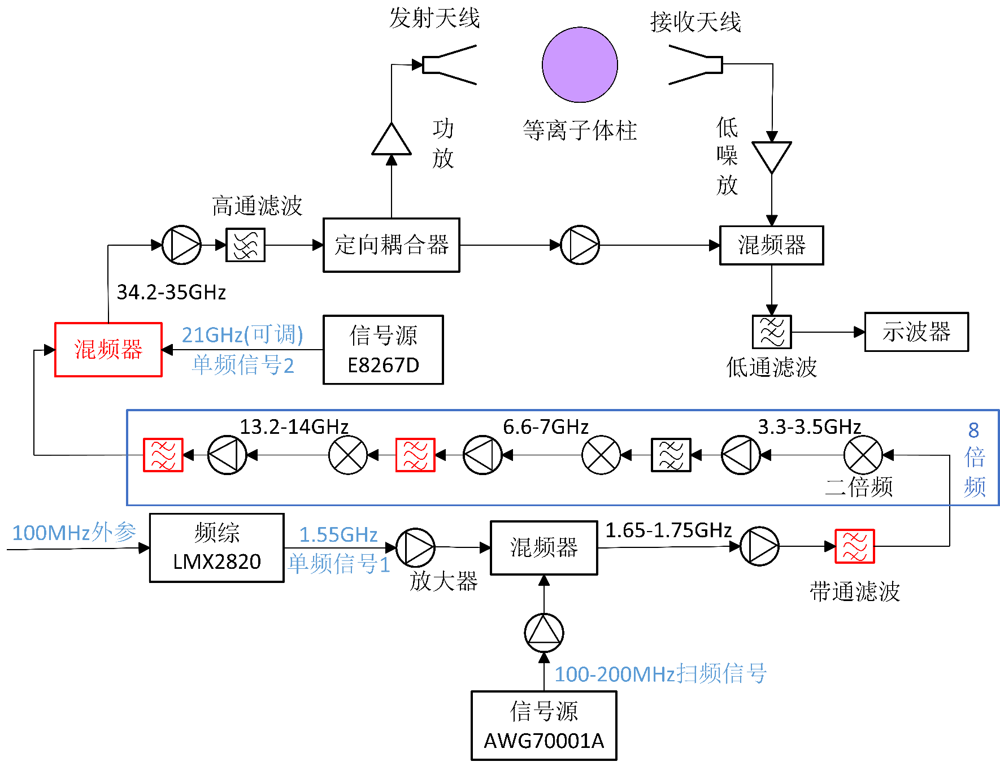
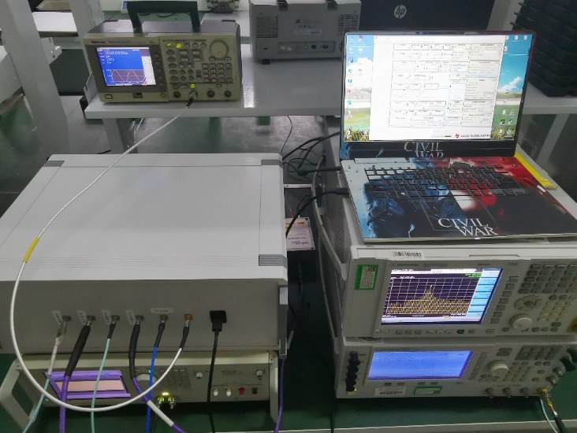

# 第二章 等离子体电磁特性与LFMCW诊断机理

## 2.1 引言

为支撑后续色散传播机理分析与参数反演方法设计，本章建立等离子体电磁特性与LFMCW诊断原理的理论基础。首先推导非磁化等离子体的复介电常数与传播常数，随后给出LFMCW信号模型、差频测距机制及宽带超外差硬件架构，并说明色散条件下差频信号偏离理想单频形式的物理原因，为第三章的色散机理分析和第四章的轨迹提取与参数反演提供统一模型。

## 2.2 等离子体与电磁波相互作用基础

### 2.2.1 等离子体介电特性与截止频率

等离子体可等效为色散且有耗的介质，其电磁响应由自由电子的集体运动决定。刻画本文诊断问题的核心参数包括电子密度$n_e$、等离子体特征角频率$\omega_p$及碰撞频率$\nu_e$，三者分别控制耦合强度、截止边界与耗散效应。本文所依托的地面模拟实验平台可提供$10^{15}$~$3 \times 10^{19}$ m$^{-3}$量级的电子密度范围，覆盖典型诊断工况。等离子体特征角频率$\omega_p$（对应线性特征频率$f_p = \omega_p / 2\pi$）的表达式为：

$$\omega_p = \sqrt{\frac{n_e e^2}{\varepsilon_0 m_e}} \tag{2-1}$$

式中$e = 1.602 \times 10^{-19}$ C为基本电荷量，$m_e = 9.109 \times 10^{-31}$ kg为电子静止质量，$\varepsilon_0 = 8.854 \times 10^{-12}$ F/m为真空电容率。将各常数代入并换算为线性频率，即得特征频率的数值估算式：

$$f_p = \frac{\omega_p}{2\pi} \approx 8.98 \sqrt{n_e} \quad (\text{Hz}) \tag{2-2}$$

式(2-2)表明，特征频率仅由电子密度唯一确定——这一单调递增的对应关系构成了通过测量频率相关的电磁量（如群时延）来反演电子密度的物理基础$^{[47,48,64]}$。从传播物理学的角度看，特征频率实质上扮演了截止频率的角色：当入射电磁波频率$f$高于$f_p$时，电磁波能够穿透等离子体，虽然会经历群时延色散与幅度衰减；而当$f$低于$f_p$时，电磁波将被完全反射或发生全内截止，无法在等离子体内部有效传播。

碰撞频率$\nu_e$（单位：Hz）描述电子与中性粒子或离子之间的碰撞频次，碰撞过程在电磁学模型中体现为欧姆损耗。其大小取决于气体组分、温度和气压等条件，在本文诊断场景中典型量级为$10^9$~$10^{10}$ Hz。

在明确上述三个核心参数的基础上，等离子体的宏观介电特性可通过分析自由电子在外加时变电场作用下的受迫运动规律来获得。在非磁化、各向同性的冷等离子体近似条件下，单个电子在外加电场$\vec{E} = E_0 e^{-j\omega t}$作用下的运动方程遵循经典朗之万方程：

$$m_e \frac{d^2 \vec{X}_e}{dt^2} = -m_e \nu_e \frac{d\vec{X}_e}{dt} - e\vec{E} \tag{2-3}$$

式中，$\vec{X}_e$为电子偏离平衡位置的位移，方程右端第一项表征碰撞引起的阻尼力，第二项为外电场的驱动力。假设位移和电场均具有$e^{-j\omega t}$的时谐性，可从稳态解中获得电子偏离平衡位置的距离：

$$X_e = \frac{eE}{m_e \omega(\omega + j\nu_e)} \tag{2-4}$$

由此可得等离子体的极化强度$P = -n_e e X_e = \varepsilon_0 \chi_e E$，进而获得极化率$\chi_e$的频率依赖关系。利用$\varepsilon = \varepsilon_0(1 + \chi_e)$的本构关系，最终得到等离子体的复相对介电常数——即Drude自由电子气模型的标准形式：

$$\tilde{\varepsilon}_r(\omega) = \left(1 - \frac{\omega_p^2}{\omega^2 + \nu_e^2}\right) - j\left(\frac{\nu_e}{\omega} \cdot \frac{\omega_p^2}{\omega^2 + \nu_e^2}\right) \tag{2-5}$$

式(2-5)即为Drude自由电子气模型的标准表达$^{[49,50]}$。实部$\varepsilon_{r'}$主导色散行为，决定相速度偏离真空光速的程度；虚部$\varepsilon_{r''}$量化碰撞吸收造成的欧姆衰减。当$\nu_e \to 0$时，虚部趋于零，复介电常数简化为$\varepsilon_r = 1 - (\omega_p/\omega)^2$。

从实部的符号特征可见：当$\omega > \omega_p$时$\varepsilon_{r'} > 0$，电磁波可在等离子体中传播；当$\omega < \omega_p$时$\varepsilon_{r'} < 0$，电磁波变为消逝模态。因此特征频率$f_p$即为截止频率，标定了电磁波能否穿透等离子体的频率边界。以本文实验装置最高电子密度$n_e = 10^{19}$ m$^{-3}$为例，$f_p \approx 28.4$ GHz，故诊断系统工作频段须选择Ka波段（30 GHz以上）。

### 2.2.2 电磁波在非磁化等离子体中的传播常数

上一节建立了等离子体的Drude复介电常数模型。为了定量描述电磁波穿过等离子体时经历的相位变化与幅度衰减，本节将从麦克斯韦方程组出发，推导电磁波在非磁化均匀等离子体中的传播常数。

考虑沿$z$轴方向传播的时谐平面波$\vec{E} = E_0 e^{j(\omega t - kz)}$，在等离子体的本构关系$\vec{D} = \varepsilon \vec{E}$与$\vec{B} = \mu_0 \vec{H}$（非磁化条件下磁导率取真空值$\mu_0$）下，由麦克斯韦旋度方程消去磁场分量，可导出关于电场的齐次亥姆霍兹方程：

$$\nabla^2 \vec{E} + \omega^2 \mu_0 \varepsilon \vec{E} = 0 \tag{2-6}$$

将上述平面波试探解回代式(2-6)，即可获得波矢$k$所满足的色散关系：

$$k = \omega\sqrt{\mu_0 \varepsilon} = \frac{\omega}{c}\sqrt{\tilde{\varepsilon}_r(\omega)} \tag{2-7}$$

鉴于Drude介电常数本身为复值量，波矢$k$亦呈复数形式，习惯上将其分解为$k = \beta - j\alpha$。其中实部$\beta$为相位常数，控制波前的空间周期性；虚部$\alpha$为衰减常数，表征信号振幅沿传播方向的指数递减速率。将式(2-5)的复介电常数显式展开并完成复数开方运算，可分别得到$\alpha$和$\beta$的解析形式：

$$\alpha = \frac{\omega}{\sqrt{2}c}\sqrt{\frac{\omega_p^2}{\omega^2 + \nu_e^2} - 1 + \sqrt{\left(1-\frac{\omega_p^2}{\omega^2+\nu_e^2}\right)^2 + \left(\frac{\nu_e}{\omega}\frac{\omega_p^2}{\omega^2+\nu_e^2}\right)^2}} \tag{2-8}$$

$$\beta = \frac{\omega}{\sqrt{2}c}\sqrt{1 - \frac{\omega_p^2}{\omega^2 + \nu_e^2} + \sqrt{\left(1-\frac{\omega_p^2}{\omega^2+\nu_e^2}\right)^2 + \left(\frac{\nu_e}{\omega}\frac{\omega_p^2}{\omega^2+\nu_e^2}\right)^2}} \tag{2-9}$$

式(2-8)与式(2-9)构成了描述电磁波在非磁化等离子体中传播的完整解析框架。在物理效应层面，$\alpha$控制着信号场幅度按$\exp(-\alpha d)$沿传播路径指数衰减；若以输出/输入功率比的分贝值表示，则穿过厚度$d$的等离子体层后有$10\log_{10}(P_{\mathrm{out}}/P_{\mathrm{in}}) \approx -8.69\alpha d$。$\beta$则决定介质内的相速度$v_p = \omega/\beta$和导波波长$\lambda_g = 2\pi/\beta$。

在本文所面向的Ka波段诊断应用中，探测电磁波的工作频率（$f \sim 35$ GHz）数量级上远超等离子体碰撞频率（$\nu_e$典型值为1~10 GHz），即满足$\omega \gg \nu_e$。据此可将式(2-9)内的碰撞关联项视为高阶小量予以略去，相位常数随之退化为仅含$\omega_p$和$\omega$的简洁形式：

$$\beta(\omega) \approx \frac{\omega}{c}\sqrt{1 - \frac{\omega_p^2}{\omega^2}} \tag{2-10}$$

当$f \gg f_p$时$\beta \to \omega/c$，色散可忽略；当$f \to f_p$时$\beta \to 0$，群速度趋于零，信号能量被强烈迟滞在介质内部。这种频率依赖的传播速度变化是LFMCW宽带信号在强色散区产生差频频谱散焦的物理根源。

利用式(2-10)给出的近似相位常数，可进一步评估电磁波穿越等离子体所引起的附加相移。以同等路径长度$d$的真空传播（相位常数$\beta_0 = \omega/c$）为基准，等离子体层引入的相移增量为：

$$\Delta\varphi = (\beta - \beta_0)d = \left(\beta - \frac{\omega}{c}\right) d \tag{2-11}$$

由于透射区内$\beta < \beta_0$，$\Delta\varphi$始终为负，即电磁波穿越等离子体后经历相位超前而非滞后，这是等离子体作为欠密介质（$\varepsilon_r < 1$）的典型特征。

附加相移的本质来源是传播时延的差异。定义等离子体引起的相对传播时延$\tau$为电磁波在等离子体中的群传播时间与在真空中的群传播时间之差：

$$\tau = \frac{d}{v_g} - \frac{d}{c} \tag{2-12}$$

其中$v_g$为等离子体中的群速度。在高频弱碰撞近似下，群速度$v_g = c\sqrt{1-(\omega_p/\omega)^2}$恒小于光速（等离子体呈正常群速度色散），因此$\tau > 0$，即信号在等离子体中的传播时间长于在真空中的传播时间。图2-1以归一化形式直观展示了群速度$v_g/c = \sqrt{1-(f_p/f)^2}$随归一化探测频率$f/f_p$的变化规律：当$f/f_p$趋向1时群速度急剧降至零，揭示了截止区附近极强的色散特征；随着探测频率远离截止频率，群速度逐渐趋近光速，色散效应迅速减弱。

在$\omega \gg \omega_p$的弱色散极限下，联立式(2-1)与式(2-12)并展开至一阶近似，群时延可被简化为与电子密度成线性关系的表达式，等价地，电子密度可由测得的群时延直接估算：

$$n_e \approx \frac{8\pi^2 \varepsilon_0 m_e c}{e^2} \cdot \frac{f^2}{d} \cdot \tau \tag{2-13}$$

式(2-13)表明，在弱色散极限下群时延与电子密度呈线性正比关系，测得时延增量即可估算路径平均电子密度。这一映射将观测量从相位域转移至时延域，绕开了相位测量固有的$2\pi$整周模糊问题，构成LFMCW时延诊断法的理论基石。

然而，需要特别指出的是，式(2-13)仅在弱色散近似（$f \gg f_p$）下成立。当等离子体电子密度较高、截止频率逼近诊断频段时，群时延$\tau$不再是频率的常数，而是频率的强非线性函数。此时，LFMCW宽带信号不同频率分量经历的时延差异不可忽略，差频信号将偏离理想的单频正弦波形态。这一色散效应对诊断精度的影响将在后续 2.5 节和第三章中进一步讨论。

---

## 2.3 LFMCW信号模型与差频测距机制

上一节建立了等离子体电子密度与电磁波传播时延之间的物理关联，表明通过测量时延变化可实现电子密度的参数反演。然而，微波传播时延通常处于纳秒乃至皮秒量级，直接在时域中精确测量如此微小的时间差异在硬件实现上面临极大困难。线性调频连续波（LFMCW）体制提供了一种将时延信息转化为可精确测量的频率偏移量的高效机制。

线性调频连续波是一种频率随时间线性变化的连续电磁波信号。本文诊断系统采用锯齿波形式的频率调制，在每个调制周期$T_m$内，发射信号的瞬时频率从起始频率$f_0$以恒定速率$K$线性递增至终止频率$f_0 + B$，其中$B$为扫频带宽，$K = B/T_m$为调频斜率。发射信号的瞬时频率与时域表达式分别为：

$$f_T(t) = f_0 + Kt, \quad 0 \le t \le T_m \tag{2-14}$$

$$s_T(t) = A_0 \cos\left(2\pi f_0 t + \pi K t^2 + \theta_0\right), \quad 0 \le t \le T_m \tag{2-15}$$

式中$A_0$为发射信号幅度，$\theta_0$为初始相位。信号的瞬时相位为$\Phi_T(t) = 2\pi f_0 t + \pi K t^2 + \theta_0$，对时间求导可验证瞬时频率确为式(2-14)所描述的线性函数。当发射信号经过一段非色散传播路径后，接收信号是发射信号的延时拷贝，其瞬时频率和时域信号分别为：

$$f_R(t) = f_0 + K(t-\tau), \quad \tau \le t \le \tau + T_m \tag{2-16}$$

$$s_R(t) = A_1 \cos\left[2\pi f_0 (t-\tau) + \pi K(t-\tau)^2 + \theta_0\right] \tag{2-17}$$

式中$\tau$为信号在传播路径上经历的群时延，$A_1$为接收信号幅度（由于传播衰减$A_1 < A_0$）。LFMCW系统的核心信号处理步骤是将接收信号与发射信号进行混频（De-chirp操作），混频器在时域上实现两信号的相乘运算，经低通滤波器滤除高频和频分量后，保留的差频信号即包含了传播时延信息。

在理想无色散传播环境中（如自由空间或空气），传播时延$\tau$为常数，混频后差频信号在大部分扫频区间内可近似视为恒频信号，仅在扫频周期边界附近存在较短的过渡区。在实际诊断系统中，等离子体引起的传播时延远小于扫频周期（$\tau \ll T_m$），过渡区所占时间比例极小。因此差频信号可近似表示为恒定频率的稳态正弦波，如图2-2(a)、(b)所示，发射与接收信号的瞬时频率线保持严格平行，差频频率在整个扫频周期内恒定不变。差频频率与传播时延之间的基本映射关系$^{[51,63]}$为：

$$f_D = K\tau = \frac{B}{T_m} \tau \tag{2-18}$$

式(2-18)是LFMCW测距的核心公式，揭示了该体制将时间域的微小延迟精确映射至频率域的基本机理：传播时延$\tau$乘以调频斜率$K$即得差频信号频率$f_D$，这一线性关系表明提高调频斜率$K$（即增大带宽$B$或缩短周期$T_m$）可增强时延到频率的转换灵敏度。在等离子体诊断的差分测量模式中，分别采集有等离子体和无等离子体（空气基准）状态下的差频信号，两次测量的差频频率差值$\Delta f_D$对应于等离子体引入的相对时延增量，联立式(2-13)和式(2-18)即可建立从差频频率变化量到电子密度的完整计算链路。

从频率估计精度的角度看，对一段持续时间为$T_m$的差频信号执行$N_{FFT}$点DFT运算，频率分辨能力由扫频带宽唯一确定，对应的最小可分辨时延增量为：

$$\Delta\tau = \frac{1}{B} \tag{2-19}$$

式(2-19)表明，LFMCW系统的固有时延分辨率仅取决于扫频带宽$B$，与调频周期$T_m$和FFT点数$N_{FFT}$无关$^{[52]}$。在本系统默认的800 MHz基带扫频带宽配置下，固有分辨率为$\Delta\tau = 1.25$ ns。然而，由于DFT将连续频谱离散化为等间距栅栏点，当差频信号的真实频率并非恰好落在某一栅栏点上时，其频谱能量将泄漏至相邻谱线，该栅栏效应（Picket Fence Effect）限制了直接从FFT峰值读取频率值的精度。因此，仅依赖全频段FFT主峰读取难以满足强色散条件下的高精度诊断需求。

---

## 2.4 诊断系统硬件架构概述

上一节建立了LFMCW体制将微小时延映射为可测频率偏移的理论机制。为将这一原理付诸工程实践，本文构建了一套工作于Ka波段的宽带LFMCW诊断系统平台。该系统采用低频扫频、上变频混频、倍频扩带和二次混频搬移相结合的级联超外差方案$^{[62]}$（图2-3），核心思想是将信号生成的线性度控制集中在低频段（$\sim$100 MHz），通过后续的频率变换链路将窄带扫频信号逐级搬移至Ka波段（30~40 GHz）。

如图2-3所示，系统射频前端链路在信号流向上可划分为发射变频、信号分配与收发、接收解调三个功能模块。在发射通路中，泰克任意波形发生器（AWG70001A）产生中心频率约100~200 MHz、带宽100 MHz的基带线性调频信号，经第一级混频器上混频至1.65~1.75 GHz区间后，进入由三级无源二倍频器串联构成的八倍频链路，将带宽从100 MHz扩展至800 MHz。经八倍频后的13.2~14 GHz信号再经第二级混频器与21 GHz可调本振进行上混频，完成至Ka波段的搬移，获得中心频率约34.6 GHz、带宽800 MHz的发射信号。

在收发链路中（图2-4），定向耦合器将发射信号分为两路：主路经发射天线向待测等离子体辐射宽带LFMCW探测信号，耦合路则被引出作为接收端解调的本振参考。经接收天线拾取的透射信号首先通过低噪声放大器提升信噪比，随后与本振参考信号完成自混频解调，所得差频信号经低通滤波与高速数字化采集后，由离线算法完成后续的信号处理与参数反演。

该架构的一个重要设计优势在于系统发射信号中心频率的灵活可调性——通过改变第二级混频的本振频率，可在不改动链路硬件的情况下将发射信号中心频率在30~40 GHz范围内连续调节，根据待测等离子体的预估截止频率灵活选择诊断频段。在差分测量层面，诊断中关注的核心物理量并非差频频率的绝对值，而是有、无被测介质两种状态下差频频率的变化量$\Delta f_D$，该策略可有效消除系统固有电延迟等共模误差源。此外，通过更换链路中的关键混频器与带通滤波器，系统具备由800 MHz进一步扩展至3 GHz扫频带宽的能力。相应的硬件实现、扩带设计、分辨率标定及等效验证结果将在第五章中系统给出。

---

## 2.5 色散效应对LFMCW时延测量的影响

前述2.3节的差频测距机制与2.4节的硬件系统均建立在一个理想化前提之上：传播时延$\tau$在整个扫频带宽内为常数。然而，当诊断对象为等离子体这样的色散介质时，这一前提将不再成立。本节深入分析色散效应导致差频信号畸变的物理机理，并论证传统诊断方法在面对强色散效应时所遭遇的根本性局限，以此说明后续方法调整的必要性。

### 2.5.1 色散介质下的时变时延与差频信号畸变

等离子体的群速度是频率的函数$v_g(\omega) = c\sqrt{1-(\omega_p/\omega)^2}$，不同频率分量在穿过等离子体时经历的群时延各不相同。当LFMCW信号的扫频带宽较大或等离子体的截止频率接近诊断频段时，这种频率依赖的时延差异将对差频信号的特性产生本质性的影响。

在LFMCW体制下，发射信号的瞬时频率按$f(t) = f_0 + Kt$随时间线性扫描。由于等离子体对不同频率的电磁波施加不同的群时延$\tau_g(f)$，在一个扫频周期内，信号不同时刻的频率分量经历的传播延迟也随之变化。将$f = f_0 + Kt$代入群时延的频率依赖关系中，可得到传播时延对时间的隐式函数$\tau_g(t) = \tau_g(f(t))$。其结果是，接收信号不再是发射信号的简单延时拷贝，混频后的差频信号也不再保持理想的恒频正弦形式，而会呈现明显的时变频特征。

图2-2给出了非色散与强色散条件下的直观对比：如图2-2(a)、(b)所示，在非色散条件下，发射与接收信号的瞬时频率线保持近似平行，差频频率基本恒定；而在强色散条件下，接收信号频率线发生明显弯曲，差频频率随时间变化，传统整段FFT单峰读取所依赖的物理前提被破坏。关于时变时延模型的解析展开，第三章将进一步给出定量推导。

### 2.5.2 传统诊断方法的局限性与方法调整动因

上节从信号层面揭示了色散效应对差频信号的破坏机理——时变时延导致理想的恒频正弦波假设失效。本节进一步分析传统诊断方法在强色散条件下面临的基本局限。

传统LFMCW单峰检测方法和式(2-13)的线性反演关系均建立在弱色散近似之上。当截止频率逼近诊断频段时，群时延在扫频带宽内呈现显著的频率依赖性，差频信号偏离理想单频形式，单一时延读数已难以支撑稳定反演。因此，强色散条件下的诊断应转向从差频信号的时频演化中提取频率—群时延轨迹特征并据此开展参数反演。色散机理的定量建模与传统方法的适用边界在第三章展开，基于轨迹特征的提取与反演方法在第四章给出。

---

## 2.6 本章小结

本章建立了等离子体电磁特性与LFMCW时延诊断的理论基础。

在等离子体电磁特性方面，基于Drude自由电子气模型，从朗之万方程出发推导了非磁化等离子体的复相对介电常数表达式。通过将复介电常数代入波动方程，获得了电磁波在等离子体中的衰减常数$\alpha$和相位常数$\beta$的完整解析形式。在高频弱碰撞近似条件下，建立了附加相移和相对传播时延与等离子体参数之间的定量关系，明确了电子密度$n_e$或等效截止频率$f_p$对群时延的主导作用，以及碰撞频率$\nu_e$主要影响幅度衰减并仅以二阶微扰进入群时延表达式的物理特征。

在LFMCW差频测距方面，建立了锯齿波调制的LFMCW信号数学模型，推导了差频信号频率与传播时延之间的线性映射关系$f_D = K\tau$，揭示了LFMCW体制将时域微小延迟精确映射至频域可测频率偏移的核心机制，并明确了系统固有时延分辨率$\Delta\tau = 1/B$仅取决于扫频带宽的基本规律。在此基础上概述了诊断系统采用的级联超外差架构设计，该架构兼顾了宽带信号生成的线性度控制与谐波抑制要求，并通过外部可调本振注入方式赋予了系统30~40 GHz范围内的频率灵活调节能力。

在色散效应分析方面，本章说明了当传播时延由常数转化为频率相关函数后，差频信号将偏离理想单频形式，传统全频段FFT方法的适用前提受到破坏，诊断过程需要从单值测量转向轨迹特征分析。上述结果为第三章的色散机理定量分析和第四章的轨迹提取与参数反演提供了统一的物理模型与硬件背景。
