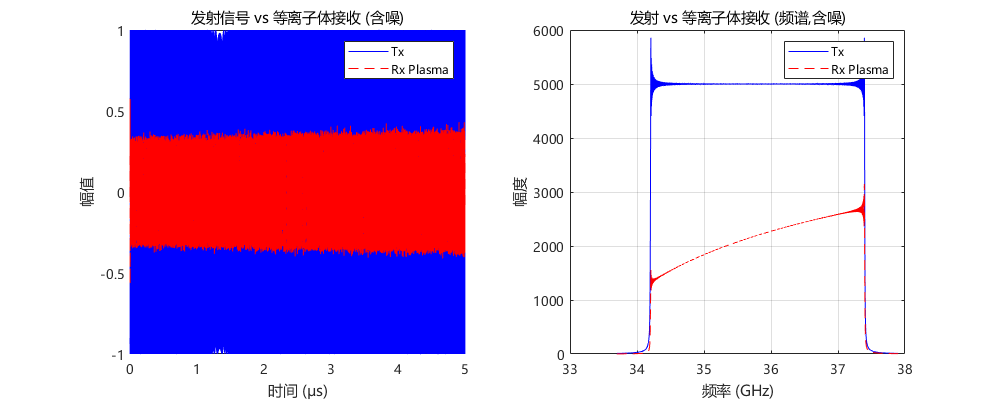
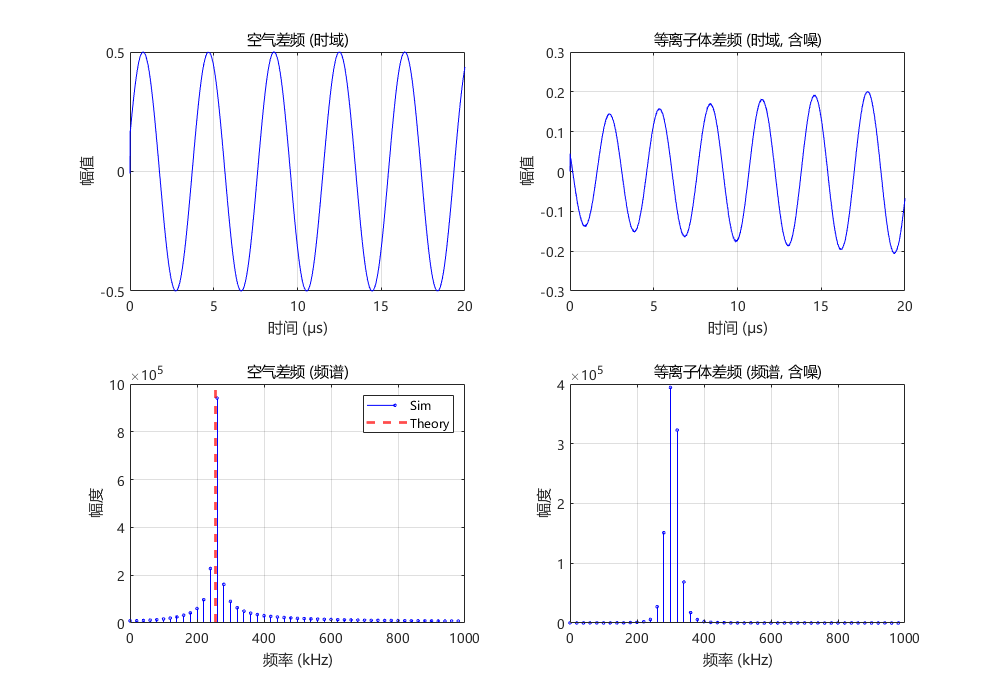
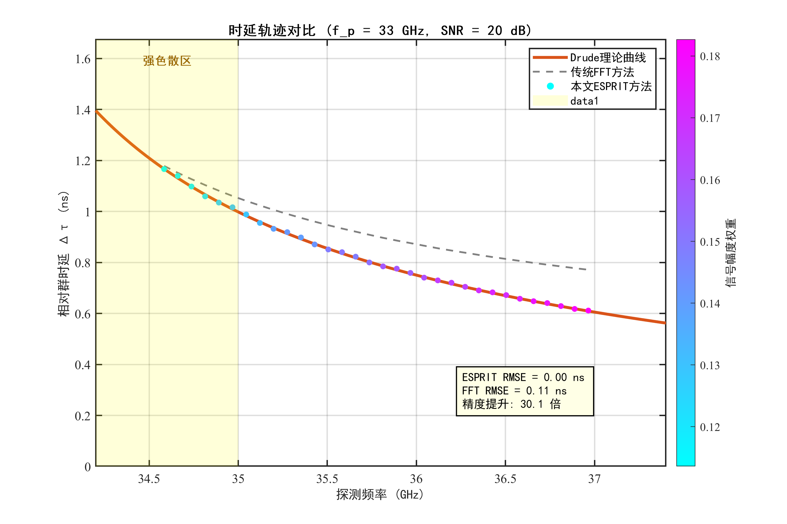
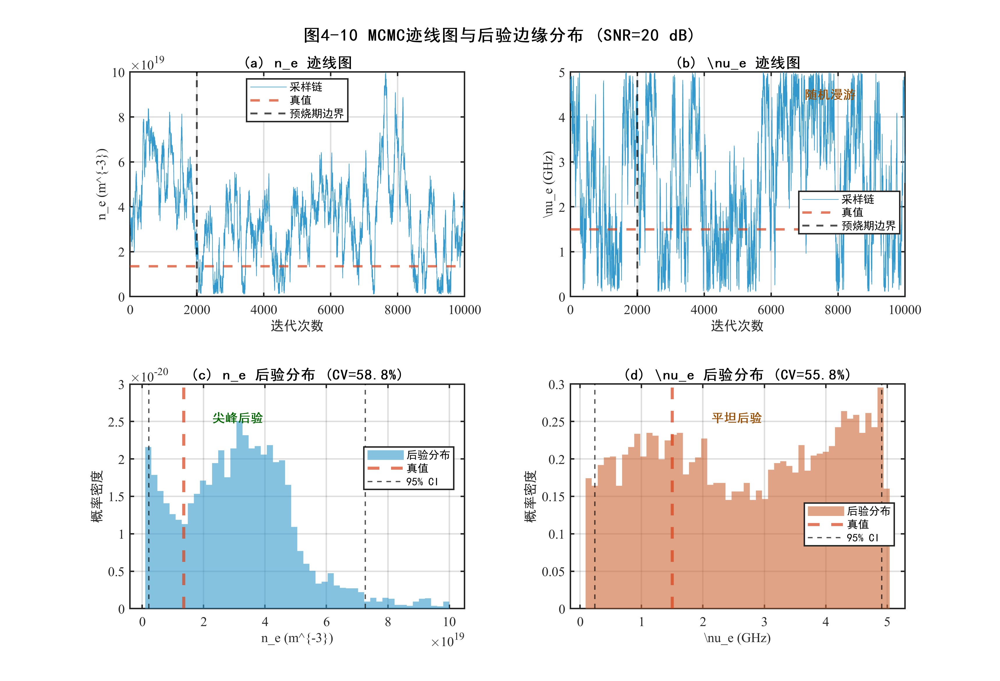
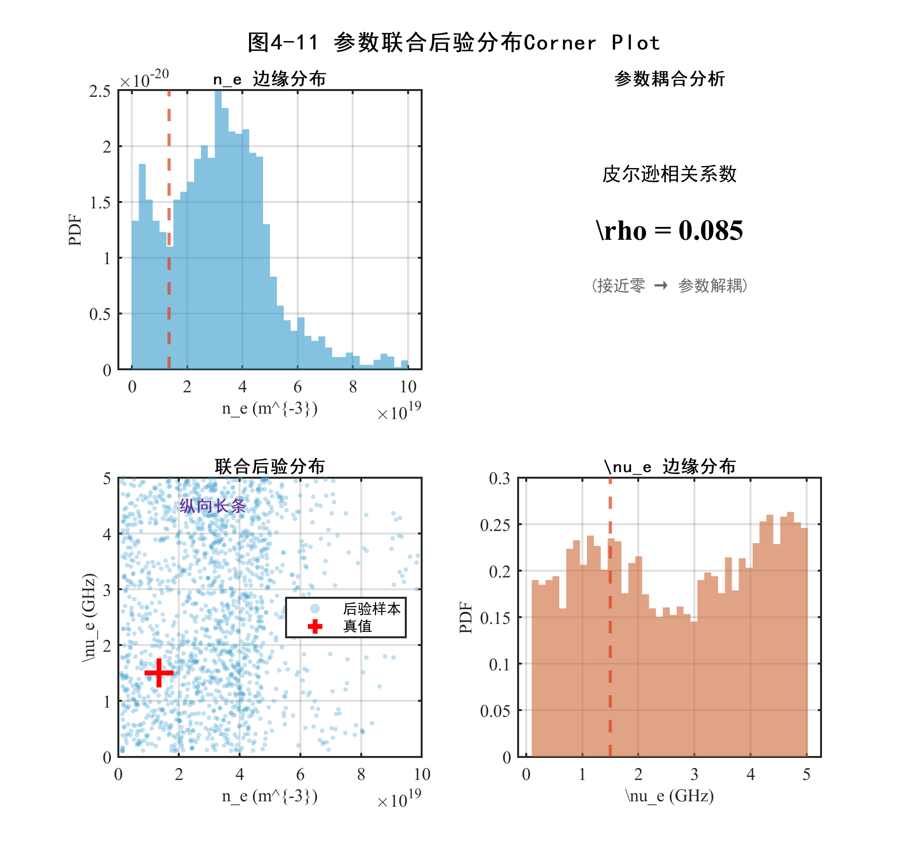
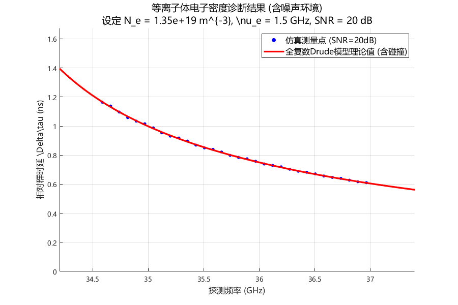
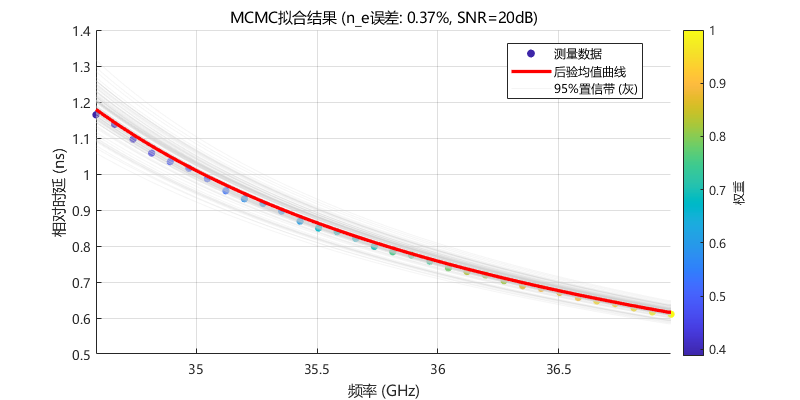

# 4.5 Drude等离子体模型仿真验证与不确定性量化

本节在Drude等离子体仿真场景中对第四章方法链进行集中验证：4.5.2验证特征提取的可靠性，4.5.3考察$n_e$与$\nu_e$在后验层面的可观测性差异，4.5.4和4.5.5分别从传统方法对比与噪声鲁棒性角度检验链路的工程有效性。

---

## 4.5.1 仿真环境设置与噪声建模

为验证所提方法在强色散条件下的有效性，本节构建了完整的LFMCW等离子体诊断仿真系统，包含信号生成、Drude模型传播、噪声注入、混频处理和特征提取五个核心模块。表4.2汇总了完整的仿真参数配置。

**表4.2 LFMCW等离子体诊断仿真参数配置**

| 参数类别 | 参数符号 | 物理含义 | 数值 | 单位 |
|---------|---------|---------|------|------|
| **LFMCW信号** | $f_{start}$ | 扫频起始频率 | 34.2 | GHz |
| | $f_{end}$ | 扫频终止频率 | 37.4 | GHz |
| | $B$ | 扫频带宽 | 3.2 | GHz |
| | $T_m$ | 调制周期 | 50 | $\mu$s |
| | $K$ | 调频斜率 | $6.4 \times 10^{13}$ | Hz/s |
| | $f_s$ | 仿真采样率 | 80 | GHz |
| **等离子体参数** | $f_p$ | 等离子体截止频率 | 33 | GHz |
| | $n_e$ | 电子密度（由$f_p$计算） | $1.3511 \times 10^{19}$ | m$^{-3}$ |
| | $\nu_e$ | 碰撞频率 | 1.5 | GHz |
| | $d$ | 等离子体层厚度 | 150 | mm |
| **传播路径** | $\tau_{fs}$ | 自由空间单程时延 | 1.75 | ns |
| | $\tau_{air}$ | 空气参考信道时延 | 4 | ns |
| **噪声模型** | SNR | 射频端信噪比 | 20 | dB |
| | $P_n$ | 噪声功率 | $P_s / 10^{2}$ | W |
| **ESPRIT参数** | $T_w$ | 滑动窗口时长 | 12 | $\mu$s |
| | 重叠率 | 窗口重叠比例 | 90 | % |
| **MCMC参数** | $N_{samples}$ | 总采样次数 | 10000 | 次 |
| | $N_{burn}$ | 预烧期 | 2000 | 次 |

上述参数确保探测频率$f \in [34.2, 37.4]$ GHz与截止频率$f_p = 33$ GHz之间满足$f > f_p$的透射条件；标准工况$f_p = 33$ GHz对应$(f_p/f)^2 \in [0.779, 0.931]$，覆盖了从中等色散到强色散的宽动态范围。MCMC预烧期经迹线图诊断选取$N_{burn} = 2000$，采样链在约1500次迭代后进入平稳态。

为模拟真实的电磁环境，本节在接收天线端口处的时域回波信号$s_{RX}(t)$上叠加加性高斯白噪声（AWGN）。噪声注入位置选在混频之前的射频端口，而非直接在差频信号上加噪，这一设计符合实际接收机的物理链路模型，能够真实反映非线性混频过程对噪声的传递效应。噪声功率由$P_n = P_s/10^{\text{SNR}_{\text{dB}}/10}$确定，其中$P_s = \text{mean}(s_{RX}^2(t))$为接收信号的平均功率。设定SNR = 20 dB为标准测试条件，后续鲁棒性测试扫描10~30 dB。由于混频增益和低通滤波的带宽限制，差频信号的等效信噪比通常高于射频端SNR（即存在处理增益），因此射频端20 dB对应着一个较为恶劣的实际工况。

信号传播采用频域精确仿真方法，采用三段式传播模型：发射信号先经过自由空间段1（固定时延$\tau_{fs} = 1.75$ ns）到达等离子体层入口，穿过厚度为$d$的等离子体层，再经过自由空间段2到达接收端。等离子体层的传递函数由Drude模型复介电常数导出：

$$H_{plasma}(\omega) = \exp\left[-j \cdot \text{Re}\{\tilde{k}(\omega)\} \cdot d - |\text{Im}\{\tilde{k}(\omega)\}| \cdot d\right] \tag{4-31}$$

其中复波数$\tilde{k}(\omega) = (\omega/c)\sqrt{\tilde{\varepsilon}_r(\omega)}$，复介电常数由式(4-1)给出。式(4-31)的第一项描述相位延迟（决定群时延），第二项描述幅度衰减（决定传输损耗）。衰减项采用虚部绝对值$|\text{Im}\{\tilde{k}\}|$以确保在整个频域内信号幅度单调递减，避免数值伪增益。总传递函数$H_{total}(\omega) = H_{plasma}(\omega)\,e^{-j\omega(2\tau_{fs})}$包含两段自由空间固定时延与等离子体层色散与阻尼。

---

## 4.5.2 特征提取框架验证：高精度轨迹重构的必要性

本节聚焦于轨迹重构的精度，以验证后续贝叶斯反演是否建立在可信数据之上。

仿真信号经去斜混频后得到差频信号并实施滑动窗口分帧。

图4.9(a)表明，等离子体信道使回波出现幅度滚降与相位畸变；图4.9(b)进一步表明，强色散条件下差频信号呈显著时变调频特征，验证了滑动窗口局部平稳化策略的必要性。

为验证ESPRIT在强色散信号处理中的必要性，本节引入"滑动窗口短时FFT（STFT脊线）"作为对照基线。该方法与本文方法一样，均基于滑动窗口对差频信号进行局部分析，并由窗口中心时刻映射得到探测频率；不同之处在于，对照组采用局部频谱峰值读取完成瞬时差频估计，而本文方法采用基于子空间分解的TLS-ESPRIT完成局部频率估计。前者受频谱展宽、栅栏效应及短窗分辨率限制影响更大，后者则能在局部平稳条件下保持更高的频率估计精度。

图4.10直观展示了两种方法提取的"频率-时延"轨迹对比。

ESPRIT散点紧密贴合理论真值曲线，而STFT脊线在低频端（接近截止频率处）表现出显著的系统性偏差和抖动。这种偏差并非源于噪声，而是源于FFT方法无法有效处理窗内非平稳信号的内在缺陷。以标准工况（$f_p = 33$ GHz，SNR = 20 dB）为例，ESPRIT的RMSE为0.004 ns，STFT脊线的RMSE为0.110 ns，精度提升约30.1倍。

**表4.3 强色散条件下FFT与ESPRIT特征提取性能对比**

| 性能指标 | 滑动窗口FFT（STFT脊线） | 本文ESPRIT方法 | 性能提升 |
|---------|-------------|---------------|-------------|
| 时延估计RMSE | 0.110 ns | 0.004 ns | 30.1 倍 |

上述对比表明，在本节所设定的强色散仿真条件下，本文方法能够稳定提取频率—时延特征轨迹$\mathcal{D}=\{(f_{probe,i}, \tau_{meas,i}, A_i)\}$，并较好描述Drude理论曲线的非线性演化特征。这里比较特征提取方法的目的，不在于单纯强调算法优劣，而在于说明：只有首先获得可信的轨迹数据，后续基于后验分布的参数可观测性分析才具有物理意义。

---

## 4.5.3 MCMC后验分布分析：对4.2节降维策略的统计学验证

第4.2节基于渐近分析提出了降维策略，本节通过MCMC后验分布的形态特征在噪声环境下为其提供统计学支撑。

需要说明的是，图4.11与图4.12对应一组标准工况下的基准后验链，用于展示迹线图、边缘后验与角点图；表4.5和表4.6则分别来自参数扫描与SNR扫描下重新独立生成的采样结果。各处统计量共享同一物理建模框架，但并不要求逐项数值完全一致；真正需要保持统一的是工况定义、统计口径与物理结论。

图4.11展示了$(n_e, \nu_e)$的MCMC迹线对比。$n_e$采样链在预烧期后快速收敛，围绕真值$n_e = 1.3511 \times 10^{19}$ m$^{-3}$稳定振荡；而$\nu_e$采样链在预烧期后仍在较宽区间游走，后验均值$\hat{\nu}_e = 3.47$ GHz偏离真值$1.5$ GHz，$\text{CV}_{\nu_e} = 23.6\%$。这种差异并非算法失效，而是群时延观测对$\nu_e$约束较弱的直接反映，为"应固定$\nu_e$"提供了反证式统计证据。

有效样本统计表明，$n_e$后验呈尖峰收缩，均值与真值高度一致且95%置信区间覆盖真值；$\nu_e$后验虽较先验有所收缩，但仍明显宽展并出现均值偏移，与第4.2节灵敏度分析一致。需要说明的是，本文并未将幅度作为独立反演通道，而仅用于加权似然中的置信度权重，因为实际系统中幅度测量受链路增益漂移、天线响应等因素影响，绝对标定难度显著高于时延测量。

图4.12以角点图形式展示了$(n_e, \nu_e)$的二维联合后验结构。联合后验呈特征性的纵向长条结构：散点在$n_e$维度高度聚集于一个狭窄的垂直带内（宽度约$\pm 3\%$），而在$\nu_e$维度则弥散覆盖整个先验范围$[0.1, 5]$ GHz。该几何结构表明，无论$\nu_e$取何值，$n_e$都被观测数据约束在很窄的范围内。皮尔逊相关系数$\rho_{n_e, \nu_e} = 0.126$量化了两参数之间的弱耦合特性。真值点（红色十字）位于$n_e$后验分布的高密度区域内，95%置信区间成功覆盖真值。

为从数据域验证反演结果的自洽性，图4.13给出"测量点—理论曲线—后验预测"的拟合优度验证。

图4.13(a)中ESPRIT提取的测量点紧贴Drude模型理论曲线，表明特征提取能够有效恢复强色散条件下的群时延演化趋势。图4.13(b)中MCMC后验均值曲线与测量点拟合良好，95%置信带覆盖主要测量点分布范围，从数据域层面验证了反演结果的自洽性。

---

## 4.5.4 与传统全周期FFT单峰方法的反演对比

为说明第四章所建立的方法链在强色散诊断中的必要性，本节将本文提出的"ESPRIT—MCMC"框架与传统全周期FFT单峰方法进行对比。需要说明的是，本节所称"传统FFT方法"特指对整段差频信号进行一次性全周期FFT并读取单峰的传统处理方案，不同于4.5.2节中作为局部特征提取对照组的滑动窗口短时FFT方法。

两类方法的核心差异可从三个维度加以概括。在信号模型层面，传统FFT方法将差频信号视为单频正弦波（稳态假设），而本文方法将其视为时变调频信号（非平稳假设），并采用滑动窗口局部化后由MDL定阶与TLS-ESPRIT完成瞬时频率估计。在时延—频率映射层面，传统方法仅提取全周期FFT单峰对应的全局平均时延，本文方法则沿频率轴重构多点瞬时时延轨迹。在反演与不确定性量化层面，传统方法依赖线性近似公式（式(4-32)）给出点估计且无不确定性输出，本文方法则基于Drude模型的MCMC贝叶斯推断提供后验分布、置信区间与CV判据。传统方法的适用范围限于弱色散区（$(f_p/f)^2 < 0.5$），本文方法可覆盖$(f_p/f)^2 \in [0, 0.95]$的全色散范围。

设全周期FFT提取的单峰差频偏移为$\Delta f = f_{beat,plasma}^{corr} - f_{beat,air}^{corr}$，对应平均附加时延$\Delta\tau = \Delta f / K$。在弱色散线性近似下，传统方法所采用的电子密度点估计公式为：

$$\hat{n}_e^{FFT} \approx \frac{8\pi^2 \varepsilon_0 m_e c \bar{f}^2}{e^2 d}\frac{\Delta f}{K} \tag{4-32}$$

其中$\bar{f} = (f_{start}+f_{end})/2$为扫频中心频率。该公式将全周期FFT得到的单一差频峰值解释为全局平均时延，仅在弱色散、时延变化缓慢的条件下近似成立。

表4.4汇总了不同截止频率下两种方法的电子密度反演结果（SNR = 20 dB）。

**表4.4 不同截止频率下电子密度反演结果对比（SNR = 20 dB）**

| 截止频率 $f_p$ (GHz) | $f_{beat,air}^{corr}$ (MHz) | $f_{beat,plasma}^{corr}$ (MHz) | $\Delta f$ (MHz) | 真值 $n_e$ (m$^{-3}$) | 传统FFT估计 $n_e$ (m$^{-3}$) | 传统误差（%） | MCMC后验均值 $\hat{n}_e$ (m$^{-3}$) | MCMC误差（%） | $\text{CV}_{n_e}$（%） | $\text{CV}_{\nu_e}$（%） |
|---:|---:|---:|---:|---:|---:|---:|---:|---:|---:|---:|
| 20 | 0.2570 | 0.2619 | 0.0049 | 4.9626e+18 | 4.8888e+18 | 1.49 | 4.8515e+18 | 2.24 | 15.75 | 58.97 |
| 21 | 0.2570 | 0.2626 | 0.0056 | 5.4712e+18 | 5.5754e+18 | 1.90 | 5.3923e+18 | 1.44 | 12.93 | 59.37 |
| 22 | 0.2570 | 0.2634 | 0.0064 | 6.0047e+18 | 6.3460e+18 | 5.68 | 5.9336e+18 | 1.18 | 11.15 | 64.02 |
| 23 | 0.2570 | 0.2643 | 0.0073 | 6.5630e+18 | 7.2130e+18 | 9.90 | 6.4892e+18 | 1.12 | 9.07 | 64.07 |
| 24 | 0.2570 | 0.2653 | 0.0082 | 7.1461e+18 | 8.1905e+18 | 14.61 | 7.1090e+18 | 0.52 | 7.70 | 49.77 |
| 25 | 0.2570 | 0.2664 | 0.0094 | 7.7540e+18 | 9.2943e+18 | 19.86 | 7.7115e+18 | 0.55 | 6.19 | 47.14 |
| 30 | 0.2570 | 0.2820 | 0.0249 | 1.1166e+19 | 2.4790e+19 | 122.02 | 1.1170e+19 | 0.03 | 1.91 | 45.83 |
| 31 | 0.2570 | 0.2857 | 0.0286 | 1.1923e+19 | 2.8466e+19 | 138.76 | 1.1942e+19 | 0.16 | 1.50 | 31.71 |
| 33 | 0.2570 | 0.3040 | 0.0469 | 1.3511e+19 | 4.6650e+19 | 245.29 | 1.3561e+19 | 0.37 | 0.62 | 23.59 |

表4.4表明，两类方法在色散增强过程中的表现存在明显分化：在弱色散区（$f_p \le 20$ GHz），传统全周期FFT单峰方法仍可给出近似可用的结果；但当截止频率逼近诊断频段时，其误差迅速放大并最终超过100%，说明单峰读数已无法继续对应真实群时延。相比之下，本文方法在强色散主工作区仍保持低于1%的反演误差。这一结果定量说明，强色散条件下的诊断问题必须转向轨迹提取—统计反演的处理链路。

---

## 4.5.5 降维反演的鲁棒性分析

参数扫描与SNR扫描用于检验降维反演链路的工程鲁棒性。

在$f_p \in [25, 32]$ GHz、$\nu_e \in [0.5, 3.0]$ GHz范围内共扫描48组参数组合。结果表明，$n_e$的后验CV始终维持在$1\%\sim6\%$，$\nu_e$的后验CV波动于20%~60\%且后验均值可能偏离真值。该结果与前文理论分析一致：碰撞频率对群时延的贡献仅为$O((\nu_e/\omega)^2)$的二阶微扰，因此$\nu_e$难以在后验中形成稳定聚集，而$n_e$仍可保持窄峰锁定。

**表4.5 参数扫描代表性组合的后验统计（SNR = 20 dB）**

| 截止频率 $f_p$（GHz） | 真值 $\nu_e$（GHz） | $\hat{n}_e$相对误差（%） | $\text{CV}_{n_e}$（%） | $\hat{\nu}_e$（GHz） | $\text{CV}_{\nu_e}$（%） |
|---:|---:|---:|---:|---:|---:|
| 25 | 0.5 | 0.61 | 6.21 | 3.37 | 41.17 |
| 26 | 1.0 | 0.43 | 5.12 | 2.91 | 48.61 |
| 26 | 1.5 | 0.12 | 4.28 | 2.41 | 61.39 |
| 27 | 1.5 | 0.17 | 4.20 | 2.49 | 54.75 |
| 28 | 2.0 | 0.02 | 3.30 | 2.21 | 61.01 |
| 29 | 2.5 | 0.03 | 2.61 | 2.72 | 45.91 |
| 30 | 3.0 | 0.03 | 1.91 | 2.74 | 45.83 |

在固定$f_p = 33$ GHz、$\nu_e = 1.5$ GHz条件下，将射频端信噪比从10 dB扫描至30 dB，统计反演结果（表4.6）。

**表4.6 不同SNR下的MCMC后验统计（$f_p = 33$ GHz, $\nu_e = 1.5$ GHz）**

| SNR (dB) | $\hat{n}_e$相对误差（%） | $\text{CV}_{n_e}$（%） | $\hat{\nu}_e$（GHz） | $\text{CV}_{\nu_e}$（%） |
|---:|---:|---:|---:|---:|
| 10 | 0.17 | 1.05 | 2.86 | 36.82 |
| 15 | 0.41 | 0.73 | 3.75 | 26.07 |
| 20 | 0.37 | 0.62 | 3.47 | 23.59 |
| 25 | 0.40 | 0.58 | 3.67 | 23.71 |
| 30 | 0.39 | 0.53 | 3.62 | 18.82 |

表4.6揭示了两个值得关注的规律。其一，$n_e$的反演精度在SNR由30 dB降低至10 dB的全过程中保持稳定：相对误差始终不超过0.41%，后验CV从0.53%缓慢上升至1.05%。其二，$\nu_e$的后验CV从18.82%升至36.82%，且后验均值在所有SNR下均偏离真值1.5 GHz——该参数的不可辨识性并非噪声所致，而是由物理机制（二阶微扰）决定的内禀特性。

因此，在工程实践中，将$\nu_e$固定为经验常数（如$1\sim 3$ GHz）并仅对$n_e$进行单参数反演，是一种物理上合理、统计上稳健的降维策略。

---

## 本节小结

本节在Drude等离子体仿真场景下完成了对第四章方法链的验证。结果表明，滑动窗口—MDL—ESPRIT链路能够稳定重构强色散条件下的频率-时延轨迹，并为后续MCMC反演提供可靠输入；在此基础上，电子密度$n_e$的后验保持尖峰锁定，碰撞频率$\nu_e$则持续表现为宽展且偏移的弱约束参数。与传统FFT基线及不同SNR条件下的对比结果一致说明，该诊断链路在Drude场景下能够稳定反演$n_e$，并继续支撑固定$\nu_e$的降维策略。

# 4.6 本章小结

本章建立并验证了"物理约束—特征提取—贝叶斯反演—Drude验证"的完整技术路线。碰撞频率$\nu_e$在当前频段内仅表现为二阶微扰，据此采用固定$\nu_e$、仅反演$n_e$的降维策略；滑动窗口—MDL—TLS-ESPRIT链路将强色散差频信号的非平稳结构转化为频率—时延轨迹；加权似然与MH采样相结合的反演框架实现了电子密度反演与不确定性量化。Drude仿真验证表明，所提方法在强色散条件下能稳定反演$n_e$，而$\nu_e$后验始终难以形成可信锁定，统计层面支撑了降维策略的合理性。第五章将进一步检验该链路在受控色散场景中的可移植性。
