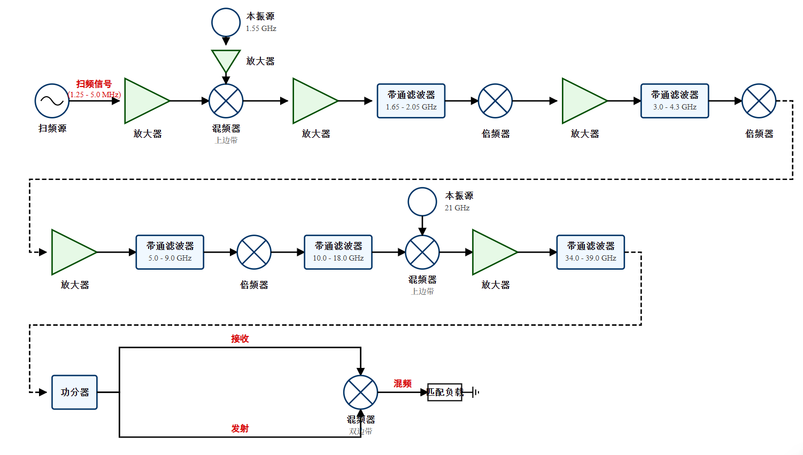
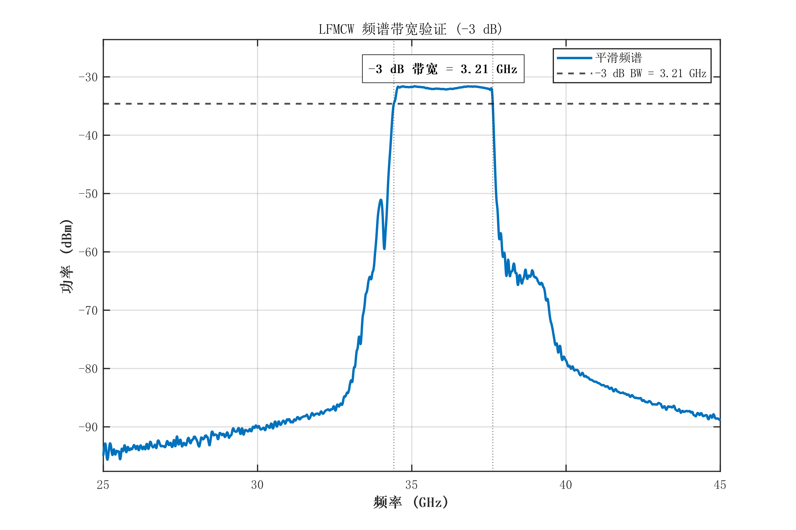

# 5.1 引言

第五章在受控条件下对前文建立的色散特征提取与参数反演链路进行工程化验证。由于真实等离子体在实验室环境中难以长期稳定复现，本章引入结构参数已知、微波响应可稳定获取的带通滤波器作为等效色散验证载体，重点验证”特征提取—模型计算”这条方法链路的有效性，而非以滤波器参数识别本身作为研究目标。

验证沿两条主线展开：硬件层面，构建宽带LFMCW收发前端并完成时延分辨率标定（5.2节）；算法层面，引入等效色散载体（5.3节），在全链路仿真环境中完成差频时延特征提取与参数一致性检查（5.4节）。

# 5.2 宽带LFMCW诊断系统设计与时延分辨率测试

第三章和第四章的推导表明，低电子密度状态的诊断下限受制于系统对微小时延波动的分辨能力，而该物理极限直接依赖射频带宽。本节据此完成硬件链路拓扑设计、非色散环境去嵌入，并开展移动靶标时延分辨率标定。系统核心参数配置为：工作频段覆盖Ka波段，主扫频带宽扩展至3 GHz，测量误差控制在15%以内。

## 5.2.1 宽带LFMCW收发前端架构与扩频链路设计

诊断系统采用超外差架构完成基带扫频信号到Ka波段宽带信号的频率搬移。直接在毫米波频段产生宽带线性调频信号具备较高的硬件代价，故本系统将线性度控制集中在低频段，再通过混频与倍频链路逐级搬移到目标频段。

前端射频链路采用分级外差与倍频相结合的结构完成宽带Ka波段信号生成。基带扫频信号先与低频本振混频产生中频，再经级联二倍频链路提升至13.2~14 GHz波段，最后与21 GHz本振再次混频，得到覆盖Ka频段的发射信号。接收端通过功分保留参考支路，并与探测回波在解调器中混频，输出表征传播时延差异的差频信号。

该分级外差结构将频谱扩展分散到多级混频与倍频网络中，可降低单级高倍频带来的谐波和杂散压力，同时保留一定的频率配置灵活性。

LFMCW系统的固有时延分辨率满足$\Delta\tau = 1/B$。初始800 MHz配置对应1.25 ns的时延分辨尺度；若按前述诊断口径（载频$f_0 = 32$ GHz、$d = 200$ mm）进行量级换算，其对应的电子密度检出下限约为$1 \times 10^{18}$ m$^{-3}$。为提升对微小时延变化的跟踪能力，系统需要进一步扩展射频带宽。最终方案在Ka波段内实现3 GHz扫频带宽；其中硬件标定中心频率为34.6 GHz，强色散等效仿真工作频段选为37 GHz，二者均处于单扫全带覆盖范围内。

硬件扩频的关键限制主要来自第二级上变频器的中频带宽及配套滤波器的带外响应。原有14 GHz级别的器件配置会对扩频后的高频分量产生明显抑制，因此系统同步更换了第二级混频器、倍频链路中的带通滤波器以及无源倍频器等关键节点，其替换关系见表5.1。

上述升级使中频端口带宽、级联滤波通带以及倍频链路的工作范围能够与扩频目标相匹配，从而为3 GHz扫频配置提供了必要的硬件条件。

扩频链路关键器件替换清单

| 器件类别 | 链路位置 | 替换型号 | 核心射频参数 | 升级要点 |
|:----:|:----:|:----:|:----:|:----:|
| 混频器 | 第二级上变频（MIX2） | 莱尔微波 LFC-2006 | RF/LO: 18~42 GHz; IF: DC~18 GHz; 变频损耗 9 dB; $P_{1\text{dB}}$: 7 dBm | IF端口带宽由14 GHz扩展至18 GHz |
| 带通滤波器 | 第一级混频后（BPF1） | 西安航星 HXLBQ-DTA456X | 通带: 1650~2050 MHz | 通带扩展至400 MHz |
| 带通滤波器 | 倍频链路第二级（BPF2） | 成都恒伟 HXLBQ-DTA217 | 通带: 5~9 GHz | 覆盖扩频后二倍频输出 |
| 带通滤波器 | 倍频链路第三级（BPF3） | 西安航星 HXLBQ-DTA417 | 通带: 10~18 GHz | 覆盖扩频后四倍频输出 |
| 无源倍频器 | 二倍频×2级 | 成都恒伟 HWD622/622C | 输入: 3~11 GHz; 插入损耗 11 dB; 输入功率 13 dBm | 适配扩频后的频率与功率范围 |

扩频后的完整前端链路如图5.1所示。

器件更换完成后，系统可在不同基带带宽配置下实现相应的毫米波扩频输出：当基带带宽为200 MHz时，八倍频后发射带宽达到1.6 GHz；当基带带宽提升至375 MHz时，总带宽可扩展至3 GHz。实验中同时调整第一级本振频率与基带中心频率，以避开混频谐波与目标频段重叠。综合测试表明，在第一级本振保持1.55 GHz、基带中心频率设为200 MHz的条件下，链路工作状态较为稳定。

表5.2给出初始配置与三种扩频配置下的关键参数。

扩频前后系统关键参数对照

| 参数 | 初始配置（800 MHz） | 扩频配置一（1.6 GHz） | 扩频配置二（2.4 GHz） | 扩频配置三（3 GHz） |
|:----:|:----:|:----:|:----:|:----:|
| 基带扫频源带宽 | 100 MHz | 200 MHz | 300 MHz | 375 MHz |
| 基带中心频率 | ~100 MHz | 200 MHz | 200 MHz | 200 MHz |
| 八倍频后带宽 $B$ | 800 MHz | 1.6 GHz | 2.4 GHz | 3 GHz |
| 发射信号中心频率 | 34.6 GHz | 34.6 GHz | 34.6 GHz | 34.6 GHz |
| 固有时延分辨率 $1/B$ | 1.25 ns | 0.625 ns | 0.417 ns | 0.333 ns |

由表5.2可见，随着扫频带宽由800 MHz扩展至3 GHz，系统的固有时延分辨尺度由1.25 ns改善至0.333 ns。射频带宽的扩展为更小量级的时延测量提供了物理基础。基于此，本节后续通过移动靶标实验对系统在真实测量条件下的时延分辨能力进行标定，以评估其对皮秒级微小时延变化的可分辨程度。

## 5.2.2 实验系统搭建与非色散环境基准测试

实验平台主要由扫频信号源、射频前端机箱、收发天线及采集处理模块组成。扫频信号由泰克AWG70001A产生，第一级与第二级本振分别由LMX2820评估板和E8267D提供。射频前端机箱内部集成混频、倍频、滤波和放大链路；收发端采用26~40 GHz宽带聚焦透镜天线，差频信号由高速示波器DSOX95004Q采集，并同步送入频谱仪监测。

平台搭建完成后，首先在空气信道中开展直通测试，用于标定系统在非色散环境下的本底响应。以800 MHz配置为例，发射信号覆盖34.2~35.0 GHz，差频信号经低通滤波后主要位于420 kHz~2 MHz范围，该频段主要由线缆长度和系统固有延迟决定。为减小常驻共模延迟对测量结果的影响，实验采用差分测量方式，仅以介入目标后差频的相对变化量$\Delta f_D$作为后续分析输入。

在扩频后的空传测试中，差频频移随扫频带宽增加而呈现稳定增长趋势，与$f_D = B\tau/T_m$的理论关系一致。3 GHz配置下的实测发射频谱如图5.2所示，在33.1~36.1 GHz范围内实现连续覆盖，$-3$ dB带宽达到3 GHz。虽然带内仍存在约3~5 dB起伏，但未出现明显断裂，说明扩频后链路能够保持基本完整的宽带传输特性。

## 5.2.3 移动靶标时延测量与硬件系统极限分辨率标定

系统极限分辨能力的实验标定，依赖单轴高精度位移平台引入受控传播时延增量。以初始天线间距为参考零位提取相对差频，随后沿轴向移动接收天线$\Delta d$并再次采集差频信号。通过差分运算可抵消环境中的常驻杂散，得到由位移引起的频率增量$\Delta f_D$，并按式(5-1)计算测量时延增量

$$\Delta\tau_{meas} = \frac{\Delta f_D \cdot T_m}{B} \tag{5-1}$$

在自由空间条件下，其对应的理论时延增量为

$$\Delta\tau_{theory} = \frac{\Delta d}{c} \tag{5-2}$$

进一步定义相对误差率为

$$\varepsilon = \frac{|\Delta\tau_{meas} - \Delta\tau_{theory}|}{\Delta\tau_{theory}} \times 100\% \tag{5-3}$$

为评估系统在基础带宽配置下的分辨能力，实验首先在800 MHz带宽条件下进行标定，并引入LNA以改善回波信噪比。测试以平均相对误差不超过15%、且五次重复采集结果保持集中为判据，对10 mm至5 mm位移进行步进测量。结果表明，系统能够稳定分辨6 mm位移对应的约20 ps理论时延增量；当位移进一步减小至5 mm时，重复测量结果开始明显发散，已难以满足稳定分辨要求。据此，可将800 MHz配置下的有效时延分辨率标定为20 ps（对应空间位移约6 mm）。若按前述诊断口径进行量级换算，其对应的电子密度检出下限约为$1 \times 10^{18}$ m$^{-3}$。

为验证扩频体制对分辨能力的提升作用，系统进一步在1.6 GHz、2.4 GHz和3 GHz配置下开展位移标定实验。表5.3汇总了不同带宽下的测试结果。

扩频配置下的标定实验结果汇总

| 扫频带宽 | 移动距离 | 理论时延 | 诊断时延（s） | 误差 |
|:----:|:----:|:----:|:----:|:----:|
| 1.6 GHz | 2 mm | $6.67 \times 10^{-12}$ | $7.09 \times 10^{-12}$ | 6.39% |
| | | | $6.08 \times 10^{-12}$ | 8.86% |
| | | | $7.37 \times 10^{-12}$ | 10.51% |
| | | | $7.14 \times 10^{-12}$ | 7.07% |
| | | | $5.95 \times 10^{-12}$ | 10.73% |
| 2.4 GHz | 1 mm | $3.33 \times 10^{-12}$ | $3.59 \times 10^{-12}$ | 7.74% |
| | | | $3.16 \times 10^{-12}$ | 5.25% |
| | | | $3.71 \times 10^{-12}$ | 11.43% |
| | | | $3.03 \times 10^{-12}$ | 9.00% |
| | | | $3.77 \times 10^{-12}$ | 13.00% |
| 3 GHz | 1 mm | $3.33 \times 10^{-12}$ | $3.44 \times 10^{-12}$ | 3.30% |
| | | | $3.18 \times 10^{-12}$ | 4.50% |
| | | | $3.58 \times 10^{-12}$ | 7.50% |
| | | | $3.08 \times 10^{-12}$ | 7.50% |
| | | | $3.62 \times 10^{-12}$ | 8.50% |

结果显示，在1.6 GHz配置下，系统能够对2 mm位移对应的约6.67 ps时延增量进行稳定分辨；当带宽扩展至3 GHz后，1 mm位移对应的约3.33 ps理论时延增量也能够被稳定测得，五次重复测量的平均偏差约为6.26%。这表明扩频体制显著改善了系统的微小时延分辨能力。若按前述等离子体传输口径进行量级换算，3.33 ps的分辨精度对应的电子密度检出下限可扩展至$1.24 \times 10^{17}$ m$^{-3}$。

上述标定表明，在自由空间单轴测量条件下所构建的宽带超外差链路能够实现皮秒量级时延变化的可分辨。
