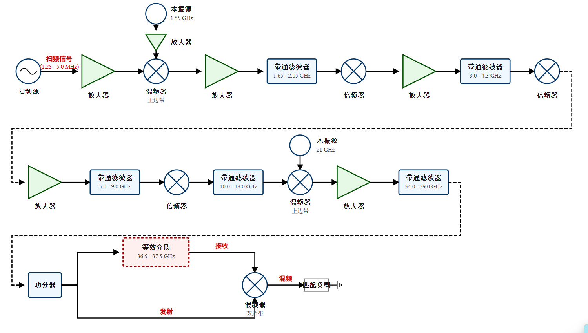
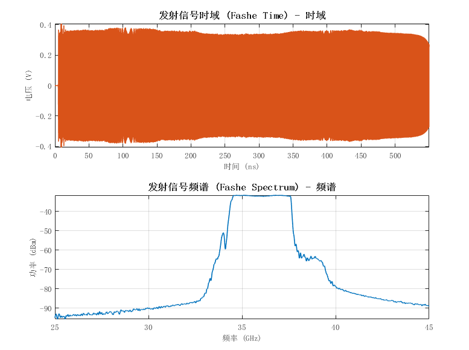
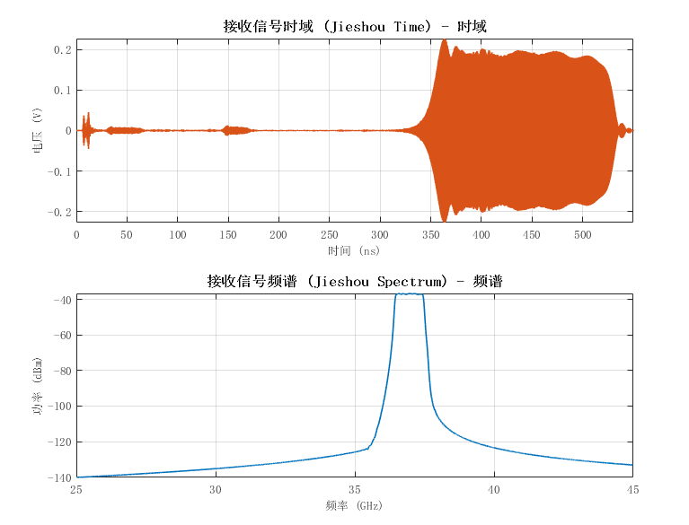
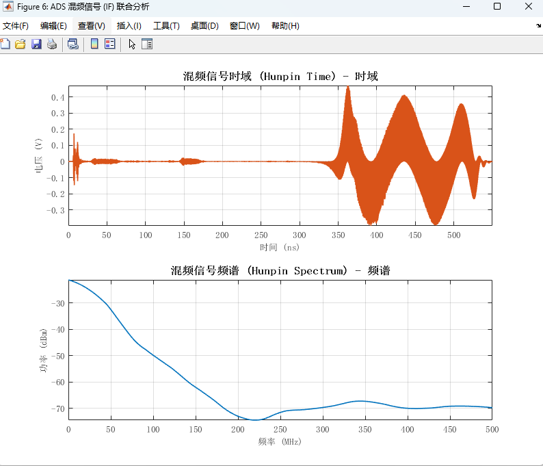
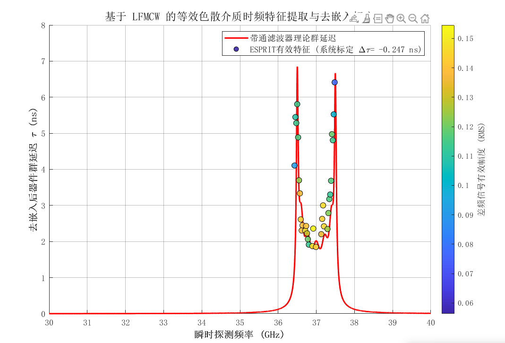
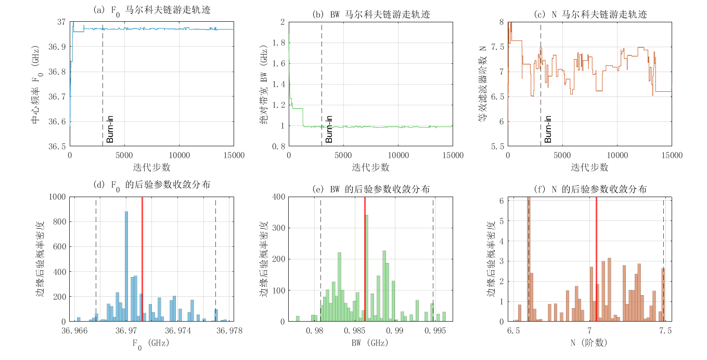
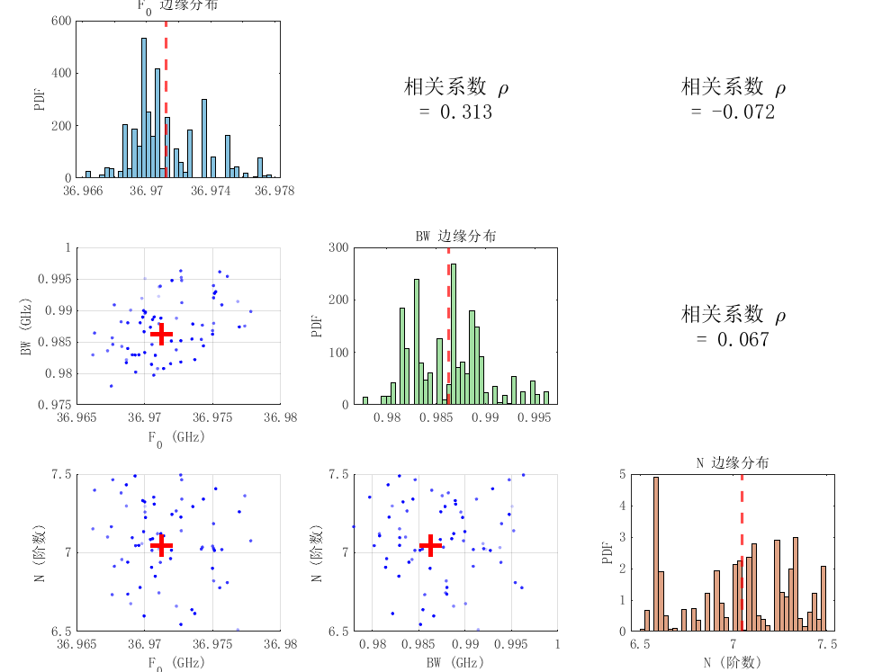
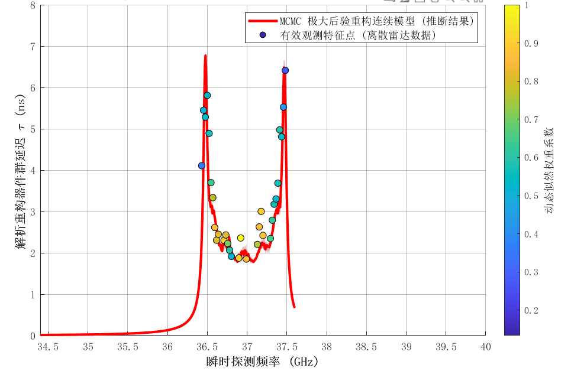

# 5.3 色散等效介质的时延轨迹提取与物理映射机理

5.2节已经确立了微波带通滤波器作为等效验证载体的作用。本节将在此基础上检验两个核心问题：LFMCW差频信号中能否稳定提取色散介质的时延轨迹特征点，以及在正向模型已知的条件下，这些特征点是否足以驱动后续参数计算。只要这两个问题得到肯定回答，前文形成的特征提取与反演思路便可自洽地从滤波器场景泛化到Drude等离子体场景。

围绕这一目标，本节主要完成以下论证：在ADS中搭建与前文硬件链路保持一致的全链路仿真平台，并通过去嵌入剥离系统固有延迟；建立从滑动窗口差频估计到频率-时延散点的物理映射关系，并结合物理约束完成数据清洗；在已知切比雪夫正向模型条件下进行MCMC一致性检查，评估散点集合的信息承载能力与后验收敛性。

## 5.3.1 全链路联合仿真与色散基准去嵌入

为尽量逼近5.1节硬件系统的真实工作方式，在ADS中搭建了与实际射频前端一一对应的电路级瞬态模型。信号流程仍为基带扫频、初级变频、三级二倍频、二次上变频、功分以及自混频解调。仿真扫频范围设为$f_{start} = 34.4$ GHz至$f_{end} = 37.61$ GHz，扫频周期由基带信号参数确定。这里采用37 GHz附近的工作口径，是为了覆盖目标滤波器的色散区间；它服务于受控等效验证，与5.1节34.6 GHz的硬件标定口径分别对应不同层级的实验目的。

目标色散介质选用5阶切比雪夫Type-I带通滤波器BPF11，其参数与5.2节正向模型保持一致：$F_0 = 37$ GHz，$BW = 1$ GHz，$R_p = 0.5$ dB，阻带衰减大于90 dB。滤波器置于功分后的测量通路中，用于模拟色散介质对LFMCW信号的群时延调制。瞬态仿真采用自适应变步长时间网格，最小步长5 fs，最大步长0.5 ps，总时长$T_{stop} = 0.55~\mu$s，以保证完整覆盖至少一个扫频周期。

图5-5给出了ADS全链路拓扑。与5.1节的硬件前端相对应，该图直接展示了基带源、倍频器、混频器、功分器和目标滤波器之间的连接关系，是后续信号分析和去嵌入标定的基础。

结合图5-6至图5-8所展示的发射信号、经过滤波器后的接收信号以及自混频后的中频差频信号特性可知，发射信号频谱在34~38 GHz范围内连续分布，3 dB带宽约为3.2 GHz，与设定扫频范围一致，说明前端链路能够在仿真中保持宽带扫频特性。接收信号在时域上表现为明显的包络门控：扫频进入滤波器通带后信号幅度迅速上升，在通带外则被显著抑制；其频谱在37 GHz附近形成约1 GHz宽的窄带峰，与滤波器通带一致。混频后的差频信号能量主要集中在通带扫频对应的时间区间内，频谱由非色散情况下的窄带单峰扩展为覆盖数百兆赫的宽带结构，反映出色散引起的频谱展宽效应。

滤波器自身的幅度响应和群时延真值分别见图5-9与图5-10。$|S_{21}|$在37 GHz附近形成约1 GHz通带，阻带衰减超过90 dB；群时延曲线在通带上下边缘形成两个明显峰值，峰高约为6~7 ns，通带中央基线约为2 ns。后续所有特征点提取精度的评价，都以图5-10对应的群时延真值作为比较基准。

进一步地，需要针对系统固有延迟进行去嵌入标定。差频信号中不仅包含目标滤波器引入的群时延，也包含前端走线、功分器、衰减器和混频器带来的系统固有延迟$\tau_{sys}$。如果不先剥离这一部分，后续得到的时延散点会整体偏移，尤其会影响通带平坦区的精度评价。

去除固定传输相位干扰的去嵌入标定依赖空腔短路直通法执行。剔除中间测试媒介后，系统两条通路的传输延时主要由非等长射频连线余量及变频固有相偏生成。借助提取该无目标直通条件下的参考包络值$f_{D,thru}$，按式(5-11)可提取设备静止常量迟滞本底时间：

$$\tau_{sys} = \frac{f_{D,thru} \cdot T_m}{B} \tag{5-11}$$

常规去嵌入实操中，若不对谱峰搜索窗体施加边界隔离，会受到多级变频和倍频带来的互调杂散影响，得到远大于真实值的伪延迟。根据链路几何尺寸估算，真实系统差频应位于极低频区，因此将搜索窗限定在0~5 MHz内，再采用汉宁窗FFT结合三角形插值进行精调，最终得到系统基准延迟，如式(5-12)所示

$$\tau_{sys} = 0.2470\ \text{ns} \tag{5-12}$$

后续所有含滤波器的群时延估计均以这一数值作为减法校正常数。

## 5.3.2 离散时延特征点与连续演化曲线的物理映射关系

滑动窗口方法的物理含义，是将时间轴上的局部差频估计映射回扫频过程中的瞬时探测频率。LFMCW发射信号的瞬时频率如式(5-13)所示

$$f_{tx}(t) = f_{start} + K t \tag{5-13}$$

其中$K$为扫频斜率。以窗口中心时刻$t_c$对应的差频估计值$f_{IF}(t_c)$为例，该频率对应的探测频率为式(5-14)

$$f_{probe}(t_c) = f_{start} + K t_c \tag{5-14}$$

在该频率点，差频与群时延满足式(5-15)

$$f_{IF}(t_c) = K[\tau_{sys} + \tau_g(f_{probe})] \tag{5-15}$$

因而去嵌入后的群时延估计可写为式(5-16)

$$\hat{\tau}_g(f_{probe}) = \frac{f_{IF}(t_c)}{K} - \tau_{sys} \tag{5-16}$$

随着滑动窗口沿时间轴推进，便可获得一组离散观测点$\{(f_k, \hat{\tau}_k)\}$。这组散点在通带平坦区应聚集于约2 ns的基线附近，在通带边缘则向双峰区上升。若散点能够连续覆盖这一演化过程，说明LFMCW差频信号已经承载了色散曲线的主拓扑信息。

这种映射关系并不依赖滤波器模型本身。ESPRIT在窗口内提取的是差频瞬时频率，只有在后续解释阶段才通过已知扫频规律转化为群时延。因此，只要介质的色散模型形式已知，同样的特征点提取链路就可以迁移到Drude等离子体或其他色散介质中。

## 5.3.3 强色散时延轨迹特征提取与物理约束清洗策略

ADS输出的中频信号采用自适应变步长网格，需先重采样到均匀时间轴。本文以4 GHz采样率进行样条插值重采样，再通过4阶Butterworth低通滤波器提取200 MHz以内的差频分量，并做2倍抽取，最终工作采样率为2 GHz。在预处理后的差频信号上，采用第四章建立的滑动窗口ESPRIT方法提取频率-时延散点。窗口长度设为总信号长度的3%，且不少于64个采样点；步进长度取窗口长度的$1/8$；子空间维度$L_{sub}$取窗口长度的$1/2$；信号源数由MDL准则自动判定，上限设为3。每个窗口内先构造前后向平均Hankel矩阵，再执行特征分解和ESPRIT估计，输出瞬时差频$\hat{f}_{IF}$、对应探测频率$f_{probe}$和局部RMS幅度$A_{rms}$。

极低信噪比边缘区域的瞬时估计容易出现失锁离群点。为避免引入先验设定的真值干扰，本研究仅依据提取特征的自身分布规律构建数据清洗门限。考虑到阻带区域具有显著的信号衰减特性，第一层信号有效阈值基于实际检测到的微波幅度制定，用于剔除边缘衰落引起的高斯随机噪点。该自适应阈值配置如下：

$$A_{rms}(f_k) > 0.20 \times \max\{A_{rms}\} \tag{5-17}$$

通过上述幅度门限筛选后，保留的核心特征集记为$\mathcal{T}_{core}$。该集合中可能仍残留极少数由于非稳态边界失锁导致的逻辑异常负向时延，可通过统计学的四分位距下限经验门限予以滤除。该经验截断准则定义为：

$$\tau_{lb} = Q_{25}(\mathcal{T}_{core}) - 1.5\,\mathrm{IQR}(\mathcal{T}_{core}) \tag{5-18}$$

在此条件划定之后，剩余散点需满足：

$$\hat{\tau}_g(f_k) > \tau_{lb} \tag{5-19}$$

针对当前工况数据集，此机制导出的下限截断稳步维系于 $\tau_{lb} = 0.723$ ns 处，整个隔离网络均依赖抽样源数据内部反馈生成，未施加人工修正设定。由于锯齿扫频波源在斜率折返点处必然产生极宽频带的反相等幅交叠失真，本处理流程依照式(5-20)给出的占空比例（其中$T_w$为滑动窗口时间长度）隔离了两端扫频拐角不可回避的波形交叠失真盲区；位于该盲区内的极少量失锁散点，则依托邻近极高信噪平坦段的强物理关联属性，执行原坐标代换与加权平滑修正。

$$\delta_t = \max\left(0.01, \frac{T_w}{2T_m}\right), \qquad \delta_t < t_c/T_m < 1 - \delta_t \tag{5-20}$$

当前参数下$\delta_t \approx 0.029$。对整个45个有效散点的分析表明，这一步仅修正了其中3个异常点，旨在恢复局部物理演化连续性，而非实施全局均方误差的数值平滑。对照计算显示，经局部重构后，通带平坦区的平均绝对误差有所改善，整体轨迹保留了显著的特征原貌。

经去嵌入和三步清洗后，最终保留45个有效散点，频率范围为36.43~37.50 GHz，群时延范围为1.10~7.59 ns，完整覆盖了双峰演化区间。图5-11给出了清洗后散点与理论真值曲线的叠加结果。

为定量的评价特征轨迹提取精度，将45个有效散点与ADS导出的群时延真值逐点比较。按局部色散梯度，将频率轴划分为通带平坦区、色散过渡区和双峰陡变区。统计结果见表5-5。

表5-5 时延特征点提取精度统计

| 频率分区 | 散点数 | MAE (ns) | RMSE (ns) | 最大偏差 (ns) |
|:----:|:----:|:----:|:----:|:----:|
| 通带平坦区（36.7~37.3 GHz） | 26 | 0.33 | 0.40 | 0.95 |
| 色散过渡区（过渡带） | 15 | 1.05 | 1.45 | 4.02 |
| 色散双峰陡变区（峰顶附近） | 4 | 1.67 | 1.93 | 3.32 |
| 全频段综合 | 45 | 0.69 | 1.06 | 4.02 |

结果呈现出明确的分层特征。通带平坦区色散梯度较低，散点MAE为0.33 ns，整体达到亚纳秒量级，说明ESPRIT能够稳定追踪群时延基线。过渡区和双峰陡变区的误差明显增大，主要来自滑动窗口平均效应和边缘低信噪比，而非算法完全失锁。这些区域的绝对误差较大，散点仍然保持了双峰位置、峰间距和峰值包络等主拓扑信息。

这一结果对第五章的意义在于，后续模型拟合并不依赖全频段等精度散点，而是依赖一组在高信噪比区精度较高、在高梯度区保留主拓扑信息的加权散点。通带平坦区的26个散点提供了强约束，边缘散点则提供峰位和峰高信息。只要这种信息组合能够驱动已知模型稳定收敛，就足以说明特征提取链路具备支撑后续参数计算的能力。

## 5.3.4 基于MCMC拟合的一致性检查与信息承载分析

为了检验上述45个有效散点是否足以支撑已知正向模型的贝叶斯收敛，本节重新构建基于MCMC一致性检查。设观测数据为$D_{obs} = \{(f_k, \hat{\tau}_k)\}_{k=1}^{M}$，则后验分布满足式(5-21)

$$p(\theta | D_{obs}) \propto p(D_{obs} | \theta)\, p(\theta) \tag{5-21}$$

考虑到通带平坦区与两侧色散陡变区间的信噪比差异分化，采用了基于局部有效信号幅度的加权因子以平衡全局拟合算子，加权规则如式(5-22)所示

$$w_k = \left(\frac{A_{rms}(f_k)}{\max\{A_{rms}\}}\right)^2 \tag{5-22}$$

进而将多参量联合后验推断的对数似然成本函数构建表达为式(5-23)

$$\ln L(\theta) = -\frac{1}{2} \sum_{k=1}^{M} w_k \left(\frac{\hat{\tau}_k - \tau_g^{theory}(f_k; \theta)}{\sigma_{meas}}\right)^2 \tag{5-23}$$

其中$\sigma_{meas} = 0.2$ ns，此基准方差依据通带平坦区客观统计误差量级设定。为排除主观锁定猜测，验证模型先期统一采取宽泛的均匀弱信息分布范式，预设参数域如式(5-24)所示：

$$F_0 \sim U(36, 38)\ \text{GHz}, \qquad BW \sim U(0.5, 2.0)\ \text{GHz}, \qquad N \sim U(2, 8) \tag{5-24}$$

这一设定刻意使用宽先验，以检验散点本身的约束能力，而不是依赖狭窄先验锁定结果。采样阶段采用四条独立初始化的Metropolis-Hastings链。每条链长度为18000步，前6000步作为预烧期丢弃，预烧期后每链保留12000个状态，总保留样本数为48000。提议分布采用各向异性高斯形式，且只在预烧期进行步长自适应。最终，$F_0$和$BW$的接受率稳定在27%~29%，$N$的接受率稳定在45%~46%。

收敛诊断结果显示，采用局部邻域重构后的散点时，$\hat{R}_{F_0}=1.0004$、$\hat{R}_{BW}=1.0002$、$\hat{R}_N=1.0000$，对应$ESS_{F_0}=5809$、$ESS_{BW}=5776$、$ESS_N=10674$，积分自相关长度分别为8.26、8.31和4.50。若去除局部邻域重构，其余设置保持不变，则$\hat{R}_{F_0}=1.0002$、$\hat{R}_{BW}=1.0000$、$\hat{R}_N=1.0000$，对应$ESS_{F_0}=5234$、$ESS_{BW}=5377$、$ESS_N=10674$。两组结果量级相近，说明少量异常点的局部替代并未改变后验统计稳定性。反映到后验链轨迹层面（图5-12所示），三参数的链轨迹和一维边缘分布在预烧期后顺利进入同一高概率区域并保持重叠，表明当前采样已建立良好的混溶性收敛。

后验统计的全面量化评价如表5-6所示。

表5-6 MCMC贝叶斯拟合结果汇总

| 参数 | 后验均值 | 设计真值 | 绝对误差 | 相对误差 | 95%后验区间 | 变异系数CV |
|:----:|:----:|:----:|:----:|:----:|:----:|:----:|
| 中心频率 $F_0$ | 36.9683 GHz | 37.000 GHz | 32 MHz | 0.086% | [36.964, 36.973] GHz | 0.006% |
| 绝对带宽 $BW$ | 0.9862 GHz | 1.000 GHz | 14 MHz | 1.38% | [0.978, 0.994] GHz | 0.422% |
| 等效阶数 $N$ | 7.00 | 5（设计值） | — | — | [6.53, 7.47] | 4.10% |

结果表明，$F_0$与$BW$已被稳定约束在设计值附近，其中$F_0$误差为32 MHz，$BW$误差为14 MHz。对是否采用局部邻域重构进行对照后，$F_0$后验均值仅变化$-2.47$ MHz，$BW$仅变化$+3.64$ MHz，$N$基本不变，说明支撑后验收敛的主要仍是高权重平坦区散点和双峰位置约束，而不是少数局部修补点。$N$的后验均值约为7.00，没有与器件设计阶数5逐项重合。这里的$N$应理解为切比雪夫集总正向模型对分布参数滤波器相位陡峭度的等效表征，而不是实际器件网络阶数的直接复现。ADS目标结构包含分布参数耦合和寄生效应，理想集总模型无法逐项复刻这些细节，因此$N$的偏移不影响第五章的核心判断。更关键的是，其后验变异系数明显高于$F_0$和$BW$，说明它确实处于较弱的可观测层级，这与5.2节的敏感度分析一致。

如图5-13的联合后验分布所示，$F_0$与$BW$的相关系数为$\rho = 0.217$，表现为弱正相关；$F_0$与$N$、$BW$与$N$的相关系数分别为0.015和0.004，均接近零。这表明中心频率和带宽之间存在有限耦合，而阶数主要影响局部细节，和前两者在观测通道中的作用近似正交。

将后验均值$(\bar{F}_0, \bar{BW}, \bar{N})$代入正向模型，可得到重构群时延曲线。如图5-14所示，该重构曲线在通带平坦区准确穿过高密度散点中心，在双峰区域也能兼顾正确的峰位与峰高包络。由后验样本随机生成的100条曲线形成了较窄的分布带，进一步说明散点集合已经能够稳定约束主导拓扑结构。

贝叶斯反演测试表明，基于滑动窗口提取的时延特征散点具备充足的物理约束能力。在宽泛的无信息先验条件下，45个有效观测点依然能驱动MCMC链向真值区域收敛，成功提取出等效滤波器的中心频率与绝对带宽。这一验证不仅确认了差频时延轨迹能够完整映射色散介质的几何拓扑结构；同时也证明了，即使面临高频衰减与带通截断等实验干扰，基于特征轨迹的降维寻优在工程探测中依然可行。

上述等效测评结论为本文的理论体系提供了核心确证：面向群时延曲线受少数宏观物理量主导的强色散介质，利用离散时延散点回溯本征参数的反演路线具备工程实用性。在正向物理模型已知的条件下，该算法能够有效抵抗测量噪声的干扰，直接由差频特征几何轮廓重构出目标介质的宏观物理变量。

---

# 5.4 本章小结

本章围绕LFMCW时频联合探测链路的工程实现与色散反演可行性，开展了诊断系统的硬件评测与受控色散网络等效验证。目的是从实验平台和全链路仿真环境两个层面，确认论文提出的特征提取与高维模型求解方法具备实际应用价值。

为提取极微小的电磁时延波动，本章构建了基于超外差架构的系统收发前端，并将扫频带宽扩展至3 GHz。非色散空间标定实验表明，系统有效分辨率达到3.33 ps，突破了$1/B$的物理基准限制。以此高分辨硬件链路为基础，本章引入微波带通滤波器展开等效验证。分析表明，滤波器通带边缘的双峰色散响应在拓扑结构上与Drude模型截止频率附近的发散特性高度一致。随后的全链路电路级联合仿真进一步证明，在已知色散分布数学形式的条件下，系统不仅能经过去嵌入与降噪处理保留时延轨迹，且提取的散点足以在宽边界先验下驱动贝叶斯网络收敛于参数真值。这一验证证实：只要能稳健提取群时延轨迹点，即便模型包含高维非线性特征，也能在正向模型已知的情况下独立完成核心变量的反演。