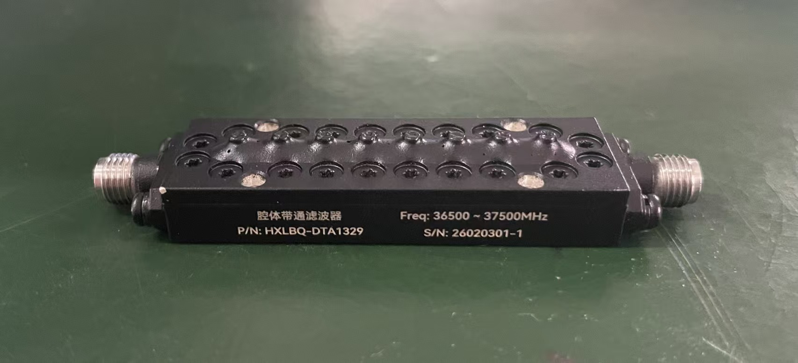
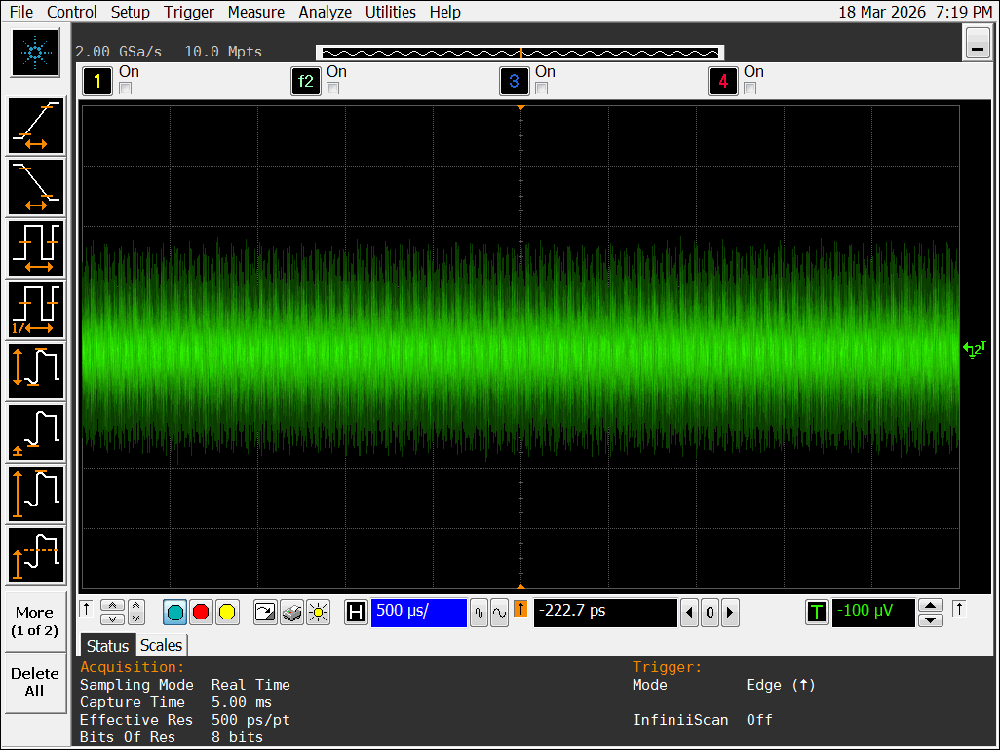

# 5.5 实测微波带通滤波器的色散等效验证

5.4节在ADS仿真环境下验证了时延轨迹提取的有效性，但仿真环境不含器件非理想性与实际噪声干扰。本节将实物微波带通滤波器接入5.2节所构建的宽带LFMCW硬件系统，以实测数据检验群时延轨迹的恢复能力。由于实物滤波器不具备可用于反演的显式数学形式，本节验证终点在于轨迹恢复的准确性，不延伸至参数估计$^{[32,33,36,37,39-46]}$。

## 5.5.1 实测实验方案与真值参考构建

本节实验对象为型号HXLBQ-DTA1329的腔体带通滤波器，其标称通带范围为36.5~37.5 GHz，中心频率37.0 GHz，两端采用SMA接口，如图5.14所示。

图5.15给出了由该滤波器S参数文件计算得到的$S_{21}$群时延曲线。群时延在通带上下边缘附近均出现明显抬升，通带中部则维持平缓基线，该双边缘增强的色散特征即为后续实测轨迹恢复的对照基准。

该滤波器接入5.2节LFMCW硬件系统的测量通路，替代5.4节ADS仿真中的虚拟滤波器元件，其余链路结构保持不变。扫频参数设定为：起始频率$f_{start} = 34$ GHz，终止频率$f_{end} = 37$ GHz，扫频带宽$B = 3$ GHz，调制周期$T_m = 50~\mu$s，对应扫频斜率$K = B/T_m = 6 \times 10^{13}$ Hz/s。由于5.4节ADS瞬态仿真总时长约$0.55~\mu$s，与本节调制周期相差近两个数量级，二者不做时域长度的逐项对比，验证目标统一为频率-群时延轨迹的恢复效果。

真值参考来自该滤波器的S参数测量文件（S2P格式）。对$S_{21}$相位进行解缠绕与频率微分即得全频段群时延曲线$\tau_g(f)$，图5.15所示曲线作为后续实测散点的比对基准。

## 5.5.2 实测差频信号特征与数据质量分析

特征提取之前需判断系统本底时延是否会对轨迹恢复造成显著偏移。图5.16给出了不接入滤波器时的直通差频离散频谱，其主峰紧贴零频，仅在极低频少量谱线上存在显著能量。按$f_D = K\tau$的映射关系估算，该本底对应的系统固有时延远小于滤波器通带内约2 ns量级的群时延，因此不再单独构造去嵌入常数，将系统本底视为可忽略项。

接入滤波器后，差频信号的时域与频域特征均发生明显变化。图5.17为高速示波器采集的含滤波器差频信号时域波形，信号幅度随时间呈非均匀变化，反映了不同探测频率处色散程度的差异。图5.18为对应的离散频谱，与直通状态下近零频集中的窄带谱线不同，频谱能量在0~2 MHz范围内显著展宽，呈多谱线宽带结构，表明色散效应已将差频信号由近稳态单频成分转变为承载时变群时延信息的展宽信号。

在此基础上，还需判断各频段数据质量是否均适合直接提取时延散点。本节从三个维度进行诊断：窗内RMS幅度反映局部信号能量是否塌陷至信噪比不足；窗口边界支撑度（分析窗口到扫频首尾边界的归一化最小距离）刻画Hankel矩阵有效采样支撑的充足程度，该值越小截断效应越显著；参数扰动稳定性则通过改变窗口长度和子空间维度$L_{sub}$重复执行提取，以候选时延的四分位距和标准差衡量结果对参数扰动的敏感性。各区域诊断结果见表5.7。

表5.7 分区信号质量与提取稳定性诊断

| 区域 | 窗内RMS幅度 (mV) | 窗口边界支撑度（归一化） | 参数扰动下时延IQR (ns) | 参数扰动下时延STD (ns) |
|:----:|:----:|:----:|:----:|:----:|
| 左侧边缘 | 0.080 | 0.730 | 0.227 | 0.178 |
| 通带平坦区 | 0.084 | 0.575 | 0.299 | 0.223 |
| 右侧肩部 | 0.086 | 0.300 | 0.360 | 0.320 |
| 右侧边缘 | 0.080 | 0.170 | 0.522 | 0.709 |

各区域RMS幅度处于同一量级（0.080~0.086 mV），排除了信号能量塌陷的可能；但归一化支撑度由左侧边缘的0.730降至右侧边缘的0.170，右侧边缘时延候选值四分位距达0.522 ns、标准差达0.709 ns，远高于其他区域。因此，右侧边缘提取精度下降的主导因素是扫频末端边界支撑不足及由此诱发的参数扰动失稳，而非低信噪比。通带中段与左侧边缘可通过常规滑动窗口获得稳定散点，右侧边缘则需引入基于局部连续性与多窗口重复支持的数据驱动重建。

## 5.5.3 右侧边缘特殊处理与最终轨迹恢复结果

实测差频信号的主处理链路仍沿用第四章建立的"滑动窗口$\to$MDL信源估计$\to$ESPRIT超分辨"框架。实测数据经100个调制周期叠加平均与抽取后，有效采样点数约1000点，对应工作采样率约20 MHz，窗口参数相应压缩为：窗口长度150点，步进13点，子空间维度$L_{sub}$取窗口长度的$1/2$。5.4节ADS仿真虽也存在边界效应，但其理想器件与高密度采样使边界附近子空间分解仍较稳定。实测数据有效点数有限且叠加了采样噪声与链路增益漂移，右侧窗口可用样本更少，边界截断与器件非理想共同放大了模态竞争，因此需要额外的局部重建策略。

右侧边缘的重建策略并非人为修形，而是对直接提点失稳区施加弱结构约束。具体做法是：先在右侧肩部及其相邻平坦区选取已稳定提取的散点，构造局部锚定参考轨迹。该区域尚未进入最严重的边界截断区，支撑度和扰动稳定性均优于右侧边缘，直接提取结果可重复性较高，因而适合作为短程延拓基准（注意该参考轨迹并非真值曲线本身）。随后在右侧边缘对多组窗口长度和子空间维度重复执行ESPRIT，对每个频率邻域保留与局部参考延拓最接近、且被多个参数配置重复支持的候选模态，最后以局部连续性门限剔除与邻域演化趋势不一致的点。真实物理轨迹从右侧肩部向通带边缘连续延伸，而伪模态仅在少数配置下偶发出现，该策略正是利用邻域延拓一致性与多配置重复支持来区分真实轨迹与伪解。

图5.19给出了最终提取的离散群时延散点与S2P真值曲线的叠加比对，分三个区域考察恢复效果。

左侧边缘区域（36.50~36.62 GHz）的提取散点恢复了群时延由通带外缘向内部递减的下降趋势，与S2P真值曲线的左侧上升沿基本对齐。通带平坦区（36.78~37.38 GHz）散点密集分布在约2 ns基线附近，与S2P真值平坦段一致。右侧边缘区域（37.38~37.50 GHz）经数据驱动重建后，散点保持由基线向高值上升的正确方向，主拓扑位置与S2P曲线右侧上升沿基本吻合，但离散程度大于前两个区域。

以全部47个可比散点做量化统计，点对曲线偏差$\Delta\tau = \tau_{point} - \tau_{s2p}$的平均绝对误差为0.0827 ns，均方根误差为0.1168 ns，最大绝对偏差为0.3199 ns；74.5%的散点落在$\pm 0.10$ ns误差带内，87.2%落在$\pm 0.20$ ns以内。为便于比较不同频段的恢复质量，进一步按左侧边缘、左肩过渡带、通带平坦区、右侧肩部和右侧边缘五个区段统计偏差，结果见表5.8。

表5.8 轨迹恢复结果与S2P真值偏差统计

| 区段 | 频率范围 (GHz) | 点数 | MAE (ns) | RMSE (ns) | 最大$|\Delta\tau|$ (ns) | $|\Delta\tau| \leq 0.10$ ns | $|\Delta\tau| \leq 0.20$ ns |
|:----:|:----:|:----:|:----:|:----:|:----:|:----:|:----:|
| 全部可比散点 | 36.50~37.50 | 47 | 0.0827 | 0.1168 | 0.3199 | 74.5% | 87.2% |
| 左侧边缘 | 36.50~36.62 | 4 | 0.0395 | 0.0510 | 0.0778 | 100.0% | 100.0% |
| 左肩过渡带 | 36.62~36.78 | 5 | 0.1218 | 0.1341 | 0.1889 | 40.0% | 100.0% |
| 通带平坦区 | 36.78~37.22 | 22 | 0.0477 | 0.0709 | 0.2593 | 95.5% | 95.5% |
| 右侧肩部 | 37.22~37.38 | 6 | 0.1109 | 0.1435 | 0.2610 | 66.7% | 66.7% |
| 右侧边缘 | 37.38~37.50 | 10 | 0.1404 | 0.1750 | 0.3199 | 40.0% | 70.0% |

由表5.8可知，左侧边缘的平均绝对误差和均方根误差分别为0.0395 ns和0.0510 ns，恢复精度最高；左肩过渡带的平均绝对误差和均方根误差分别为0.1218 ns和0.1341 ns，误差较左侧边缘有所上升，但全部散点仍落在$\pm 0.20$ ns误差带内。通带平坦区的平均绝对误差和均方根误差分别为0.0477 ns和0.0709 ns，与S2P真值平坦段保持较高一致性；右侧肩部为0.1109 ns和0.1435 ns，右侧边缘为0.1404 ns和0.1750 ns。整体来看，通带中段及左侧边缘已达到较高一致性，左右两侧过渡区和右侧边缘误差有所上升，但仍保持正确的主拓扑位置与连续演化方向。

提取散点覆盖了S2P真值曲线的主要特征区间，在轨迹走向与主拓扑位置上与真值保持一致，表明在真实射频环境下特征提取链路仍可恢复有效的群时延特征点。

---
# 5.6 本章小结

本章完成了硬件标定、ADS仿真验证与实测滤波器验证三个层次的检验。硬件层面，空间位移标定验证了3 GHz带宽下约3.33 ps的有效时延分辨能力。仿真层面，提取出与理论真值总体一致的群时延散点轨迹，MCMC一致性检查的后验估计结果与设计值接近。实测层面，从色散调制的差频信号中恢复出与S2P真值曲线主拓扑一致的群时延轨迹特征点。上述结果表明，本文方法能够在受控色散场景中从LFMCW差频信号中恢复主拓扑信息，并在色散函数数学形式已知时为参数估计提供有效支撑。
